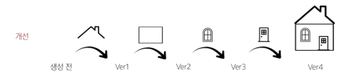
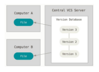
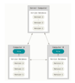

# Git
## Git
- 분산 **버전 관리 시스템**
  - 버전 관리 : 변화를 기록하고 추적하는 것
    - **버전 관리 반드시 해야 함**
    
  - **중앙 vs. 분산** 
    - 중앙 집중식
      - 버전은 중앙 서버에 저장되고 중앙 서버에서 파일을 가져와 다시 중앙에 업로드
      
    - 분산식
      - 버전을 여러 개의 복제된 저장소에 저장 및 관리
      - 중앙 서버를 사용하지 못하는 상황이라도, 복제된 다른 저장소를 이용해 파일 사용 가능
      - 예)
        - A : 파란색 창문으로 바꿈
        - B : 빨간색 창문으로 바꿈
        - ver5를 만들 때는 원본을 바탕으로 만듦
      - 중앙 서버에 의존하지 않고도 동시에 다양한 작업 수행 가능
        - 개발자 간의 작업 충돌 ↓, 개발 생산성 ↑
      - 중앙 서버의 장애느 손실에 대비해 백업과 복구 용이
      -인터넷에 연결되지 않은 환경에서도 작업 계속 가능
        - 변경 이력과 코드를 로컬 저장소에 기록 / 나중에 중앙 서버와 동기화

        

## Git의 영역
### 1. Working Directory
- 실제 작업 중인 파일들이 위치하는 영역
### 2. Staging Area
- Working Directory에서 변경된 파일 중, 다음 버전에 포함시킬 파일들을 선택적으로 추가하거나 제외할 수 있는 중간 준비 영역
### 3. Repository
- 버전(**Commit**) 이력과 파일들이 영구적으로 저장되는 영역
- 모든 버전과 변경 이력이 기록됨
- Repository에 저장되면 Staging Area는 비워짐(?)
### Commit("버전")
- 변경된 파일들을 저장하는 행위
- 마치 사진을 찍듯이 기록한다 하여 'snapshot'이라고도 함

## Git의 동작
1. git init
  - 로컬 저장소 설정(초기화)
  - git의 버전 관리를 시작할 디렉토리에서 진행
  
  - `$ git init`
2. git add
  - 변경사항이 있는 파일을 staging area에 추가
  - `$git add 00_startcamp/01_git/markdown.md`
  
