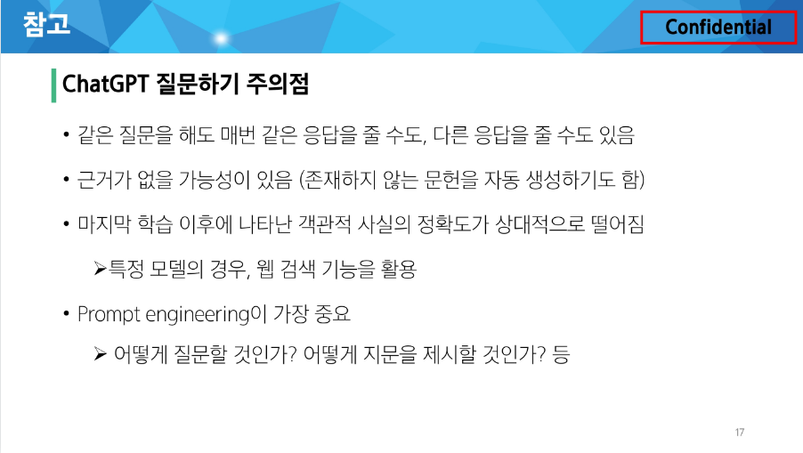

# Start Camp Day 3
## 목차
1. ChatGPT
2. API
3. Prompt Engineering
4. Vibe Coding
  - 기획 : ChatBot 만들기
  - 랜덤 자리 바꾸기 사이트 만들기(?)

## 1. ChatGPT
### Genrative AI
- 오디오, 비디오, 이미지, 텍스트, 코드, 시뮬레이션 등의 새로운 콘텐츠를 생성하는 인공지능 모델
- 최근 언어 및 이미지 분석에서 큰 파급력을 보임

### ChatGPT
- Generative / Pre-trained / Transformer
- 생성 모델 / 사전 훈련 / 트랜스포머 Ai 모델
- GPT 모델을 기반으로 한 대화형 AI

### ChatGPT 주요 개념
- Generative AI
  - 기존 패턴을 기반으로 오디오, 비디오, 텍스트, 코드, 시뮬레이션 등의 새로운 콘텐츠를 생성하는 인공지능 모델
- Pre-trained
  - 거대 언어 모델 + 추가 학습 데이터 + 추가 강화 학습
- Transformer [Neural Network Architecture]
  - 문장 속의 단어 간 관계를 추적해 맥락과 의미를 학습
  - 인간처럼 일관되고 연관성이 높은 언어를 구사하여 대화형 작업에 강점
  - 문장의 맥락을 효과적으로 이해하고 처리
  - Attention 메커니즘

### Transformer 주요 개념
- Self-Attention 메커니즘
  - 입력 데이터 간의 관계와 중요도를 계산
- 병렬 처리 가능
  - RNN과 달리 순차 처리가 필요 없어 속도가 빠름
- 스케일링 가능
  - 대규모 데이터 및 파라미터로 확장 가능

※ GPT 모델은 특히 Transformer의 디코더 부분만을 사용

### 질문하기(Prompting)

## API
### Interface
- 서로 다른 두 개의 시스템(기기, 소프트웨어 등)이 정보를 교환할 때, 그 사이에 존재하는 접점
- 사용자가 기기를 쉽게 동작시키거나 기계와 기계가 통신할 때 필요한 '약속된 방식'

### Interface 예시
- 키보드, 마우스, 모니터
  - 컴퓨터와 사람 사이의 물리적 인터페이스
- TV 리모컨
  - TV와 사람 사이의 인터페이스
- 자동차 운전대, 페달
  - 자동차의 내부 장치와 운전자 사이를 연결
- 스마트폰 터치 스크린
  - 디지털 인터페이스

### 클라이언트와 서버
### 웹의 동작 방식
 - 우리가 컴퓨터 혹은 모바일 기기로 웹 페이지, 데이터를 보게 될 때까지 무슨 일이 일어날까?

### 클라이언트와 서버

### 클라이언트(Client)
- 서비스를 요청하는 쪽
- ex) 사용자의 웹 브라우저, 모바일 웹

### 서버(Server)
- 요청을 받아서 처리하고, 결과를 응답해주는 쪽
- ex) 웹 서버, 데이터베이스 서버

### API(Application Programming Interface)
- 두 소프트웨어(또는 시스템)가 서로 통신할 수 있게 하는 메커니즘
- '약속된 방식의 인터페이스'
- 특정 규칙에 따라 데이터를 요청하고 응답하는 규칙을 제공

### Application
- 특정 기능을 수행하는 모든 소프트웨어
- 웹 / 모바일 / 데스크톱 앱 등 우리가 만든 서비스나 프로그램도 모두 앱의 일종

### API 활용

### API Key
### API Key
- API에게 요청을 보내는 애플리케이션을 구별하기 위한 고유한 식별 문자열

---
---
앞으로 매일 과제 있음
- 2개
  - 과제 하나 당 프로젝트 하나씩 만들어짐
    - 예 : python/hw_02

OPEN AI API-KEY 반드시 코드 삭제하고 github에 올리기
