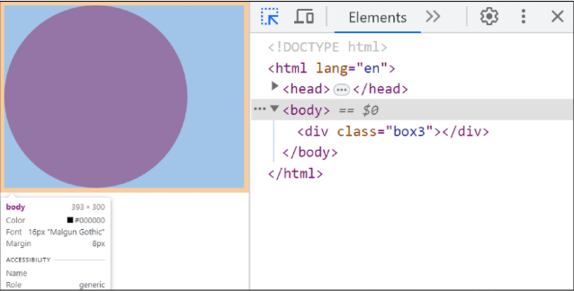
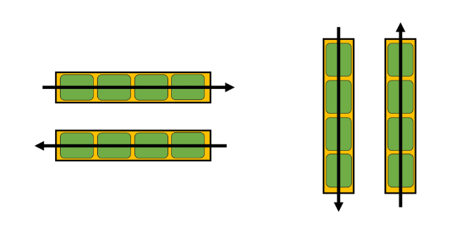
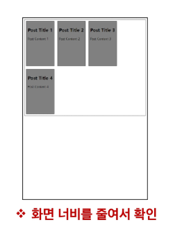
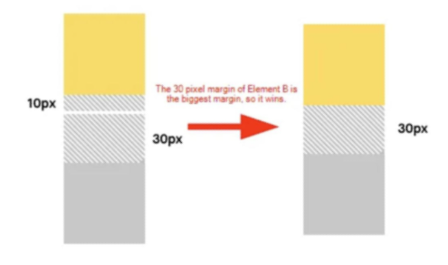

# CSS Layout
## 목차
1. CSS Box Model
  - 지난 시간 - 박스 타입
  - 박스 구성 요소
  - shorthand 속성
  - box-sizing 속성
  - 기타 display 속성
2. CSS position
  - Position 유형
  - z-index
3. CSS Flexbox
  - Flexbox 구성 요소
  - Flexbox 속성
  - flex-wrap 응용
4. 참고
  - 마진 상쇄
  - 박스 타입 별 수평 정렬
  - 실제 Position 활용 예시
  - Flexbox Shorthand 속성
  - Flexbox 속성 정리

## 1. CSS Box Model
### 개요
#### CSS Box Model
- 웹 페이지의 모든 HTML 요소를 감싸는 사각형 상자 모델

#### 원은 네모 박스를 깎은 것


### 지난시간 - 박스 타입
#### 박스 타입
1. Block box
2. Inline box
- 박스 타입에 따라 페이지에서의 배치 흐름 및 다른 박스와 관련하여 박스가 동작하는 방식이 달라짐

#### 박스 표시(Display) 타입
1. Outer display type
2. Inner display type

#### Outer display type
- Block
  ```CSS
  .index {
    display: block;
  }
  ```
- Inline
  ```CSS
  .index {
    display : inline;
  }
  ```
- 박스가 문서 흐름에서 어떻게 동작할 지를 결정
- 속성
  - block, inline

#### Outer display type - block 특징
- 항상 새로운 행으로 나뉨
- width와 height 속성 사용 가능
- padding, margin, border로 인해 다른 요소를 상자로부터 밀어냄
- width 속성을 지정하지 않으면 박스는 inline 방향으로 사용 가능한 공간을 모두 차지함
  - 상위 컨테이너 너비 100%로 채우는 것
- 대표적인 blcok 타입 태그
  - h1~6, p, div

#### Outer display type - inline 특징
- 새로운 행으로 넘어가지 않음
- width와 height 속성을 사용할 수 없음
- 수직 방향
  - padding, margin, border가 적용되지만 다른 요소를 밀어낼 수 없음
- 수평 방향
  - padding, margins, borders가 적용되어 다른 요소를 밀어낼 수 있음
- 대표적인 inline 타입 태그
  - a, img, span, strong, em

.
.
.

### 박스 구성 요소
#### CSS Box Model
- 웹 페이지의 모든 HTML 요소를 감싸는 사각형 상자 모델
- 내용(content), 안쪽 여백(padding), 테두리(border), 외부 간격(margin)으로 구성되어 요소의 크기와 배치 결정

#### Box 구성 요소

<02-box-model/02-part-of-box.html 수정>
```CSS
    .box2 {
      width: 300px;
      border: 1px dashed black;
      margin: 25px auto; 
      /* 상하 : 25px, 좌우 : auto여서 창 크기에 따라 위치 변경 */
      padding: 25px 50px; 
      /* 상하 : 25px, 좌우 : 50px */
```
- Content box
  - 실제 콘텐츠가 표시되는 영역 표시
  - width 및 height 속성을 사용하여 크기 조정
- Padding box
  - 콘텐츠 주위에 공백
  - padding 관련 속성을 사용하여 크기 조정
- Border box
  - 콘텐츠와 패딩을 래핑
  - border 관련 속성을 사용하여 크기 조정
- Margin box
  - 콘텐츠, 패딩 및 테두리를 래핑
  - 박스와 다른 요소 사이의 공백
  - margin 관련 속성을 사용하여 크기 조정

#### Box 구성의 방향별 속성 값


### shorthand 속성
#### shorthand 속성 - 'border'
- border-width, border-style, border-color를 한 번에 설정하기 위한 속성
- `border: 2px soild black;`

#### shorthand 속성 - 'margin' & 'padding'
- 4방향의 속성을 각각 지정하지 않고 한 번에 지정할 수 있는 속성
```CSS
.index {
  /* 4개 - 상우하좌 */
  margin: 10px 20px 30px 40px;
  padding: 10px 20px 30px 40px;
}
.index {
  /* 3개 - 상/좌우/하 */
  margin: 10px 20px 30px;
  padding: 10px 20px 30px;
}
.index {
  /* 2개 - 상하/좌우 */
  margin: 10px 20px;
  padding: 10px 20px;
}
.index {
  /* 1개 - 공통 */
  margin: 10px;
  padding: 10px;
}
```

### box-sizing 속성
#### THe standard CSS box model
- 표준 상자 모델에서 width와 height 속성 값을 설정하면 이 값은 content box의 크기를 조장하게 됨
  - 실제 박스 크기는 350px이 아닌 테두리, 패딩 값을 모두 더한 값을 가짐
  - 

#### The alternative CSS box model
- 대체 상자 모델에서 모든 width와 height는 실제 상자의 너비
- 실제 박스 크기를 정하기 위해 테두리와 패딩을 조정할 필요X
- 

#### 대체 상자 모델로 변경 - box-sizing 속성


### 기타 display 속성
#### 기타 display 속성
1. inline-block
2. none

#### 'inline-block'
- inline과 block 요소 사이의 중간 지점을 제공하는 display 값
- width 및 height 속성 사용 가능
- padding, margin 및 border로 인해 다른 요소가 상자에서 밀려남
- 새로운 행으로 넘어가지 않음
- 요소가 줄 바꿈 되는 것을 원하지 않으면서 너비와 높이를 적용하고 싶은 경우에 사용
- 
- 

#### 'none'
- 요소를 화면에 표시하지 않고, 공간조차 부여되지 않음

#### 'none' 예시
- 

## CSS Position
### 개요
#### CS Layout
- 각 요소의 위치와 크기를 조정하여 웹 페이지의 디자인을 결정하는 것
- Display, Position, Flexbox 등

#### CSS Position
- 요소를 Normal Flow에서 제겅하여 다른 위치로 배치하는 것
- 다른 요소 위에 올리기, 화면의 특정 위치에 고정시키기 등

#### Position 이동 방향


### Position 유형
#### Position 유형
1. static (정적)
2. relative (상대)
3. absolute (절대)
4. fixed (고정)
5. sticky

#### Position 활용
- 03_web/02_CSS_Layout/03-css-layout-position/01-position.html 참고

#### Position sticky 활용
- 03_web/02_CSS_Layout/03-css-layout-position/01-sticky.html 참고

#### Position absolute 활용
- 

#### Position 유형별 특징
1. static
  - 요소를 Normal Flow에 따라 배치
  - top, right, bottom, left 속성이 적용되지 않음
  - 기본 값
2. relative
  - 요소를 Normal Flow에 따라 배치
  - 자신의 원래 위치(static)을 기준으로 이동
  - top, right, bottom, left 속성으로 위치를 조정
  - 다른 요소의 레이아웃에 영향을 주지 않음(요소가 차지하는 공간은 static일 때와 같음)
3. absolute
  - 요소를 Normal Flow에서 제거
  - 가장 가까운 relative 부모 요소를 기준으로 이동
    - 만족하는 부모 요소가 없다면 body 태그를 기준으로 함
  - top, tight, bottom, left 속성으로 윛 ㅣ조정
  - 문서에서 요소가 차지하는 공간 없어짐
4. fixed
  - 요소를 Normal Flow에서 제거
  - 현재 화면영역(viewport)을 기준으로 이동
  - 스크롤해도 항상 같은 위치에 유지됨
  - top, right, bottom, left 속성으로 위치 조정
  - 문서에서 요소가 차지하는 공간 없어짐
5. sticky
  - relative와 fixed의 특성을 결합한 속성
  - 스크롤 위치가 임계점에 도달하기 전에는 relative처럼 동작
  - 스크롤이 특정 임계점에 도달하면 fixed처럼 동작하여 화면 고정됨
  - 만약 다음 sticky 요소가 나오면 다음 sticky 요소가 이전 sticky 요소의 자리를 대체
    - 이전 sticky 요소가 고정되어 있던 위치와 다음 sticky 요소가 고정되어야 할 위치가 겹치게 되기 때문

### z-index
#### z-index
- 요소의 쌓임 순서(stack order)를 정의하는 속성
- 정수 값을 사용해 Z축 순서를 지정
- 값이 클수록 요소가 위에 쌓이게 됨
- static이 아닌 요소에만 적용됨

#### z-index 특징
- 기본값이 auto
- 부모 요소의 z-index값에 영향을 받음
- 부모의 z-index가 낮으면 자식의 z-index가 아무리 높아도 부모보다 위로 올라갈 수 없음
- z-index 값이 같으면 HTML 문서 순서대로 쌓임

#### z-index 예시

#### Position의 목적
- 전체 페이지에 대한 레이아웃을 구성하는 것보다는 페이지 특정 항목의 위치를 조정하는 것

## CSS Flexbox
### 개요
#### Inner display type
- Flexbox
- ```CSS
  .container {
    display: flex;
  }
  ```
- 박스 내부의 요소들이 어떻게 배치될 지를 결정
- 속성 : flex

#### CSS Flexbox
- 요소를 행과 열 형태로 배치하는 1차원 레이아웃 방식
  - 
- '공간 배열' & '정렬'

### Flexbox 구성 요소
#### Flexbox 구성 요소
- 

#### main axis(주 축)
- flex item들이 배치되는 기본 축
- main start에서 시작하여 main end 방향으로 배치(기본값)

#### cross axis(교차 축)
- main axis에 수직인 축
- cross start에서 시작하여 cross end 방향으로 배치(기본 값)

#### Flex Container
- `display: flex;` 혹은 `display: inline-flex;`가 설정된 부모 요소
- 이 컨테이너의 1차 자식 요소들이 Flex Item이 됨
- flexbox 속성 값들을 사용하여 자식 요소 Flex Item들을 배치하는 주체
- 

#### Flex Item
- Flex Container 내부에 레이아웃되는 항목

### Flexbox 속성
#### Flexbox 속성 목록
- Flex Container 관련 속성
  - display, flex-direction, flex-wrap, justify-content, align-items, align-content
- Flex Item 관련 속성
  - align-self, flex-grow, flex-basis, order

#### 1. Flex Container 지정
- flex item은 기본적으로 행(주 축의 기본값인 가로 방향)으로 나열
- flex item은 주 축의 시작 선에서 시작
- flex item은 교차 축의 크기를 채우기 위해 늘어남

#### 2. flex-direction
- flex item이 나열되는 방향을 지정
- column으로 지정할 경우 주 축이 변경됨
- "-reverse"로 지정하면 flex item 배치의 시작 선과 끝 선이 서로 바뀜

#### 3. flex-wrap
- flex item 목록이 flex container의 한 행에 들어가지 않을 경우 다른 행에 배치할 지 여부 설정
```CSS
.container {
  /* flex-wrap: nowrap */
  flex-wrap: wrap;
}
```


#### 4. justify-content
- 주 축을 따라 flex item과 주위에 공간을 분배
```CSS
.container {
  /* justify-content: flex-start; */
  justify-content: center;
  /* justify-content: flex-end; */
}
```
#### 5. align-content
- 교차 축을 따라 flex item과 주위에 공간을 분배
  - flex-wrap이 wrap 또는 wrap-reverse로 설정된 여러 행에만 적용됨
  - 한 줄짜리 행에는 효과 없음(flex-wrap이 nowrap으로 설정된 경우)

#### 6. align-items
- 교차 축을 따라 flex item 행을 정렬
```CSS
.container {
  align-items: center;
}
```

#### 7. align-self
- 교차 축을 따라 개별 flex item을 정렬
```CSS
.item1 {
  align-self: center;
}

.item2 {
  align-self: flex-end;
}
```

#### 목적에 따른 속성 분류
1. 배치
  - flex-direction
  - flex-wrap
2. 공간 분배
  - justify-content
  - align-content
3. 정렬
  - align-items
  - align-self

#### 속성명 Tip
- justify : 주축
- align : 교차 축

#### justify-items 및 justofy-self 속성이 없는 이유
- **필요 없기 때문**
- margin auto를 통해 정렬 및 배치 가능

#### 8. flex-grow
- 남는 행 여백을 비율에 따라 각 flex item에 분배
  - 아이템이 컨테이너 내에서 확장하는 비율을 지정
- flex-grow의 반대 : flex-shrink

#### 9. flex-basis
- flex item의 초기 크기 값을 지정
- flex-basis와 width 값을 동시에 적용한 경우 flex-basis가 우선

### flex-wrap 응용
#### 반웅형 레이아웃
- 다양한 디바이스와 화면 크기에 자동으로 적응하여 콘텐츠를 최적으로 표시하는 웹 레이아웃 방식

#### 반응형 레이아웃 작성
- flex-wrap을 사용해 반응형 레이아웃 작성(flex-grow & flex-basis 활용)

## 참고
### 마진 상쇄
#### Margin collapsing (마진 상쇄)
- 두 block 타입 요소의 margin top과 bottom이 만나 더 큰 margin으로 결합되는 현상
- 

#### Margin collapsing(마진 상쇄) 이유
- 복잡한 레이아웃에서 요소 간 간격을 일관되게 유지하기 위함
- 요소 간의 간격을 더 예측 가능하고 관리하기 쉽게 만듦
  - 일관성, 단순화

### 박스 타입별 수평 정렬
#### Block 요소의 수평 정렬
- margin: auto 사용
  - 블록 요소의 너비를 지정하고 좌우 마진을 auto로 설정

#### Inline 요소의 수평 정렬
- text-align 사용
  - 부모 요소에 적용

#### Inline-block 요소의 수평 정렬
- text-align 사용
  - 부모 요소에 적용

