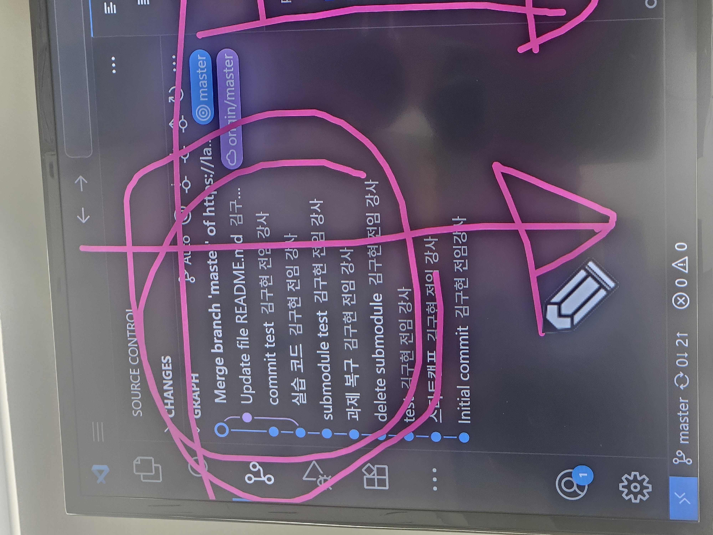
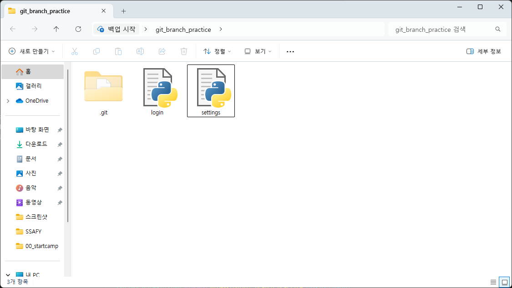
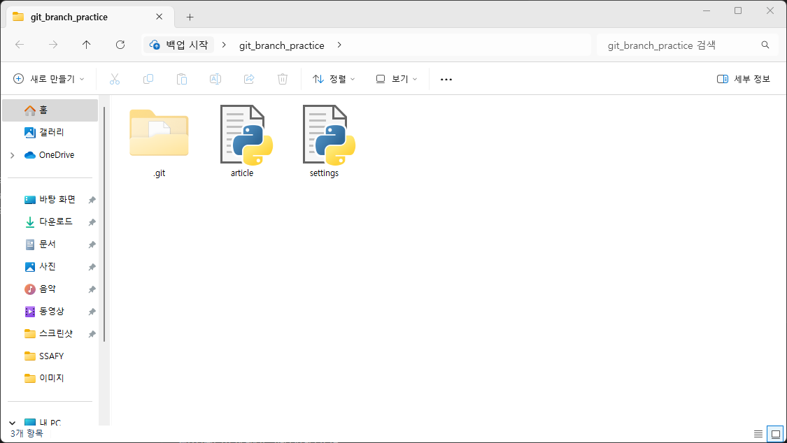
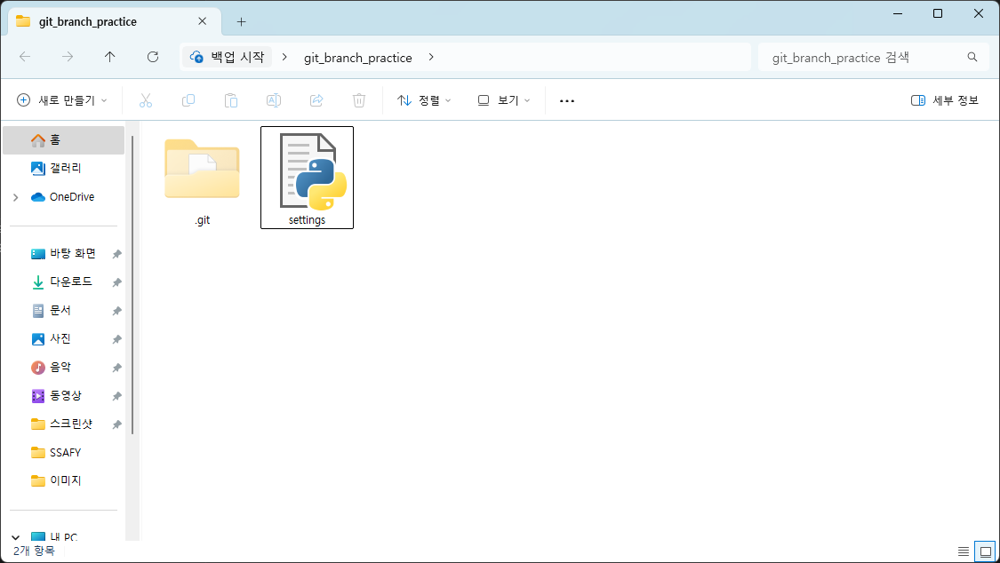
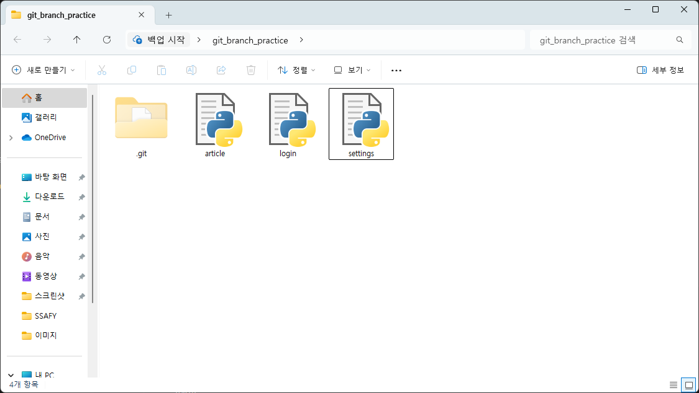
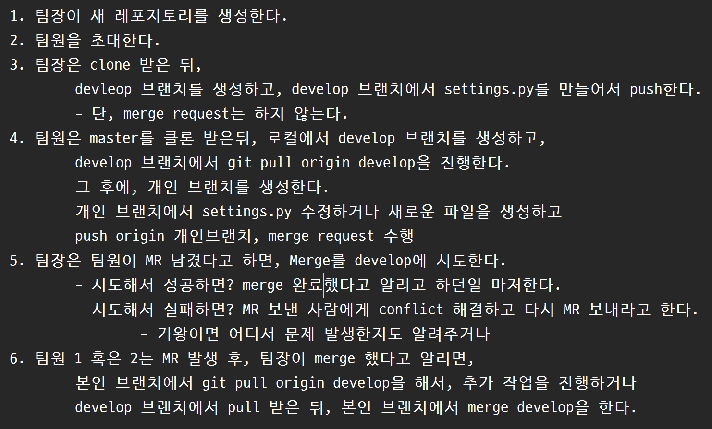

# Branch
## 개요
### Git Branch
#### 정의
- 나뭇가지처럼 여러 갈래로 작업 공간을 나누어 독립적으로 작업할 수 있도록 도와주는 Git의 도구

#### 장점
1. 독립된 개발 환경을 형성하기 때문에 원본(master)에 대해 안전
2. 하나의 작업은 하나의 브랜치로 나누어 진행되므로 체계적으로 협업과 개발이 가능
3. 손쉽게 브랜치를 생성하고 브랜치 사이를 이동할 수 있음

---
### branch 상황을 경험하기 위한 예시
1. git_branch_practice 폴더를 생성한다.
2. `touch settings.py`를 생성한다.
3. 다음과 같은 역할을 분담한다.
  - Viktor는 로그인 기능을 작업한다.
  - Harry는 게시글 작성 기능을 작업한다.
  - 그 둘은 모두 settings.py의 내용을 필요로 한다.
4. `git branch -c viktor/login`
5. `git branch -c harry/article`를 작성해 권한을 준다.
6. `git branch`를 통해 작업 공간을 잘 나누었는지 확인하기
7. 작업 공간을 바꾸고 싶을 때, `git switch viktor/login`
  ```bash
  SSAFY@DESKTOP-763H707 MINGW64 ~/Desktop/git_branch_practice (master)
$ git switch viktor/login
Switched to branch 'viktor/login'
```

SSAFY@DESKTOP-763H707 MINGW64 ~/Desktop/git_branch_practice (viktor/login)
```
8. ```bash
  touch login.py
  git add .
  git commit -m 'article'
  ```


9. 작업 공간을 바꾸고 싶을 때, `git switch harry/article`

10. ```bash
    touch article.py
    git add .
    git commit -m 'article 작업 완료'
    ```


11. 다시 작업 공간을 master로 바꿨을 때,


12. master 공간에서 `git merge`를 통해 병합하기
```bash
$ git merge viktor/login
Updating ee76aa6..976f56a
Fast-forward
 login.py | 0
 1 file changed, 0 insertions(+), 0 deletions(-)
 create mode 100644 login.py

SSAFY@DESKTOP-763H707 MINGW64 ~/Desktop/git_branch_practice (master)
```
  - 잘 됐는지 확인하는 명령어 : `git log`

13. harry 작업 공간도 병합하기
```bash
$ git merge harry/article
Merge made by the 'ort' strategy.
 article.py | 0
 1 file changed, 0 insertions(+), 0 deletions(-)
 create mode 100644 article.py
 ```
 

 #### viktor는 그냥 merge(Fast Forward merge)했는데 harry는 바로 merge되지 않았을까(vim이 켜짐, three way merge)?
 `git log --oneline --graph`

14. 병합 후 branch 삭제하고 싶을 때
```bash
  git branch -d viktor/login # viktor 삭제
  git branch -d harry/article # harry 삭제
  git branch # 작업 공간 확인
  ```

15. viktor 공간에서 작업한 파일을 harry 공간에서 이용하고 싶다면?
  ```bash
  git switch harry/article
  git merge viktor/login
  ```

### README가 있는 상태로 파일이 만들어지면?
- git으로 관리하고 있는 파일이 생성됨


## 각자 다른 컴퓨터로 진행할 때
1. 위와 마찬가지로 파일 생성 후 add, commit까지 진행
2. `git push origin JuYeon`을 통해 팀장이 만든 origin에 JuYeon이라는 branch push하기

## branch 만들어서 작업 후 merge 요청하기
1. 우선 팀장의 `git clone {url}` 받는다.
2. 받은 파일에서 code에서 열기
3. `git branch -c {name}`으로 branch를 만든다.
4. `git switch {name}`으로 작업 공간을 바꾼다.
5. ```bash
    touch {file}
    git add {file}
    git commit -m {commit_name}
    ```
    을 진행한다.
6. merge할 commit을 다 생성했다면, 
```bash
git push origin {name}
```
을 진행한다.
7. gitlab에 들어가서 merge 요청하기
8. merge가 됐다면, VScode에서 다음 코드 진행
```bash
git switch master
git pull
```
9. master 공간에 다른 branch 공간에서 생성된 commit이 pull됐다면, `git branch -d {name}`으로 branch 지우기
10. `git branch`로 branch 잘 지워졌는지 확인하기

# Git Merge
## Merge Conflict
- 병합하려는 두 브랜치가 "동일한 파일의 동일한 부분"에서 변경된 후 병합 시 충돌이 발생하는 것

if master가 viktor와 harry에게 settings.py를 이용하라고 시킴,
```bash
git switch viktor
git merge master
```

---
## branch 만들어서 작업 후 merge 요청하기
### 같은 README.md를 수정해서 merge 요청
1. 위와 똑같이 진행
2. 첫번째로 merge 요청한 내용을 merge하면 merge됨
3. 다음으로 merge 요청할 경우. 충돌 발생
4. 각자 `git pull` 진행
5. `git switch {name}`
6. `git merge master` 진행하면, maser에 merge된 첫번쨰 merge 요청한 내용과 내 내용이 충돌
7. 충돌 내용 수정 후, add commit 진행 후 push

---
# Git Workflow
- 원격 저장소를 활용해 다른 사용자와 협업하는 방법

# ※주의사항※
1. master 브랜치는 아무도 수정하지 않는다.
2. master 브랜치는 최초 설정 (모든 팀원이 함께 쓸 내용 생성 시만 사용)
  - git add. / git commit / git push까지 진행
3. 팀장이 develop (or dev) 브랜치를 생성한다.



