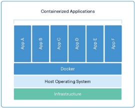
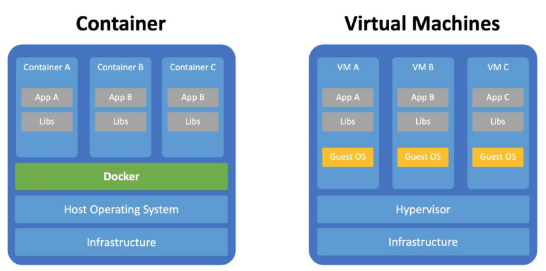
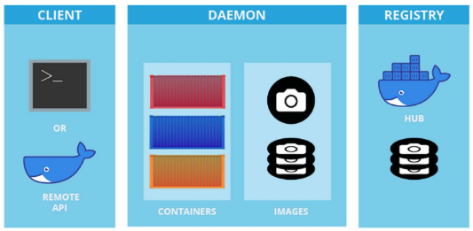
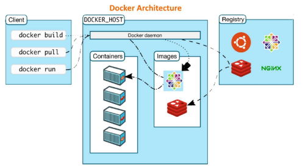
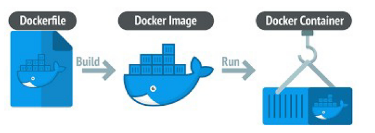

# 데이터엔지니어링 기초 - Kafkaw 기본 구조

목차

1. Kafka 개요
2. Kafka의 기본 구조 및 동작 원리
3. Kafka 클러스터 구조 및 데이터 분산
4. Kafka 설치

## 1. Kafka 개요
### 1) 카프카란?
#### 메시징 시스템이란?
- 어플리케이션 간 데이터를 교환하는 비동기적 방식 데이터 전송 시스템
  - 메시지를 생산하는 생산자(Producer), 관리하는 브로커(Broker), 소비하는 소비자(Consumer)로 구성
  - 간혹 브로커가 없는 경우도 있음 (Redis Pub/Sub, ZeroMQ 등)
    

#### 메시징 시스템이란?
- 메시징 시스템의 특징
  - 안정적인 구조 : 비동기적 방식이라 시스템 간 결합이 느슨함
    

  - 뛰어난 확장성 : 브로커만 추가하면 성능이 선형적으로 증가
    

#### 카프카란?
- 대규모 데이터 처리에 적합한 분산형 메시징 시스템
  - 카프카 브로커(Broker) : 카프카의 메시지를 관리하는 서버(브로커)
  - 토픽(Topic) : 카프카의 메시지를 관리하는 논리적 단위, 카테고리라고 보면 됨
  - 파티션(Partition) : 토픽을 이루는 저장 단위, 파티션 기반으로 병렬 처리가 이루어짐

    

### 2) 카프카의 역할
#### 카프카의 역할
  
  

- 데이터 파이프라인에서 카프카의 역할
  - 카프카는 스트리밍형 데이터 수집에 뛰어난 도구
  - 스트리밍형 데이터 수집 : 지속적으로 발생하는 데이터를 즉각 수집 및 처리
    

#### 카프카의 장점
- 카프카를 쓰는 이유
  - 고성능 : 초당 수백만개의 메시지 처리 가능
  - 확장성 : 분산 구조로 인해 뛰어난 확장성
  - 내결함성 : 백업본을 관리와 모니터링을 통한 안정적인 장애 복구
  - 메시지 유지 : 메시지를 장기간 보관 가능 → 데이터를 다시 읽는 것도 가능
  - 이벤트 기반 구조 : 여러 유저가 같은 데이터 읽기 가능

## 2. Kafka의 기본 구조 및 동작 원리
### 1) Kafka 구조 복습하기
#### Kafka의 핵심 개념
- 주요 개념 요약
  - 생산자(Producer) : 메시지를 브로커에 전송
  - 소비자(Consumer) : 브로커에서 메시지를 소비
    

#### Kafka의 핵심 개념
- 주요 개념 요약
  - 토픽(Topic) : 메시지를 저장하는 논리적 단위, 택배를 찾을 때 주소 같은 느낌
  - 파티션(Partition) : 메시지를 병렬로 처리하기 위한 단위, 큐와 유사함, 택배 창고 같은 느낌
  - 브로커(Broker) : 메시지를 관리하는 Kafka의 서버
  - 클러스터(Cluster) : 함께 동작하는 Kafka 서버 집단
    

  - Zookeeper : Kafka의 클러스터를 관리해주는 분산 관리 시스템
    

### 2) Kafka 기본 구조
#### Kafka의 기본 구조
- 주요 개념 요약
  - Zookeeper : Kafka의 클러스터를 관리해주는 분산 관리 시스템
  

### 3) Kafka의 데이터 동작방식
#### Kafka의 토픽과 파티션
- 토픽과 파티션
  - 토픽(Topic) : 메시지를 저장하는 논리적 단위, 택배를 찾을 때 주소 같은 느낌
  - 파티션(Partition) : 메시지를 병렬로 처리하기 위한 단위, 택배 창고 같은 느낌
  - 오프셋(Offset) : 파티션의 데이터를 가리키는 숫자
    
    
    

#### Kafka의 저장방식
- 토픽 / 파티션의 물리적인 위치는?
  - 메모리? 대용량 데이터를 다룰려면 많은 데이터가 필요할 거 같은데 ...
  - 스토리지? 그러면 빠른 입출력이 불가능할텐데 ,,,
    

- 세그먼트(Segment) 파일
  - 세그먼트 : 파티션이 실제로 저장되는 물리적 단위, 파일 형태.
    
    
  
- Kafka의 실제 데이터
  - kafka/config/server.properties 파일에 가면 저장 경로를 확인할 수 있음
    

- Kafka의 파일 타입
  - 모두 [시작 인덱스], [확장자]의 형식
  - 모두 Binary 파일 → 빠른 읽기 속도
  - 실제 데이터 : 실제로 데이터가 들어있는 파일. `XXX.log`의 형식
  - 인덱스 파일 : 오프셋을 빠르게찾기 위한 색인용 파일. `XXX.index`의 형식
  - 타임스탬프 : 시간 기준 검색을 위한 파일. `XXX.timeindex`의 형식
    

## 3. Kafka의 클러스터 구조 및 데이터 분산
### 1) Kafka의 클러스터
- 클러스터를 구성하는 이유
  - High Throughput : 동시에 더 많은 데이터를 처리할 수 있음
    
  
  - 데이터 안정성 : 복제를 통해 데이터 유실률을 낮춤
    

  - 고가용성 : 하나의 브로커가 문제가 생기더라도 전체 시스템은 멈추지 않음
    

- 클러스터 관리
  - 공통 메타데이터 및 자원 관리
    
  
  - 관리의 복잡성 증가 : 장애 대처 알고리즘, 파티션 할당 등
    
  
  - 분산 시스템 아키텍쳐 : 네트워크 트래픽, 디스크 용량, 다중 모니터링 시스템 등 고려하여 설계 필요
    

- Kafka와 Zookeeper
  - Zookeeper : Kafka의 클러스터를 관리해주는 분산 관리 시스템
  - 코디네이션 서비스 시스템 : Zookeeper처럼 분산 시스템 관리를 도와주는 시스템
    
  
- Zookeeper의 역할
  - 공용 리소스 관리 : 브러커들이 공통으로 사용해야하는 리소스/데이터 관리
    

  - 노드 Healthcheck : 카프카의 브로커(노드/서버)들이 정상 동작중인지 확인
    
    

  - 브로커 및 파티션 관리 : 메인이 파티션인 Leader 선출 및 메인 브로커인 Controller 선출을 도움
    

- Kafka의 컨트롤러
  - 컨트롤러(Controller) : 클러스터 관리 및 장애 처리 역할 수행
    
    

#### Kafka 데이터 분산
- Kafka의 리더와 팔로워
  - 레플리카(Replica) : 파티션 데이터를 보존하기 위해 복사본을 두는 것
  - 리더(Leader) : Producer, Consumer와 통신하는 메인 파티션(레플리카)
  - 팔로워(Follower) : 리더의 데이터를 실시간으로 복사해서 가지고 있는 파티션(레플리카)
    

- Kafka의 리더 선출
  - Zookeeper와 Controller가 결정
  - 선호 리더(Prefered Leader) : 파티션별로 가장 선호하는 리더, 기본적으로 Round Robin
  - 처음에는 선호 리더에 맞추어 리더가 결정됨
    
    

  - 리더 선출(Leader Election) : 기존 리더 브로커가 사망했을 때 다음 리더를 뽑는 것
  - ISR(In-Sync Replica) : 리더와 완전히 같은 값을 가진 팔로워
    

  - 팔로워 중 ISR에 속한 것이 있는 경우 가장 빠른 순서가 리더가 됨
    
  
  - `unclean, leader, election, enable = true` 옵션 사용 시 그나마 가장 최신 데이터를 가진 팔로워가 리더가 됨
    
    
  
  - `unclean, leader, election, enable = true` 옵션 사용 시 원래 브로커가 복구된다해도 팔로워로 참여
  - 카프카는 리더의 데이터를 절대적으로 신뢰함
    

## 4. Kafka 설치
### 1) Kafka 설치
#### Kafka 설치하기
- Kafka 환경 설정
  - 설치 전 필수 요소 : 운영체제, Java, Zookeeper
  - Kafka는 여러 개의 브로커(서버)와 토픽-파티션으로 이루어지고 Zookeeper가 이를 관리해줌
    

#### 운영체제 선택
- Kafka를 실행할 운영체제
  - JVM 기반이라 다양한 운영체제에서 실행 가능 → Linux 환경이 가장 안정적이며 추천됨
  - Windows는 WSL 환경 추천
    

- 강의 자료 참고
