# 데이터엔지니어링기초 - Flink Checkpointing & Window
<details>
<summary> 목차 </summary>

1. Checkpointing
2. Window
3. Triggers 및 Evictors
4. Watermark와 Late Element(늦은 요소) 처리

</details>

## 1. Checkpointing
- <span style='color:green'>(손실X, 안정적, if 장애 발생, 복구 및 처리 재진행)</span>
- <span style='color:green'>상태 저장</span>

### 1) Checkpointing 기본 개념
#### 상태(state)와 데이터 저장
- 중간 결과나 정보를 상태(state)로 저장
  - <span style='color:green'>ex) 숫자 합계</span>
    - <span style='color:green'>어떤 상태에 숫자가 저장되어 있다가 업데이트해서 그 상태를 저장</span>

  - 데이터 스트림을 처리하면서 중간 결과나 정보를 상태(state)로 저장
  - ex) 스트림에서 숫자의 합계를 계산하는 작업에서는 현재까지의 합계가 상태에 해당
    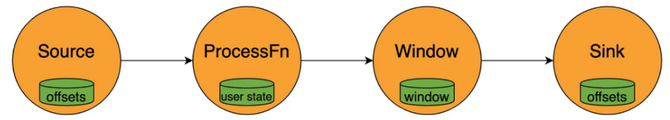

- 상태의 유형
  - '키'가 있는 상태(Keyed State) : 특정 키와 연관된 상태로, 각 키마다 별도의 상태를 유지
    - ex) 사용자 ID별로 세션 정보를 저장하는 경우
      - <span style='color:green'>A, B, C 사용자의 누적 금액을 별도로 저장하고 계산하게끔 도와주는 줌 / 서로 간섭하지 않도록 </span>

  - 연산자(Operator) 상태 : 특정 연산자와 연관된 상태로, 연산자 전체에 걸쳐 공유
    - <span style='color:green'> 키가 없는 상태 </span>
    - ex) 소스 연산자가 외부 시스템에서 데이터를 읽을 때 마지막으로 읽은 위치를 저장하는 경우

  - Broadcast 상태 : 모든 하위 작업에서 동일한 상태를 유지하기 위해 하나의 스트림 레코드를 모든 하위 작업에 브로드캐스트
    - <span style='color:green'> 태스크 전체가 공통으로 공유해야 되는 내용 </span>
    - <span style='color:green'> 시스템에 대한 금지 키워드가 있다면 그 목록을 전체에게 공유(taskslot) </span>

#### 상태 관리 중요성
- **정확성(정합성) 보장**
  - 상태를 통해 중간 결과를 저장하여 데이터 처리의 정확성을 유지
  - <span style='color:green'>한 번 처리한 데이터를 다시 처리하지 않도록, 한 번도 빠지지 않도록 </span>
- **장애 복구**
  - 체크포인트와 세이브포인트를 활용하여 장애 발생 시에도 이전 상태로 복구
  - <span style='color:green'>마지막으로 정상이었던 상태로 돌아감</span>
- **성능 최적화**
  - 효율적인 상태 관리를 통해 메모리 사용을 최적화
    - <span style='color:green'>리소스 절약 & 성능 향상</span>
  - 대규모 데이터 처리에서도 안정적인 성능을 제공

#### 상태 관리 예제 - KeyedSum 구현
- 상태 관리를 위한 클래스 생성
  - <span style='color:green'>checkpointing.py</span>
  
  ```python
  class KeyedSum(KeyedProcessFunction):
    """각 사용자별 누적 금액을 계산하는 KeyedProcessFunction"""

    def __init__(self):
      self.state = None  # Keyed State를 저장할 변수

    def open(self, runtime_context):
      """Keyed State 초기화"""
      self.state = runtime_context.get_state(ValueStateDescriptor("sum", Types.LONG()))

    def process_element(self, value, ctx):
      """각 ID별 금액을 누적하여 관리하고 상태 출력"""
      current_sum = self.state.value() or 0
      new_sum = current_sum + value[1]
      self.state.update(new_sum)

      # 현재 키에 대한 상태 확인 (Keyed State 조회)
      print(f'현재 상태: ID={value[0]}, 누적 금액={new_sum}')

      return value[0], new_sum
  ```

#### 상태 관리 예시
- Datastream에 적용(key_by 사용)

  ```python
  def main():
    """Flink 환경을 설정하고 Keyed State를 활용한 스트림 처리 실행"""
    env = StreamExecutionEnvironment.get_execution_environment()
    env.set_parallelism(1)
    env.enable_checkpointing(10000)  # 10초마다 체크포인트 저장

    # CSV 데이터 로드
    df = pd.read_csv("../data/data.csv")
    transactions = df[['transaction_id', 'amount']].dropna().values.tolist()

    # Flink 데이터 스트림 생성
    transaction_stream = env.from_collection(transactions)

    # Keyed State 적용 (각 ID별 금액 합산)
    keyed_stream = transaction_stream.key_by(lambda x: x[0]).process(KeyedSum())

    # 결과 출력
    keyed_stream.print()

    env.execute("Keyed State Example")
    ```

#### Checkpointing
- 문서 처리에서의 '자동 저장'
  - 체크포인팅을 하면 현재까지의 처리 상태와 데이터를 안전한 곳에 저장
  - 시스템에 장애가 발생하거나 프로그램이 중간에 멈추는 일이 생기더라도 마지막 저장한 체크포인트 지점부터 이어서 복구
  - 데이터 유실을 방지

    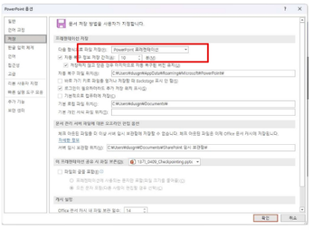
  - <span style='color:green'>정상 실행</span>
    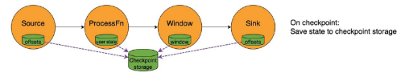
  - <span style='color:green'>장애가 생긴 직후</span>
    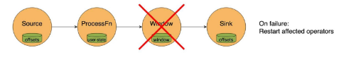
  - <span style='color:green'>장애 복구를 정상적으로 한 후 처리 진행 </span>
  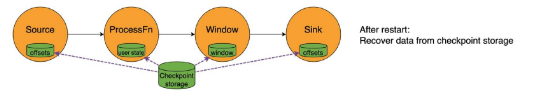

- 실행 중인 어플리케이션의 한재 상태를 백업해 놓은 스냅샷(snapshot)
  - <span style='color:green'>장애 발생 시, 이 스냅샷을 불러서 복구 작업 진행</span>
  - 스냅샷을 주기적으로 찍어서 파일시스템(HDFS, S3 같은 곳)에 저장
  - 문제가 생기면 바로 이 체크포인트를 불러와서(recovery) 작업을 재개
    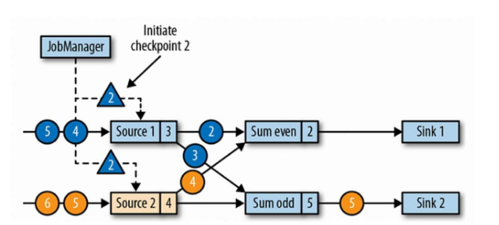
    - <span style='color:green'>Barrier를 기준으로 스냅샷이 찍힌다.</span>
    - <span style='color:green'>동일한 시점의 상태를 갖는 것이 목표</span>

- 데이터 유실 방지 & 시스템 장애 대배
  - 장애가 발생해도 데이터 손실이나 중복 없이 정확히 한 번씩 처리를 이어갈 수 있는(Exactly-Once) 강력한 내구성을 갖게 됨
  - 프로그램이 정상 종료될 경우 체크포인트는 자동 제거됨(자동 생성 및 종료)
    

- 분산 스토리지 + 로컬 스토리지(<span style='color:green'>복수 구조</span>)에 상태 스냅샷 보관
  - 로컬 저장소는 노드 장애 시 내구성을 보장하지 않음
  - 다른 노드가 상태를 재분배할 수 있는 권한도 제공 안함
  - 따라서, 스냅샷 저장소의 기본값은 분산 스토리지!

- 복구 시 Flink는 로컬 저장소에서 먼저 복원 시도(<span style='color:green'>성능 향상을 위해?</span>)
  - 로컬 복구는 기본적으로 비활성화되어 있으며, 키를 사용한 Flink의 구성을 통해 활성화
    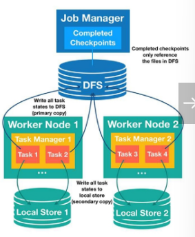
    - <span style='color:green'>Distributed File System</span>


#### Barrier(<span style='color:green'>스트림 사이의 경계선</span>)
- 데이터 스트림 사이에 '장벽'을 세우는 것(<span style='color:green'>Barrier에 도착하면 그 상태를 체크포인트 저장소에 저장(checkpointing)</span>)
  - 소스 노드들이 일정 주기마다 모든 스트림에 Checkpoint Barrier를 흘려보냄
  - Barrier가 특정 지점(연산자 등)에 도달하면, 자신의 상태를 저장

- Barrier 동기화
  - 한 연산자가 입력 스트림을 여러 개 받고 있다면, 모든 입력으로부터 이 배리어를 하나씩 다 받을 때까지 기다렸다가 상태를 저장
  - Barrier를 통해 모든 데이터 흐름에 동일한 시점의 일관된 스냅샷을 보장

- 적용 순서
  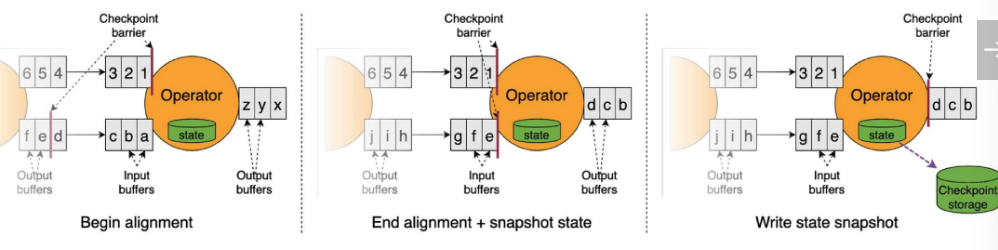

  - Checkpoint Coordinator가 일정 주기마다 모든 소스 노드들에게 신호를 보냄
    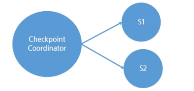
      - S1, S2 : Source 연산자(신호)

  - 각 Source는 그 시점까지의 데이터를 기록하고, 다운스트림으로 체크포인트 배리어를 보냄
    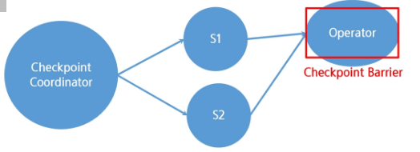

  - operator들은 데이터를 게속 처리하다가 배리어를 받으면 일단 해당 입력에 대한 처리를 잠시 멈추고 대기. 그리고 자신의 상태를 그 순간에 저장
  - 만약 여러 입력 중 한 곳에서만 배리어가 오고 다른 곳은 아직이라면, 받은 곳은 멈추고 나머지 입력들을 기다렸다가 모두 배리어에 도달하면 그때 스냅샷을 찍음
    

  - 저장한 위치 정보(상태 핸들) JobManager에게 전송
    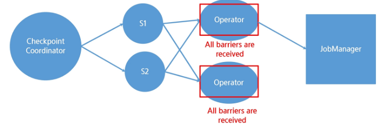
      - <span style='color:green'>일관된 snapshot 완성</span>

  - 최종 싱크(Sink) 연산자들끼리 모두 자신의 상태 저장을 마치고 신호를 보내면, 메타데이터 파일을 기록 및 저장
    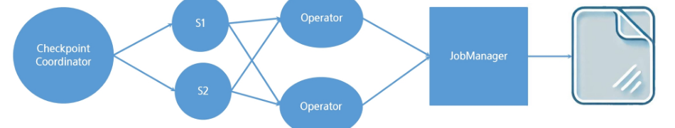


#### SavePoint
- 게임에서의 '저장' 기능(<span style='color:green'>명령을 내려서 snapshot 생성</span>)
  - <span style='color:green'>checkpoint : 작업 재시작, 재배포할 때(장애가 발생할 때) 사용</span>
  - <span style='color:green'>savepoint : 의도적으로 특정 시점(상태)를 저장</span>
  - CheckPoint와 동일한 매커니즘으로 생성.
  - 현재까지의 처리 상태와 데이터를 안전한 곳에 저장
  - 반드시 사용자가 직접 생성 및 삭제해야 함.
  - > 작업 종료 후나 복원 후에도 SavePoint는 유지됨.

- job을 실행시켜야 savepoint를 사용할 수 있음
- CMD에 직접 Savepoint 생성 명령어를 전달해줘야 함
- 코드 실행 후 /tmp/flink-savepoints/savepoint-{JOB-ID}에서 생성된 파일 확인

  ```python
  # Checkpoint 활성화 및 저장소 설정
  env.enable_checkpointing(5000)  # 5초마다 체크포인트 저장
  env.get_checkpoint_config().set_checkpoint_storage(FileSystemCheckpointStorage(CHECKPOINT_PATH))

  # CSV 파일에서 데이터 로드
  csv_path = '../data/data.csv'
  df = pd.read_csv(csv_path)
  transactions = df[['transaction_id', 'amount']].dropna().values.tolist()

  # Flink 데이터 스트림 생성
  transaction_stream = env.from_collection(transactions)

  # 데이터 처리 연산 적용 (Flink 내부에서 실행되도록 MapFunction 사용)
  processed_stream = transaction_stream.amp(TransactionProcessor())

  # 결과 출력
  processed_stream.print()

  # Flink 실행 (즉시 실행되도록 'execute()' 사용)
  job_client = env.execute_async("Savepoint Debugging Example")

  # 실행 중인 Job의 ID 가져오기
  job_id = job_client.get_job_id()
  # Savepoint 요청 전, Job이 실행될 시간을 확보
  time.sleep(5)

  # CMD에 savepoint 생성 명령어 실행
  savepoint_command = f'$FLINK_HOME/bin?flink savepoint {job_id} {SAVEPOINT_PATH}'
  savepoint_result = os.system(savepoint_command)
  ```

#### 장애 발생 시 복구 과정
- 어플리케이션을 다시 재시작(restart)함
- 가장 최근에 성공해 둔 체크포인트 데이터를 불러옴
  - 연산자들의 상태를 복원
  - 체크포인트에 기록된 위치부터 다시 읽기 시작

- 체크포인트 사이에 진행된 부분은 장애로 처리되지 못했으니 다시 처리
  - 소스 측에서 해당 체크포인트 이후의 데이터로부터 다시 보냄.
  - 하지만 barrier 정렬 덕분에 중복으로 처리되지는 않음 → 일관성 보장
    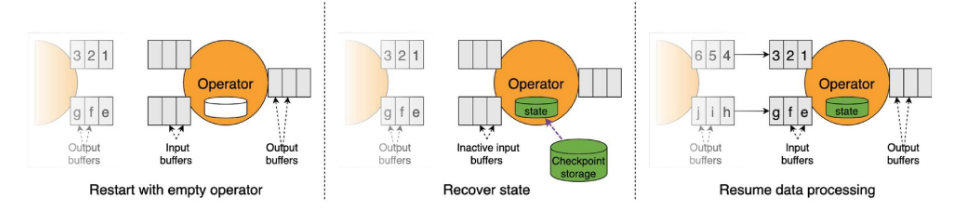
      - <span style='color:green'>operator 안에 아무것도 없는 빈 상태</span>
      - <span style='color:green'>체크포인트?</span>
      - <span style='color:green'>체크포인트 시점에서 읽기 시작?</span>
      - <span style='color:green'>저장하는 중에 operator에 장애 발생,?</span>

### 2) Checkpointing 최적화 기술
#### Checkpointing 최적화 기술
- 비동기 체크포인팅 (Asynchronous Checkpointing)
  - 체크포인트를 찍는 동안 데이터 처리를 완전히 멈춘다면, 체크포인트에 걸리는 시간만큼 데이터 처리가 지연
  - 대부분의 상태 백엔드는 기본적으로 비동기 스냅샷을 지원
  - 쓰레드나 별도의 방법으로 상태 데이터를 백업하면서, 메인 데이터 처리는 계속 진행
  - 체크포인팅으로 인한 지연(latency) 영향이 훨씬 줄어듦.
    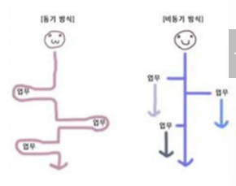
  - <span style='font-size:20px;font-weight:bold;'>비동기 체크포인팅 = 게임 백그라운드 저장</span>
  
- 증분 체크포인팅 (Incremental Checkpointing)(<span style='color:green'>매번 상태를 저장하는 것이 아님</span>)
  - GIT 저장 방식과 같이 매번 전체 상태를 다 저장하지 않고, 이전 체크포인트 이후 변경된 부분만 저장
  - Flink의 초기 버전에서는 모든 체크포인트마다 전체 상태를 통째로 저장(시간이 지날수록 상태 크기가 커짐)(<span style='color:green'>변경된 부분만 저장하다가 특정 시점에 통째로 저장</span>)
  - 저장해야 하는 데이터 양이 줄어서 훨씬 빠르게 처리할 수 있음
    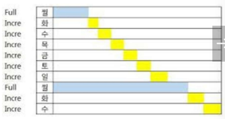
  - <span style='font-size:20px;font-weight:bold;'>증분 체크포인팅 = 바뀐 것만 저장</span>
  
- Barrier Alignment 최적화
  - Barrier 정렬 과정은 한 입력 스트림이 매우 느려지거나 막혀버리면, 다른 빠른 스트림들도 체크포인트를 위해 그 느린 스트림을 기다려야 함. 따라서 정확한 스냅샷을 위해 꼭 필요하지만, 때로는 처리 지연을 유발

- Unaligned Checkpoint
  - 느린 스트림을 굳이 기다리지 않고도 체크포인트를 수행
  - 배리어가 도착하지 않은 스트림의 데이터까지도 포함해서 그대로 체크포인트에 저장(지금까지 온 데이터 전부를 일단 스냅샷에 넣는 것)
  - 체크포인트 진행이 특정 느린 채널에 발목 잡히지 않아서 전체적으로 빨라질 수 있음
  - 특히 네트워크 지연이나 백프레셔로 인해 일부 스트림에 정체된 데이터가 많을 때 유용
  - 단, 체크포인트 크기가 커질 수는 있음(<span style='color:green'>→ 복구할 때 복잡도가 약간 증가할 수 있음</span>)
  
- 체크포인트 주기 조정
  - 체크 포인트를 자주 찍을수록 장애 발생 시 잃는 데이터가 거의 없어 안전
    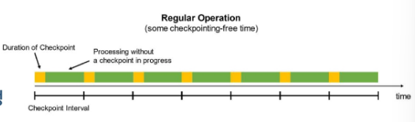

  - 그러나 너무 잦으면 그만큼 시스템에 부하가 걸리고 성능이 떨어질 수 있음
    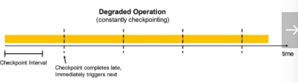
  
  - 반대로 너무 드물게 찍으면 성능은 좋지만 장애 시 더 많은 데이터를 다시 처리해야 하거나 데이터를 잃을 위험이 있음
    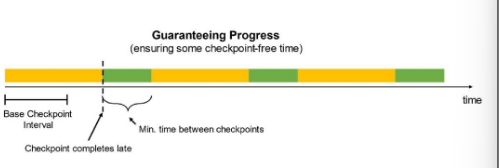
      - <span style='color:green'>최소 간격 확보</span>

- 체크포인트 병렬성 조정
  - Flink는 기본적으로 모든 작업자(task)들이 동시에 자신의 상태를 체크포인트
  - 동시에 진행되는 체크포인트 개수 조절 가능(Default: 한번에 하나의 체크포인트)
  - MaxConcurrentCheckpoints 설정으로 여러 체크포인트를 중첩해서 진행할 수 있음
- 최소 간격(min pause) 설정
  - 체크포인트 끝내고 다음 체크포인트 시작까지 기다리는 최소 시간

- 체크포인트 타임아웃 설정
  - 지정된 시간 내에 체크포인트를 완료 못 하면 실패로 간주하는 시간

### 3) Checkpointing 구현 및 관리
#### Checkpointing 활성화
- StreamExecutionEnvironment
  - `enable_checkpointing(10000)` : 10,000 밀리초 (10초)마다 체크포인트를 생성
- 체크포인트 저장소 설정
  - `set_checkpoint_storage(FileSystemCheckpointStorage(CHECKPOINT_PATH))`

```python
from pyflink.datastream import StreamExecutionEnvironment
from pyflink.datastream.checkpoint_config import CheckpointConfig
from pyflink.datastream.checkpoint_storage import FileSystemCheckpointStorage

# 실행 환경 설정
env = StreamExecutionEnvironment.get_execution_environment()
env.set_parallelism(1)

# Checkpoint 활성화 (10초 간격)
env.enable_checkpointing(10000)

# Checkpoint 저장소 설정(로컬)
env.get_checkpoint_config().set_checkpoint_storage(
  FileSystemCheckpointStorage("file://tmp/flink-checkpoints")
)
```

#### Checkpoint 설정
- 동시 체크포인트 수 설정
  - 한 번에 하나의 체크포인트만 진행
- 체크포인트 간 최소 간격 설정
  - 체크포인트사이에 최소 5초의 간격을 둠
- 체크포인트 타임아웃 설정
  - 체크포인트 타임아웃을 1분으로 설정

```python
# 동시에 2개의 체크포인트 실행 가능
env.get_checkpoint_config().set_max_concurrent_checkpoints(2)

# 60초(1분) 후 타임아웃 발생
env.get_checkpoint_config().set_checkpoint_timeout(60000)

# 최소 5초 간격 유지
env.get_checkpoint_config().set_min_pause_between_checkpoints(5000)
```

- 증분 체크포인트 활성화
  - RocksDB 활용 필수
```python
# Incremental Checkpoint 활성화 (RockDB 활용)
env.set_state_backend(EmbeddedRocksDBStateBackend())
```

#### Checkpointing 전체 코드(로컬 파일 예제)
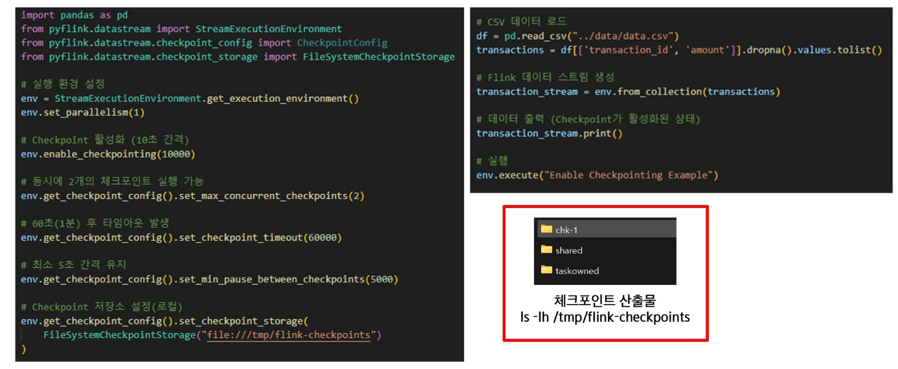

## 2. Window
### 1) 윈도우의 개념 및 종류
#### 윈도우란?
- 연속적인 데이터 스트림을 유한한 세그먼트로 분할하는 방법
  - 실시간으로 끝없이 발생하는 스트림 데이터를 분석하기 위해서는, 데이터를 유한한 덩어리로 나누는 개념이 필요
  - 연속적인 데이터 스트림을 특정 기준에 따라 유한한 세그먼트(구간)로 분할하는 방법
  - 윈도우를 사용하면 문한에 가까운 데이터 흐름을 잘게 나누어 각 조각마다 합계나 평균 같은 계산을 수행할 수 있음
    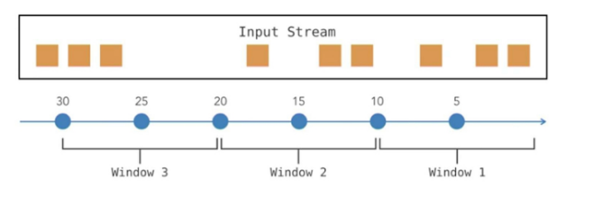

#### 윈도우가 필요한 이유
- 무한 스트림의 처리 가능
  - 무한히 발생하는 이벤트 스트림을 유한한 크기로 나누어 처리할 수 있게 해줌
  - 전체 스트림에 대해 한 번에 평균을 계산하는 것은 불가능하지만, 1분 단위로 윈도우를 구분하여 각 분마다 평균을 계산하면 계속해서 업데이트되는 평균값을 얻을 수 있음
- 변화 추적 및 시간별 통계
  - 윈도우별로 데이터를 구분하면 시간의 흐름에 따른 변화 추이(<span style='color:green'>시간별 통계</span>)를 관찰할 수 있음
- 연속 계산 및 자원 절약
  - 모든 데이터를 모을 때까지 기다리지 않고 부분 결과를 지속 계산함으로써, 메모리나 저장공간을 효율적으로 사용할 수 있음

#### 윈도우 종류
- 텀블링 윈도우(Tumbling Window)(<span style='color:green'>일정한 크기의 고정된 창</span>)
  - 텀블링 윈도우는 크기가 고정된 창으로, 서로 겹치지 않게 배치
  - 각 윈도우는 특정 고정 길이 (예 : 1분, 100개 이벤트 등)를 가지며, 빈틈없이 배치
  - 각 데이터 요소는 다른 윈도우에 중복되어 속하지 않으며, 모든 요소는 정확히 하나의 텀블링 윈도우에만 속하게 됨
  - 매 분/시간/일별 집계, 배치(batch) 처리의 마이크로버전 등 일정한 시간 및 구간별 요약을 얻고자 할 때 적합함
    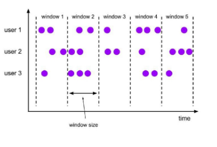

- 텀블링 윈도우 동작 방식
  - 윈도우 길이를 미리 설정해두면, Flink가 스트림을 해당 간격으로 잘라서 독립적인 섹션으로 만듦
  - 예를 들어 5분 텀블링 윈도우로 설정하면, 각 5분 구간에 도착한 이벤트들을 모아서, 5분이 끝나면 집계 결과를 한 번 출력하고 다음 윈도우로 넘어감
    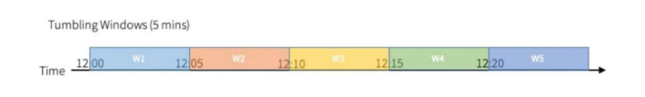
      - <span style='color:green'>각각의 window는 각각의 session처럼</span>
      - <span style='color:green'>session : 어떤 활동이 연속되는 구간</span>

- 슬라이딩 윈도우 (Sliding Window)
  - 텀블링 윈도우처럼 고정된 크기를 가지지만, 겹칠 수 있음
  - 윈도우 크기와 간격 파라미터 설정 필요(<span style='color:green'>슬라이드 간격 파라미터가 추가됨 (from 텀블링 윈도우)</span>)
  - 윈도우들은 슬라이드 간격만큼씩 이동하면서 생성
  - 슬라이드 간격이 윈도우 크기보다 작으면 새로운 윈도우가 시작될 때 이전 윈도우와 겹쳐지는 부분이 발생(중복 가능)
    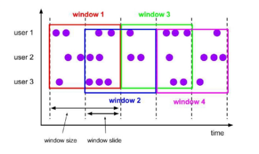

- 슬라이딩 윈도우 동작 방식
  - 윈도우 크기 10분, 슬라이드 간격 5분
  - 첫 윈도우는 0~10분 데이터를 포함하고 10분에 종료
  - 슬라이드 간격 5분이 지나면 두 번째 윈도우가 5~15분 구간으로 생성
  - 5~10분 구간의 데이터는 첫 번째와 두 번째 윈도우에 겹쳐 중복됨
    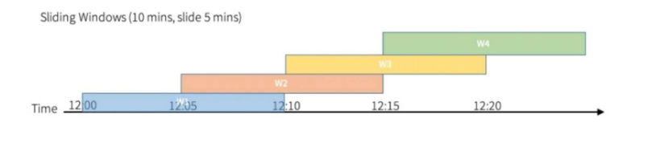

- 세션 윈도우 (Session Window)
  - 고정된 크기가 없는 동적 윈도우
  - 데이터의 발생 패턴에 따라 윈도우 구간이 결정됨
  - 일반적으로 세션 간격(Session gap)이라고 불리는 비활동 기간(threshold)을 기준으로, 일정 기간 이상 이벤트가 발생하지 않으면 하나의 세션 윈도우가 종료되고 다음 윈도우가 시작됨
  - <span style='color:green'>비활동시간 = 세션 간격(session gap)</span>
    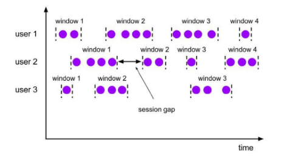
      - 5분동안 아무런 이벤트 발생하지 않으면 세션 윈도우 종료
      - 만약 5분 안에 이벤트 발생 시, 세션 윈도우 진행

- 세션 윈도우 동작 방식
  - 세션 윈도우는 이벤트 사이의 간격을 추적
  - 연속된 이벤트들 사이의 시간이 설정한 세션 간격보다 작으면 같은 윈도우(세션)에 속함
  - 이벤트 간격이 기준보다 길게 비면 그 시점을 기준으로 이전 세션 윈도우가 닫히고 새로운 윈도우가 열림
  - 데이터 스트림에서 한동안(Event gap) 이벤트가 없으면, 그 앞까지를 하나의 세션으로 보고 그룹화
    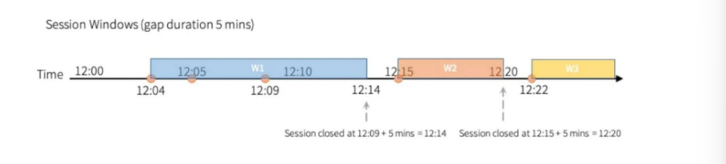

- 글로벌 윈도우 (Global Window)
  - 글로벌 윈도우는 스트림 전체를 하나의 윈도우로 간주
  - 모든 이벤트가 한 윈도우에 속하게 되며, 윈도우의 범위에 시간적 제한이 없음
  - 스트림을 하나로 묶어 버리기 때문에, 윈도우 자체로는 절대 닫히지 않고 계속 열려있게 됨
  - 따라서 사용자 정의 트리거를 통해 언제 결과를 산출할지를 반드시 정의해주어야 함
    - <span style='color:green'>트리거가 필수다! → 트리거는 조건을 가지고 있음</span>
    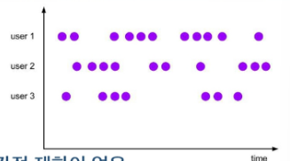

- 동작 방식
  - 별도의 윈도우 분할 기준을 주지 않으면 모든 데이터가 한 차에 쌓이게 됨
  - 개발자가 원하는 시점에 출력을 발생시키는 트리커(trigger)를 설정해야 함
  - ex) Count 트리거 : 100개마다 출력
  
### 2) 윈도우 구현
#### 공통 환경 설정
- 실행 환경 생성 및 데이터 소스 생성
```python
import time
from pyflink.datastream import StreamExecutionEnvironment
from pyflink.common.time import Time
from pyflink.datastream.window import SlidingProcessingTimeWindows
from pyflink.common.typeinfo import Types

# 실행 환경 생성
env = StreamExecutionEnvironment.get_execution_environment()
env.set_parallelism(1)

# 데이터 소스 생성
data_stream = env.from_collection (
  collection = [('user1', 1), ('user1', 3), ('user1', 4), ('user1', 5)],
  type_info = Types.TUBLE([Types.STRING(), Types.INT()])
)
```

#### 텀블링 윈도우 (Tumbling Window)
- TumblingProcessingTimeWindows
  - <span style='color:green'>Processing Time : Event Time과 다름</span>
    - <span style='color:green'>프로세스가 처리되는 시간</span>
  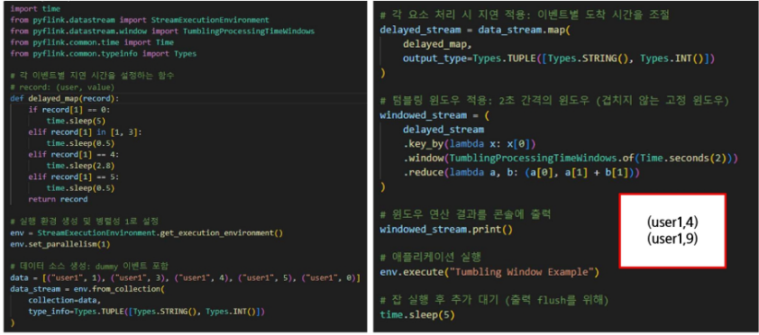

#### 슬라이딩 윈도우 (Sliding Window)
- SlidingProcessingTimeWindows
  - 1.2초 지연, 윈도우 크기 2초, 슬라이드 간격 1초
    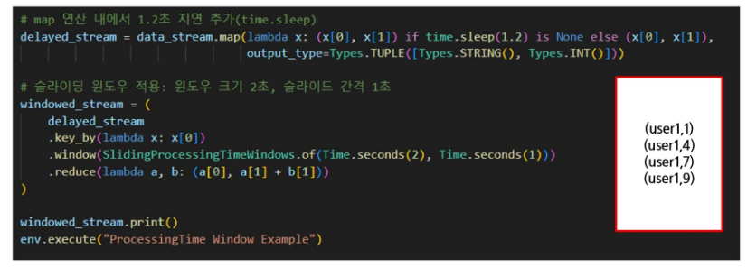

#### 세션 윈도우 (Session Window)
- ProcessingTimeSessionWindows
  - 세션 간격 2초
    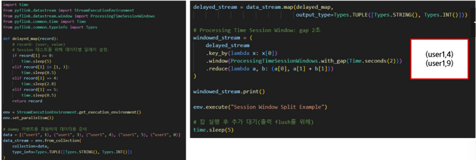

#### 글로벌 윈도우 (Global Window)
- GlobalWindows
  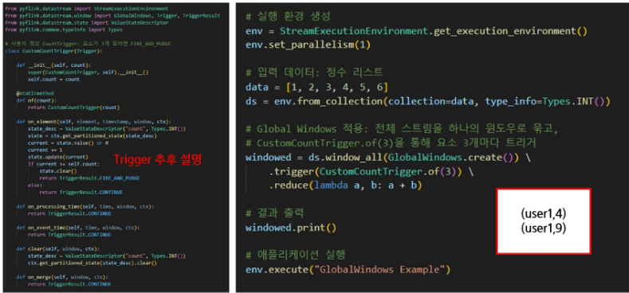

## 3. Triggers 및 Evictors
### 1) Triggers 및 Evictors
#### Trigger
- 트리거의 개념
  - 윈도우가 언제 결과를 내보낼지를 결정하는 조건/규칙
  - 각 윈도우에는 디폴트 트리거가 정의되어 있어서 특별히 지정하지 않아도 작동

- 기본 트리거 종류
  - 이벤트 시간(Event Time) 기반 윈도우 (<span style='color:green'> → 정확한 데이터</span>)
  - 처리 시간(Processing Time) 기반 윈도우
  - 세션 윈도우

- 시간 기반 트리거
  - 일정 시간 간격으로 윈도우를 강제로 출력
  - ex) Processing-Time 트리거 : 5초마다 강제 출력

- 카운트 기반 트리거
  - 윈도우에 누적도니 이벤트 개수가 특정 숫자에 도달할 때 출력
  - ex) 100개의 이벤트가 모일 때마다 출력

- 복합 조건 트리거
  - 시간 OR 카운트 등 여러 조건 중 하나 만족 시 출력하거나, AND 조건 등 조합
  - ex) 1분이 지났거나 50개가 모이면 출력

- 사용자 정의 트리거
  - 특정 값 이상이 되면 출력 등, Trigger 인터페이스를 구현하여 onElement에서 임의의 조건으로 FIRE 시킴

#### TriggerResult
| TriggerResult | 설명 | 사용 |
|:--------------|:----|:-----|
| `TriggerResult.FIRE` | 현재까지 수집된 데이터를 출력하지만 윈도우는 유지 | 부분 출력을 원할 때 |
| `TriggerResult.FIRE_AND_PURGE` | 현재까지 수집된 데이터를 출력하고 윈도우를 초기화 | 새로운 윈도우 시작할 때 |
| `TriggerResult.CONTINUE` | 현재 윈도우를 유지하고 아무 작업도 수행하지 않음 | 기준이 충족되지 않았을 때 |
| `TriggerResult.PURGE` | 출력 없이 윈도우만 초기화 | 이벤트 삭제할 때 |

#### 기본 Trigger 유형
- ProcessingTimeTrigger
  - 처리 시간 기준 특정 시점에 FIRE.
- EventTimeTrigger
  - 이벤트 시간 워터마크 기준 FIRE. (모든 이벤트-타임 윈도우 default 트리거)
- CountTrigger
  - 누적 이벤트 개수가 기준에 도달하면 FIRE

#### CustomTrigger
- Trigger 클래스 상속, 필수 메서드 구현
  - Trigger 구현을 위해 반드시 추상 메서드 5개를 구현해야 함.
  - 미사용 메서드는 return TriggerResult.CONTINUE로 처리할 수 있음.

    | 메서드 | 설명 | 사용 여부 |
    |:------|:----|:---------|
    | `on_element(self, element, timestamp, window, ctx)` | 새 데이터가 들어올 때 실행됨 | 필수 |
    | `on_processing_time(self, time, window, ctx)` | 특정 처리 시간이 도래하면 실행됨 | 선택 |
    | `on_event_time(self, time, window, ctx)` | 특정 이벤트 시간이 도래하면 실행됨 | 선택 |
    | `on_merge(self, window, ctx)` | 여러 윈도우가 병합될 때 실행됨 | 선택 |
    | `clear(self, window, ctx)` | 윈도우가 닫힐 때 상태 초기화 | 필수 |

#### CustomTrigger 예제 : CountTrigger
- Trigger 클래스 상속, 필수 메서드 구현 예제
  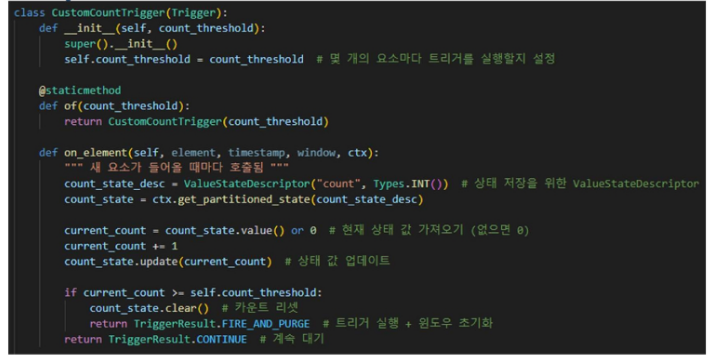
  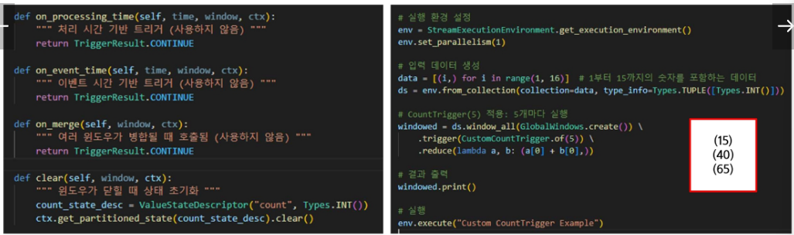

#### Evictor
- 윈도우에서 일부 요소를 제거(evict)하는 역할(<span style='color:green'>전처리기</span>)
  - 윈도우 연산이 수행되기 전후에 적용되어, 남겨둘 요소와 버릴 요소를 결정할 수 있음
  - 특정 기준에 따라 오래된 데이터나 조건에 맞지 않는 데이터를 윈도우에서 빼냄으로써, 실제 연산에 사용되는 데이터 범위를 조절

- 사용이유(길이가 1시간인 윈도우에서 최대값 구하기)(<span style='color:green'>→ 1시간치의 데이터가 쌓임</span>)
  - 데이터를 오래 유지하면 메모리 사용량이 증가하고, 최근 데이터만 남기면 분석 효율이 증가
  - 이빅터를 사용해 최근 10분치 데이터만 남겨두고 이전 50분치 데이터는 버릴 수 있음
  - 메모리 사용 최적화 → 오래된 데이터(50분 이전)는 제거됨.
  - 최신 데이터 기반 분석 가능 → 최근 10분 데이터만 반영되므로 실시간성 유지
  - 윈도우 크기는 1시간으로 유지 → 여전히 1시간 내에서 트리거가 실행되지만, 계산은 최근 10분 데이터만 사용하는 효과가 발생.(<span style='color:green'>윈도우 제어 흐름에서 완전히 없어진 것으로 취급 →외부 sink 같은 곳에 보내지는 것도 없음?</span>)

#### Evictor 유형
- <span style='color:green'>window 크기가 너무 큰데 앞부분은 고려하지 않겠다 → 최신성 고려</span>
- CountEvictor(N)
  - 각 윈도우마다 N개의 요소만 유지하고 나머지는 제거
  - ex) 윈도우에 100개가 쌓였는데 CountEvictor(50)를 쓰면 50개만 남기고 50개 evict
- TimeEvictor(t)
  - 현재 윈도우의 가장 늦은 타임스탬프 -t보다 이전의 모든 요소를 제거
  - ex) TimeEvictor(10초) → 윈도우 내에서 최신 이벤트 시간으로부터 10초보다 더 오래된 이벤트들을 제외하고 연산

- DeltaEvictor(△) 
  - 델타 함수를 이용한 사용자 정의 기준.
  - 요소들 간의 차이나 특정 속성 변화량이 설정한 △ 기준보다 크면 제거하는 방식 등, 사용자가 DeltaFunction을 정의해야 함

#### TimeEvictor 예제
- 오래된 데이터 제거
  - 윈도우 자체는 60분치 데이터를 모으지만, 실제 계산에는 가장 최근 10분 이내의 데이터만 사용
  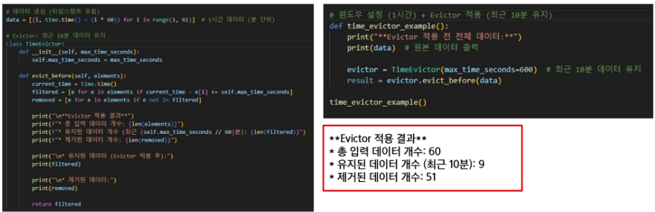

## 4. Watermarks와 Late Elements 처리
### 1) Watermarks와 Late Elements 처리
#### Watermarks
- 필요성
  - 실시간 스트림 처리에서 이벤트의 시간(timestamp)을 기준으로 윈도우를 사용하는 경우, 이벤트가 발생한 실제 시각(Event Time)과 시스템이 이벤트를 처리하는 시각(Processing Time) 사이에 차이가 있을 수 있음
  - 네트워크 지연이나 시스템 부하 때문에 이벤트들이 생성 순서와 다르게 도착하기도 함
  - 이런 경우 아무 대책 없이 이벤트 시간 윈도우를 사용하면, 윈도우가 이미 닫힌 후에 늦게 도착한 이벤트가 발생하여 데이터 손실이나 잛못된 결과가 나올 수 있음

- 워터마크란?(<span style='color:green'>이벤트 타임스탬프</span>)
  - <span style='color:green'>이전 시간 이벤트는 이미 도착했다고 가정함</span>
  - 특수한 타임스탬프 메타데이터로서, 현재까지 도착한 이벤트 중 가장 큰 이벤트 시간에 대한 정보를 표현
  - "현재 시각(t)까지의 이벤트는 모두 도착했다고 간주하겠다"라는 마커를 주기적으로 생성하여 스트림과 함께 흘려보냄
  - 윈도우 연산자는 워터마크를 참고하여, 특정 윈도우를 언제 확정 짓고 닫을지 결정
    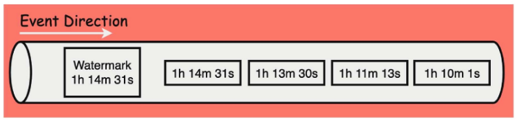

  - Window Operator에 Watermark가 유입되고 나면 Window Operator는 더 이상 1h 13m보다 과거의 Event는 유입되지 않는다고 판단
  - Watermark가 명시한 시간보다 과거의 Event들은 모두 Purge됨
    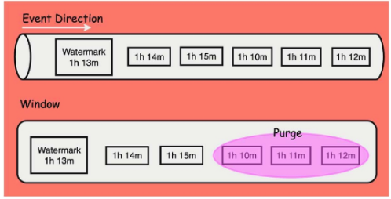

#### 이벤트 시간 vs. 처리 시간
- 이벤트 시간(Event Time)
  - 데이터가 실제 현실에서 발생한 시각
  - 이벤트 시간 기반으로 윈도우를 처리하면, 결과를 데이터 발생 시각을 정확히 반영하므로, 지연이나 순서 뒤바뀜에도 논리적으로 일관된 결과를 얻을 수 있음
  - 이벤트 시간이 올바르게 동작하려면 워터마크를 통해 Flink가 시간 진행을 파악해야 함

- 처리 시간(Processing Time)
  - Flink 태스크가 실제로 이벤트를 처리하는 현재 시스템 시간
  - 구현이 간단하고 자연 처리도 필요없지만, 외부요인에 따라 순서가 어긋나거나 지연된 이벤트를 고려할 수 없음
  - 따라서 실시간성은 높지만 정확도는 떨어질 수 있음

#### Watermarks
- 작동 원리
  - 워터마크는 보통 '현재이벤트 타임 - (허용 지연 시간)'의 값으로 주기적으로 생성
  - 워터마크를 받은 윈도우 오퍼레이터는 해당 워터마크 시각보다 이전에 끝나는 윈도우들은 이제 모두 이벤트가 다 왔다고 판단하고, 그 윈도우들을 마감
    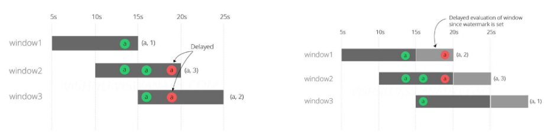

#### Late Elements와 Allowed Lateness(<span style='color:green'>한 번 닫힌 후에도 추가적으로 늦은 애들을 허용해주는 기능</span>)
- 지연 도착 데이터 처리
  - Allowed Lateness(허용 지연) 설정을 통해, 윈도우가 닫힌 후에도 일정 기간 동안 늦은 데이터를 수용하는 기능을 제공
  - Allowed Lateness(Duration)을 설정하면, 해당 기간 내에 도착한 늦은 이벤트는 다시 그 윈도우를 열어서 계산을 반영(<span style='color:green'>기간을 너무 길게 잡으면 실시간성과 정확성이 떨어질 수 있음</span>)
  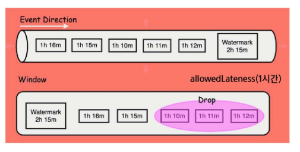

  - Allowed Lateness는 watermark delay 이후 적용
    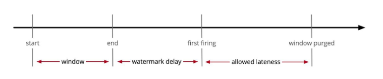

#### Watermarks + allowedLateness 예제
- 1초까지 out-of-order를 허용하는 워터마크
- 2초의 이벤트 시간 텀블링 윈도우에 대해 최대 2초의 허용 지연 설정
  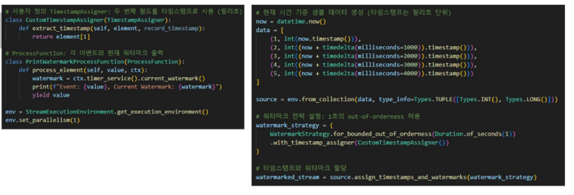

- Late Elements 처리
  - side output으로 모은 너무 늦은 이벤트들을 처리
    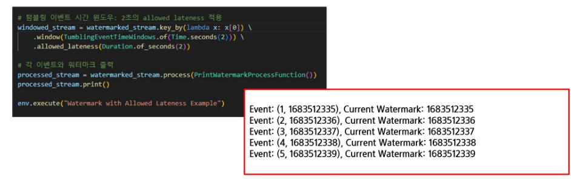