# 데이터엔지니어링 기초 - Flink DataStream
<details>
<summary>목차</summary>

1. DataStream API
2. 데이터 변환 및 연산
3. 데이터 스트림의 분할 및 반복
4. Flink Table API

</details>

## 1. DataStream API
### 1) DatatStream API 개요
#### Stream Processing?
- 동전 분류기, 줄서기 예시
  - 모든 구성 요소는 직렬로 연결
  - 지속적으로 시스템에 입력되어 향후 사용을 위해 다양한 대기열로 출력(분류됨)
  - 일반적으로 스트림 처리 시스템은 무한 데이터셋 처리를 지원하기 위해 데이터 기반 처리 방법을 사용
    

#### Batch vs. Streaming 처리 방식
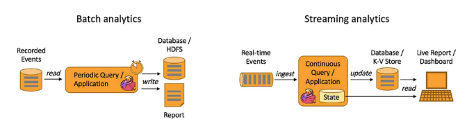

| | Batch | Streaming |
|:-:|:-:|:-:|
| 처리 방식 | 일정기간 단위로 수집하여 한 번에 처리 | 연속된 데이터를 하나씩 처리 |
| 처리량 | 대규모 데이터 단위 | 주로 소량의 레코드 단위 |
| 속도 | 수분 ~ 시간의 지연시간 | (준)실시간 |
| 사용환경 | 복잡한 분석이 요구되는 환경<br> 데이터 처리량이 많은 환경 | 실시간 처리 및 분석 정보가 요구되는 환경 |

#### DataStream API 개요
- 스트림 데이터를 처리하기 위한 API
  - 데이터 스트림(DataStream) 기본적으로 유한 또는 무한의 불변(immutable) 데이터 집합으로, 변환(transformation)을 통해 처리
  - 실시간 이벤트 처리, CEP(Complex Event Processing), 사용자 정의 로직, 복잡한 상태 관리
  - 저수준(Low-level) API로, 데이터의 흐름과 처리를 세밀하게 제어
  - 프로그램은 데이터 소스(source)로부터 데이터를 읽고, 여러 변환(transformations)을 적용한 후, 결과를 싱크(sink)를 통해 외부 시스템에 출력
  - 실제 데이터 처리는 `execute()` 호출 시점에 실행 계획(Data Flow Graph)으로 실행

#### Directed Acyclic Graph
- 논리 모델 (DAG)
  - DAG(Directed Acyclic Graph) : 방향성이 있는 비순환 그래프로, 전체 계산 로직을 노드(연산자)와 간선(데이터 흐름)으로 표현.
  - 사용자가 작성한 스트림 처리 프로그램에서 "어떤 연산을 순서대로 수행할 것인지"를 추상적으로 표현
  - "연산자가 어떻게 연결되는지, 어떤 순서로 실행되는지"만을 정의
    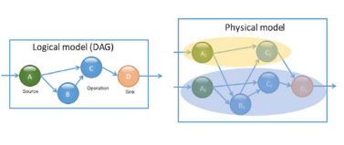

- 왜 DAG를 사용하는가?
  - 스트림 처리에서 여러 연산자가 순차 혹은 병렬적으로 데이터를 처리하는 과정을 직관적으로 표현
  - DAG 형태로 나누어 두면, 각 노드를 여러 태스크로 확장하여 대규모 데이터를 병렬로 처리할 수 있음
  - DAG 구조를 분석해 노드 간 데이터 교환, 파티셔닝, 스케줄링 등을 최적화 가능
  - 엔진은 DAG에 정의된 각 노드(연산자) 상태를 주기적으로 체크포인트(checkpoint)하고, 장애 발생 시 해당 노드 상태만 복구해 재실행 용이
    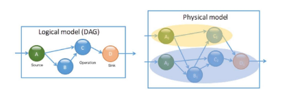

#### 데이터 소스 종류
- 파일 시스템
  - 로컬 파일, HDFS 등에서 데이터를 읽어 들임

- 메시지 큐/스트리밍 플랫폼
  - Apache Kafka 등과 연동하여 실시간 스트림 처리

- 소켓 스트림
  - 네트워크 소켓을 통해 실시간 로그나 이벤트 데이터를 수신

#### 데이터 소스 구성 방법
- Flink의 'StreamExecutionEnvironment'를 사용
- 커넥터 API를 통해 다양한 외부 시스템과 쉽게 연결

  ```python
  from pyflink.datastream import StreamExecutionEnvironment

  # Flink 환경 생성
  env = StreamExecutionEnvironment.get_execution_environment()

  # 파일 데이터 소스 (파일에서 한 줄씩 읽기)
  file_path = '../data/data.csv'
  text_stream = env.read_text_file(file_path)

  # 데이터 출력
  text_stream.print()

  # 실행
  env.execute('File Source Example')
  ```

#### Sink
- 데이터 흐름 : 데이터 소스 → 연산(변환) → Sink
  - 데이터 소스 : 데이터 입력을 정의
  - 연산 : 데이터를 가공하는 작업
  - Sink : 처리한 스트림을 출력·저장하는 단계
    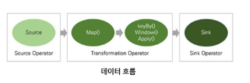

    | Sink 종류 | 설명 |
    |:---------:|:----|
    | PrintSink | `print()` 메서드를 사용하여 콘솔에 출력 |
    | FileSink | 데이터를 파일로 저장 (텍스트, CSV, JSON 등) |
    | KafkaSink | 데이터를 Kafka에 저장 |
    | DatabaseSink | JDBC를 이용하여 DB(MySQL, PostgreSQL 등)에 저장 |
    | ElasticsearchSink | 데이터를 Elasticsearch에 저장 |

#### Sink 예제(FileSink)
- FileSink를 위해 Java encoder 필요
  - `get_gateway()`를 통해 Java 가상 머신에 접근, Java의 SimpleStringEncoder를 생성
  - 생성한 Java encoder를 Encoder 클래스에 전달하여 Python encoder를 생성

    ```python
    from pyflink.datastream import StreamExecutionEnvironment
    from pyflink.datastream.connectors import FileSink
    from pyflink.common.serialization import Encoder
    from pyflink.common.typeinfo import Types
    from pyflink.java_gateway import get_gateway

    # 실행 환경 생성
    env = StreamExecutionEnvironment.get_execution_environment()

    # 데이터 소스 생성
    data = ['Hello', 'Flink', 'World']
    data_stream = env.from_collection(data, type_info=Types.STRING())

    # Java 엔코더 생성
    gateway = get_gateway()
    j_string_encoder = gateway.jvm.org.apache.flink.api.common.serialization.SimpleStringEncoder()

    # Python Encoder 생성
    encoder = Encoder(j_string_encoder)

    # FileSink 설정
    file_sink = FileSink.for_row_format(
      "./output/result", # 출력 디렉터리
      encoder
    ).build()

    # Sink에 데이터 연결
    data_stream.sink_to(file_sink)

    # 플링크 작업 실행
    env.execute('File Sink Example')
    ```

## 2. 데이터 변환 및 연산
### 1) 데이터 변환 및 연산
#### 데이터 변환
- 데이터 변환은 원시 데이터를 유용한 정보로 변형
  - 원시 데이터를 의미 있는 정보로 재구성
  - 후속 처리(예 : 집계, 조인, 윈도우 연산 등)를 위한 전처리 작업을 수행
  - 변환 함수들은 병렬 처리에 최적화
  - 각 연산은 독립적으로 실행되어 클러스터 환경에서도 높은 확장성과 내결합성을 보장
- 지연 평가(Lazy Evaluation) 방식

#### 지연 평가(Lazy Evaluation)
- 연산 계획 수립
  - 데이터 스트림에 대해 여러 변환 연산(map, filter, flatMap 등)을 적용하면, 각 연산은 바로 실행되지 않고 내부적으로 실행 계획(Graph)으로 기록

- 최적화 기회 제공
  - 실제 실행 전까지 여러 연산이 결합되어 전체 최적화가 가능해짐
  - 불필요한 중간 결과를 줄이고, 연산 체인을 병합하는 등의 최적화가 수행

- 실행 트리거
  - 최종 결과를 출력하는 sink가 설정되거나 `execute()` 명령이 호출되면, 기록된 연산 계획에 따라 전체 데이터 플로우가 한꺼번에 실행
  
    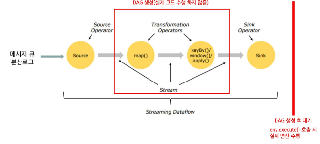

#### 지연 평가(Lazy Evaluation) 장점
- 효율성
  - 불필요한 계산을 방지하여 리소스를 절약하고, 전체 실행 계획을 최적화 가능

- 성능 향상
  - 여러 연산을 하나의 파이프라인으로 결합함으로써, 데이터 전송 및 중간 결과의 저장을 최소화

- 유연성
  - 실행 시점까지 연산을 미루어, 실행 계획을 재구성하거나 동적으로 변경

#### 기본 변환 함수
| 함수 | 역할 | 용도/설명 |
|:---:|:-----|:---------|
| map | 각 입력 요소를 1:1로 변환 | 데이터 포맷 변경, 특정 필드 추출, 단순 계산 적용 |
| flatMap | 하나의 입력 요소에서 0개 이상 출력 생성 | 복합 데이터를 분해하거나, 조건에 따라 다수의 결과 생성 |
| filter | 입력 요소를 조건에 따라 선별 | 노이즈 제거, 유효 데이터 필터링 |

#### map 함수
```python
from pyflink.datastream import StreamExecutionEnvironment
from pyflink.common.typeinfo import Types

env = StreamExecutionEnvironment.get_execution_environment()

# 예제 입력 : 정수 리스트
input_data = [1, 2, 3, 4]

# DataStream 생성
ds = env.from_collection(collection = input_data, type_info = Types.INT())

# map 함수 : 각 요소에 2를 곱하기
mapped_stram = ds.map(lambda x: x * 2, output_type = Types.INT())

# 실행 후 결과 수집
env.execute('Simple Map Job')
mapped_result = list(mapped_stream.execute_and_collect())

print('map 결과:', mapped_result)  # map 결과: [2, 4, 6, 8]
```

#### Flat_map 함수
```python
from pyflink.datastream import StreamExecutionEnvironment
from pyflink.common.typeinfo import Types

env = StreamExecutionEnvironment.get_execution_environment()

# 예제 입력 : 문자열 리스트
input_data = ['hello', 'hi']

# DataStream 생성
ds = env.from_collection(collection = input_data, type_info = Types.STRING())

# flat_map 함수 : 각 문자열을 문자 단위로 분해하여 개별 문자 출력
def split_string(s):
  for ch in s:
    yield ch

flat_mapped_stream = ds.flat_map(split_string, output_type = Types.STRING())

# 실행 후 결과 수집
env.execute('FlatMap Job')
flat_mapped_result = list(flat_mapped_stream.execute_and_collect())

print(flat_mapped_result) # flat_map 결과 : ['h', 'e', 'l', 'l', 'o', 'h', 'i']
```

#### filter 함수
```python
from pyflink.datastream import StreamExecutionEnvironment
from pyflink.common.typeinfo import Types

env = StreamExecutionEnvironment.get_execution_environment()

# 예제 입력 : 정수 리스트
input_data = [1, 2, 3, 4, 5, 6]

# DataStream 생성
ds = env.from_colelction(collection = input_data, type_info = Types.INT())

# filter 함수 : 짝수만 통과시키기
filtered_stream = ds.filter(lambda x : x % 2 == 0)

# 실행 후 결과 수집
env.execute('Filter Job')

filtered_result = list(filtered_stream.execute_and_collect())
print('filter 결과:', filtered_result) # filter 결과: [2, 4, 6]
```

#### 그룹화 및 집계 함수
| 함수 | 역할 | 용도/설명 |
|:---:|:-----|:---------|
| keyBy | 스트림 요소들을 특정 키로 그룹화 | 그룹별 집계, 상태 저장, 윈도우 연산 등의 사전 준비 단계 |
| reduce | 그룹 내 요소들을 누적하여 단일 결과로 집계 | 합계, 최대/최소 값 계산 등 간단한 집계 연산 |
| process | 각 이벤트에 대한 로직 커스텀 처리 | 상대 기반 집계, 타이밍 제어 등 복잡한 로직 구현 |

#### keyby 함수
```python
from pyflink.datastream import StreamExecutionEnvironment
from pyflink.common.typeinfo import Types

env = StreamExecutionEnvironment.get_execution_environment()

# 예제 입력: (사용자, 값) 튜플들의 리스트
input_data = [("A", 1), ("B", 2), ("A", 3), ("B", 4)]

# DataStream 생성 (튜플 타입: (String, Int))
ds = env.from_collection(input_data, type_info=Types.TUPLE([Types.STRING(), Types.INT()]))

# keyBy : 사용자(첫 번째 요소)를 기준으로 그룹화
keyed_stream = ds.key_by(lambda x:x[0])
```

#### reduce 함수
```python
# 각 키 그룹에서 값을 합산하여 변화를 확인
summed_stream = keyed_stream.reduce(lambda a, b: (a[0], a[1] + b[1]))

# 결과 출력
summed_stream.print()

# 실행
env.execute('KeyBy Visualization')
# Keyby + reduce 결과
# (A, 1)
# (B, 2)
# (A, 4)
# (B, 6)
```

#### process 함수
```python
from pyflink.datastream import StreamExecutionEnvironment
from pyflink.datastream.functions import ProcessFunction
from pyflink.common.typeinfo import Types

# ProcessFunction 예제 : 짝수면 2배, 홀수면 그대로 반환
class MyProcessFunction(ProcessFunction):
  def process_element(self, value, ctx: 'ProcessFunction.Context'):
    if value % 2 == 0:
      yield value * 2 # 짝수이면 2배로 출력
    else:
      yield value # 홀수이면 그대로 출력

env = StreamExecutionEnvironment.get_execution_environment()
env.set_parallelism(1)

# 예제 입력 : 정수 리스트
data = [1, 2, 3, 4, 5, 6]

# DataStream 생성
ds = env.from_collection(collection = data, type_info = Types.INT())

# ProcessFunction 적용 (결과 타입 명시)
processed_stream = ds.process(MyProcessFunction(), output_type = Types.INT())

# Flink 작업 실행
env.execute('ProcessFunction Example')

# Process 결과 : [1, 4, 3, 8, 5, 12]
```

#### 멀티 스트림 및 결합 함수
| 함수 | 역할 | 용도/설명 |
|:----:|:----|:----------|
| union | 여러 개의 스트림을 하나로 결합 | 서로 다른 데이터 소스의 스트림을 통합하여 일괄 처리할 때 사용 |
| connect | 서로 다른 타입의 두 스트림을 연결 | 이종 데이터 스트림을 결합한 후, 각각에 대해 별도의 변환을 적용할 수 있음 |

#### union 함수
```python
from pyflink.datastream import StreamExecutionEnvironment
from pyflink.common.typeinfo import Types

env = StreamExecutionEnvironment.get_execution_environment()

# 예제 입력 : 두 개의 정수 리스트 스트림
stream1 = env.from_colelction([1, 2, 3], type_info = Tpyes.INT())
stream1 = env.from_colelction([4, 5, 6], type_info = Tpyes.INT())

# union: 두 스트림을 하나로 결합
union_stream = stram1.union(stream2)

# 결과 수집
result_union = list(union_stream.execute_and_collect())
print('Union 결과:', result_union) # Union 결과: [1, 2, 3, 4, 5, 6]
```

#### connect 함수
```python
from pyflink.datastream import StreamExecutionEnvironment
from pyflink.common.typeinfo import Types
from pyflink.datastream.functions import CoMapFunction

env = StreamExecutionEnvironment.get_execution_environment()

# 예제 입력: 서로 다른 타입의 두 스트림
stream_str = env.from_collection(["A", "B"], type_info = Types.STRING())
stream_int = env.from_collection([1, 2], type_info = Types.INT())

# connect: 두 스트림을 연결
connected_stream = stream_str.connect(stream_int)

# 각 스트림에 다른 방식 처리
class MyCoMapFunction(CoMapFunction):
  def map1(self, value):
    return f'String: {value}'
    
  def map2(self, value):
    return f"Int: {value}"

co_mapped_stream = connected_stream.map(MyCoMapFunction(), output_type = Types.STRING())

# 결과 수집
result_connect = list(co_mapped_stream.execute_and_collect())
print('Connect 결과:', result_connect) # Connect 결과: ['String: A', 'String: B', 'Int: 1', 'Int:2']
```

#### Java에는 있지만 PyFlink에서는 지원되지 않는 주요 변환 함수
| 함수 | 역할 | 용도/설명 |
|:----:|:----|:---------|
| `split()` | 하나의 스트림을 논리적으로 분기 | 각 데이터에 라벨을 부여하여 여러 서브스트림으로 나누는 함수 <br> 이후 `select()`를 통해 라벨 별로 처리. |
| `connect().coFlatMap()` | 서로 다른 타입의 두 스트림을 병합하여 처리 | 두 DataStream을 연결하고, 각 스트림에 대해 개별 flatMap 로직을 정의할 수 있음. <br> 실시간 이벤트 + 설정값 처리 등에서 유용. |
| `iterate()` | 반복 처리를 위한 루프 생성 | 특정 조건이 만족될 때까지 스트림 데이터를 반복적으로 처리할 수 있음 <br> 예 : 수렴 조건이 있는 기계 학습 루트. |
| `CustomPartitioner` | 사용자 정의 파티셔닝 방식 적용 | `KeyBy()` 대신 파티셔너를 지정하여 데이터 분배 방식을 직접 제어할 수 있음 <br> 고급 분산 로직이 필요한 경우 유용. |

## 3. 데이터 스트림의 분할 및 반복
### 1) 데이터 스트림의 분할 및 반복
#### 데이터 스트림 분할 (Filter)
- 하나의 스트림에서 서로 다른 조건이나 처리 목적에 따라 데이터를 여러 개의 하위 스트림으로 나누는 작업
  - 서로 다른 처리 로직이나 파이프라인을 개별 하위 스트림에 적용
  - 복잡한 데이터 처리 시 유연성을 높일 수 있음
  - 초기 Flink 비전에서는 `split()`과 `select()` 연산자를 사용하여 스트림을 분할
  - 현재는 Filter 변환 연산 주로 사용
    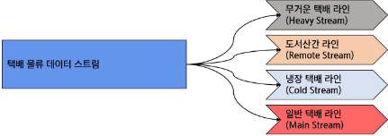

#### 데이터 스트림 분할 (Filter)
```python
from pyflink.datastream import StreamExecutionEnvironment
from pyflink.common.typeinfo import Types

env = StreamExecutionEnvironment.get_execution_environment()

# 예제 입력 : 정수 리스트
data = env.from_collection([1, 2, 3, 4, 5, 6], type_info = Types.INT())

# filter 연산을 이용하여 조건에 맞게 데이터 스트림 분할
even_stream = data.filter(lambda x: x % 2 == 0) # 짝수 스트림
odd_stream = data.filter(lambda x: x % 2 != 0) # 홀수 스트림

# 작업 실행
env.execute('Split Stream Example')

# 결과 수집
evens = list(even_stream.execute_and_collect())
odds = list(odd_stream.execute_and_collect())

print('Even Stream:', evens) # 짝수 (메인) : [2, 4, 6]
print('Odd Stream:' , odds) # 홀수 (Side Output) : [1, 3, 5]
```

```python
from pyflink.datastream import StreamExecutionEnvironment
from pyflink.common.typeinfo import Types

env = StreamExecutionEnvironment.get_execution_environment()
env.set_parallelism(1)

# (무게, 주소, 냉장 여부)
data = [
  (25, '서울 강남구', False),
  (15, '강원도 산간 지역', False),
  (10, '부산 해운대', True),
  (5, '서울 관악구', False)
]

ds = emv.from_collection(data, type_info=Types.TUPLE([Types.INT(), Types.STRING(), Types.BOOLEAN()]))

# 라벨 기반 분기 처리 (split/select 대체)
heavy = ds.filter(lambda x: x[0] > 20)
remote = ds.filter(lambda x: '산간' in x[1])
cold = ds.filter(lambda x: x[2])
normal = ds.filter(lambda x: not(x[0] > 20 or '산간' in x[1] or x[2]))

# 출력
heavy.map(lambda x: f'[무거운 택배] {x}').print()
remote.map(lambda x: f'[산간 택배] {x}').print()
cold.map(lambda x: f'[냉장 택배] {x}').print()
normal.map(lambda x: f'[일반 택배] {x}').print()

env.execute('택배 분기 처리')
'''
[무거운 택배] (25, '서울 강남구', False)
[산간 택배] (15, '강원도 산간 지역', False)
[냉장 택배] (10, '부산 해운대', True)
[일반 택배] (5, '서울 관악구', False)
'''
```

#### 데이터 스트림 반복 (Iteration)
- 알고리즘을 반복 수행하여 결과를 점진적으로 개선
  - 드라이버에서 반복문을 통해 피드백 루프 구성

  1. 초기설정 및 함수 정의(단일 Job 실행 함수)
     - 데이터 스트림 생성, 변환 연산 적용
     - Job 실행 및 결과 수집

  2. 드라이버에서 반복 로직 수행
     - 반복문(while) 내에서 연산 결과 수집 및 중간 결과 출력

  3. 피드백 및 종료
     - 조건에 따라 반복 결과를 스트림으로 재투입
     - 반복을 종료하고 최종 결과를 외부로 출력

- 주의사항
  - 드라이버에서 반복문을 통해 피드백 루프 구성
  1. 종료 조건
     - 무한 루프를 방지하기 위해 명확한 종료 조건이 필요
     - 조건이 부적절할 시 시스템 리소스가 낭비될 가능성이 큼

  2. 상태 관리
     - 중간 상태가 반복적으로 업데이트되므로, 올바른 상태 관리와 체크포인트 설정이 필수적

  3. 성능 최적화
     - 드라이버 반복 방식 사용 시, job 실행 오버헤드가 발생
     - 반복적으로 데이터를 피드백(Feedback)할 때, 데이터 흐름이 병목 현상이나 지연(latency)을 유발하지 않도록 설계

- 코드
  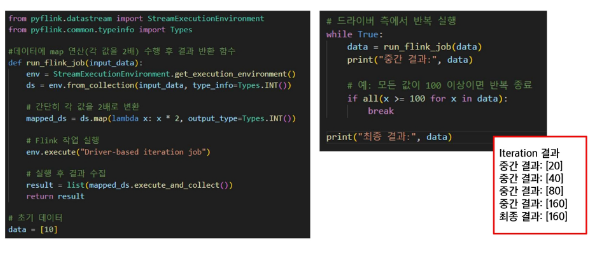

## 4. Flink Table API
### 1) Flink Table API
#### Flink Table API
- Flink Table API란?
  - Flink에서 제공하는 고수준 선언형 API
  - 배치 모드와 스트리밍 모드 모두 지원

- 특징
  - Java / Scala / Python 언어 지원
  - SQL과 유사한 방식으로 데이터 스트림 / 배치 처리 가능
  - Kafka, CSV, JDBC 등 다양한 입출력 커넥터 사용 가능
  - 내부적으로 TableEnvironment로 쿼리 실행

- Flink Table API를 이용하는 이유
  - SQL의 선언적인 형태에 유연함을 더한 구조
  - Flink의 거의 모든 기능과 잘 연결됨
  - 실시간과 배치 모두 지원

#### Flink Table API vs. Datastream API
| | DataStream API | Table API / SQL |
|:-|:-|:-|
| 추상화 수준 | 낮음(연산자 직접 구성) | 높음(SQL/선언적 질의) |
| 주요 사용 목적 | 실시.간 이벤트 처리, 복잡한 로직 | 스트림/배치 분석, 집계, SQL 쿼리 |
| 언어 스타일 | 함수형 API | SQL 및 선언적 API |
| 변환 가능성 | DataStream ↔ Table 변환 가능 | Table ↔ DataStream 변환 가능 |
| 대표 연산 | map, flatMap, keyBy, window | SELECT, GROUP BY, JOIN, WHERE |
| 사용자 대상 | 개발자 (제어 중심) | 분석가/엔지니어 (분석 중심) |

### 2) Kafka와 Flink 연계
#### Table API 사용법 ㅖ제
- 데이터
  - online_slaes_dataset.csv
  - 온라인 판매량을 나타내는 지표

- 실습 
  - 입력 파일 구조 확인
  - 소스 테이블을 통해 내부 데이터 집계

- 디렉토리 구조
  - 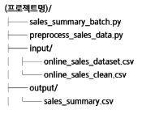
  
- 순서
  - 데이터 구조 확인
  - 데이터의 결측치 등의 특징을 파악하여 정제하는 preprocess_sales_data.py 실행
  - Flink Table API를 통해 집계를 진행하는 sales_summary_batch.py 실행
  - 집계 결과를 확인

#### 데이터 구조 확인
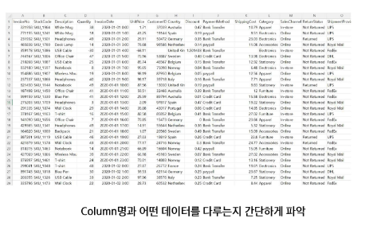

#### 데이터 정제 진행
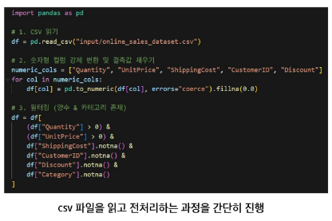
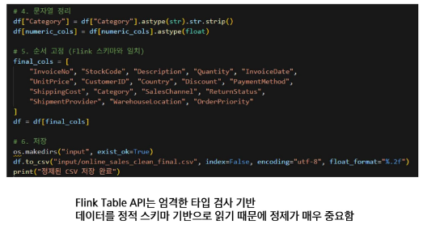

#### 데이터 집계 진행
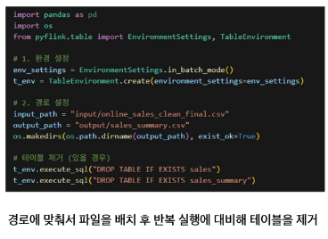
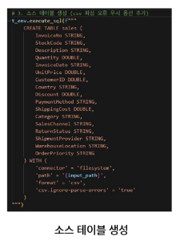
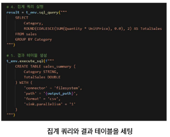

#### 데이터 집계 결과 확인
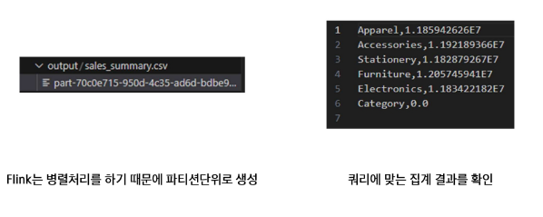

#### 개요 및 목적
- 왜 실시간 처리가 필요한가?
  - 전통적인 배치 처리 방식은 시간 지연이 발생 → 사용자 행동에 즉각 대응 불가
  - 실시간 처리는 즉각적인 반응 및 자동화 조치를 가능하게 함
    - 예) 실시간 상품 클릭 감지 후 추천 영역 갱신
  - 빠른 의사 결정과 고객 경험 향상에 필수
    - 예) 실시간 이탈 예측 후 쿠폰 발급

  

#### 실습
- 실습 프로젝트 구조


- Topic 2개 생성
  - `# kafka가 만든 Raw 소스데이터를 담을 topic : user_behaviors`
  - bin/kafka-topics.sh --create --topic user_behaviors --bootstrap-server localhost:9092 --partitions 1 --replication-factor 1

  - `# Flink가 streaming 처리한 데이터를 담을 topic : behavior_stats`
  - bin/kafka-topic.sh --create --topic behavior_stats --bootstrap-server localhost:9092 --partitions 1 --replication-factor 1

- 강의 자료 참고
- 