# 데이터엔지니어링 기초 - Flink 설치와 기본 구조
<details>
<summary>목차</summary>

1. Flink 개요 (아키텍쳐적인 부분)
2. Flink 설치 및 실행 환경설정

</details>

## 1. Flink 개요
- 지금까지는 Kafka에 대해 배움
  - > 분산형 메시징 시스템 형태로 전달 (쓰는 이유 : 데이터를 병목없이 전달하기 위해)
- 처리에 해당하는 특히 실시간 처리에 해당하는 도구로써 쓰이는 게 Flink

### 1) Flink 개요
#### Flink 등장 배경
- 데이터 파이프라인 : 배치 방식(Batch Processing)
  - 많은 기업들이 오랫동안 주로 ETL(Extractm Transform, Load) 또는 ELT(Extrack, Load, Transform) 방식의 배치 데이터 파이프라인을 사용

- 배치 데이터 파이프라인의 장점
  - 구현 및 운영이 용이
    - 배치 : 어떤 시점시점 단위로 계속 그 안에 있던 데이터를 어떻게 가공할 지, 어떤 한 시점에 처리를 하게 만들고, ...
  - **안정적이고 일관된 데이터 처리**
  - 대규모 데이터 처리에 적합 -> 정형화(주기적)된 분석에 필요

- 배치 데이터 파이프라인의 한계점
  - 실시간 대응 불가능 
    - 데이터가 들어와도 배치 주기가 맞춰지기 전까지는 대응 불가능
  - 지연된 데이터 품질 확인
  - 변경 관리의 복잡성

- 기존 배치 처리 시스템의 한계
  - 높은 지연 시간 : 배치 처리는 데이터를 모아서 한 번에 처리
  - 유연성 부족 : 배치 워크플로우를 조정의 어려움
  - 오류 처리의 복잡성 : 배치 처리 중 오류가 발생하면 전체 배치에 영향을 미침
  - 리소스 관리 문제 : 데이터 양이 증가함에 따라 배치 크기와 처리 시간도 늘어남
  - 데이터 품질 관리 : 데이터 검증, 정제, 변환 과정이 필요하여 배치 처리 워크플로우의 복잡성 증가
    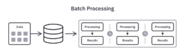

- 실시간 분석을 지원하기 위한 새로운 기술 필요
  - 높은 지연 시간 → 실시간 스트림 처리, 이벤트 시간 기반 처리
  - 유연성 부족 → 배치와 스트림 데이터를 동일 API로 통합 처리
  - 오류 처리의 복잡성 → 체크포인트 기반 장애 허용, 상태 기반 연산
  - 리소스 관리 문제 → 파이프라인 병렬 처리
  - 데이터 품질 관리 → 윈도우기반 검증, 스트리밍 ETL(예시 : Kafka → Flink → Elasticsearch)

#### 배치 처리 vs. 스트림 처리
- 배치 처리
  - 특정 시간 범위 내에서 대량의 데이터를 일괄 처리
  - Spark는 배치처리 형태로 처리하는 용도로 만들어져 있지만 마이크로 배치로 실시간 비슷하게 가능
    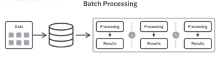

- 스트림 처리(Flink는 이걸 기본 모델로 삼고 있음)
  - 데이터가 생성되는 즉시 처리
  - 스트림을 배치 처리처럼 다룰 수 있음
    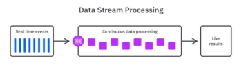

#### Flink 등장 배경
- 실시간 데이터 처리 기술의 발전
  - 2010년, 실시간 데이터 처리를 위해 Complex Event Processing(CEP: 이벤트를 인식하고 반응하게 하는 것이 목표) 기술 개발
  - 트위터의 Storm, Yahoo의 S4 같은 분산 스트림 병렬 처리 시스템이 개발됨
  - Google의 MapReduce와 Hadoop 프레임워크는 대용량 데이터 배치 처리와 실시간 처리를 모두 지원하며 빅데이터 기술 발전을 가속화 시킴
    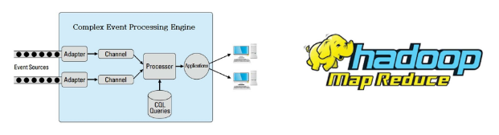

#### Flink를 활용한 데이터 파이프라인 구조 활용
- 실제 스트리밍 데이터 파이프라인의 구조
  - 데이터 소스에서 발생하는 실시간 이벤트를 Kafka와 같은 플랫폼을 통해 Flink로 전달
  - Flink에서 데이터를 필터링하고 중복 제거, 유효성 검사, 데이터 결합 및 집계를 수행
  - 최종적으로 정제된 데이터는 분석 시스템(OLAP)이나 머신러닝 모델, 모니터링 시스템, OLTP로의 전송(운영 DB) 등으로 전달
  - 일정한 주기(배치 처리) / 실시간(스트림 처리)

#### Spark vs. Flink 비교
| 항목 | Spark | Flink |
|:---:|:------:|:----:|
| 실시간성 | 완전한 실시간(real time) 처리는 아님 | **진정한 실시간 처리(True real-time processing) 가능** |
| 핵심 처리 프레임워크 | 기본적으로 배치(Batch) 처리 프레임워크 | **기본적으로 스트림(Stream) 처리 프레임워크** |
| 스트리밍 모델 | 마이크로배칭(Microbatching) 기반 | 윈도우(Windowing)와 체크포인팅(Checkpointing) 기반 |
| **메모리 관리자** | 효율적인 메모리 관리 기능이 부족 | **자체 자동 메모리 관리(Automatic Memory Manager)** |
| **OOM(Out of Memory: 메모리를 효율적으로 쓰지 못함) 가능성** | 비교적 OOM 발생 가능성이 높음 | **OOM 발생이 겅의 없음** |

#### Spark vs. Flink, Yahoo's Benchmark
- 벤치마크 설정
  - 캠페인 수 : 100개
  - 캠페인 당 광고(ads) 수 : 10개
  - 데이터 스트림 생성 : Kafka 사용
  - 데이터 전송 속도 : 초당 50k ~ 170k (50k/s ~ 170k/s)

- 결과
  - Flink 지연 시간(약 40초)
  - Spark 지연 시간(백프레셔 미적용 시, 70초)
  - Spark 지연 시간(백프레셔 적용 시, 120초)
    - 백프레셔 : 데이터 소비 속도가 생산 속도가 훨씬 빨라서 따라가지 못함
      - > 자동으로 속도 조절 요청
    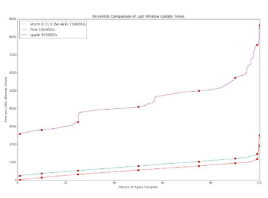

#### Flink
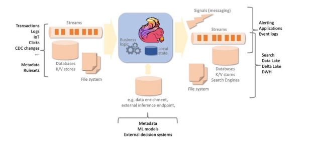

#### Flink 특징
- 분산 스트림 처리 엔진
  - Flink는 클러스터 환경에서 **분산 방식**으로 데이터를 처리
  - 데이터 흐름을 스트림(stream) 형태로 다루며, 각 데이터를 이벤트 단위로 지속적으로 처리
  - 병렬성과 확장성이 뛰어나기 떄문에 대규모 데이터에 적합
    - 여러 노드에 동시에 데이터를 나눠서 처리하기 때문에

- 무한한 스트림 데이터를 실시간으로 처리
  - 정해진 배치(batch) 처리와 달리, Flink는 무한한 데이터 흐름을 실시간(real-time)으로 처리
  - Kafka 등과 연동하여 데이터가 발생하는 즉시 처리 가능하며, 지연 시간이 매우 낮음(low-latency)

- 무한 스트림(Unbounded Streams)
  - **시작점은 있지만 끝이 정의되지 않은 스트림**
  - 데이터를 **계속해서 실시간으로 처리**해야 하며, 데이터를 모두 수집한 후 처리하는 것은 불가능

- 유한 스트림(Bounded Streams)
  - 이벤트의 순서가 중요하지 않음(유한한 데이터셋은 항상 정렬할 수 있으므로)
  - 이런 유한 스트림 처리 방식은 **배치 처리(Batch Processing)**라고도 부름
  - 끝이 정해진 스트림
    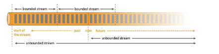

#### Flink Architecture
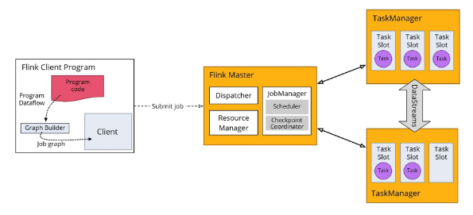
- Flink Client Program
  - Job Graph
    - 논리적인 DAG : 방향은 있으나 다시 돌아가진 않는 그래프(순환X)
  - Client가 Flink Master에게 Job 제출

- Flink Master
  - Dispatcher
    - 새로운 Job을 제출 받고 그것을 Job Manager한테 전달해주는 역할(접수 창구)
  - Resource Manager
    - 리소스(자원) 관리하는 애
    - 컴퓨팅 자원을 얼마나 할당할지(여기에는 얼마나, 저기에는 얼마나)
  - JobManager
    - Flink가 실질적으로 처리
    - Excution Graph(물리적 DAG) 형태로 만들어서 각 작업들을 Task Manager에게 전달
    - Checkpoint Coordinator
      - 작업의 상태들을 주기적으로 저장/관리
      - 오류가 나면 복구 -> 상태를 기록하니 복구 지점으로 사용 가능

- Task Manager
  - 실행 노드
  - 여러 개의 태스크 슬롯이라는 게 존재하고 각 슬롯에는 하나의 병렬 작업을 수행하는 태스크들이 들어감
    - 슬롯이 많으면 많을수록 병렬 처리가 원활

- Flink 실행 흐름
  - Program (프로그램 작성)
    - 클라이언트 시스템이 실행을 위해 제출하는, 사용자가 개발한 애플리케이션 프로그램
    - 파이썬 언어로 만들어진 스크립트를 제출한다.
    - 데이터 처리 논리를 구성해놓은 단계

    - Parse and Optimize (파싱 및 최적화)
      - 이 단계에서는 코드를 파싱하여 문법 오류를 확인하고, 타입 추출(type Xtractor), 최적화 작업을 수행
      - 순서를 어떻게 처리했을 때 효율화할 수 있을 것인가

    - DataFlow Graph (데이터 플로우 그래프 변환)
      - 애플리케이션 작업이 데이터 플로우 그래프로 변환되어 이후 실행 단계에서 사용할 수 있도록 준비

    - Job Manager (잡 매니저 처리)
      - 이 단게에서 Flink의 Job Manager 데몬이 태스크를 스케줄링하고, Task Manager에게 실행을 위임하고, 중간 처리 결과를 모니터링하는 역할도 수행
    
    - Task Manager (태스크 매니저 처리)
      - 이 단계에서 Task Manager는 Job Manager가 할당한 작업을 실제로 실행
    
- 시퀀스 흐름
  - 하나의 Task Slot에서 여러 개의 연산자(Source, map 등)를 개발자가 CLI 등을 통해 Flink 애플리케이션 제출(job 제출하는 단계)
  - JobManager가 JobGraph → Task Execution Graph 변환 및 병렬화(논리->물리)
  - Resource Manager가 Task Slot을 할당
  - TaskManager가 Task Slot에서 병렬로 데이터 스트림 처리 수행
    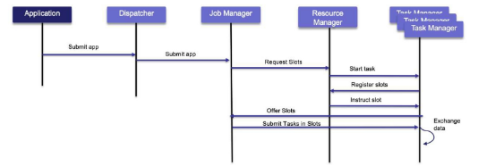

#### Flink Architecture - Flink Program
- 데이터 소스 정의 및 데이터 변환
- 데이터 싱크 정의(어디로 보낼지)
- Dataflow Graph 생성
- 실행 계획 최적화
- JobManager에 실행 계획 전달
- 사용자가 직접 작성한 코드가 실행되는 공간
  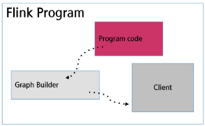

#### Flink Architecture - Flink Master
- 작업 계획 및 스케줄링
- 리소스 관리
- 장애 복구
- 통신 및 조정
- 웹 인터페이스 제공
  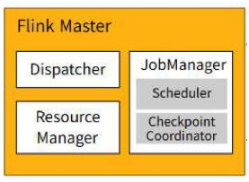

#### Flink Architecture - TaskManager
- 일하는 노드(실제로 일을 처리하는 공간)
- 태스크 실행
- 리소스 할당 및 관리
- 데이터 버퍼링 및 전송
- 메모리 관리
- 하트비트(나 동작중) 및 상태 모니터링
  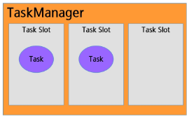

#### Flink Architecture
- 각 슬롯에 메모리 할당(1/n)
  - Task는 TaskManager 내 Task Slot에서 병렬 실행
  - 하나의 Task Slot에서 여러 개의 연산자(Source, map 등)를 실행할 수 있음
  - 현재 이미지는 슬롯이 3개니까 1/3씩 메모리 할당
  - 하나의 슬롯이 하나의 병렬 작업 단위
  - 태스크가 병렬적으로 처리됨
  - 각각의 연산자들을 체인처럼 연결해서 실행(operator chain)
    - 연속적으로 실행
    - 슬롯마다 하나의 연산자 가지고 있으면 불필요한 네트워크 이슈가 발생
    - 할당되어 있는 자원들을 효율적으로 사용할 수 있게
    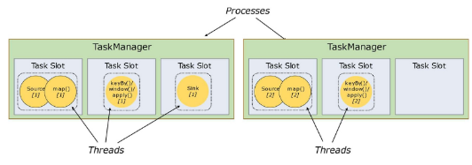

- 작업 슬롯 공유
  - 리소스를 완전히 활용 가능
  - 하위 작업이 TaskManager에 공정하게 분배
  - 데이터 전송 이슈(네트워크 이슈)를 줄이기 위함

- 태스크 슬롯 : 태스크 매니저의 자원을 나눠갖는 단위
  - 각 슬롯은 여러 개의 연산자가 하나의 체인처럼 묶여있다.
  - 슬롯 쉐어링(공유) : 리소스를 효율적으로 분배하고 그걸 통해서 낭비되는 것을 줄이기 위함
    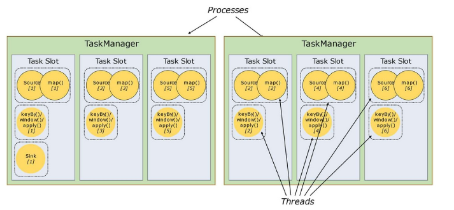

#### Flink 장점
- 실시간 처리 능력
  - 매우 낮은 지연시간과 높은 처리량을 제공하여 초당 수백만 개의 이벤트를 처리

- 정확한 결과 보장 (Exactly-once)
  - 체크포인트와 세이브포인트 기능을 통해 데이터 중복이나 손실 없이 정확히 한 번만 처리
  - 상태 기반으로 checking

- 상태 관리 (Stateful Processing)
  - 복잡한 이벤트 집계, 윈도우 연산, 패턴 인식을 위해 내부 상태를 효율적으로 관리

- 확장성 및 분산 처리
  - 클러스터 내 다수의 노드와 태스크 슬롯을 통해 애플리케이션을 수평적으로 확장 가능

- 유연한 API 제공
  - **SQL / Table API** : Flink 애플리케이션 작성 시 Bounded 및 Unbounded Streams 모두에게 사용 가능한 선언적 고수준 API
  - **DataStream API** : Flink 애플리케이션 작성 시 UnBounded Streas에서 사용되는 고수준 API
  - **DataSet API** : Flink 애플리케이션 작성 시 Bounded Streams에서 사용되는 더 낮은 수준의 API
- spark를 다룰 땐 괜찮지만 flink를 다룰 땐 아쉬운 부분이 있을 수 있음
    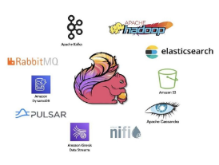

#### Flink 사례 : Netflix
- 데이터를 빠르게 처리하고 분석하기 위해 Apache Flink를 사용하여 스트림 데이터를 실시간으로 처리
- 데이터 처리 과정에서 발생할 수 있는 장애 상황을 대비하여, Flink의 체크포인팅(checkpointing) 및 백프레셔(backpressure) 관리 기능을 적극 활용
  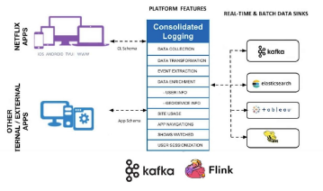

#### Flink 사례 : SmartThings
- 데이터 플랫폼은 실시간으로 데이터를 처리하는 것이 중요
- Apache Spark의 마이크로 비트 처리보다 Apache Flink의 실시간 데이터 처리 모델이 더 적합
- 서버리스, 완전 관리형 솔루션 등을 제공하여 독립적 작동, 주기적 저장 지점 생성 가능
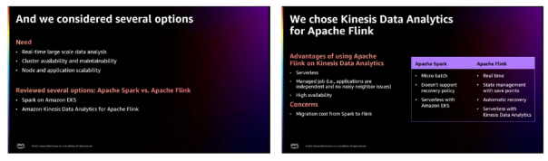

#### Flink 코드 구조
- Datastream API 구조
  - 실행 환경 생성 (StreamExecutionEnvironment)
  - 데이터 소스 (Source) 정의
  - 데이터 변환 (Transformation) 적용
  - 데이터 싱크(Sink) 설정
  - 작업 실행 `env.execute()` (-> 이걸 호출하지 않으면 아무 일도 일어나지 않음 => Lazy evaluation)

- 실행 환경 생성 (StreamExecutionEnvironment)
  - Flink 작업을 구성하고 실행하는 중심 객체
  - 데이터 소스, 변환, 싱크 등을 생성하는 메서드를 제공

    ```python
    from pyflink.datastream import StreamExecutionEnvironment

    # 1. 실행 환경 설정
    env = StreamExecutionEnvironment.get_execution_environment()
    # 실행 환경 하나를 생성함
    ```
  
- 데이터 소스(Source: Flink 외부에서 Flink로 들어올 수 있게끔 하는 데이터 문 역할) 정의
  - 외부 데이터를 PyFlink 내부로 불러오는 역할 (파일, 소켓, 컬렉션 등)

    ```python
    # 2. 데이터 소스(Source) 정의 (리스트 데이터를 스트림으로 변환)
    data_stream = env.from_collection([1, 2, 3, 4, 5])
    # Flink 스트림 형태로 변환
    ```

- 데이터 변환(Transformation) 적용
  - 입력 데이터를 원하는 형태로 가공(예 : 매핑, 필터링, 집계 등)

    ```python
    # 3. 데이터 변환(Transformation) 적용 (각 숫자에 * 2 연산 수행)
    transfomred_stream = data_stream.map(lambda x: x * 2)
    # map : 1:1로 변환하는 연산자(1, 2, 3, 4, 5 -> 2, 4, 6, 8, 10)
    ```

- 데이터 싱크(Sink) 설정
  - 처리된 데이터를 외부 시스템으로 출력(콘솔, 파일, 데이터베이스 등)
    - Sink로 다른 Kafka나 Database에 저장하겠다. (Sink 정의만 하면 됨)
    
    ```python
    # 4. 데이터 싱크(Sink) 설정 (결과를 콘솔에 출력)
    transfomred_stream.print()
    ```

- 작업 실행 `env.execute()`
  - 지금까지 구성한 소스, 변환, 싱크(계획 정의)를 기반으로 실행

    ```python
    # 5. 작업 실행
    env.execute('Simple Flink Job')
    ```

## 2. Flink 설치 및 실행 환경설정
강의 자료 참고
