# 데이터엔지니어링 기초 - Kafka 모니터링

목차

1. Kafka 모니터링의 필요성 및 주요 지표
2. Kafka 모니터링 툴 소개
3. Kafka 모니터링 환경 구성

## 1. Kafka 모니터링의 필요성 및 주요 지표
### 1) Kafka 모니터링의 필요성 및 주요 지표
#### Kafka 모니터링이란?
- 모니터링의 정의 및 기본 구조
  - 모니터링 : 시스템의 상태, 성능, 이상징후를 감시 분석하는 시스템
  - 데이터 수집 → 시각화 및 분석 → 알림 및 대응 단계로 이루어짐
    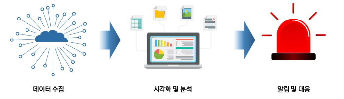

#### Kafka 모니터링이 필요한 이유
- 모니터링이 필요한 이유
  - 장애 발생 예방 : 데이터의 흐름 및 자원 과부하 상황을 파악하여 문제가 될 부분을 사전에 감지
  - 장애 발생 감지 : 시스템 이상 징후를 빠르게 파악하고 알림
  - 성능 최적화 : 메시지 지연시간, 메시지 처리율 등 직접적인 성능 문제 파악
  - 문제 해결 : 데이터들을 축적하고 분석하여 문제 해결책 도출
    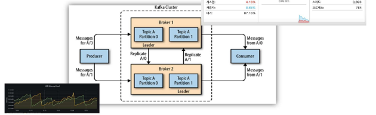
    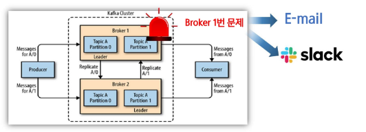
    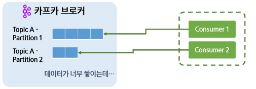
    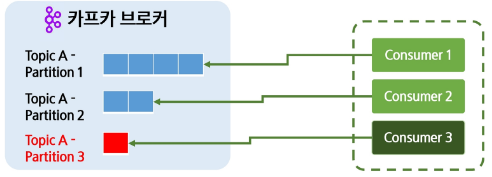

- 프로듀서(Producer) 성능 지표
  - 초당 메시지 전송량 (Records send rate) : 프로듀서가 초당 전송하는 메시지 개수
  - 요청 지연 시간 (Request Latency) : 프로듀서가 브로커로 메시지를 전송할 때 걸리는 응답 시간
  - 재전송 횟수 (Retries) : 프로듀서가 메시지를 재전송하는 회수
    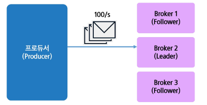
    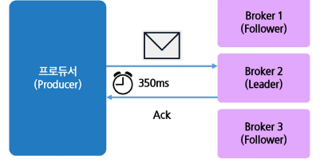
    

- 컨슈머(Consumer) 성능 지표
  - 컨슈머 랙(Consumer Lag) : 브로커의 컨슈머의 offset 차이, 즉, 브로커에서 가져와야 할 메시지의 개수로
  - 메시지 처리량(Consumed Messages per second) : 컨슈머가 촹 처리하는 메시지 개수
  - 메시지 지연 시간(Fetch Latency) : 컨슈머가 메시지를 가져오는 데 걸리는 시간
  - 커밋 빈도(Commit Rate)  : 컨슈머가 오프셋을 얼마나 자주 커밋하는지
    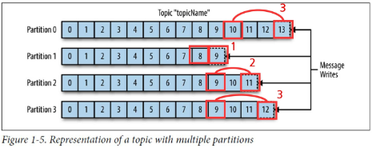
    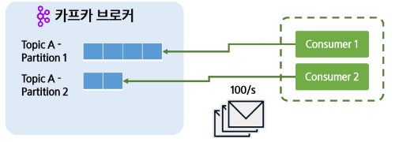
    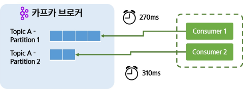
    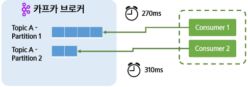

#### Kafka 모니터링 주요 지표
- 브로커(Broker) 성능 지표
  - 초당 처리량(Throughput, MB/s) : Kafka 브로커가 초당 처리하는 데이터의 양
  - 리소스 사용량(CPU, Memory, Disk, Network Usage) : 브로커 노드의 CPU, 메모리, 디스크, 네트워크 사용률
  - 요청 처리 시간(Request Time) : Request가 브로커에서 처리되는 시간
    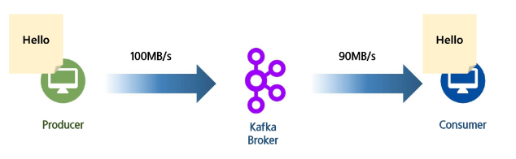
    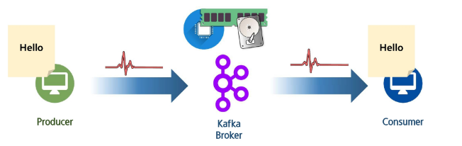
    

- 파티션(Partition) 성능 지표
  - 레플리케이션 간 랙(Partition Replication Lag) : 팔로워와 리더 간 동기화 정도, ISR 관리 척도
  - 파티션 균등분포(Topic Partition Distribution) : 특정 토픽의 브로커 간 파티션 분포 상태
  - 리더 수 (Leader Count) : 브로커가 담당하는 리더의 수
    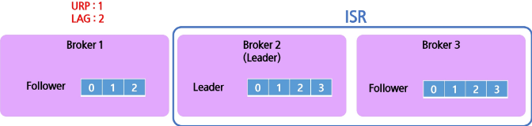
    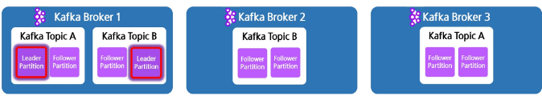
    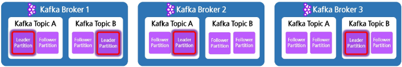

## 2. Kafka 모니터링 툴
### 1) Kafka 모니터링 도구
#### Kafka 모니터링 방법
- Kafka의 모니터링 방법
  - 기본 스크립트 : `--describe`, `--list` 같은 옵션을 통해 기본적인 정보를 얻을 수 있음
  - HMX(Java Management eXtention) : 자바에서 제공하는 모니터링 표준 인터페이스, Kafka도 있음
  - 외부 모니터링 툴 : 다양한 기능과 편리한 시각화, JMX의 데이터를 활용하는 경우도 있음

- Kafka Burrow
  - Linked In 에서 제작한 모니터링 도구
  - 컨슈머 랙의 정보를 집중적으로 제공하는 전문 모니터링 도구
    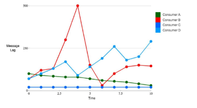

- Confluent Control Center
  - Kafka를 관리하는 Confluent에서 직접 제공한 모니터링 도구
  - Kafka를 직접 관리 조작도 가능하며 JMX와 연동해서 작동됨
  - 유로 버전을 써야 온전히 기능을 사용할 수 있음
    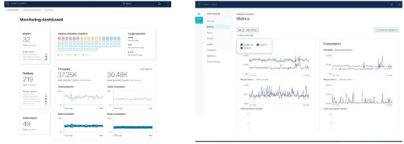

- Datadog
  - 클라우드 기반 환경에 최적화된 모니터링 도구
  - 시각화와 모니터링 범위가 넓고 장애 감지 및 알림 기능이 잘 되어 있음
  - 유료이며 SaaS 플랫폼에서 분석하기 때문에 데이터 반출 문제가 있음
    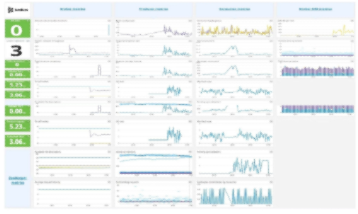

- Prometheus + Grafana
  - Prometheus : 시계열 데이터를 수집 관리할 수 있는 도구 데이터베이스
  - Grafana : 시계열 데이터를 시각화 해주는 오픈소스 도구
  - 무료지만 유연하게 기능 추가가 가능함, JMX나 Kafka Exporter 같은 데이터 소스가 필요함
    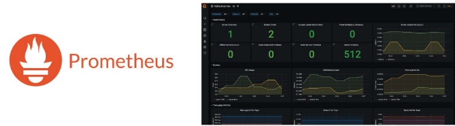
    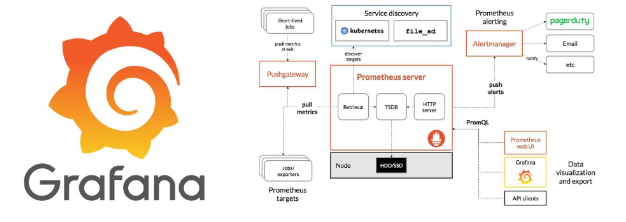
    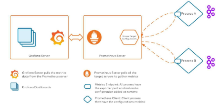

## 3. Kafka 모니터링 환경 구성
