# 데이터엔지니어링 기초 - Kafka 최적화

목차

1. Kafka 성능 최적화
2. 프로듀서 및 컨슈머의 성능 튜닝
3. 주요 설정 파라미터 이해
4. Kafka 데이터의 저장

## 1. Kafka 성능 최적화 개론
### 1) Kafka 성능 최적화 개론
#### Kafka 성능 최적화가 필요한 이유
- Kafka의 성능 최적화가 필요한 이유
  - 대규모 트래픽 처리 : 데이터의 처리량(Throughput) 및 지연(Latency) 최적화
    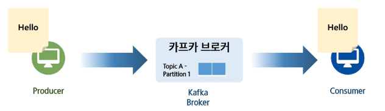
    - 기본 설정으로도 대부분 잘 작동함
      - 대용량 처리가 아니라면 데이터 주고 받는 건 큰 문제 없이 가능
        - 초기에 잘 잡아둔다면...
    - 처음에는 문제가 없지만 데이터 양과 트래픽이 많아지면 불러오는 컨슈머 양도 늘려야 하고 토픽도 늘어남
      - 최적화 관련된 내용은 카프카에서만 다룰 예정
    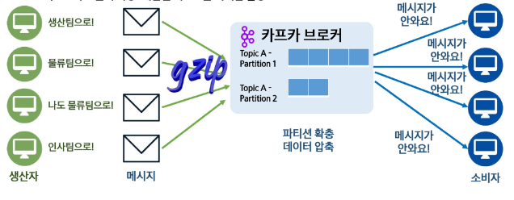
    - 처리를 못하는 이슈
      - 파티션을 늘리거나 데이터를 줄이는 방법

  - 리소소의 효율적 사용 : 제한된 리소소를 최대한 활용
    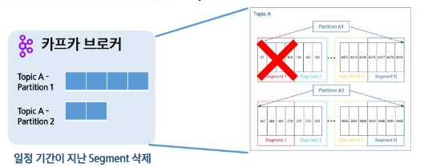
    - 서버 자체를 안정적으로 관리해야 이슈에 대해서 대비 가능
    - 브로커가 임시로 데이터를 가지고 있고 그거 가지고 컨슈머들이 데이터를 가져옴
      - 세그먼트들을 마냥 가지고 있지 않음 (용량들을 일정하게 최적화할 수 있기에)
        - 세그먼트를 삭제해서 디스크 공간을 확보하고 불필요한 메모리 사용 줄이기

  - 안정성 개선 : 데이터 손실에 대한 안정성(Durability)를 높임
    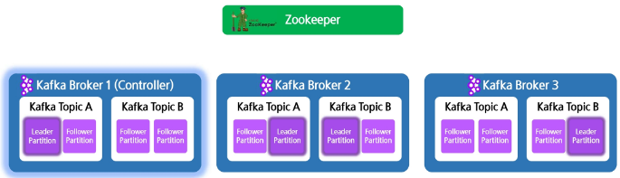
    - 어떻게 하면 성능이나 자원 소모를 최소화하면서 안전하게 운영할 수 있는가?
    - 리더&팔로워 구조 -> 브로커 간 파티션 복제
    - 장애가 발생한다고 해도 안정적으로 유지 가능

#### Kafka 성능 최적화 주요 지표
- 성능 최적화 주요 지표
  - 프로듀서 컨슈머의 처리 속도
    - 데이터 양 ↑ -> 처리 속도 ↓
    - 처리량과 지연 시간이 지표가 된다.
    
  - 브로커 및 주키퍼 설정
    - CPU나 메모리 사용량 -> 인프라적 요소(주키퍼의 연결상태나 리더 선출이 지연되는가 / 내부적인 설정값에 따라서 병목이 어떻게 생기는가)

  - 스토리지, 네트워크 등 자원 최적화
    - 물리적인 자원(디스크 I/O, 네트워크 전송속도)
    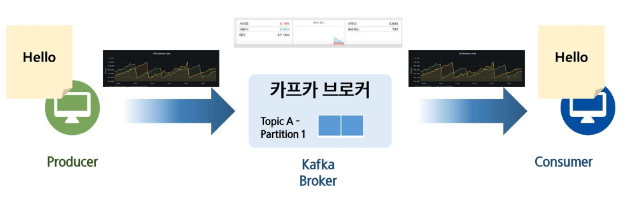
- > 튜닝(모니터링)
    
## 2. 프로듀서 및 컨슈머 성능 튜닝
### 1) 프로듀서 및 컨슈머 성능 튜닝
#### Producer 성능 최적화
- 직렬화 방식 선정 ( -> byte 형식으로 바꿔줌)
  1. `StringSerializer` : 단순한 문자열 직렬화, 문자열을 UTF-8로 인코딩, 압축 효율 낮음
    - 가장 편하게 쓸 수 있는 기본적인 방식
      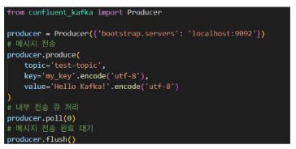
      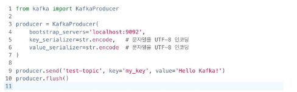
        - `key`와 `value` 직렬화를 다른 방식으로 적용 가능
        - `consumer`쪽에서도 `deserializer`(역직렬화)할 때 맞춰줄 필요가 있다

  2. `ByteArraySerialzier` : 데이터를 그대로 바이트 배열로 직렬화, 다양한 형식 처리 가능, 빠른 변환 / 부족한 사용성
    - 바이트 형식으로 변환된 이미지, 로그, 압축 데이터 가능
    - 사람이 봐서는 내용을 알 수 없음(가독성 ↓)
      - `value = b...`
        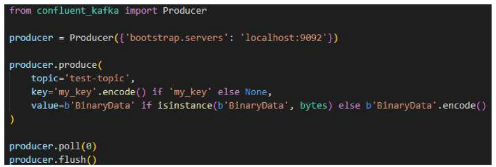
        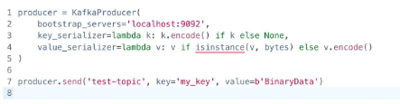

  3. `JsonSerialzier` : JSON 형식으로 직렬화, 가독성 높지만 압축 효율 낮음
    - `value = json.dumps ...`
    - 결국 텍스트 기반의 포맷이기에 같은 데이터를 바이너리 포맷 자체로 보낼 때보다 전송하는 크기가 커질 수 있다.
    - 디버깅할 때 유용(가독성이 높기 때문)
      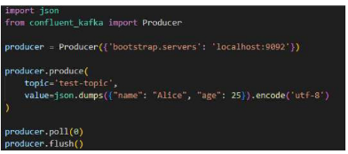
      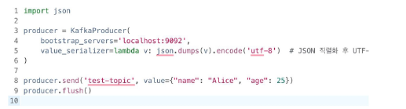

  4. `AvroSerializer` : Avro 포맷을 사용한 직렬화, 스키마 기반, 압축 효율이 좋고 빠름 (Kafka 권장 방식)
    - 카프카에서 공식적으로 추천하는 직렬화 방식
    - 데이터가 어떤 구조인지 스키마 정보를 함께 정의해서 관리함
    - JSON 형태로 Avro 스키마 작성
      - name, age, email 같은 필드 이름과 Type 명시
      - 이 스키마를 Registry에 등록
        - 카프카 환경의 별도의 서비스로 구성해서 프로듀서와 컨슈머가 스키마를 공유
      - 스키마 id만 보내면 돼서 압축 효율이 좋음
      - 컨슈머는 스키마 id를 확인해서 처리(Registry에서 스키마 자체를 불러옴)
    - 버전 관리도 가능
      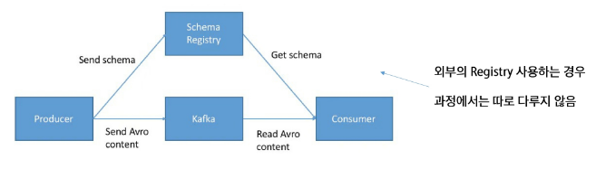
      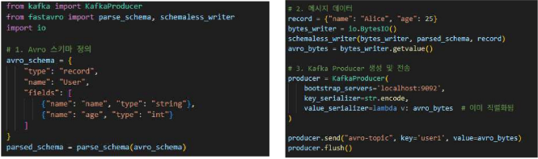
      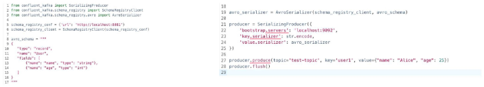

- 파티셔닝 방식 선정
  1. key 기반 파티셔닝 : 해시기반, 같은 key를 가진 값들끼리 같은 파티션 배치
    - 기준(key)
    - 순서를 보장
      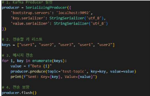
      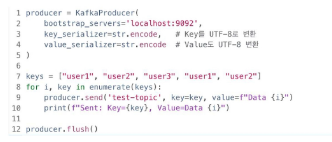

  2. 특정 파티션 지정 : 바이트 배열 그대로 전송
    - 파티션 번호를 직접 지정해서 바이트 배열에 그대로 전송해버리겟다.
    - 파티션 번호가 0번 -> 그럼 0번 파티션으로 무조건 전송
    - 로드 밸런싱 X -> 한 파티션으로 몰리면 그 파티션이 과부하가 걸리기에 자주 사용되진 않음
      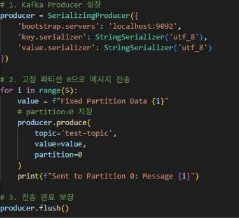
      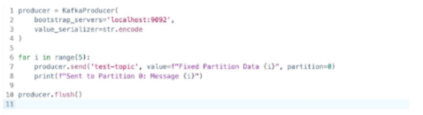

  3. StickyPartitioner : 정수 값을 바이너리 데이터로 변환, Batch를 최대한 활용하여 RoundRobin보다 효율적 (같은 파티션에 여러 메시지를 모아서 보내고, 일정 조건이 되면 다른 파티션으로 바꾸는 전략)
    - 한 Batch에 최대한 많은 데이터를 몰아 보내면서 효율화를 하는 것이 목표
    - 한 번 파티션을 정하면 일정시간(일정 크기)이 지나면 다른 파티션으로 변경
      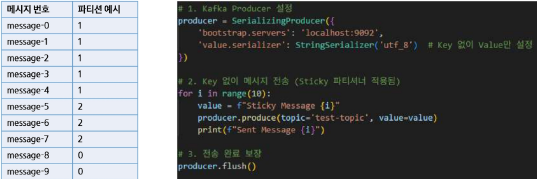
      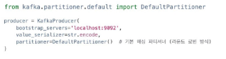
      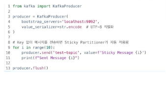

  4. 커스텀 파티셔너 : 본인만의 로직을 만든 파티셔너 (kafka-python 라이브러리) (confluent-kafka-python은 내부적으로 C 라이브러리인 librdkafka를 감싸서 구현되어 있기 때문에 불가능)
      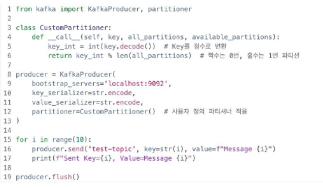

- Batching 설정 최적화
  - 내부 버퍼에 데이터 일정 양을 쌓아뒀다가 한꺼번에 Batch 단위로 전송한다.
  - Batch 크기가 전송 시점의 성능에 영향을 준다.

  1. `buffer.memory` : 프로듀서 내부에서 저장할 수 있는 RA 버퍼의 최대 크기, 기본값 32MB (confluent-kafka에 없음)
    - 이 공간이 다 차면 아직 batch가 다 안 찼어도 강제로 전송
    - 그래서 불필요한 네트워크 호출이 발생할 수도 있고 성능 저하 가능성 있음
      - 버퍼 사이즈를 좀 더 키워주는 것도 괜찮음

  2. `batch.size` : 한 batch의 크기, 해당 크기가 다 차면 전송 준비, 기본값 16KB
    - 주로 32나 64로 늘린 상태로 쓰임
    - 보낼 때마다 네트워크를 거치기 때문에 용량을 늘리면 네트워크 부하 줄일 수 있음
    
  3. `linger.ms` : Batch가 만들어지는 최대 대기 시간, 해당 시간이 지나면 다 안 차도 전송 준비, 기본값 없음
    - 대기 시간을 5ms로 진행한다면, batch 효율 좋아질 수 있음
      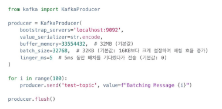
        - `producer.flush()` : 지금까지 쌓인 거 바로 전송(위 조건들 무시하고)

      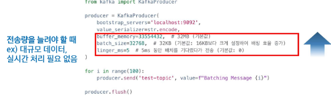
      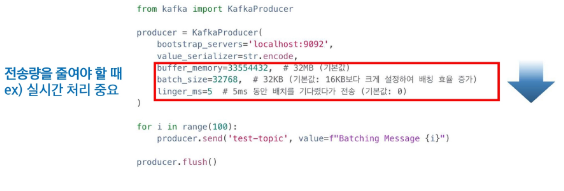

- Compression 방식 결정
  1. Gzip : 높은 압축률, 느린 처리속도, 높은 CPU 사용량 → 확실한 압축
    - 디스크 공간 ↓, 네트워크 트래픽 ↓ / 압축속도 ↓

  2. LZ4 : 적당한 압축률, 준수한 처리속도, 중간 정도의 CPU 사용량 → 균형잡힌 압축과 CPU 사용
     
  3. Snappy : 낮은 압축률, 빠른 처리속도, 낮은 CPU 사용량 → 빠른 압축과 CPU 절약
    
    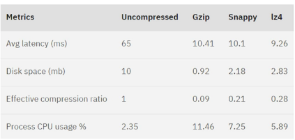
      - 압축하지 않은 경우, Gzip, Snappy, LZ4 순서

    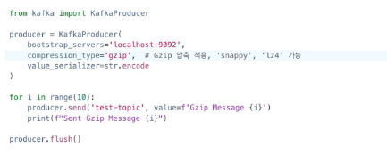

- Acknowledge 방식 결정
  - acks : 프로듀서가 어느 정도까지 응답을 기다릴 것인가
  1. `acks = 0` : 프로듀서가 메시지를 보내고 확인하지 않음
  2. `acks = 1` : 리더 브로커만 받으면 성공
  3. `acks = all(-1)` : 모든 복제본이 메시지를 수신할 때까지 대기, 기본값
    - 가장 안전하지만 성능은 가장 느림
      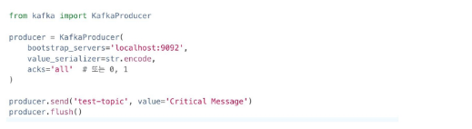

  4. `min.insync.replicas` : 복제본 중 실제로 응답해야 하는 최소 개수, 기본값 1, 2 이상 설정 권장

  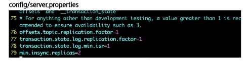
    - `min.insync.replicas=2` : ISR 중 2개 이상 살아있어야 한다. (최소조건)

- Transaction
  1. kafka-python은 transaction 관리 기능이 없음. confluent_kafka는 존재
    - 사용할 거면 우회해서 사용해야 함
    - 정확히 한 번 처리 : exactly one semetics (EOS)
  2. Transaction이 너무 길지 않도록 관리 필요
    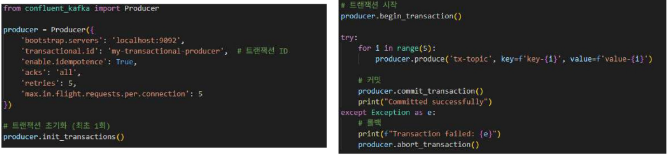

- Retry 관련 옵션 결정
  1. `retries` : 몇 번까지 재시도 할 것인지 설정, 기본값 INT_MAX
  2. `max.in.flight.requests.per.connection` : Ack을 받지 않고 보낼 수 있는 동시 요청 가능 수, 기본값 5
  3. `enable.idempotence` : 멱등성 프로듀서 설정, 즉 중복 전송에 대한 설정, 기본값 true
    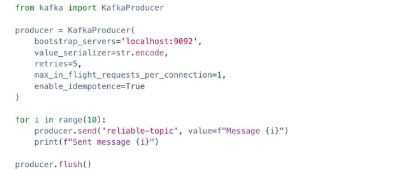

#### Consumer 성능 최적화
- Coordinator 설정 최적화
  1. `heartbeat.interval.ms` : heartbeat 간격, session.time.out의 1/3 수준이 적당, 기본값 3초
  2. `session.time.out` : Hearbeat를 기다리는 시간, 이 이상이면 해당 컨슈머 제거 후 rebalancing, 기본값 10초
  3. `max.poll.records` : 컨슈머가 한 번에 가져갈 수 있는 최대 데이터 수, 기본값 500
  4. `max.poll.interval.ms` : Polling 호출 간격, 이 이상이면 컨슈머 제거 후 rebalancing, 기본값 5분
    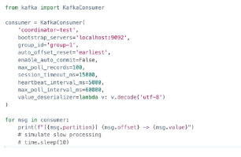

- Fetching 방식 선정
  1. `fetch.min.byte` : 가져올 최소 데이터 사이즈의 크기, 기본값 1 => Throughput과 비례, Latency 반비례
  2. `fetch.max.byte` : 한 번에 받을 수 있는 최대 데이터 크기, 기본값 50MB => 클수록 대량 처리 가능
  3. `fetch.max.walt.ms` : 데이터가 모일 때까지 기다리는 최대 시간, 기본값 500ms
  4. `max.partiton.fetch.bytes` : 파티션 하나 당 가져올 수 있는 최대 데이터, 기본값 1MB
    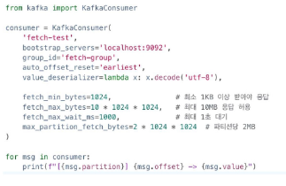

- Partitioning 관련 설정
  1. `RangeAssignor` : 토픽 당 N개씩 연속된 파티션 분배 (기본값)
  2. `RoundRobinAssignor` : 컨슈머 수에 맞게 순차 배분 => 균등 분배
  3. `StickyPartitionAssignor` : 기본 할당을 유지하면서 변경 최소화 => 리밸런싱이 잦을 때 파티션 유지 우선
  4. `CooperativeSticyAssignor` : Sticky를 기본으로 하지만 일부 컨슈머 변경 시에도 나머지 작동 => Zero-Downtime 리밸런싱
    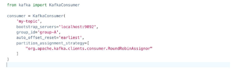
    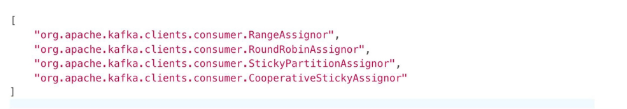

- Commit 관련 설정
  1. `enable.auto.commit` : 주기적으로 offset을 커밋, 기본값 true
  2. `auto.commit.interval.ms` : 주기적으로 offset을 커밋하는 간격, 기본값 5초
      
    
- 수동 Commit 전략
  1. Batch 단위 처리 : 프로듀서의 Batch 처럼 일정 데이터가 모이면 처리, 대용량 데이터 적합
  2. 주기 처리 : 일정 시간 주기마다 처리, 시간기반 데이터 적합 (예 : 실시간 로그)
  3. 1 + N Hybrid : N개를 처리 후 마지막 메시지만 Commit, 안정성과 효율의 중간, Kafka 권장

- `auto.offset.reset` 설정값
  - `earliest` : 가장 초기의 offset 값으로 설정 => 처음부터 다시 시작해야 할 때
  - `latest` : 가장 마지막의 offset 값으로 설정 => 실시간 데이터 소비
  - `none` : 이전 offset 값을 찾지 못하면 error 발생
      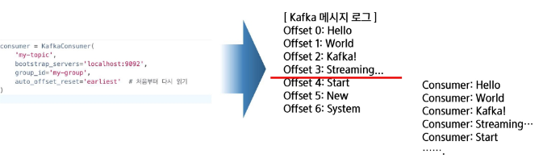
      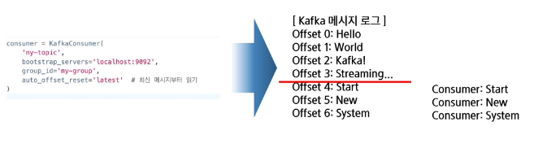

## 3. Kafka 주요 파라미터의 이해
### 1) Kafka 주요 설정 파라미터의 이해
#### Topic 및 Replica 관련 설정
- Topic 및 Replica 관련 설정
  - `num.partitions` : 파티션 수 조정, 기본값 1(기본값으로 거의 안씀), 한 번 설정 후 줄일 수는 없음
  - `replication.factor` : 파티션 별 replica 수
  - `min.sync.replicas` : 정상 동작해야 하는 최소 replica의 수
    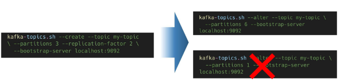
    

#### 네트워크 및 메모리 설정 최적화
- 네트워크 및 메모리 설정 최적화
  - `socket.send/receive.buffer.bytes` : 네트워크 버퍼 크기, 기본값 100KB, 0 설정 시 자동조정(추천)
  - `log.flush.interval.messages/ms` : 로그 플러쉬 주기 조절, 기본값 `Long.MAX_VALUE`
  - `message.max.byte` : 브로커가 수용하는 메시지 최대 크기, 기본값 1MB, 10MB이상 넘기지 않는 것 추천
  - `num.network.threads` : 네트워크 요청 처리 스레드 수, 기본값 3, CPU 코어 수와 비슷하게 설정
  
    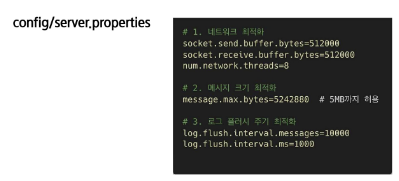

#### 브로커 리소스 최적화
- 기타 브로커 리소스 설정값
  - `KAFKA_HEAP_OPTS` : 카프카가 사용할 JVM 힙 메모리 크기, 기본값 1GB, 4~8GB 추천
  - `num.lo.threads` : DISK I/O 스레드 수, 기본값 8, CPU 코어에 맞춰서 높이기
  - `replica.fetch.min.bytes` : 팔로워가 리더로부터 받는 데이터 크기, 기본값 1 Byte, 1MB 정도 추천
    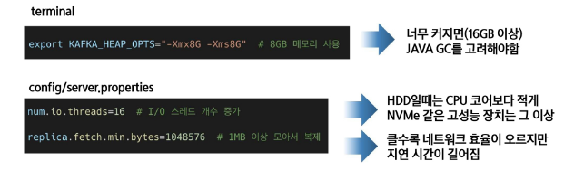

#### Zookeeper 관련 설정
- Zookeeper 관련 설정
  - `maxClientCnxns` : 주키퍼 최대 연결 수, 기본값 60, 브로커 1개당 20 정도 필요
  - `syncLimit` : 리더-팔로워 최대 지연 시간, 기본값 10초
  - `autopurge.snapRetainCount` : 저장하고 있는 스냅샷 수, 기본값 3
  - `autopurge.purgeInterval` : 저장하고 있는 로그 삭제 주기. 기본값 24시간
    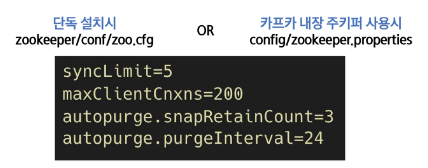

## 4. Kafka 데이터의 저장
### 1) Kafka 데이터 저장
#### Log 저장 방식 최적화
- Segment 저장 관련 설정값
  - `log.retention.ms` : 로그 보관 시간, 기본값 7일, 장기 보관 시 별도의 저장장치로 백업 추천
  - `log.segment.bytes` : 세그먼트 크기 설정, 기본값 1GB
  - `log.cleanup.policy` : 오래된 데이터를 삭제할지 압축할지 결정, 기본값은 'delete', 동시에 설정도 가능
  - `log.cleaner.enable` : 데이터를 정리할 때 키 별로 최신 로그를 남길지 여부, 기본값 false
    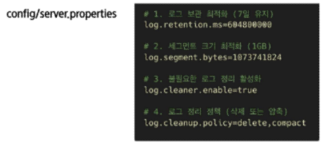

### 2) Kafka 데이터 압축 및 스토리지 최적화
#### Log 저장 방식 최적화
- Segment 압축하기
  - 앞서 나왔던 메시지의 압축과는 다름
  - 동일한 key 값의 최신 데이터만 남게 하는 것이 목표
    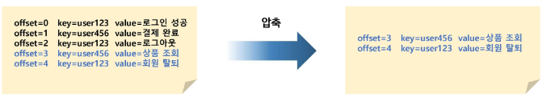