# 데이터엔지니어링기초 - Spark 설치와 기본 구조

 목차 

1. Spark 개요 및 실행 구조
  - flink와 조금 다른 느낌
2. Spark 설치 및 실행 환경설정

## 1. Spark 개요 및 실행 구조
### 1) Spark의 중요성
#### 실시간 데이터 처리의 필요성 증가
- 배치 처리
  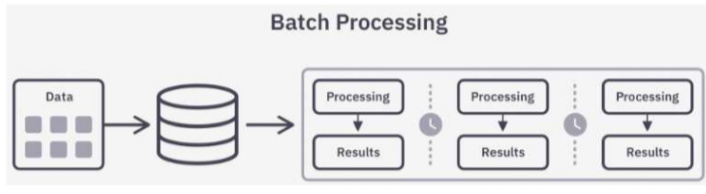 
    - 유한 (끝이 있는 데이터)
    - Spark (스트리밍 기능도 있지만 배치가 주 기능)
- 스트림 처리
  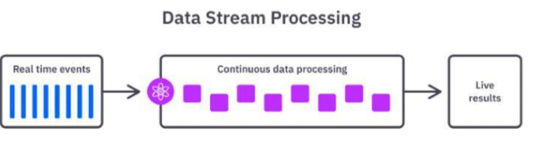
    - 무한 (끝이 없는 데이터)
    - Kafka - Flink

#### 단일 서버의 확장성 부족
- 기존 데이터 처리는 주로 단일 서버로 이루어짐
- 데이터가 증가하면 서버 성능을 높이는 방식(수직 확장, Scale-Up)을 사용
  - CPU, RAM 메모리 성능 향상
- 그러나 단일 서버는 하드웨어의 물리적 한계로 인해 무한정 성능을 높일 수 없음
  - 성능을 올리는 데 한계

- ex) 온라인 쇼핑몰에서 할인 행사 진행
  
    - 트래픽이 몰리고 단일서버면 서버가 다운될 수 있음
  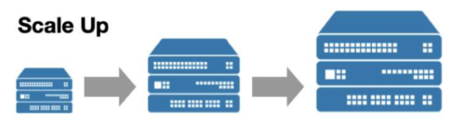
    - CPU 코어 추가
    - 메모리 추가
    - 확장이 어려운 시기가 온다.
  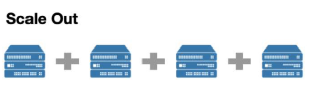
    - 그래서 등장한 방식이 Scale Out
    - 서버 여러 대를 실행해서 부하를 나눈다
    - 분산 처리 시스템

### 2) 기존 데이터 처리 방식의 한계점
#### 디스크(보조 기억 장치) 기반 처리로 인한 속도 문제
- Spark 이전의 기술은 데이터를 처리할 때 디스크(RAM보다 느림) 기반의 저장장치를 사용
  - 데이터를 읽고 쓰는데 시간이 오래 걸리기 때문에 대용량 데이터나 반복 연산같은 걸 처리하는데 있어 병목이 생길 수 있음
- 디스크는 메모리(RAM)보다 데이터 읽기/쓰기 속도가 현저히 느리기 때문에 데이터 처리 과정에서 속도 저하 현상이 발생
  - 디스크를 쓰긴 하지만 보조 저장소 느낌으로 진행

### 3) Spark란?
#### Apache Spark란?

  - Hadoop과 MapReduce가 먼저 등장

### 4) 왜 Spark가 필요할까?
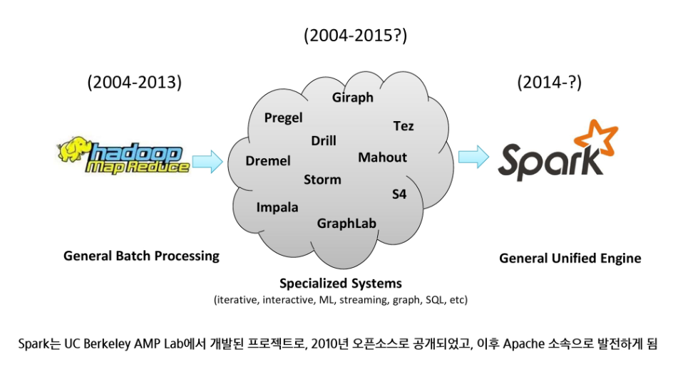
  - 2004-2013 : Hadoop MapReduce - 빅데이터 근간(오픈 소스) / 분산 환경에서 처리할 수 있게 가능(배치 처리)
    - 단점 : 처리 속도가 느림, 반복 작업에 있어 비효율적임, 분석할 때 다양한 요소를 고려하기 어려움
  -  Specialized Systems(특화된 시스템) : 각각의 용도에 맞춘 솔루션들을 하둡에 붙여서 쓰기 시작
    - > Hadoop Ecosystem이라고 불림
    - 각각을 설치해서 운영하고 연동하고 작업하고를 다 해야한다는 불편함(복잡함)이 있음
  - 한 번에 처리할 수 있는 통합 플랫폼이 있으면 좋겠다! → Spark(메모리 기반으로 연산, 맵리듀스보다 빠른 속도, 다양한 일 처리 가능)

### 5) Spark는 어떻게 문제를 해결했나?
#### Spark의 탄생 배경과 설계 목적
- 기존 Hadoop MapReduce(분산환경에서 대용량 처리를 가능하게 해줌)는 느린 속도와 반복 작업의 비효율성이라는 구조적 한계 존재
- 특히 머신러닝, 스트리밍 분석처럼 반복적이고 실시간성이 요구되는 작업에 부적합
- Spark는 UC Berkeley AMP Lab에서 이러한 문제를 해결하고자 개발됨
- Matei Zaharia가 2009년 개발 시작 → 2010년 오픈소스 공개 → 2014년 Apache 프로젝트로 채택
  

#### Spark가 기존 기술의 한계를 어떻게 극복했는가?
- Spark는 기존 시스템의 단점들을 보완해, 빠르고 통합적인 분석 환경을 제공
  | | 문제점 | Spark의 접근 방식 |
  |:-|:-|:-|
  | Hadoop | 느린 처리 속도, 반복적인 비효율 | 메모리 기반 연산(In-memory) |
  | RDBMS(스키마가 반드시 필요) | 확장성 부족, 비정형 데이터 처리 어려움 | 분산 클러스터 기반, 유연한 스키마 |
  | 특화 시스템 | 기능 분산, 통합 어려움 | 하나의 플랫폼에서 배치 + 실시간 + ML |
  | 디스크 기반 처리 | 입출력 병목 | DAG 기반 최적화 실행, Lazy 평가 |

#### Spark 사용 이유
- 반복 연산에서 Hadoop MapReduce보다 빠른 처리 성능
- 메모리 기반의 데이터 처리로 빠른 속도
- Hadoop과의 유연한 연동성(연동이 유연함)
  - 기존 인프라가 Hadoop 형태로 만들어졌다고 하더라도 Spark가 붙여서 처리하면 문제없이 동작함
- RDD의 계보(lineage)를 기반으로 장애 발생 시 연산을 자동으로 재실행하여 복구
  - checkpoint와 state와 비슷한 기능을 가지지만 형태가 다름

#### Spark의 설계 철학
- 속도
  - 메모리 기반 연산(In-Memory Computation)으로 디스크 I/O 최소화
  - DAG(방향이 있고 순환X) 기반 스케줄링으로 병렬 처리 최적화
  - Tungsten 엔진(최적화)을 통한 코드 생성 최적화
    - 데이터 처리를 할 때 최적화를 해야하는 순간이 올 수 있는데 알아서 최적화해줌

- 사용 편리성
  - 단일 PC와 클러스터 간 코드 차이가 최소화된 추상화 구조
  - RDD → DataFrame → Dataset의 계층적 API 제공
  - Scala, Python, Java, R 등 다중 언어 지원

- 모듈성
  - SparkSQL, Streaming, MLlib, GraphX 등 다양한 워크로드를 하나의 엔진에서 처리
  - 별도의 시스템(Hive, Storm, Mahout 등) 통합 불필요

- 확장성
  - 다양한 데이터 소스(HDFS, Cassandra, MongoDB, RDBMS, S3 등) 연동
  - 여러 파일 포맷(csv, parquet 등) 지원
  - 수많은 서드파티 패키지와 통합 가능
  - pyspark는 거의 제약 X

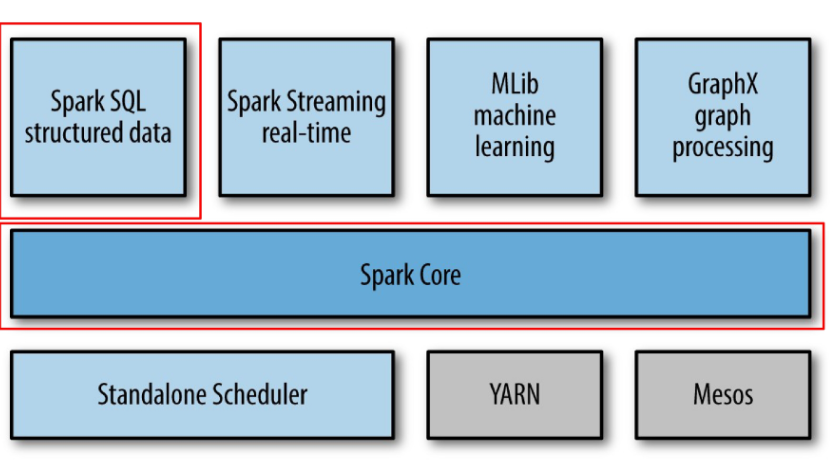
- Spark Core : 전체 연산을 실행하고 자원을 관리하는 역할, 위에 올라가는 여러 모듈들을 연결하는 기본적인 엔진 

### 6) Spark의 주요 컴포넌트
#### Spark의 주요 컴포넌트
- 모든 컴포넌트는 Spark Core 위에서 실행되며, 공통된 실행 엔진 및 스케줄러 공유
  | 컴포넌트 | 설명 |
  |:--------|:----|
  | Spark Core | 핵심 실행 플랫폼 |
  | Spark SQL | 구조적 데이터 처리 및 SQL 기반 쿼리 실행 |
  | Spark Streaming | 실시간 데이터 분석을 위한 스트리밍 처리 (마이크로 배치 방식) |
  | MLlib | 머신러닝 알고리즘 라이브러리 (분류, 회귀, 군집 등) |
  | GraphX | 그래프 기반 데이터 처리와 분석 지원 (PageRank 등) |

### 7) Spark란?
#### Apache Spark란?
- Apache Spark는 오픈소스 클러스터 컴퓨팅 프레임워크
- 대규모 데이터를 빠르게 처리할 수 있도록 설계되었으며, 배치 처리와 실시간 처리를 모두 지원
- Spark는 in-memory(메모리 내) 연산을 통해 디스크 기반 처리보다 훨씬 빠른 성능을 제공
- 다양한 언어(Java, Scala, Python, R)를 지원하며, 데이터 과학, 머신러닝, 스트리밍 분석 등 다양한 분야에서 활용

### 8) Spark 특징
#### Spark 특징
- 높은 처리 성능 (메모리 기반 처리)
- Lazy Evaluation(DAG)을 통한 최적화
- 다양한 데이터 처리 방식 지원 (배치 처리, 스트리밍 처리)
- 폭넓은 언어 지원

### 9) Spark 활용 시 주의점
#### Spark 활용 시 주의점
- 엄밀한 실시간 처리 불가 (Micro-batch 기반)
- 작은 데이터 파일 처리의 비효율성
- 자체 파일 관리 시스템 부재 (HDFS, S3 등 사용)
  - Spark 자체만으로는 데이터 저장소를 대체할 수 없음
- 높은 메모리 비용

### 10) Spark의 실행구조
#### Spark는 Driver, Cluster Manager, Worker Nodes로 구성된 분산 데이터 처리 시스템
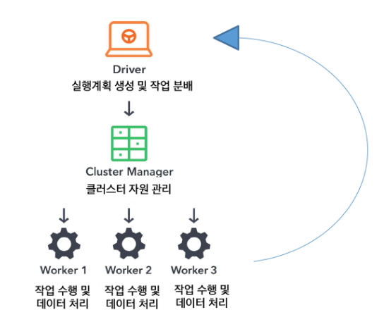
  -  Workers : 실제로 작업 수행
    - Executor : JVM 기반의 프로세스를 띄워서 처리, 변환하고 계산함 

#### 애플리케이션 구성 요소
1) 클러스터 매니저(Cluster Manager)
2) 드라이버(Driver)
3) 실행기(Executor)
4) 스파크 세션(Session)
5) 잡(Job)
6) 스테이지(Stage)
7) 태스크(task)

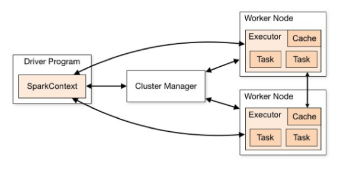

#### 클러스터 매니저(자원을 조율하는 역할)
- 애플리케이션의 리소스 관리
  - 드라이버가 요청한 실행기 프로세스 시작
    - Worker Node에서 프로세스 띄움
  - 실행 중인 프로세스를 중지하거나 재시작
  - 실행자 프로세스가 사용할 수 있는 최대 CPU 코어 개수 제한 등
- 종류
  - Standalone
    - 자체적으로 내장된 클러스터 매니저를 쓰는 것
  - Hadoop Yarn
    - Hadoop 클러스터를 운영할 때 사용하는 대표적인 리소스 매니저
  - Kubernetes

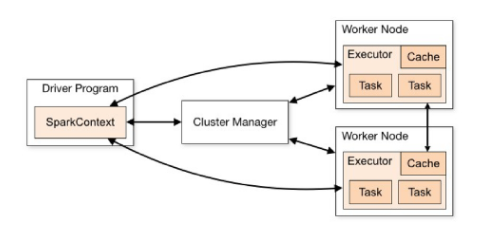

#### 드라이버(Driver)
- 스파크 애플리케이션의 실행을 관장하고 모니터링
  - 클러스터 매니저에 메모리 및 CPU 리소스를 요청(자원요청)
  - 애플리케이션 로직을 스테이지와 태스크로 분할(작업 분할(분배))
  - 여러 실행자에 태스크를 전달(결과 수집)
  - 태스크 실행 결과 수집
  - 1개의 스파크 애플리케이션에는 1개의 드라이버만 존재
  - 드라이버 프로세스가 어디에 있는지에 따라, 스파크에는 크게 두 가지 모드가 존재
    - 클러스터 모드 : 드라이버가 클러스터 내의 특정 노드에 존재
    - 클라이언트 모드 : 드라이버가 클러스터 외부에 존재

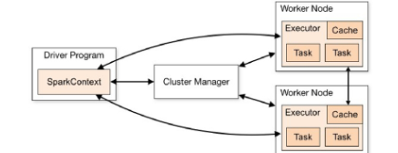

#### 실행기(Executor)
- 드라이버로부터 전달받은 태스크를 실행하는 프로세스
  - 스파크 드라이버가 요청한 태스크들을 받아서 실행하고, 그 결과를 드라이버로 변환
  - 각 프로세스는 드라이버가 요청한 태스크들을 여러 태스크 슬롯 (스레드)에서 병렬로 실행
  - JVM 프로세스
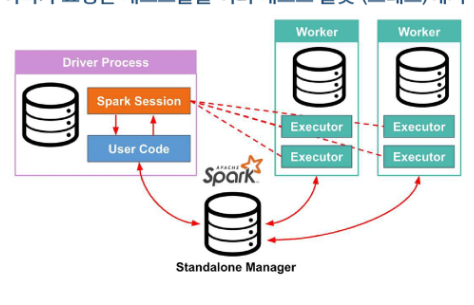

#### 스파크 세션(Spark Session)
- 스파크 기능(DataFrame, SQL 등)을 사용하기 위한 진입점(Spark와 연결하기 위한 entry point(진입점))
  -  Spark Core 기능들과 상호 작용할 수 있는 진입점 제공
  -  API로 프로그래밍을 할 수 있게 해주는 객체
  -  spark-shell에서 기본적으로 제공
  -  스파크 애플리케이션에서는 사용자가 **SparkSession 객체를 생성해 사용해야 함**

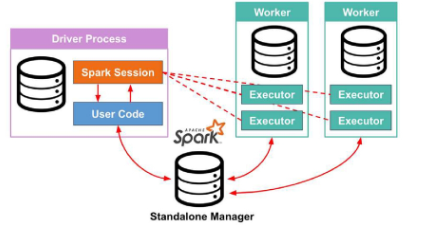
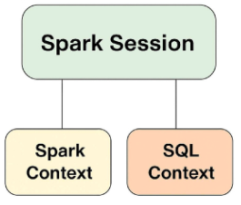
  - Spark Session : 리모컨 같은 느낌

#### 잡 (Job)
- 사용자가 실행한 액션(`collect()`, `count()` 등)에 의해 생성되는 작업 단위
  - 스파크 액션(`save()`, `collect()` 등)에 대한 응답으로 생성되는 여러 태스크로 이루어진 병렬 연산
    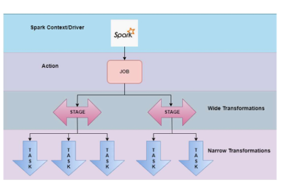

#### 스테이지 (Stage)
- 잡(Job)을 셔플(데이터 이동) 기준으로 나눈 실행 단위(작업을 묶어서 실행하는 논리적 단위)
  - 스파크 각 잡은 스테이지라 불리는 서로 의존성을 가지는 다수의 태스크 모음으로 나뉨
  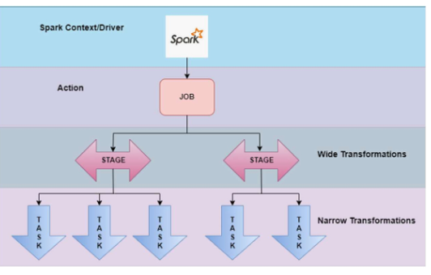
    -  Job : 단일 연산이 아니라 Stage와 task로 구성
    - Stage : 셔플(데이터 재배치)
    - Action 호출 → Job 생성 → Stage 형태로 분할 → Task로 실행
  
  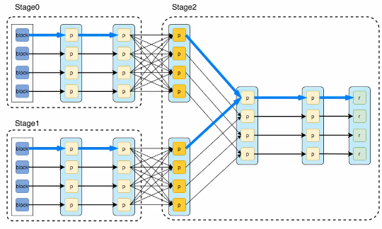
    - 파란색 블록(파티션)
    - 한 단위 한 단위 넘어가는 걸 narrow transformation
    - Groupby나 Join같은 걸 한다(데이터가 섞여야 할 때) → 셔플(데이터 재배치)

#### 태스크(task)
- 스테이지를 구성하는 실제 실행 단위
  - 스파크 각 잡별 실행기로 보내지는 작업 할당의 가장 기본적인 단위
  - 개별 task slot에 할당되고, 데이터의 개별 파티션을 가지고 작업
  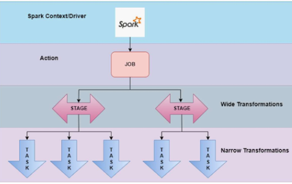
    - 데이터가 10개의 파티션으로 구성되어 있으면, Task도 10개가 생성됨
      - Task는 Executor에서 병렬로 실행하고 배분, CPU가 4개면 executor가 한 번에 task 4개까지 처리 가능

#### 스파크 연산의 종류
- 스파크 연산은 크게 트랜스포메이션(Transformation,변환 연산(map, filter, select, groupby 등)), 액션(Action)으로 구별
  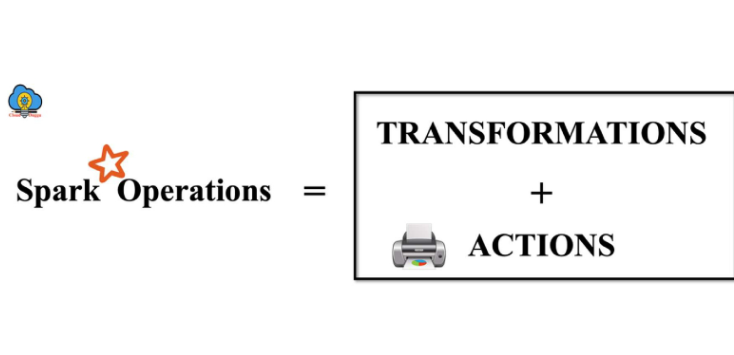

#### Transformation
- Immutable(불변)인 원본 데이터를 수정하지 않고, 하나의 RDD나 DataFrame을 새로운 RDD나 DataFrame으로 변형
- (input, output) 타입 : (RDD, RDD), (DataFrame, DataFrame)의 연산
  - `map()`, `filter()`, `flatMap()`, `select()`, `groupby()`, `orderby()` 등
- Narrow, Wide Transformation 존재
  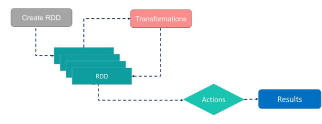
    - Lineage : RDD가 어떻게 만들어졌는지를 기록한 계산 그래프, 장애가 발생하면 재계산을 한다

#### Narrow Transformation
- Narrow transformation(데이터가 하나에 묶여있을 때, 그대로 이어서 처리해도 될 때)
  - input : 1개의 파티션
  - output : 1개의 파티션
  - 파티션 간의 데이터 교환이 발생하지 않음
  - ex) `filter()`. `map()`, `coalesce()`

  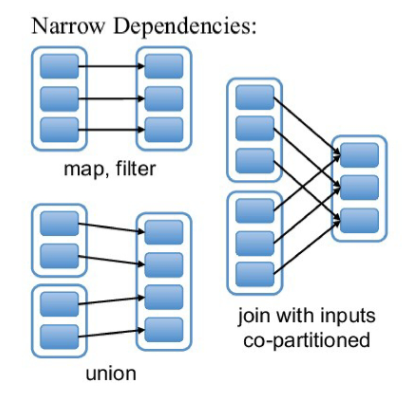

#### Wide transformation
- Wide transformation(데이터가 여러 노드에 흩어져 있어서 재배치(셔플)가 필요할 때)
  - 연산 시 파티션끼리 데이터 교환 발생(네트워크 통신이 발생, 정렬, 재분배, 디스크에 쓰기도 하고 이런 걸 진행하면서 속도가 느려지고 리소스가 증가할 수 있음)
  - ex) `groupby()`, `orderby()`, `sortByKey()`, `reduceByKey()`
  - 단, join의 경우 두 부모 RDD/DataFrame이 어떻게 파티셔닝 되어 있냐에 따라 narrow일 수도 wide일 수도 있음
  
  -  stage 수 = shuffle + 1 / stage 0 → stage 1 (stage 개수는 2개, shuffle은 1번 발생)

#### Action(실행계획 → 시작(실행)하는 단계)
- immutable(불변)인 인풋에 대해, Side effect(부수 효과, 결과 생성)를 포함하고, 아웃풋이 RDD 혹은 DataFrame이 아닌 연산
  - `count()` → 아웃풋 : int
  - `collect()` → 아웃풋 : array
  - `save()` → 아웃풋 : void
  - > JVM 기반
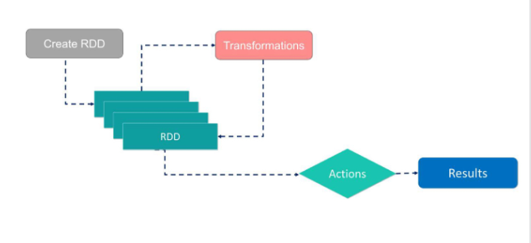

#### Lazy Evaluation
- 모든 Transformation은 즉시 계산되지 않음
- 계보(lineage)라 불리는 형태로 기록
- Transformation이 실제 계산되는 시점은 action이 실행되는 시점
- action이 실행될 때, 그 전까지 기록된 모든 Transformation들의 자연 연산이 수행됨

- 장점
  - 스파크가 연산 쿼리를 분석하고, 어디를 최적화할지 파악하여, 실행 계획 최적화가 가능 (eager evaluation이라면, 즉시 연산이 수행되기 때문에 최적화 여지가 없음)
  - 장애에 대한 데이터 내구성을 제공
  - 장애 발생 시, 스파크는 기록된 lineage를 재실행하는 것만으로 원래 상태를 재생성할 수 있음

