# 데이터엔지니어링 기초 - 데이터 파이프라인 이해와 WSL

목차

1. 데이터의 시대와 엔지니어링
2. 데이터 사이언스와 엔지니어링
3. 데이터 파이프라인

## 1. 데이터의 시대와 엔지니어링
### 1) 데이터의 시대
#### 데이터?
- 정보 vs. 데이터
  - 과거에는 정리되고 유의미하게 도움되는 '정보'만이 중요헀음
  - 그러나 현재는 원시적인 자료인 '데이터'의 중요성이 강조됨
  - 정보
    - 1970 ~ 2000년대를 대표하는 키워드
    - 실제 도움이 되는 데이터
    - 유의미함

  - 데이터
    - 2010년대 이후를 대표하는 키워드
    - 단순 수집된 원시 자료
    - 의미나 목적을 포함하지 않음

#### 데이터의 중요성
- 데이터가 중요해진 이유?
  - 빅데이터 : 데이터의 양(Volume), 다양성(Variety), 증가 속도(Velocity) 향상
  - 데이터를 수집, 가공, 활용할 수 있는 기술의 대두
    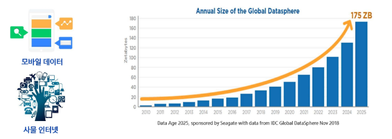

  - >데이터 파이프라인
    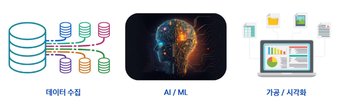
  
  - "데이터는 미래 경쟁력을 좌우하는 21세기의 원유"
  - 미국 시장조사 기관 '가트너'

- 데이터는 어디에 쓰일까?
  - 비즈니스 리더들의 의사 결정
  - 데이터를 통한 서비스/제품 강화
    

### 2) 데이터 사이언스와 엔지니어링
#### 데이터 엔지니어의 주요 활동
- 주요 역할
  - 데이터를 안정적으로 수집하고 가공하여 전달
  - 분석과 모델링 가능하도록 데이터 흐름을 자동화
  - 신뢰성 있고 재사용 가능한 파이프라인 구축
- 주로 하는 일
  - 다양한 시스템에서 데이터 수집
  - 정제 및 변환 (ETL / ELT 설계)

-  "좋은 모델은 좋은 파이프라인에서 나온다." 
-  데이터 엔지니어는 모델의 품질을 받쳐주는 기반을 설계합니다. 

## 2. 데이터 파이프라인
### 1) 데이터 파이프라인 개요
#### 데이터 파이프라인
- 데이터 파이프라인이란?
  - 데이터를 추출하고 정제하고 저장, 분석, 시가고하하는 일련의 자동화 과정
    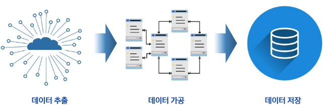
  

#### OLAP와 OLTP
- OLTP (Online Transaction Processing)
  - **운영 데이터 처리 시스템**
  - 실시간 트랜잭션 (주문, 결제, 예약 등) 처리
  - 행(Row) 단위 저장 구조
  - 빠른 입력, 수정, 삭제에 최적화

- OLAP (Online Analytical Processing)
  - **분석 데이터 처리 시스템**
  - OLTP 등에서 수집된 데이터를 기반으로 통계/리포트 분석
  - 열(Column) 단위 저장 구조
  - 집계, 요약, 에측 분석에 최적화

  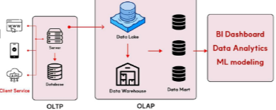

### 2) 데이터 파이프라인 기본 개념
#### ETL의 구조
- ETL(Extract, Transform, Load)란?
  - 데이터를 가공한 후 저장, 전통적인 방식
  - 추출 → 가공 → 저장
     

#### ELT의 구조
- ELT(Extract, Load, Transform)란?
  - 데이터를 저장한 후 가공, 클라우드 시대의 방식
  - 추출 → 저장 → 가공
    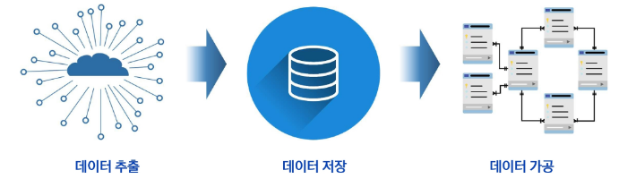

#### ETL과 ELT의 차이

  | 항목 | ETL (전통 방식) | ELT (클라우드 중심) |
  |:---:|:---------------:|:------------------:|
  | 순서 | 추출 → 가공 → 저장 | 추출 → 저장 → 가공 |
  | 환경 | 온프레미스 DW | 클라우드, 데이터 레이크 |
  | 장점 | 정제된 데이터 보장 | 연한 가공, 확장성 우수 |
  | 단점 | 느림, 유연성 부족 | 처리 비용 증가 가능성 |

  -  'ETL은 정제 우선, ELT는 속도와 유연성 중심' 
  -   환경에 따라 적합한 방식 선택

#### 데이터 처리 방식 - 배치와 스트리밍
- 배치 처리 방식(Batch Processing)
  - 데이터를 모아서 한 번에 처리하는 방식
  - 주로 하루 1회, 또는 시간 단위로 처리가 이뤄진다.
  - 정확성과 대량 처리에 적합함
    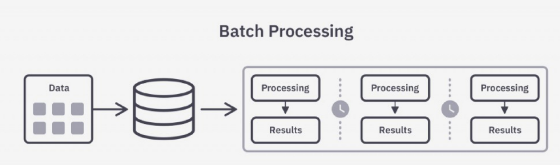

- 데이터 스트리밍 처리 방식(Data Stream Processing)
  - 데이터가 들어오는 즉시 실시간 처리하는 방식
  - 빠르게 변화하는 데이터에 즉시 반응 가능
  - 실시간 분석과 대응이 가능
    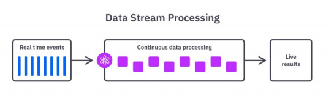

  | 항목 | 배치 처리 | 스트리밍 처리 |
  |:---:|:---------:|:------------:|
  | 처리 방식 | 일정 주기로 대량 처리 | 실시간으로 지속 처리 |
  | 예시 | 하루 1회 통계 리포트 | 실시간 사용자 클릭 분석 |
  | 장점 | 안정적, 대규모 처리 적합 | 즉시 대응, 실시간 분석 가능 |
  | 단점 | 지연 발생 가능 | 복잡한 설계 필요 |

-  '배치는 정확성과 안정성 중심, 스트리밍은 실시간성과 즉시성 중심' 
- **데이터의 속도/목표에 따라 적절한 방식을 선택해야 합니다.**

#### 데이터 파이프라인의 기본 구조
- 자동화된 데이터 흐름
  - 데이터 소스 → 수집 → 가공 → 저장 → 분석/제공
    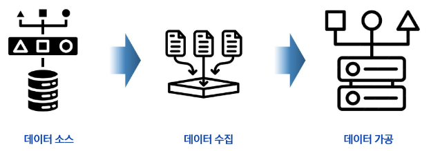
    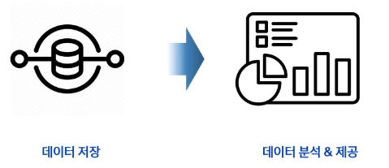

### 3) 데이터 저장소 개요
#### 데이터 저장소의 중요성
- 저장소는 분석을 위한 인프라
  - 데이터를 단순히 저장하는 것이 아니라 분석/활용을 위한 설계가 필요
  - 저장소에 따라 처리 방식과 유연성이 달라짐
  - 파이프라인에서 중요한 핵심 축
    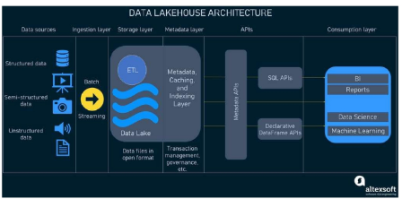

#### 데이터 저장소
- 데이터 저장소의 종류
  - 데이터 웨어하우스 : 정형 데이터를 저장하는 구조, 기본 저장구조
  - 데이터 레이크 : 원본 데이터를 저장하는 구조, 수집 후 재가공하여 활용
  - 데이터 마트 : 특정한 목적을 위해 데이터 웨어하우스의 내용을 다시 추출하여 저장
    

#### 데이터 웨어하우스의 구성
- 데이터 웨어하우스
  - 정형 데이터 중심
  - 스키마 사전 정의
  - ETL 기반의 처리 방식
  - OLAP(Online Analytical Processing) 중심의 구조
    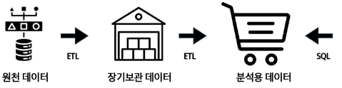

#### 데이터 레이크의 구성
- 데이터 레이그
  - DW의 구조적 질서에 유연성을 결합
  - 분석, 모델링, BI 모두 대응하는 형태
  - OLAP(Online Analytical Processing) 확장 구조 (정형 + 비정형 데이터 모두 대응)
    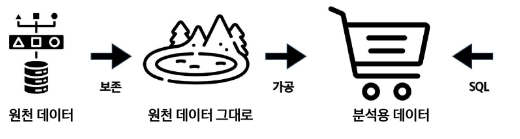

#### 데이터 저장소
- 데이터 저장소의 종류
  | | 데이터 레이크 (Data Lake) | 데이터 웨어하우스 (Data Warehouse) |
  |:-:|:-|:-|
  | 주요 목적 | - 다양한 원천 데이터를 원형 그대로 저장   - 추후 분석/활용을 위한 유연한 데이터 저장소 | - 비즈니스 의사결정을 위한 정제된 데이터 저장소   - 리포팅과 분석 업무 최적화 |
  | 데이터 형태 | - 정형, 반정형, 비정형 데이터 모두 수용 가능   - 예: 로그, 이미지, 오디오, JSON 등 | - 정형 데이터 위주 (관계형 테이블 기반, 스키마 존재) |
  | 사용 대상 | - 데이터 사이언티스트, 분석가, 기술적 역량이 있는 일반 사용자 | - 분석가, 관리자, 경영진 등 특정 목적 중심 사용자 |
  | 데이터 적재 시점 | - 가공 없이 원본 데이터 그대로 저장   - 스키마 적용 업싱 유연하게 수용 | - 사전 정의된 스키마에 맞게 가공 후 저장   - 데이터 품질, 정합성 확보 |
  | 스키마 적용 시점 | - Schema-on-Read: 조회 시점에 스키마 적용   - 다양한 데이터 활용 가능 | - Schema-on-Write : 적재 시점에 스키마 적용   - 정형화된 구조 필수 |
  | 데이터 적재 방식 | - ELT : 추출 → 적재 → 변환   - 대량 원본 수용 후 필요에 따라 처리 | - ETL : 추출 → 변환 → 적재   - 품질 정제 후 정해진 스키마에 맞춰 적재 |
  | 데이터 품질 요구 | - 퓸질 보장보다 유연성과 포괄성 중시   - 노이즈 포함 가능성 존재 | - 정합성/신뢰성 중요   - 높은 품질 기준 충족 필요 |
  | 비용 및 확장성 | - 상대적으로 저렴하고 확장성 높음   - HDFS, S3 등 파일 기반 저장소 사용 | - 저장 비용이 상대적으로 높음   - 고가의 RDBMS, 분석 엔진 활용
  | 분석 방식 | - 머신러닝, AI, 통계 분석 등 고급 분석에 활용   - 탐색적 분석 중심 | - 표준화된 리포트 및 대시보드 중심   - 운영 보고서, 경영 분석 등 |
  | 운영 및 거버넌스 | - 데이터 거버넌스 체계 수립 필요   - 메타데이터 관리 및 품질 통제 체계 중요 | - 엄격한 데이터 품질관리 체계   - 보안/접근 제어 체계 정비 |

#### 데이터 레이크
- 데이터 웨어하우스와의 차이
  - 데이터 웨어하우스 : 최종 사용자가 보고싶은 관점별 데이터 구성을 위해 원천 DB로부터 데이터를 수집
  - 스키마 관리와 품질 관리 통해 리포트를 제공하는 시스템
  - DW : 데이터 구조가 이미 결정되어 엄격한 스키마 관리가 필요하고 한 번 구축 시 변경이 어려움

#### 데이터 수집 도구
- Kafka
  - 분산 메시지 큐 시스템
  - 대용량 데이터를 빠르고 안정적으로 전달
  - 실시간 스트리밍 수집에 강점

#### 데이터 처리(가공) 도구
- Spark
  - 대규모 배치 처리 프레임워크
  - ETL/머신러닝 통합 가능
  - DAG 기반 처리로 안정성과 확장성 확보

- Flink
  - 스트리밍 처리 전문 프레임워크
  - 이벤트 기반 실시간 분석에 최적화
  - 상태 기반 연산 및 복잡한 처리 기능

#### 데이터 저장 도구
- RDBMS ( PostgreSQL, Oracle 등 )
  - 고급 기능을 지원하는 오픈소스 관계형 데이터베이스
  - 정형 데이터 저장에 적합

- Elasticsearch
  - 실시간 검색과 분석에 강력한 NoSQL DB
  - 로그, 텍스트 분석, 모니터링 등 다양한 사용처

- Hadoop (Data Lake)
  - 대용량 비정형 데이터 저장용 HDFS 기반 저장소
  - 정형/비정형 데이터 통합 저장 가능

#### 데이터 모니터링 및 워크플로우 관리 도구
- Airflow
  - 워크플로우 스케쥴러 (DAG 기반)
  - 파이프라인의 각 단계를 자동화 및 모니터링

- Grafana
  - 실시간 시각화 대시보드
  - 다양한 데이터 소스와 연결 가능 (Prometheus, Elasticsearch 등)

- Prometheus
  - 시계열 기반 모니터링 도구
  - 지표 수집, 알림, 시각화 연동 기능 제공

#### 데이터 레이크 분석 도구
- BI(Business Intelligence) / OLAP(Online Analytical Processing)
  - 데이터를 시각적으로 분석하거나 리포트를 만들기 위한 도구
  - 엑셀의 Pivot 기능 또는 시각화 기능과 같은 기능을 좀 더 전문적으로 다루는 도구
  - 원래 데이터 웨어하우스의 등장과 함께 같이 쓰이는 도구였으나, 데이터 레이크도 연결 가능
  - 라이선스 비용이 높은 편

#### 데이터 레이크하우스(레이크의 유연성 + 웨어하우스의 정형 데이터 관리(스키마))
- 데이터 레이크하우스의 구성
  - 정형 + 비정형 데이터 모두 저장
  - 스키마는 나중에 적용 (schema-on-read)
  - 대용량 로그/센서 데이터 수용 가능
    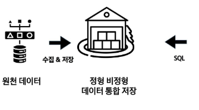

### 4) 데이터 파이프라인 설계
#### 아키텍처 설계
- 데이터 엔지니어 관점에서 데이터 아키텍처 주 관심사는 파이프라인 설계
- 데이터 수집부터 분석/시각화 환경까지 데이터를 견고하게 전달할 수 있는 아키텍처 설계를 목표로 함
  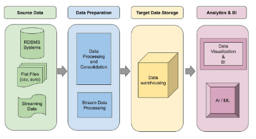

#### 파이프라인 설계
- 파이프라인 설계는 호나경마다 다르기에 정답은 없다.
- (온프레미스 vs 클라우드)
- 요구사항에 따라 각양각색으로 구현 가능하나, 실시간 수집이 필요한지 여부에 따라 파이프라인 설계 구분 가능
  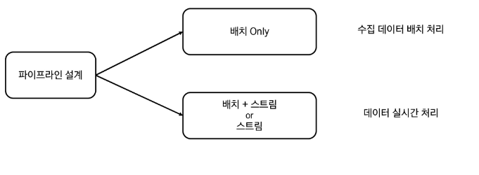

- 람다 아키텍처 & 카파 아키텍처
  - 실시간 수집이 필요한 경우 참조할 수 있는 아키텍처가 존재한다.
  - 대표적으로 람다(Lambda) 아키텍처와 카파(Kappa) 아키텍처가 존재
    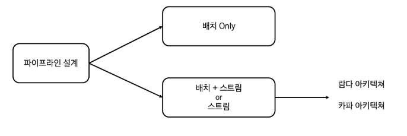

- 람다 아키텍처
  - 2011년에 제시된 아키텍처
  - 실시간 수집이 필요한 경우 배치 처리와 스트림 처리를 모두 이용 가능
    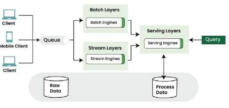

- Serving Layer
  - 배치 Layer에 저장된 데이터를 빠르게 보여주기 위한 서비스 계층
  - 사용자가 쿼리할 수 있도록 함
  - 필요에 따라 스피드 Layer에 있는 데이터를 결합하기도 함.
    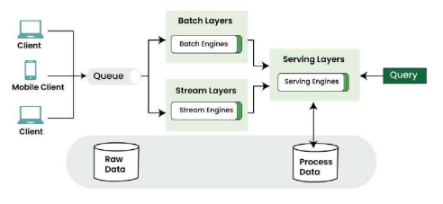

- 카파 아키텍처
  - 배치 Layer를 제거하되 배치 Layer에서 하던 일을 모두 스피드 Layer에서 수행하는 구조 (전처리 후 필요한 테이블로 재구성)
  - 데이터 소스는 주로 메시지 큐를 의미
  - 메시지 큐에는 여러 솔루션이 존재하지만 Kafka를 개발한 Jay Kreps가 만든 카파 아키텍처에서 데이터 소스는 사실상 Kafka의 Cluster를 의미
  - 카파 아키텍처에서 모든 데이터를 Kafka로 수집함을 의미
  - 그러나 일반적으로 배치 파이프라인도 많이 활용
    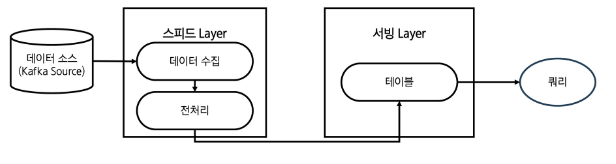

- 람다 아키텍처나 카파 아키텍처만 가능한가
  - 구조화된 아키텍처는 참고를 위한 아키텍처일 뿐 모든 데이터를 해당 아키텍처 기반의 파이프라인으로 만들 필요는 X
  - 아키텍처 수용 여부는 파이프라인마다 데이터의 활용 요건으로 결정
  - 데이터 활용 요건을 분석 후 아키텍처를 따를지 어떤 데이터 뷰를 활용할지 결정

#### 데이터 파이프라인 전체 구조
- 상품 전략 에시로 알아보자
  - 종합 인터넷 쇼핑몰 사장이다.
    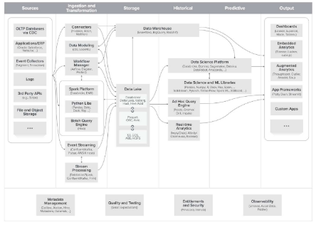

- 데이터 소스
  - 데이터가 유입되는 소스
    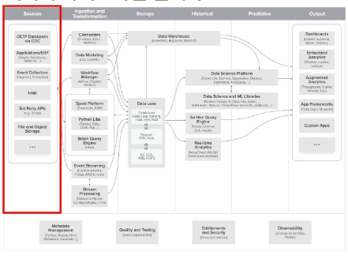
    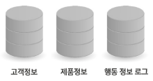
  
- 데이터 수집 및 변환
  - 데이터 소스에서 내용을 추출하고 저장에 적절한 형태로 변환
    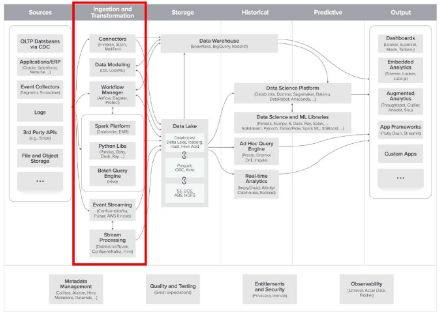
    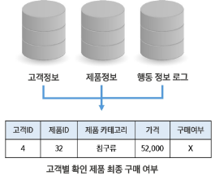

- 데이터 저장
  - 데이터를 저장하는 시스템
    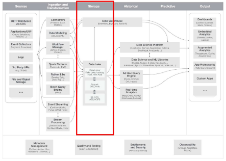
    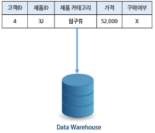

- 과거 데이터 분석
  - 과거 데이터를 활용한 분석 단계
    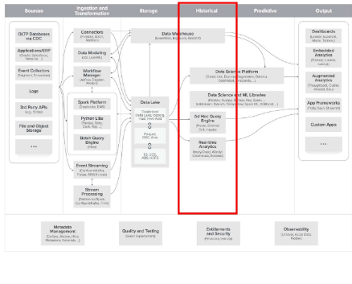
    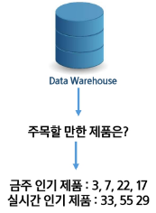

- 예측 분석
  - 데이터를 바탕으로 머신러닝 및 예측을 하는 단계
    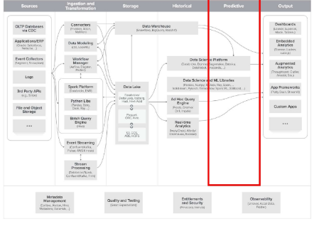
    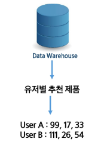

- 출력
  - 데이터 분석 결과를 시각적으로 표현하거나 시스템에 제공
    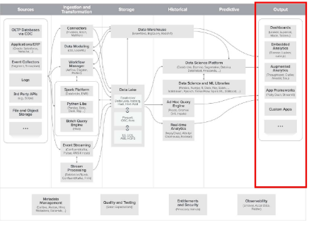
    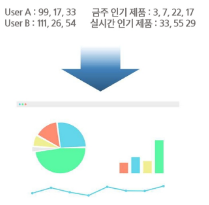

- 지원 시스템
  - 데이터 파이프라인을 관리하고 보완 및 모니터링 하는 시스템
    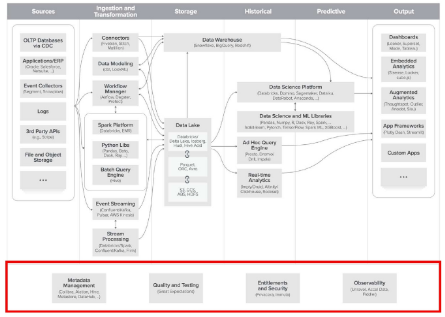

## 3. 리눅스의 개념
### 1) 리눅스의 개념
#### 리눅스
- 유닉스 (UNIX)
  - 리눅스가 탄생하기 이전 운영체제 (OS)
  - 지금도 많이 사용되는 운영체제 중 하나이지만 높은 비용 지불 필요
  - IBM의 AIX, HP의 HP/UX, 오라클의 Solaris, DEC의 Digital Unix, SCO의 SCO
  - UNIX 등

- 리눅스 (Linux)
  - 무료(Free) 유닉스 개념
  - 유닉스와 겅의 동일한 운영체제이면서 무료, 어떤 면에서는 유닉스보다 뛰어남

#### 리눅스의 구성
- 커널(Kernel)
  - 운영체제의 핵심 구성 요소로, 하드웨어와 응용 프로그램 사이를 중재하는 역할을 한다.

- 리눅스 커널의 역사
  - 리누스 토르발스 (Linus Torvalds)가 1991년, 리눅스 커널 0.01 버전을 개발
  - 1992년, 0.02 버전 소스를 공개하며 오픈소스 운동 본격화 → 리눅스의 시작
  - 리눅스 배포판은 토르발스가 만든 커널 + 다양한 오픈소스 프로그램으로 구성
    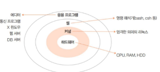

#### 리눅스의 장ㄷ점
- 무료 & 오픈소스 (Free & Open Source)
  - 누구나 자유롭게 사용, 수정, 배포 가능
  - 라이선스 비용 부담 없이 교육/개발에 적합

- 가볍고 빠른 성능
  - 구형 하드웨어에서도 작동 가능
  - 불피룡한 GUI 없이 CLI 중심 운영 가능

- 서버로서의 점유율
  - 전 세계 웹 서버의 70% 이상이 리눅스 기반
  - 클라우드, 데이터센터, 웹 호스팅에서 필수 OS

- 개발 환경
  - Git, Docker, Python, Node.js 등 대부분 리눅스 친화적
  - 패키지 설치, 자동화, 백엔드 개발에 최적

#### 우분투 리눅스
- 우분투 리눅스(Ubuntu Linux)
  - 데비안 기반 배포판, 다양한 플래버 (Desktop, Server, IoT 등)
  - 릴리스 주기 : 일반 버전(6개월), LTS 버전(2년)

## 4. WSL (Windows Subsystem for Linux)
