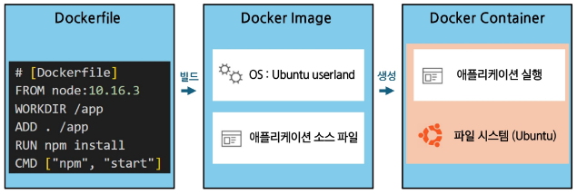
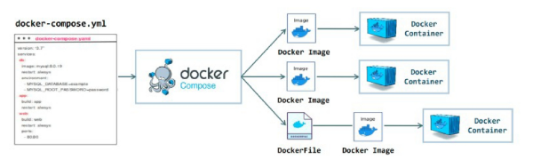

# 데이터 엔지니어링 기초 - 도커의 개념과 활용

목차

1. 컨테이너와 도커
2. Docker Desktop과 설치
3. Docker 기본 명령어
4. Docker compose 실습

## 1. 컨테이너와 도커
### 1) 컨테이너 기술과 도커 개요
#### 도커
- 도커(Docker)
  - 애플리케이션을 컨테이너라는 가볍고 독립적인 환경에서 실행할 수 있도록 도와주는 오픈소스 가상화 플랫폼
  - 외부 환경과 격리된 상태에서 애플리케이션이 환경에 영향 받지 않고 실행될 수 있도록 하는 소프트웨어
  - 컨테이너를 생성하고, 관리하는 데 필요한 엔진과 명령줄 도구(CLI)로 구성

#### 컨테이너
- 컨테이너의 의미
  - 컨테이너(Container)는 어떤 물체나 데이터를 외부와 분리된 공간에 담아두는 것
  - 물체를 격리하는 공간과 비슷한 의미

    
  
#### 컨테이너의 필요성
- 환경 차이 없이 어디서든 실행 가능
  - ex) 개발 PC, 테스트 서버, 클라우드에서도 동일하게 동작
- 설치/설정 충돌 방지
  - 여러 앱이 공존할 수 있는 안전한 격리 공간 제공
- 빠른 실행과 이식성
  - 가상머신보다 훨씬 빠르게 실행되고 리소스도 적게 사용

#### 컨테이너의 개념

- Virtual Machines
  - VM : 독립적 운영체제
    - 무거워서 느림

- Container

#### 도커의 핵심 구성 요소
- 도커 엔진(Docker Engine)
  - Docker의 중심이 되는 실행 시스템
  - 컨테이너를 실제로 생성하고 실행하는 역할을 맡음
  - dockerd라는 데몬(서버)이 Docker API 요청을 받아 처리
  - 예를 들어, "컨테이너를 하나 만들어줘", "이 이미지를 실행해줘" 같은 명령이 여기에 전달되어 실행

- 도커 클라이언트(Docker Client)
  - 우리가 터미널에서 입력하는 docker 명령어가 여기에 전달
  - 사용자가 입력한 명령은 내부적으로 Docker Engine에 전달
  - 실제로 작업을 수행하는 것은 엔진이고, 클라이언트는 이를 요청하는 창구 역할을 함
  - 예 : docker run, docker ps, docker build 등

- 도커 객체(Docker Objects)
  - Docker에서 다루는 주요 구성 단위
  - Image(이미지) : 컨테이너를 만들기 위한 설계도 역할
  - Container(컨테이너) : 미지를 실제로 실행한 실체
  - Service(서비스) : 여러 개의 컨테이너를 묶어 하나의 서비스처럼 운영하는 단위
  - 이러한 객체들을 조합해 하나의 시스템을 구성

- 도커 레지스트리 (Docker Registry)
  - 이미지를 저장하고 공유할 수 있는 중앙 저장소
  - 가장 대표적인 예는 Docker Hub
  - 사용자는 docker pull로 이미지를 내려받고, docker push로 자신이 만든 이미지를 업로드할 수 있음

#### Dockerfile, Docker Image, Docker Container의 관계
- 도커 파일(Dockerfile)
  - Dockerfile은 이미지를 만들기 위한 설계도
  - 우리가 원하는 환경과 스크립트 형식으로 작성한다.
  - 예 : 어떤 OS를 쓸지, 어떤 파일을 복사할지, 어떤 명령어를 실행할지를 기록
    

- 도커 이미지(Docker Image)
  - 이미지는 하나의 정적인 파일로, 실행할 준비가 된 상태의 환경
  - docker build 명령을 통해 Dockerfile로부터 이미지를 생성
  - 내부에는 다음곽 같은 정보가 포함
    - OS (기반 계층, ex : Ubuntu)
    - 소스코드, 의존성, 환경변수, 실행 명령어 등

- 도커 컨테이너 (Docker Container)
  - 컨테이너는 이미지의 복사본이 메모리에서 실행 중인 상태
  - 이미지를 docker run하면 컨테이너가 생성
  - 내부에서는 실제 애플리케이션이 돌아감
  - 각 컨테이너는 자신만의 파일 시스템과 프로세스를 가짐 (다른 컨테이너와 격리)

    
    

#### 도커 관련 주요 도구
- 도커 컴포즈(Docker Compose)
  - 여러 개의 컨테이너를 한 번에 실행하고 관리할 수 있는 도구
  - docker-compose.yml 파일에 컨테이너 구성과 관계를 저으이
  - 다른 여러 종류의 서버를 하나의 시스템처럼 묶어서 실행
    

## 2. Docker Desktop 설치
- 강의 자료 참고

## 3. Docker 기본 명령어
### 1) 이미지 관련 명령어

  | 명령어 | 설명 |
  |:-----:|:----:|
  | `docker search [이름]` | Docker Hub에서 이미지 검색 |
  | `docker pull [이미지명]` | 이미지 다운로드 |
  | `docker images` 또는 `docker image ls` | 로컬 이미지 목록 확인 |
  | `docker rmi [이미지ID/이름]` | 이미지 삭제 |
  | `docker tag [기존이름] [새이름]` | 이미지에 별칭(tag) 붙이기 |

### 2) 컨데이너 실행 & 관리 명령어
  | 명령어 | 설명 |
  |:-----:|:----:|
  | `docker run [이미지]` | 컨테이너 실행 |
  | `docker run -it [이미지]` | 대화형 실행 (터미널 접근) |
  | `docker run -d [이미지]` | 백그라운드 실행 (detached mode) |
  | `docker run --name [이름][이미지]` | 컨테이너에 이름 부여 후 실행 |
  | `docker ps` | 실행 중인 컨테이너 목록 |
  | `docker ps -a` | 모든 컨테이너 목록 (종료 포함) |
  | `docker stop [이름/ID]` | 컨테이너 정지 |
  | `docker restart [이름/ID]` | 컨테이너 재시작 |
  | `docker rm [이름/ID]` | 컨테이너 삭제 |

### 3) 컨테이너 내부 다루기 & 이미지 빌드 명령어
  | 명령어 | 설명 |
  |:-----:|:----:|
  | `docker exec [이름][명령]` | 실행 중 컨테이너에 명령 실행 |
  | `docker exec -it [이름] bash` | 접속 |
  | `docker cp [파일][컨테이너]:[경로]` | 컨테이너에 파일 복사 |
  | `docker container stats [이름]` | 컨테이너 리소스 사용량 확인 |

  | 명령어 | 설명 |
  |:-----:|:----:|
  | `docker build -t [이미지이름]` | 현재 디렉토리에서 Dockerfile로 이미지 생성 |

### 4) Docker Compose 명령어
    | 명령어 | 설명 |
  |:-----:|:----:|
  | `docker-compose up -d` | 여러 컨테이너 실행 |
  | `docker-compose ps` | 실행 상태 확인 |
  | `docker-compose stop` | 실행 중지 |
  | `docker-compose down` | 컨테이너 및 네트워크 삭제 |

## 4. Docker Compose 실습
### 1) Docker Compose 실습
#### Docker Compose 개요
- Docker Compose란?
  - Docker Compose는 여러 컨테이너를 하나의 프로젝트처럼 관리할 수 있게 해주는 도구
  - docker-compose.yml 파일에 정의된 내용을 바탕으로 한 번에 컨테이너들을 실행

- docker-compose.yml 구조
  - services : 컨테이너 목록
  - image : 사용할 도커 이미지
  - ports : 호스트와 컨테이너의 포트 매핑

- Docker compose. 명령어
  - `docker compose up -d` : 백그라운드 실행
  - `docker compose ps` : 실행 중인 서비스 확인
  - `docker compsoe down` : 컨테이너, 네트워크 정리

### 2) Docker Compose 실습
### 3) Docker Compose 실습 파일 구성
### 4) Docker Compose 컨테이너 실행
### 5) Docker Compose 상태 확인
### 6) Docker Compose 실행 확인
### 7) Docker Compose 정리
- 강의 자료 확인

### 8) 자주 쓰이는 docker-compose.yml 문법
  | 키워드 | 용도 | 예시 |
  |:-----:|:-----|:-----|
  | services | 실행할 컨테이너(서비스)들을 정의하는 최상위 키   각 서비스별로 이미지, 포트, 볼륨 등 설정 | `services: web: ..` |
  | image | 사용할 도커 이미지를 지정 | `image: nginx: latest` |
  | build | 로컬의 Dockerfile로 이미지를 직접 빌드할 때 사용 | `build: ./app` |
  | container_name | 컨테이너 이름을 직접 지덩 (안 하면 자동 생성됨) | `container_name : my_app` |
  | ports | 호스트 ↔ 컨테이너 포트 연결.   '호스트:컨테이너' 형식 | `ports: - '8080:80'` |
  | volumes | 데이터 공유/저장   로컬 디렉토리를 컨테이너에 마운트하거나 볼륨 이름을 지정 | `volumes: -/data:/var/lib/mysql` |
  | environment | 컨테이너 내부의 환경 변수 직접 지정 | `environment: - MYSQL_ROOT_PASSWORD=1234` |
  | env_file | .env 파일에서 환경 변수 한꺼번에 가져오기 | `env_file: -.env` |
  | command | 컨테이너 시작 시 실행할 명령어   (Dockerfile의 CMD를 덮어씀) | `command: python app.py` |

#### 상위 레벨 키워드
  | 키워드 | 용도 | 예시 |
  |:-----:|:-----|:-----|
  | volumes | 여러 서비스가 공유하는 데이터 볼륨 정의 | `volumes: db_data:` |
  | networks | 사용자 정의 네트워크 생성   (컨테이너 간 별도 통신망 필요 시) | `networks: my_network:` |

### 9) 자주 쓰이는 Docker Compose 명령어
  | 키워드 | 용도 | 예시 |
  |:-----:|:-----|:-----|
  | `docker compose up` | `docker-compose.yml`에 정의된 컨테이너를 생성-시작   (-d 옵션 : 백그라운드 실행) | `docker compose up -d` |
  | `docker compose down` | 실행 중인 모든 컨테이너, 네트워크, 볼륨 중단 및 삭제 | `docker compose down` |
  | `docker compose ps` | 현재 Compose로 실행 중인 컨테이너 상태 확인 | `docker compose ps` |
  | `docker compose logs` | 컨테이너 로그 출력(-f 옵션 : 실시간 로그) | `docker compose logs -f` |
  | `docker compose stop` | 컨테이너 중지(삭제 X) | `docker compose stop` |
  | `docker compose start` | 중지된 컨테이너 재시작 | `docker compose start` |
  | `docker compose restart` | 컨테이너 재시작 | `docker compose restart` |
  | `docker compose build` | Dockerfile 기반으로 이미지 빌드 | `docker compose build` |
  | `docker compose exec` | 실행 중인 컨테이너에서 명령어 실행 | `docker compose exec <서비스명> <명령>`   예 : `docker exec web bash` |
  | `docker compose run` | 새로운 일회성 컨테이너 실행 | `docker compose run --rm web sh` |

### 10) Docker Compose 네트워크
#### 같은 Compose 파일 내 네트워크
  - docker compose up을 실행하면 자동을 ㅗ프로젝트 이름 기반의 네트워크가 생성
  - 같은 docker-compose.yml 내 서비스들은 동일 네트워크를 공유하므로 통신 가능
  - 서비스명으로 접근 권장
    - Docker가 자동으로 DNS를 관리하므로, db 서비스 → IP보다 db라는 이름으로 접근하는 것이 일반적이고 안전 (IP는 컨테이너 재시작 시 바뀔 수 있음)
  
#### 다른 Compose 프로젝트 간 네트워크
  - 기본적으로 프로젝트 간 네트워크는 분리되어 서로 통신할 수 없음
  - 하지만 명시적으로 같은 사용자 정의 네트워클르 지정하면 서로 통신 가능
  - 두 개의 서로 다른 docker-compose.yml에서 동일한 미리 만든 외부 브리지 네트워크에 external:true 옵션을 사용하면 IP/서비스명 공유
  