# 데이터엔지니어링기초 - Spark DataFrame과 SparkSQL
<details>
<summary>목차</summary>

1. DataFrame과 Spark SQL
2. DSL과 SQL을 활용한 데이터 처리
3. Spark Streaming

</details>

## 1. DataFrame과 Spark SQL
### 1) Remind
#### RDD란?
- Resilient Distributed Dataset
  - 데이터를 병렬 처리하는 핵심적인 역할을 수행하여 빠르고 안정적으로 동작하는 프로그램을 작성 가능
  - > but 데이터 값 자체는 표현이 가능하지만, 데이터에 대한 메타 데이터, <span style = 'color:blue'>'스키마'</span>에 대해 명시적 표현 방법이 없음

### 2) SparkSQL, DataFrame, Dataset
#### RDD API의 문제점
- 스파크가 RDD API 기반의 연산, 표현식을 검사하지 못해 최적화할 방법이 없음
  - RDD API 기반 코드에서 어떤 일이 일어나는지 스파크는 알 수 없음
  - Join, filter, group by 등 여러 연산을 하더라도 스파크에서는 람다 표현식으로만 보임
  - 특히 PySpark의 경우, 연산 함수 Iterator 데이터 타입을 제대로 인식하지 못함
    - 스파크에서는 단지 파이썬 기본 객체로만 인식

- 스파크는 어떠한 데이터 압축 테크닉도 적용하지 못함
  - 객체 안에서 어떤 타입의 컬럼에 접근한다고 해도, 스파크는 알 수 없음
  - 결국 바이트 형태로 직렬화해 사용할 수 밖에 없음
  - > 스파크가 연산 순서를 재정렬해서 효과적인 질의 계획으로 바꿀 수 없음

### 3) Spark SQL과 DataFrame 소개
#### DataFrame
- 스키마(schema)를 가진 분산 데이터 컬렉션
- 데이터를 행(row)과 열(column)로 구성된 표 형태로 관리
- 각 열은 명확한 데이터 타입과 메타 데이터(schema)를 가지고 있음
- Spark SQL이 제공하는 구조화된 데이터 모델로서 RDD의 한계를 보완

#### DataFrame API - 개요
- 구조, 포맷 등 몇몇 특정 연산 등에 있어, Pandas의 DataFrame에 영향을 많이 받음
- 이름 있는 컬럼과 스키마를 가진 분산 이메모리 테이블처럼 동작
- Spark DataFrame은 아래처럼 하나의 표 형태로 보임
  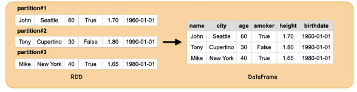

#### DataFrame API - 데이터 타입
- 기본 타입
  - Byte, Short, Integer, Long, Float, Double. String, Boolean, Decimal
- 정형화 타입
  - Binary, Timestamp, Date, Array, Map, Struct, StructField
- 실제 데이터를 위한 스키마를 정의할 때 어떻게 이런 타입들이 연계되는지를 아는 것이 중요
  ```python
  from pyspark.sql.types import StructType, StructField, StringType, ArrayType, IntegerType
  
  schema = StructType([
    StructField("name", StringType(), True),
    StructField("scores", ArrayType(IntegerType()), True)
  ])
  ```

#### DataFrame API - 스키마(Schema)
- 스파크에서의 스키마는 DataFrame을 위해 컬럼 이름과 연관된 데이터 타입을 정의한 것
- 외부 데이터 소스에서 구조화된 데이터를 읽어 들일 때 사용
- 읽을 때 스키마를 가져오는 방식과 달리, 미리 스키마를 정의하는 것은 여러 장점 존재
  - 스파크가 데이터 타입을 추측해야 되는 책임을 덜어줌
  - 스파크가 스키마를 확정하기 위해, 파일의 많은 부분을 읽어 들이려 별도의 Job을 만드는 것을 방지
  - 데이터가 스키마와 맞지 않는 경우, 초기에 문제 발견 가능

#### DataFrame
- DataFrame = RDD + schema(Named columns with types) + DSL(Domain-Specific Langauge)
  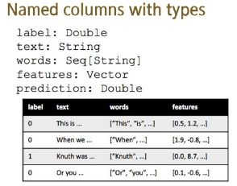
  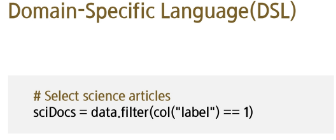

#### DataFrame, 어떻게 구성되어있나?
- DataFrame은 DSL과 SQL 퀄리 방식 모두를 지원
  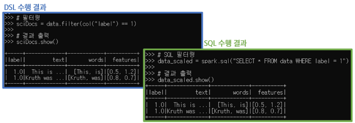

#### RDD와 DataFrame의 차이점은 무엇인가?
  | 구분 | RDD | DataFrame |
  |:----|:----|:----------|
  | 데이터 표현 방식 | 값만 표현 가능, 스키마 표현 불가능 | 명확한 스키마(컬럼, 데이터 타입)을 가진 구조적 데이터 |
  | 최적화 및 성능 | 최적화가 어려움, 직접적 연산 필요 | Catalyst Optimizer를 통한 자동 최적화 및 빠른 처리 가능 |
  | 사용 편의성 | 낮음(저수준 API) | 높음(고수준 API, SQL 활용 가능 ) |

- DataFrame을 사용하면 데이터를 더욱 효율적이고 편리하게 처리할 수 있으며, 데이터의 메타 정보를 활용하여 더 빠르고 최적화된 분석을 수행할 수 있다.

#### RDD를 사용하는 경우
1. 저수준의 Transformation과 Action을 직접 제어해야 할 때
2. 스트림 데이터(미디어나 텍스트 스트림)가 구조화되지 않은 경우
3. 특정 도메인 표현을 위해 함수형 프로그래밍이 필요할 때
4. 스키마 변환이 필요 없을 때 (예 : 열 기반 저장소를 사용하지 않는 경우)
5. DataFrame이나 Dataset에서 처리할 수 없는 성능 최적화가 필요할 때
   
#### DataFrame를 사용하는 경우
1. 고수준의 추상화와 도메인 기반 API가 필요할 때
2. 고수준의 표현(filter, map, agg, avg, sum SQL, columnar access) 등 복잡한 연산이 필요하거나 반구조적 데이터에 대한 lambda 식이 필요할 때
3. 타입 안정성과 최적화를 위해 컴파일 시 타입 안정성을 보장하고, Catalyst 최적화 및 Tungsten의 효율적인 코드 제너레이션이 필요할 때
4. Spark API의 일관성과 간결함을 원할 때

#### SparkSQL이란?
- Spark SQL은 구조화된 데이터를 SQL처럼 처리할 수 있도록 해주는 스파크 모듈
- 내부적으로는 DataFrame/Dataset API와 동일한 엔진(Catalyst)을 사용하여 처리
- DataFrame과 Dataset을 SQL처럼 다룰 수 있게 해주는 분산 SQL 쿼리 엔진
- Spark SQL은 RDD보다 더 높은 수준의 추상화와 자동 최적화를 제공
- > DataFrame이 중심이고, Spark SQL은 그것을 SQL 방식으로 접근하게 해주는 방법 중 하나

#### SparkSQL의 역할
- SQL 같은 질의 수행
- 스파크 컴포넌트들을 통합하고, DataFrame, Dataset이 java, scala, python, R 등 여러 프로그래밍 언어로 **정형화 데이터 관련 작업을 단순화할 수 있도록 추상화**
- 정형화된 파일 포맷(JSON, CSV, txt, avro, parquet, orc 등)에서 스키마와 정형화 데이터를 읽고 쓰며, 데이터를 임시 테이블로 변환
- 빠른 데이터 탐색을 할 수 있도록 대화형 스파크 SQL 셸을 제공
- 표준 데이터베이스 JDBC/ODBC 커넥터를 통해, 외부의 도구들과 연결할 수 있는 중간 역할 제공
- 최종 실행을 위해 최적화된 질의 계획 JVM을 위한 최적화된 코드를 생성

#### Spark SQL
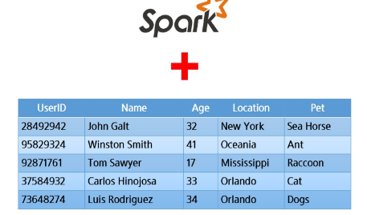

#### SparkSQL의 역할
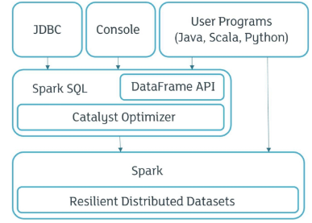

#### Spark SQL의 내부 동작
- SQL 쿼리를 실행하는 역할 + 사용자가 입력한 쿼리나 DataFrame의 명령을 **가장 빠르고 효율적인 방식으로 처리**
- Spark SQL이 내부에서 데이터를 효율적으로 처리하는 핵심적인 엔진이 Catalyst Optimizer

#### Spark SQL의 내부는 어떻게 작동할까?
- Catalyst Optimizer
  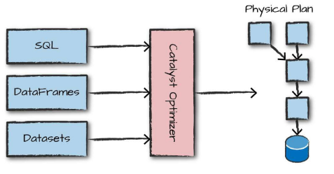

- Catalyst Optimizer의 최적화 과정
  1) SQL Parser & DataFrame API 해석 단계
  2) Logical Plan (논리적 계획) 생성
  3) Optimized Logical Plan (최적화된 논리 계획) 생성
  4) Physical Plan (물리적 실행 계획) 생성
    - > Catalyst Optimizer가 내부적으로 복잡한 최적화 과정을 자동으로 처리
  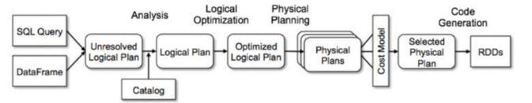

#### Spark SQL과 DataFrame API의 관계
- Spark SQl과 DataFrame API는 서로 완전히 독립된 별개의 것이 아님
- 동일한 최적화 엔진(Catalyst Optimizer)을 공유하고, 내부적으로 통합된 구조를 가짐
- > Spark에서는 DataFrame API를 이용해 작성된 데이터 처리 명령을 내부적으로 Spark SQL의 엔진으로 최적화해 실행

### 4) Dataset API
#### Dataset API
- 스파크 2.0에서 개발자들이 한 종류의 API만 알면 되도록, DataFrame, Dataset API를 하나로 합침
- Dataset은 정적 타입(typed) API와 동적 타입(untyped) API의 두 특성을 모두 가짐
- Java, Scala(타입 안전을 보장하는 언어)에서만 사용이 가능하고, Python, R(타입 안전을 보장하지 않는 언어)에서는 사용이 불가능, DataFrame API만 사용 가능
  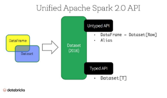

### 5) SparkSQL, DataFrame, Dataset이란?
#### DataFrame vs. Dataset
- 가장 큰 차이점은 오류가 발견되는 시점
  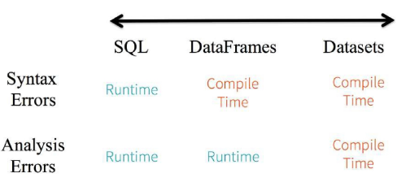

#### View 등록 및 SQL 실행
```python
# DataFrame을 뷰로 등록하기
df.createTempView("viewName")
df.createGlobalTempView("viewName")
df.createOrReplaceTempView("viewName")

# 뷰에 SQL 쿼리 실행하기
spark.sql("SELECT * FROM viewName ").show()
spark.sql("SELECT * FROM global_temp.viewName").show()
```
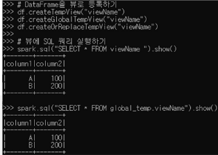

#### DataFrame 구조 변환
```python
# DataFrame → RDD (분산 처리용 RDD로 변환)
rdd1 = df.rdd

# DataFrmae → JSON 문자열 → 첫 번째 항목 확인
df.toJSON().first()

# DataFrame → Pandas DataFrame
pandas_df = df.toPandas()
print(pandas_df)
```
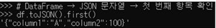
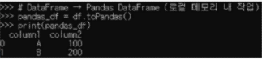

## 2. DSL과 SQL을 활용한 데이터 처리
### 1) Spark SQL
#### SQL 쿼리 기본 문법
- 데이터 조회 : SELECT, WHERE
- 정렬 : ORDER BY
- 중복 제거 : DISTINCT
- 데이터 집계 : GROUP BY, HAVING, 집계 함수(COUNT, AVG, SUM)
- 데이터 결합 : JOIN

#### Creating DataFrames(DSL 코드)
```python
# SparkSession 생성
spark = sparkSession.builder.appName("ExampleApp").getOnCreate()

# 스키마 정의
schema = StructType([
  StructField("name", StringType(), True),
  StructField("age", IntegerType(), True)
])

# 데이터 전처리 및 DataFrame 생성
parts = spark.sparkContext.parallelize([("Mine", "28"), ("Filip", "29"), ("Jonathan", "30")])
people = parts.map(lambda p: Row(name=p[0], age=int(p[1].strip())))
df = spark.createDataFrame(people, schema)

# 결과 출력
df.show()
```
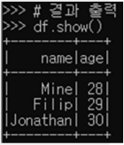

#### Creating DataFrames(SQL 코드)
```python
# DataFrame을 SQL에서 사용할 수 있도록 TempView 등록
df.createOrReplaceTempView("people")

# Spark SQL을 이용한 동일 조회
result = spark.sql("""
  SELECT name, age
  FROM people
""")

result.show()
```
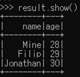

#### Creating DataFrames From File(DSL 코드)
```python
# DataFrame을 직접 생성
people_df = spark.read.option("header", "false")
            .option("inferSchema", "true")
            .csv("people.txt")
            .toDF("name", "age")

# 결과 출력
peopledf.show()
```
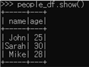

#### Creating DataFrames From File(SQL 코드)
```python
# DataFrame을 직접 생성
people_df = spark.read.option("header", "false")
            .option("inferSchema", "true")
            .csv("people.txt")
            .toDF("name", "age")

# TempView 등록
people_df.createOrReplaceTempView("people")

# SQL 쿼리로 조회
result = spark.sql("""SELECT name, age FROM people""")

# 출력 확인
result.show()
```
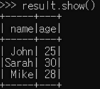

#### From Spark Data Sources
```python
# JSON
df = spark.read.json(filename.json)
df = spark.read.load("filenames.json", format='json')

# Parquet files
df = spark.read.load("filename.parquet")

# TXT files
df = spark.read.txt('filename.txt')
```
```python
# 열 이름과 데이터 유형 반환
df.dtypes

# 내용 표시
df.show()

# 처음 n개의 행 반환
df.head()

# 첫 번째 행 반환
df.first()
```

#### Inspect Data
```python
# 처음 n개의 행 반환
df.take(n)

# DataFrame의 스키마 반환
df.schema

# 요약 통계 계산
df.describe().show()

# 열 이름 반환
df.columns
```
```python
# 행 개수 계산
df.count()

# 고유 행 개수 계산
df.distinct().count()

# 스키마 출력
df.printSchema()

# (논리 및 물리적) 살행 계획 출력
df.explain()
```

#### Duplicate Values
```python
# 중복 행 제거
df = df.dropDuplicates()
```

#### Queries(SELECT)
```python
# DataFrame 생성
df = spark.createDataFrame(data)

# DSL 방식 : column1, column2 선택
df.select("column1", "column2").show()
# ---------------------------------------
# SQL 사용을 위해 TempView 등록
df.createOrReplaceTempView("my_table")

# SQL 방식 : 동일한 SELECT 쿼리
spark.sql("""
  SELECT column1, column2
  FROM my_table
""").show()
```
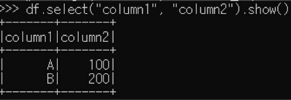
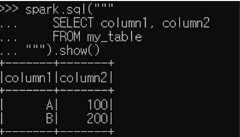

#### Queries (SELECT with Expressions & Filters) DSL 코드
```python
# column1과 column2 값에 +1 결과 출력
df.select(
  col("column1"),
  (col("column2") + 1).alias("column2_plus1")
).show()

# column1이 'A'보다 큰 값만 필터링
df.filter(col("column1") > "A").show()
```
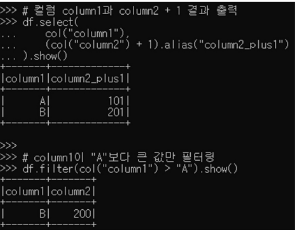

#### Queris (SELECT with Expression & Filters) SQL 코드
```python
# SELECT with expression
spark.sql("""
  SELECT column1, column2 + 1 AS column2_plus1
  FROM my_table
""")

# WHERE 조건 필터
spark.sql("""
  SELECT *
  FROM my_table
  WHERE column1 > 'A'
""").show()
```
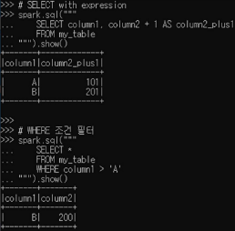

#### Quries (When, ISIN) DSL 코드
```python
from pyspark.sql.functions import when

# column2가 100보다 크면 1, 아니면 0으로 표시해 새로운 컬럼 'flag' 추가
df.select(
  "column1",
  when(df.column2 > 100, 1)
  .otherwise(0)
  .alias('flag')
).show()

# column1값이 'A' 또는 'B'인 행만 필터링
df.filter(
  df.column1.isin("A", "B")
).show()
```
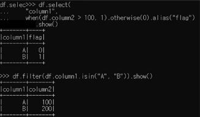

#### Queris (CASE WHEN, IN) SQL 코드
```python
# column2가 1000보다 크면 1, 아니면 0으로 표시해 새로운 컬럼 'flag' 추가
spark.sql("""
  SELECT column1,
    CASE WHEN column2 > 100 THEN 1 ELSE 0 END AS flag
  FROM my_table
""").show()

# column1 값이 'A' 또는 'B'인 행만 필터링
spark.sql("""
  SELECT *
  FROM my_table
  WHERE column1 IN ("A", "B")
""").show()
```
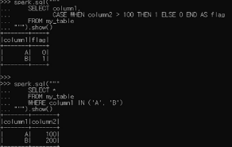

#### 문자열 조건 처리(LIKE, STARTSWITH, ENDSWITH) DSL 코드
```python
# col1 값이 'A'로 시작하면 True, 아니면 False - 특정 문자열로 시작하는지
df.select(
  col("column1").col('column1').startswith("A").alias("starts_with_A")
).show()
```
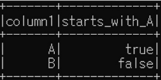

```python
# col2이 '00'으로 끝나는 경우 - 특정 문자열로 끝나는지
df.select(
  col("column2").
  col("column2").cast("string").endswith("00").alias("ends_with_00")
).show()
```
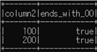

```python
# col1이 'A'와 정확히 일치하는 경우
df.select(
  col('column1').col('column1').like('A').alias('is_A')
).show()
```
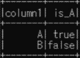

#### 문자열 조건 처리(LIKE, STARTSWITH, ENDSWITH) SQL 코드
```python
# col1 값이 'A'로 시작하면 True, 아니면 False - 특정 문자열로 시작하는지
spark.sql("""
  SELECT column1, column1 LIKE 'A%' AS starts_with_A
  FROM my_table
""").show()

# col2이 "00"으로 끝나는 경우 - 특정 문자열로 끝나는지
spark.sql("""
  SELECT column2.
  CAST(column2 AS STRING) LIKE '%00' AS end_with_00
  FROM my_table
""").show()

# col1이 'A'와 정확히 일치하는 경우
spark.sql("""
  SELECT column1, column1 = 'A' AS is_A
  FROM my_table
""").show()
```
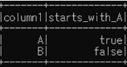
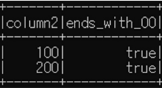
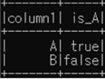

#### 문자열 추출 및 범위 조건 처리(Substring, Between) DSL 코드
```python
# column1에서 2번째 문자부터 3개의 문자를 추출하여 컬럼이름을 'name'으로 지정
df.select(df.column1, substr(2, 3).alias('name')).show()
```
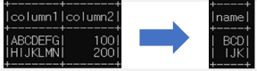
```python
# column2의 값이 50~150 사이에 있으면 TRUE를 표시
df.select(
  col("column1").col('column2').
  col("column2").between(50, 150).alias("is_between_50_150")
).show()
```
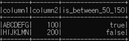

#### 문자열 추출 및 범위 조건 처리(Substring, Between) SQL 코드
```python
# column1에서 2번째 문자부터 3개의 문자를 추출하여 컬럼이름을 'name'으로 지정
spark.sql("""SELECT SUBSTRING(column1, 2, 3) AS name FROM my_table""").show()
```
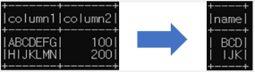
```python
# column2의 값이 50~150 사이에 있으면 TRUE를 표시
spark.sql("""
  SELECT column1, column2,
  column2 BETWEEN 50 AND 150 AS is_between_50_150
  FROM my_table
""").show()
```
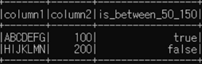

#### 컬럼 이름 변경 및 삭제(Update & Remove Columns) DSL 코드
```python
# column1 -> alphabet, column2 -> number로 컬럼명 변경
df.withColumnRenamed("column1", "alphabet")
  .withColumnRenamed("column2", "number")
  .show()

# column1 컬럼 삭제
df.drop('column1').show()
```
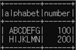
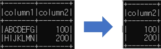

#### 컬럼 이름 변경 및 삭제(Update & Remove Columns) SQL 코드
```python
# column1 -> alphabet, column2 -> number로 컬럼명 변경
spark.sql("""
  SELECT column1 AS alphabet, column2 AS number
  FROM my_table
""").show()

# column1 컬럼 삭제
spark.sql("SELECT column2 FROM my_table").show()
```
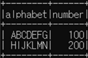
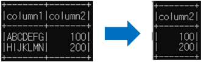

#### 그룹별 집계(Group By, Count) DSL 코드
```python
# column1을 기준으로 그룹화하고 각 그룹의 개수를 계산하여 출력
df.groupBy('column1').count().show()
```
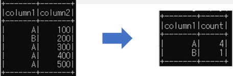

#### 그룹별 집계(Group By, Count) SQL 코드
```python
# column1을 기준으로 그룹화하고 각 그룹의 개수를 계산하여 출력
spark.sql("""
  SELECT column1, COUNT(*) as count
  FROM my_table
  GROUP BY column1
""").show()
```
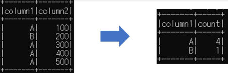

#### 조건 필터링(Filter) DSL 코드
```python
# column2의 값이 200보다 큰 항목만 필터링하여 기록을 유지
df.filter(df['column2']>200).show()
```
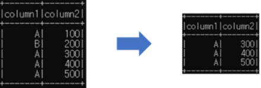

#### 조건 필터링(Filter) SQL 코드
```python
# column2의 값이 200보다 큰 항목만 필터링하여 기록을 유지
spark.sql("""
  SELECT *
  FROM my_table
  WHERE column2 > 200
""").show()
```
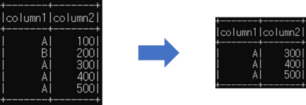

#### 정렬(Sort, OrderBY) DSL 코드
```python
# 단일 컬럼 내림차순
df.sort(df['column1'].desc()).show()
#------------------------------------------------
# 다중 컬럼 정렬 : column1 오름차순, column2 내림차순
df.orderBy(['column1', 'column2'].ascending=[True, False]).show()
```
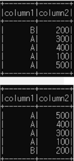

#### 정렬(Sort, OrderBy) SQL 코드
```python
# 단일 컬럼 내림차순
spark.sql("""
  SELECT *
  FROM my_table
  ORDER BY column1 DESC
""").show()
#-------------------------------------------------
spark.sql("""
  SELECT *
  FROM my_table
  ORDER BY column1 ASC, column2 DESC
""").show()
```
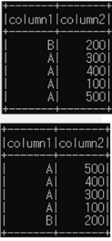

#### 결측값 처리 및 값 치환(Missing & Replacing Values) DSL 코드
```python
# column1의 NULL -> "Unknown", column2의 NULL -> 0
df.na.fill(['column1' : 'Unknown', "column2": 0]).show()
# --------------------------------------------------------
# 두 컬럼 중 하나라도 NULL이 있으면 제거
df.na.drop().show()
# --------------------------------------------------------
# "A" -> "Alpha", "B" -> "Beta"로 문자열 값 대체
df.na.replace({"A": "Alpha", "B": "Beta"}).show()
```
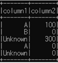
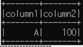
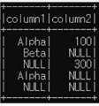

#### 결측값 처리 및 값 치환(Missing & Replacing Values) SQL 코드
```python
# column1의 NULL -> 'Unknown', column2의 NULL -> 0
spark.sql("""SELECT
   COALESCE(column1, 'Unknown') AS column1,
   COALESCE(column2, 0) AS column2
   FROM my_table
""").show()
# ----------------------------------------------
# 두 컬럼 중 하나라도 NULL이 있으면 제거
spark.sql("""SELECT * FROM my_table
WHERE column1 IS NOT NULL AND column2 IS NOT NULL""").show()
# ----------------------------------------------------------
# 'A' -> 'Alpha' , 'B' -> 'Beta'로 문자열 값 대체
spark.sql("""SELECT CASE
  WHEN column1 = 'A" THEN 'Alpha'
  WHEN column1 = 'B' THEN 'Beta'
  ELSE column1
  END AS column1, column2
  FROM my_table
""").show()
```
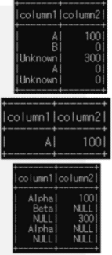

## 3. Spark Streaming
### 1) Kafka 데이터를 Spark로 처리
#### Spark Streaming
- Batch Processing은 큰 데이터 셋에 대해 한 번의 연산을 수행하는 형태
- Streaming Processing은 끊임없이 들어오는 데이터의 흐름을 연속적으로 처리
- Batch Processing과 함께 사용하여 서로의 약점을 보완하는 형태로 많이 사용(Ex.Lambda Architecture)
  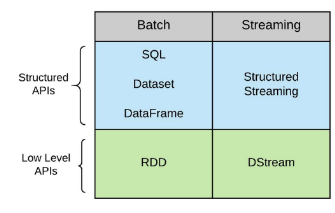

- Spark Streaming은 DStream API (Low Level APIs)를 기반으로 하며, Spark Structured Streaming은 Structured API(High Level APIs)를 기반으로 함
- Spark RDD를 기반으로 처리한다. Input도 RDD이고 처리하는 데이터도 RDD가 됨
- Micro Batch 모드로 동작
- 일정시간동안 새롭게 들어온 데이터를 모아서 한 번에 처리
  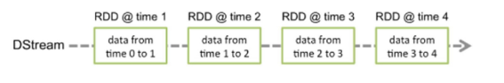

#### Spark Structured Streaming
- RDD를 직접 다루지 않고 DataFrame, Dataset API를 사용하는 만큼 더 많은 종류의 스트리밍 최적화 기술을 사용할 수 있음
- 데이터의 Stream을 무한하게 연속적으로 추가되는 데이터의 테이블 개념으로 간주
- 기본은 마이크로 배치로 처리하지만, Continuous 모드도 지원(기능 제약이 있어 대부분 마이크로 배치 모드 사용)
  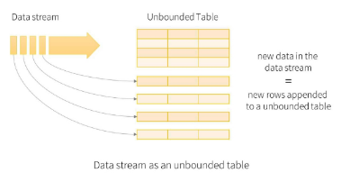

- 새로운 단어 데이터가 입력될 때마다 Input Table에 새로운 단어 배열이 append(추가)
- 실시간으로 들어오는 새로운 데이터가 기존 상태(state)에 누적되어 결과 테이블이 갱신되는 구조
  

