# 데이터엔지니어링 기초 - Spark RDD
<details>
<summary> 목차 </summary>

1. RDD의 개념과 특징 이해
2. RDD 생성 및 변환 학습

</details>

## 1. RDD의 개념과 특징 이해
### 1) RDD린?
#### RDD란?
- 대용량 데이터를 분산 처리하고 분석하기 위한 Spark의 기본 데이터 처리 단위
- Resilient(탄력적인) (<span style = 'color:green'> → 어떤 노드가 장애로 멈춰도 다른 노드의 데이터를 활용해서 복구 가능 </span>)
- Distributed(분산된)
- Dataset(데이터셋)
  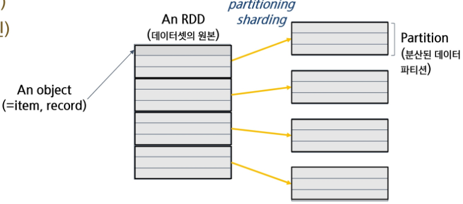
    - <span style = 'color:green'> 객체 하나가 RDD 한 줄 </span>
    - <span style = 'color:green'> 그게 모이면 RDD </span>
    - <span style = 'color:green'> Partition : 보관을 분산해서 처리하는 블록 같은... </span>
  - <span style = 'color:green'> Spark가 대규모 데이터를 빠르게 병렬처리할 수 있게 만들어주는 구조 </span>

### 2) RDD의 특징
#### (1) 데이터의 추상화(Data Abstraction)
- <span style = 'color:green'> 저장방식이나 물리적인 위치같은 것들을 몰라도 거대한 집합처럼 다룰 수 있게 해줌 </span>
  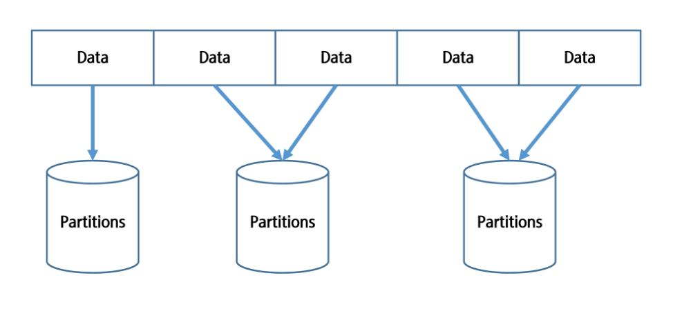

#### (2) 탄력성(Resilient) & 불변성(Immutable)
- <span style = 'color:green'> RDD는 수정이 안된다(Immutable) </span>
- RDD는 한 번 생성되면 변경할 수 없음
- 어떤 노드(서버)가 장애로 인해 중단되더라도, 데이터 복구 가능
  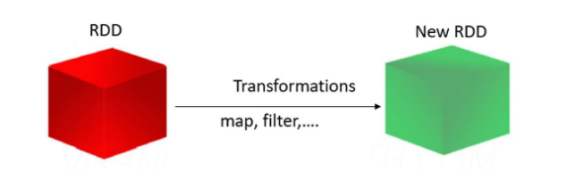
    - <span style = 'color:green'> Transformation을 거쳐서 변경되는 게 아니라 새로운 RDD 생성 (원본 데이터 유지) → 만약 장애가 생기면 원래의 RDD로 복구 가능</span>

#### (3) 타입의 안정성 보장 (<span style = 'color:green'> RDD 하나의 타입을 가진다. → RDD의 모든 요소가 동일한 자료형 </span>)
- 어떠한 하나의 타입의 객체를 가질 수 있음
- 데이터 타입을 컴파일 시전에 검사 (<span style = 'color:green'> 타입 고정(스키마가 있다.) </span>)
- 성능 최적화
- 코드의 가독성과 유지보수성 향상
- Pyspark를 쓸 때는 Python이 동적 타입 언어이기 때문에 타입 안정성이 적용되지는 않음

#### (4) 정형(Structured) & 비정형(Unstructured) 데이터
- 비정형 데이터 : 고정된 포맷이 없는 텍스트 데이터
  - > `sc.textFile()`을 활용해 RDD로 로딩 후, `map`, `filter`, `flatMap` 등으로 가공
  - <span style = 'color:green'> 변환 연산을 통해서 직접 구조화 </span>

- 정형 데이터 : 컬럼이 있는 테이블 형태 데이터(<span style = 'color:green'> 스키마가 존재 </span>)
  - > DataFrame 또는 `RDD.map()`으로 가공
    - <span style = 'color:green'> 컬럼 구조에 맞게 변환 가능 </span>
    - <span style = 'color:green'> DataFrame(SQL)로 처리 가능 </span>

#### (5) 지연 평가(Lazy Evaluation)
- 중간 연산을 줄여 성능 최적화
- 실행 계획을 최적화하여 성능 향상
- 불필요한 연산 방지로 리소스 절약
  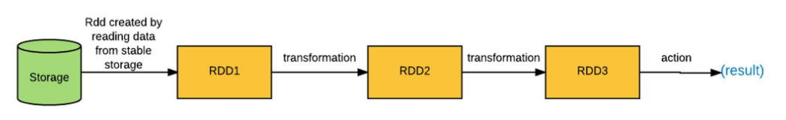

### 3) Spark RDD란?
#### 주요 구성 요소 정리 코드


## 2. RDD 생성 및 변환 학습
### 1) RDD 생성
#### (1) 기존의 메모리 데이터를 RDD로 변환하는 방법
- Python의 리스트(List)나 Scala의 컬렉션(Collection)을 RDD로 변환 가능
  - <span style = 'color:green'> 기존 메모리에 올린 데이터를 RDD로 변환하는 과정 </span>
- 이 방법은 주로 테스트나 작은 데이터 셋을 다룰 때 사용

#### (2) 외부파일(텍스트, CSV, JSON 등)에서 RDD를 생성하는 방법
- 실무에서는 보통 파일이나 데이터베이스에서 데이터를 불러와야 함
- `sc.textFile("파일 경로")`, `spark.read.format('jdbc').option(...)`형태를 사용하여 외부 데이터로 RDD로 변환할 수 있음

### 2) RDD 생성 : 메모리 데이터 활용(`parallelize()`)
#### `Parallelize()`
(1) 기존 메모리 데이터를 Spark의 RDD로 변환하는 역할
  - 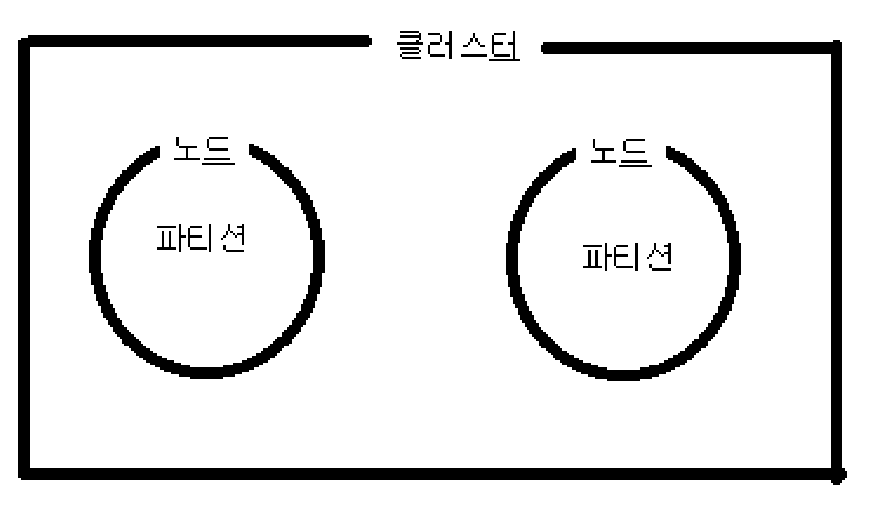
  - RDD `parallelize()` 생성 코드 예제 (Python / Scala / Java 비교)
    ```python
    # Parallelize in Python
    wordsRDD = sc.parallelize(["fish", "cats", "dogs"])
    ```

    ```scala
    // Parallelize in Scala
    val wordsRDD = sc.parallelize(List("fish", "cats", "dogs"))
    ```

    ```java
    // Parallelize in Java
    JavaRDD<String> wordsRDD = sc.parallelize(Arryas.asList("fish", "cats", "dogs"))
    ```

(2) `parallelize()`는 메모리에 있는 데이터를 Spark 클러스터로 보낼 때 사용
  - > 데이터가 클 경우 비효율적일 수 있어 소규모 데이터분석에 주로 이용

#### `sc.textFile()`
(1) 외부 파일에서 데이터를 직접 읽어와 RDD로 변환하는 역할
  - > 일반적인 텍스트 파일 (CSV, 로그 파일 등), S3 → 저장소에서 데이터 로드
  - HBase, Cassandra (C)* → NoSQL 데이터베이스에서 읽기 등
  - RDD `sc.textFile()` 생성 코드 예제 (Python / Scala / Java 비교)
    ```python
    # Read a local text file in Python
    linesRDD = sc.textFile("/path/to/README.md")
    ```

    ```scala
    // Read a local text file in Scala
    val linesRDD = sc.textFile("/path/to/README.md")
    ```

    ```java
    // Read a local text file in Java
    JavaRDD<String> linesRDD = sc.textFile("/path/to/README.md")
    ```

### 3) RDD 변환
#### MAP
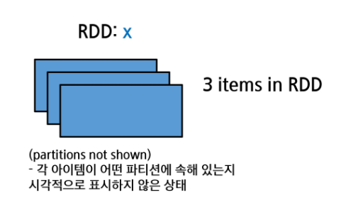
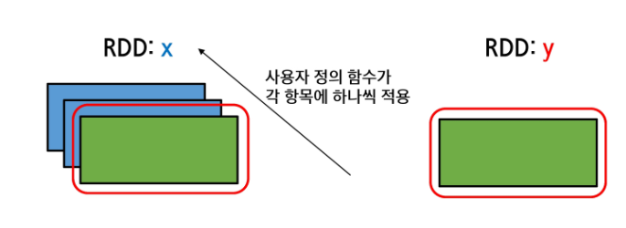
  - <span style = 'color:green'>원본 RDD가 있고 새로운 RDD 반환 </span>
  - <span style = 'color:green'> narrow transformation </span>
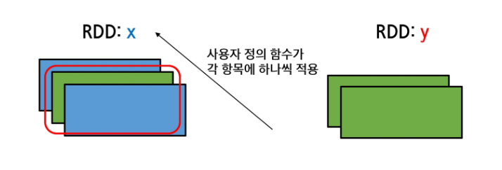
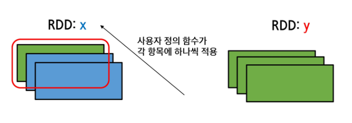
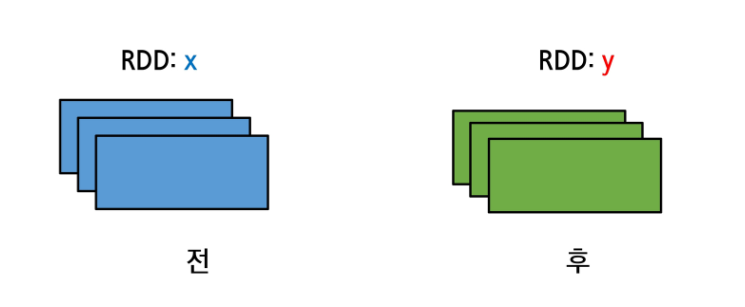
  - <span style = 'color:green'> immutable </span>
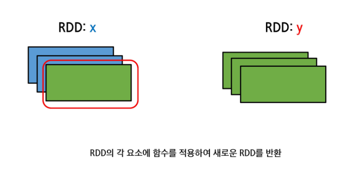


#### FLATMAP
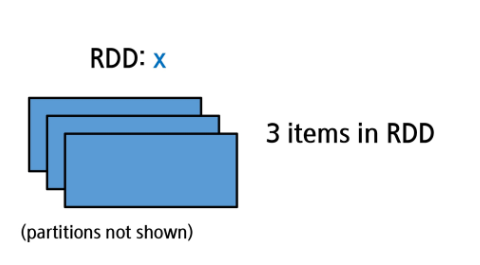

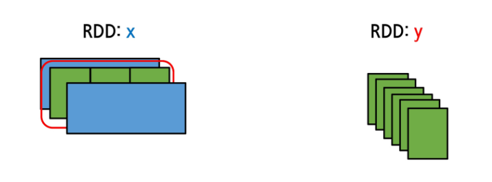
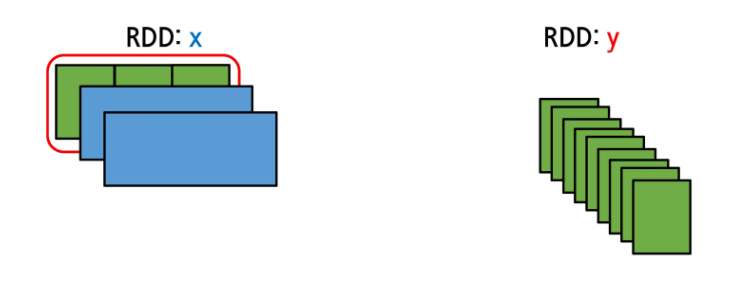

  - <span style = 'color:green'> 펼쳐서 만든다. </span>
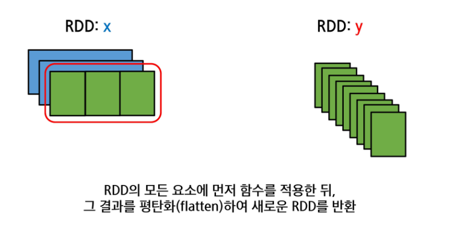
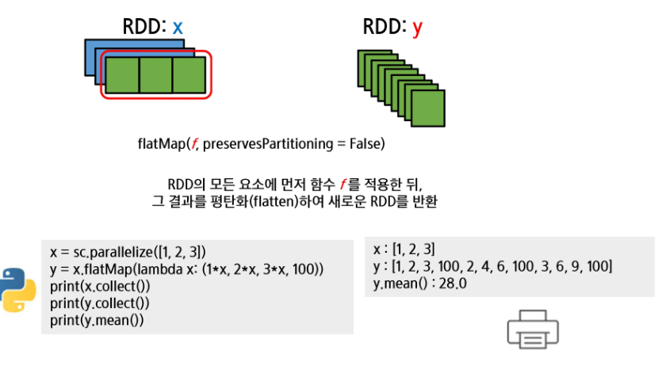

#### FILTER
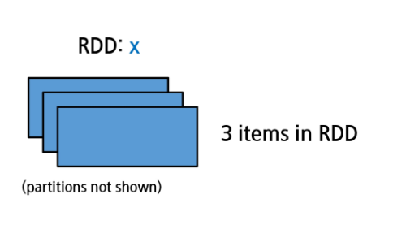
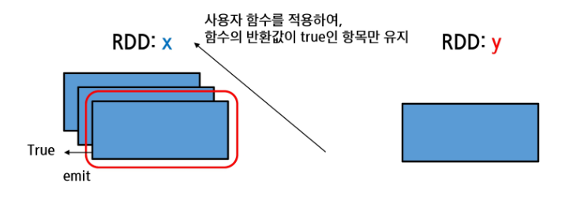
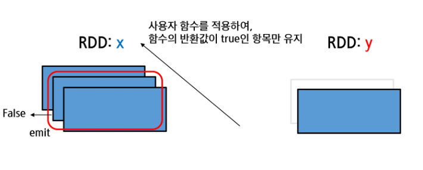
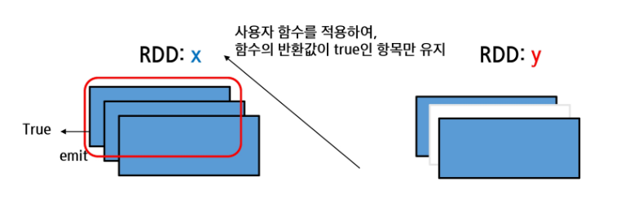
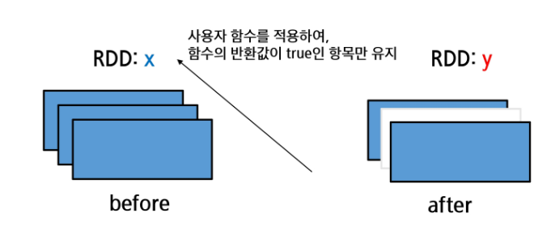
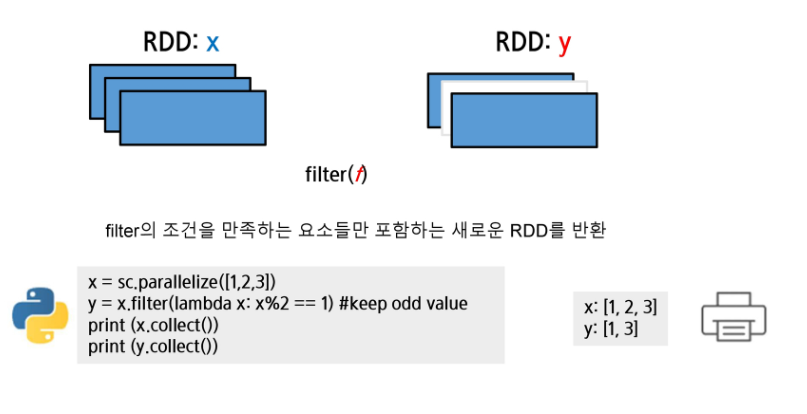

#### MAPPARTITIONS
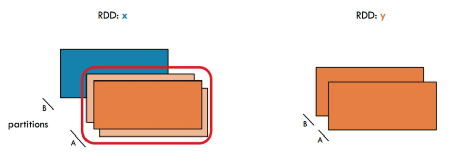
  - <span style = 'color:green'> RDD의 각 파티션 단위로 연산을 진행한다. </span>
  - <span style = 'color:green'> 파티션 크기가 너무 크면 OOM(Out-of-Memory) 가능성 있음 </span>
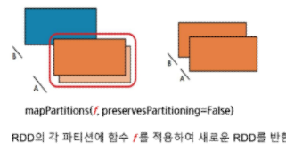
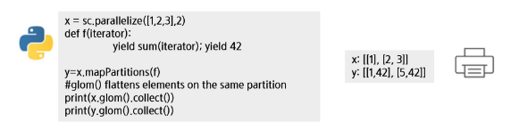
  - <span style = 'color:green'> `x = sc.parallelize([1, 2, 3], 2)` 2가 의미하는 건 파티션 몇 개? </span>
  - <span style = 'color:green'> 42라는 숫자를 뱉겠다. </span>
  - <span style = 'color:green'> `glom()` 각 파티션을 리스트로 묶겠다. </span>
  - <span style = 'color:green'> 셔플 발생하지 않음 </span>

#### MAPPARTITIONS WITH INDEX( <span style = 'color:green'> 파티션 번호를 함께 넘겨줌 </span>)
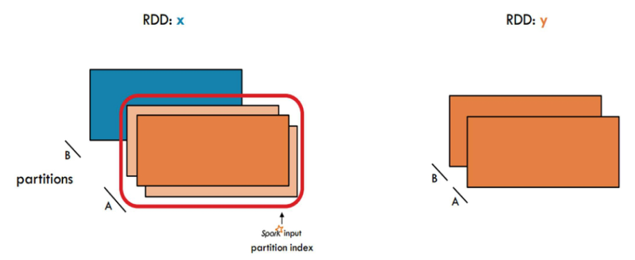
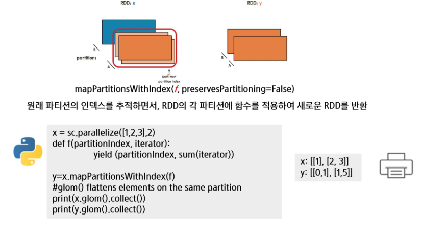

#### KEYBY (<span style = 'color:green'> 키값에 맞게 페어 형태로 만들겠다. </span>)
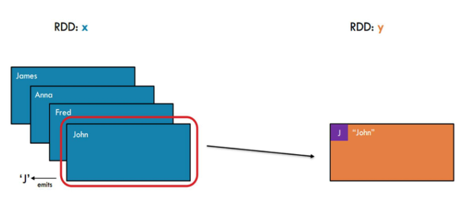
  - <span style = 'color:green'> John의 J를 키값으로 사용하겠다. </span>
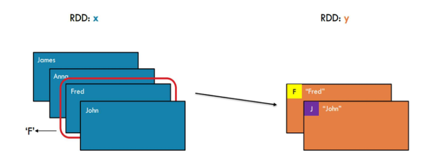
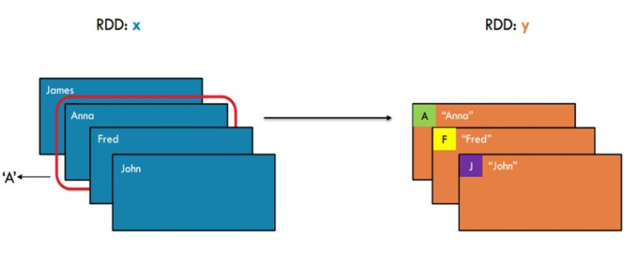
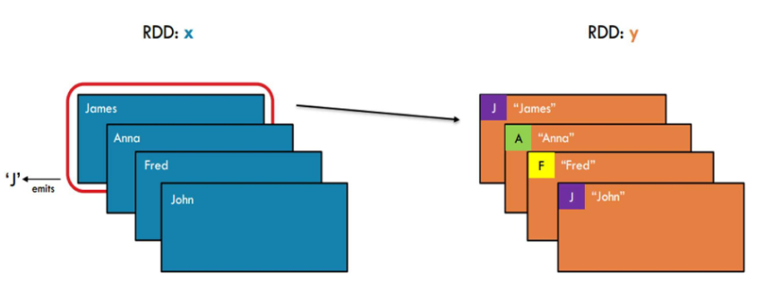
  - <span style = 'color:green'> James와 John의 키 중복 (('J', "John"), ('J', "James")) , 키가 같다고 병합되지는 않음 </span>
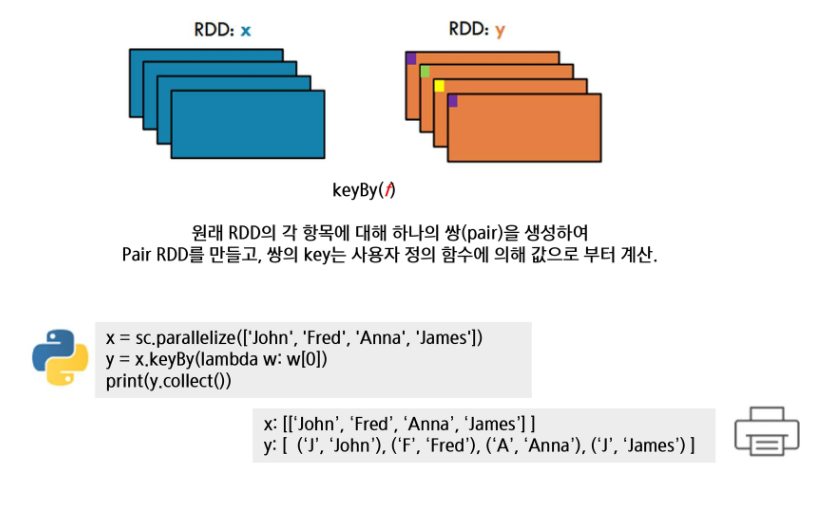
  - <span style = 'color:green'> 데이터 재분배가 필요하다? </span>

#### GROUPBY
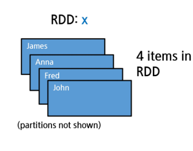
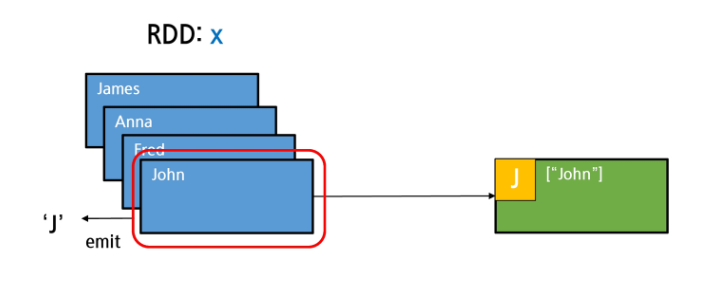
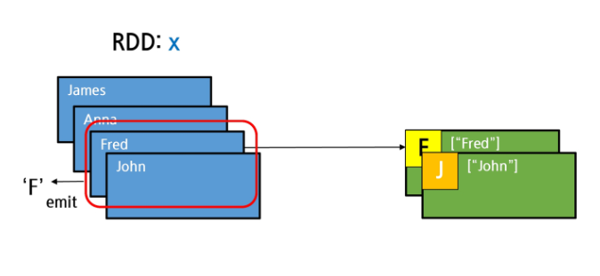
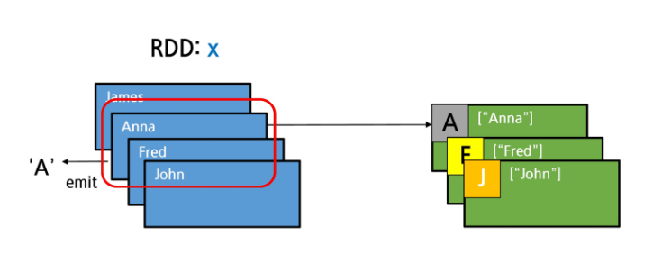
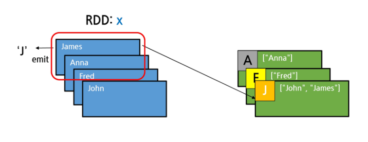
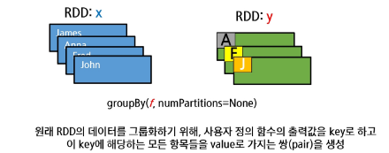
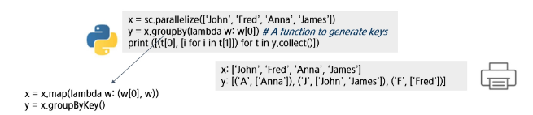
  - <span style = 'color:green'> 데이터 셔플 발생 </span>

#### GROUPBYKEY
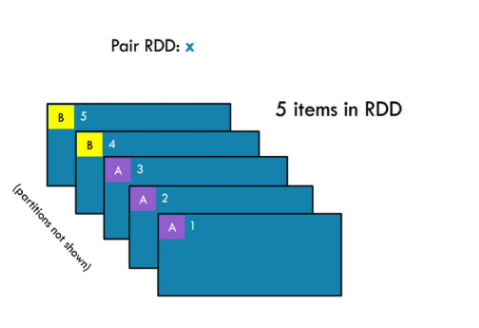
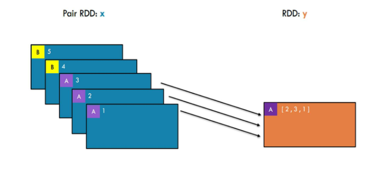
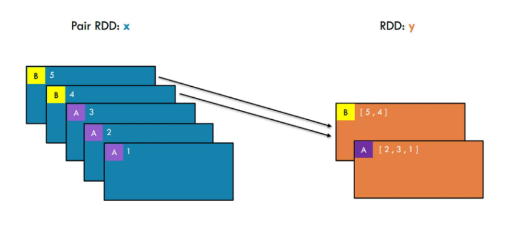
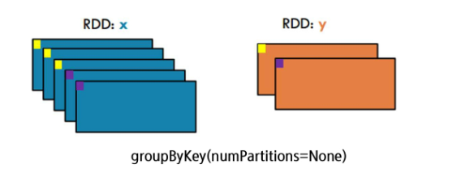
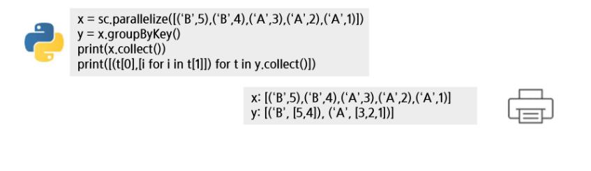

#### Word Counting 예시 (GROUPBYKEY)
```python
words = sc.parallelize(['one', 'two', 'two', 'three', 'three', 'three'])
wordPairsRdd = words.map(lambda w : (w,1))
wordCounts = wordPairsRdd.groupByKey().map(lambda pair: (pair[0], sum(pair[1])))

print(words.collect())
print(wordPairRdd.collect())
print(wordCounts.collect())
```
```text
>>> words: ['one', 'two', 'two', 'three', 'three', 'three']
>>> wordPairRDD : [('one', 1), ('two', 1), ('two', 1), ('three', 1), ('three', 1), ('three', 1)]
>>> wordCounts : [('one', 1), ('two', 2), ('three', 3)]
```

#### Word Counting 예시 REDUCEBYKEY
= > Grouping + Aggregation
```python
words = sc.parallelize(['one', 'two', 'two', 'three', 'three', 'three'])
wordPairsRdd = words.map(lambda w : (w,1))
wordCounts = wordPairsRdd.reduceByKey(lambda cnt1, cnt2 : cnt1 + cnt2)
# 키 기준으로 값을 모으고 집계까지 가능
# 각 파티션 내에서 먼저 합 → 최종 합계는 이후 셔플을 통해 묶어줌

print(words.collect())
print(wordPairsRdd.collect())
print(wordCounts.collect())
```
```text
>>> words: ['one', 'two', 'two', 'three', 'three', 'three']
wordPairsRDD: [('one', 1), ('two', 1), ('two', 1), ('three', 1), ('three', 1), ('three', 1)]
wordCounts: [('one', 1), ('two', 2), ('three', 3)]
```

#### REDUCEBYKEY vs. GROUPBYKEY
- 두 함수가 모두 사용 가능하다면, ReduceByKey를 사용
  - <span style = 'color:green'> ReduceByKey는 로컬에서 먼저 집계하고 셔플이 발생하기 때문에 불필요한 데이터 이동이 줄어듦 </span>
- ReduceByKey는 셔플 전에 행을 결합하여 셔플해야 할 행의 수를 줄일 수 있음
  - 로컬 집계
  - 중간 결과의 크기를 줄일 수 있음

#### REDUCEBYKEY
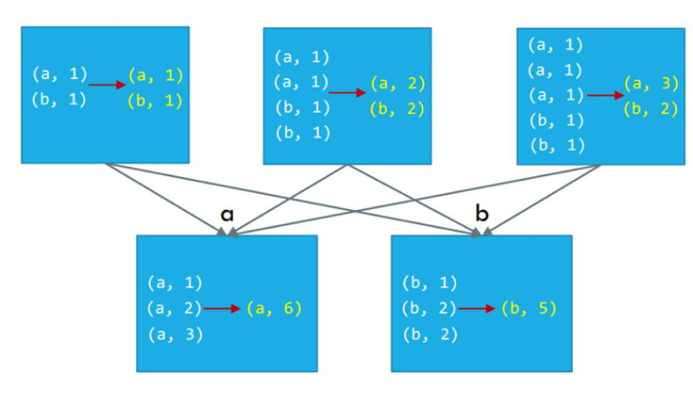

#### GROUPBYKEY
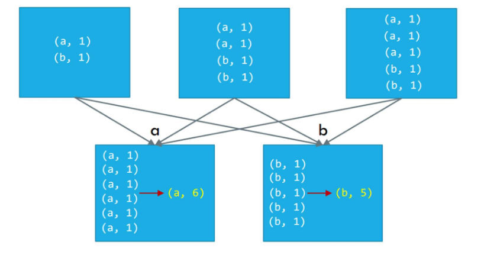

#### JOIN
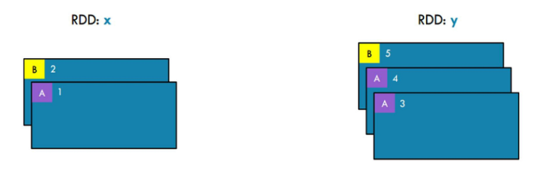
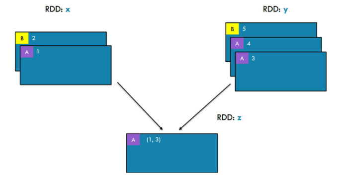
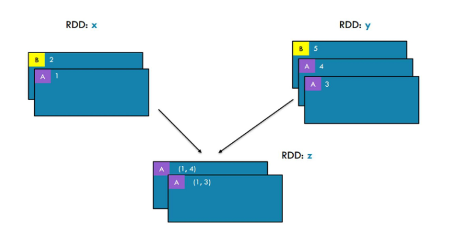
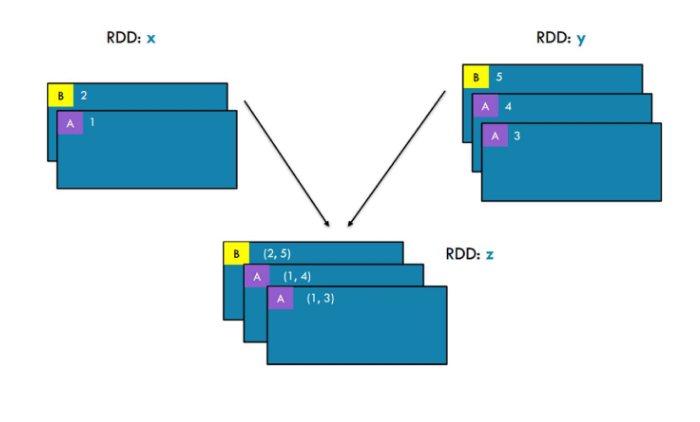
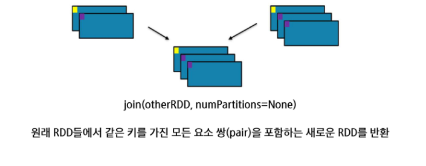


#### UNION
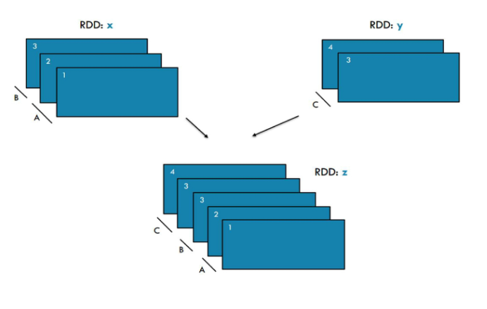
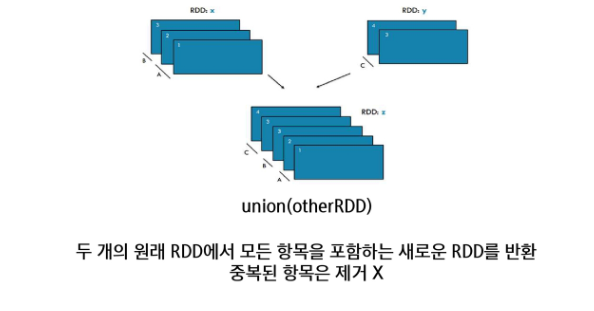
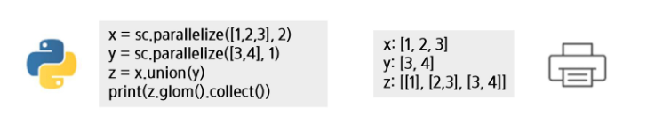

#### DISTINCT
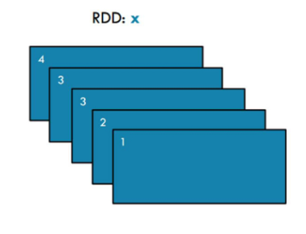
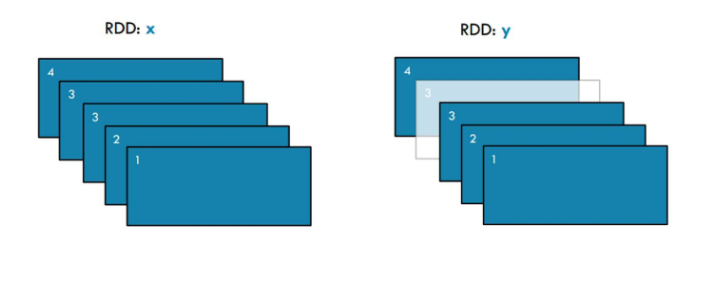
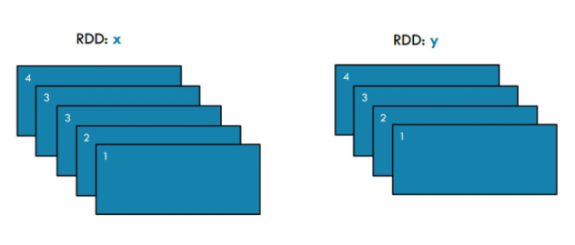
  - <span style = 'color:green'> 셔플 발생 </span>
  - <span style = 'color:green'> 분산된 상태로 저장 </span>
    - <span style = 'color:green'> 각 파티션끼리 서로 다른 파티션들이 어떤 데이터를 가지고 있는지 모름 </span>
    - <span style = 'color:green'> 중복 여부를 확인하려면 하나의 파티션에 모아야 함 </span>
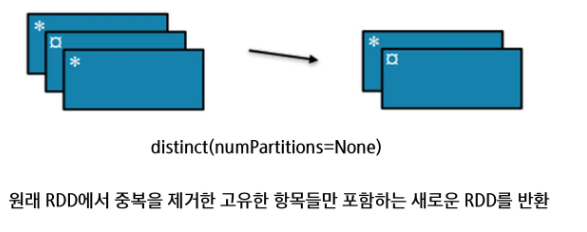
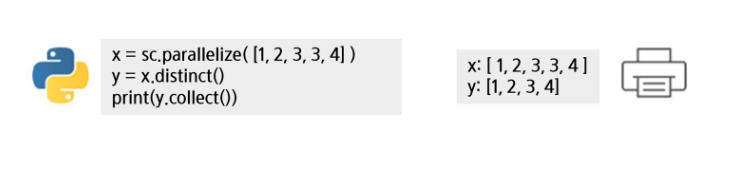

### 4) RDD Fundamentals
#### SAMPLE
- Big data
  - > 머신 수(<span style = 'color:green'>처리하는 노드</span>)가 많아질수록 처리 효율이 높아짐
  - > Small data 추출을 통해 일부 샘플만으로도 통계적으로 의미 있는 근사치 확보
  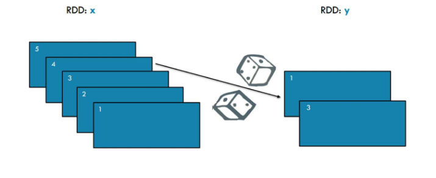
  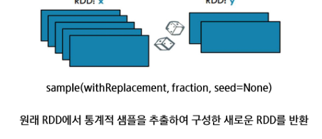
  - <span style = 'color:green'>`withReplacement` 복원추출여부 </span>
  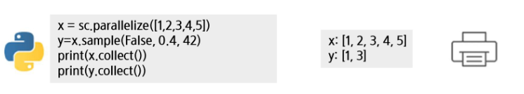

### 5) RDD 변환
#### 파티셔닝 재분배 (Repartition VS Coalesce)
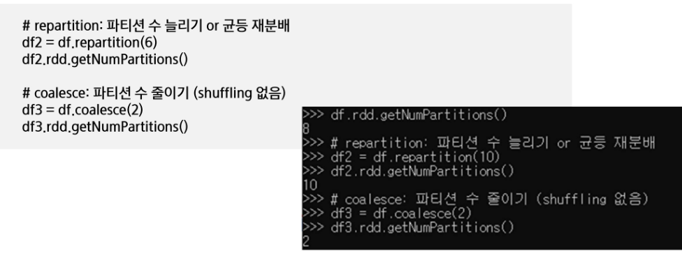
  - <span style = 'color:green'> `repartition()` : 전체 셔플링 진행, 비용 ↑, 균등하지만 성능 부하 </span>
  - <span style = 'color:green'> `coalesce()` : 파티션 수 줄일 때 사용, 기존 파티션들 병합만 함, 균등하지 않을 수 있음 → 데이터 불균형 발생 가능성 有 </span>

#### COALESCE
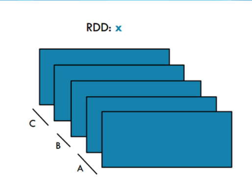
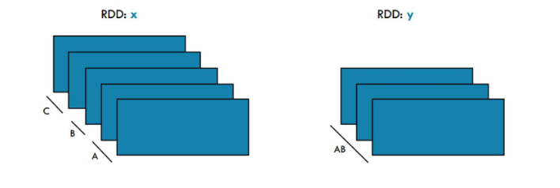

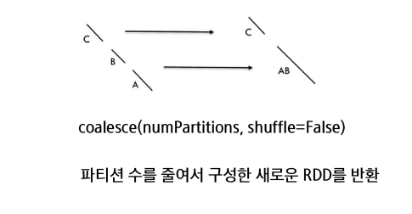
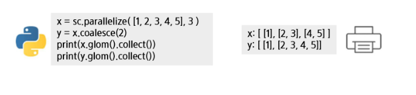

#### PARTITIONBY
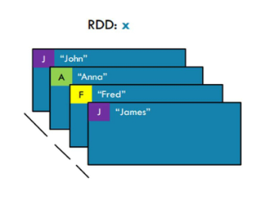
  - <span style = 'color:green'> 파티션 재배치 하고 싶다. </span>
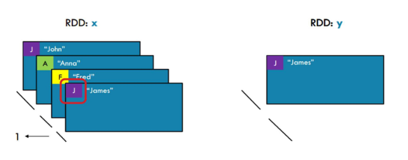
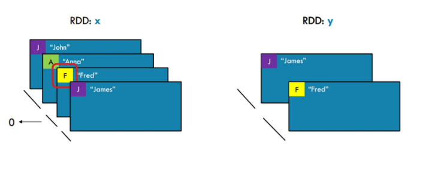
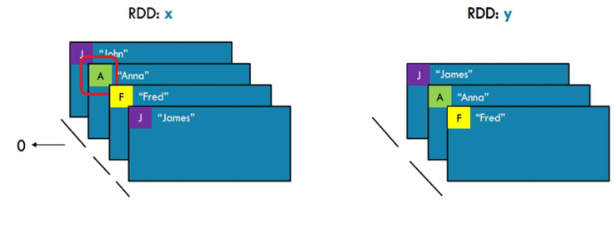
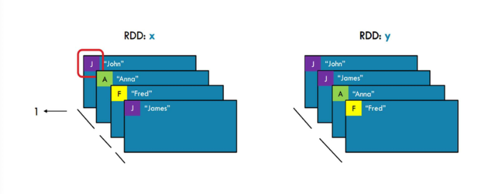
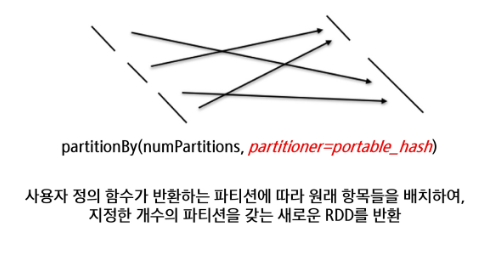
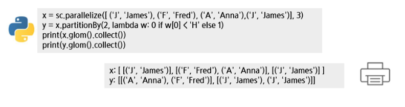

### 6) RDD Action
#### ACTIONS(<span style = 'color:green'> 실행하고 결과 확인 </span>)
- 변환된 RDD 데이터를 메모리로 가져오거나 저장하거나 집계하는 연산
  | 연산 | 설명 | 예제 | 결과 |
  |:----|:-----|:----|:-----|
  | `collect()` | 모든 데이터를 리스트로 반환(<span style = 'color:green'> 데이터 너무 많으면 오버플로우 조심</span>) | `rdd.collect()` | [1, 2, 3, 4] |
  | `count()` | 전체 요소를 하나로 결합 | `rdd.count()` | 4 |
  | `reduce()` | 전체 요소를 하나로 결합 | `rdd.reduce(lambda a, b : a + b)` | 10 |
  | `sum()` | 요소의 합 변환 | `rdd.sum()` | 10 |
  | `mean()` | 평균 값 변환 | `rdd.mean()` | 2.5 |

#### COLLECT
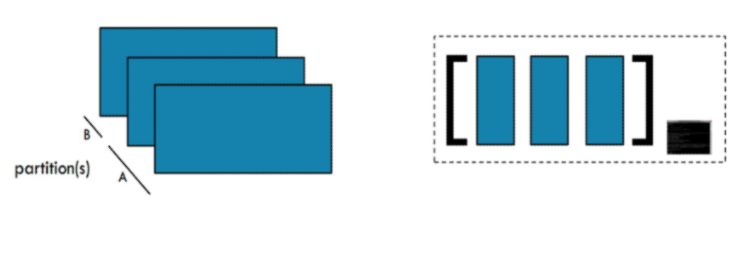
  - <span style = 'color:green'> 우측은 드라이버프로그램 </span>
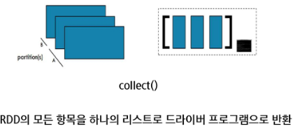
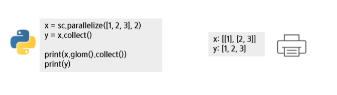

#### COUNTBYKEY(<span style = 'color:green'> 키 별로 count함 </span>)
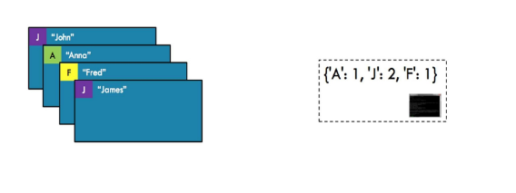
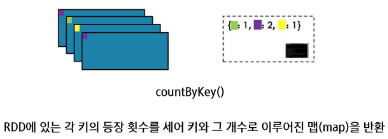
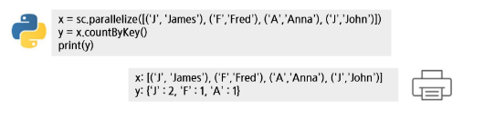

#### REDUCE
- 전체 RDD를 대상으로 축소(reduce) 연산을 수행
  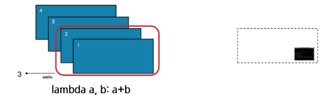
  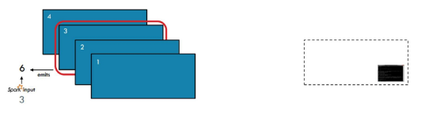
  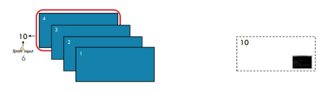
  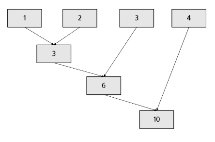
  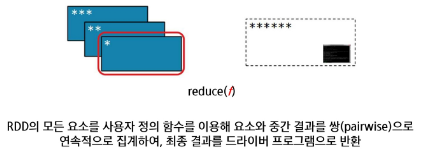
  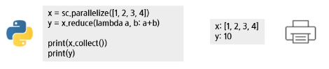
    - <span style = 'color:green'> 병렬 연산 → 병합 연산 </span>

#### SUM
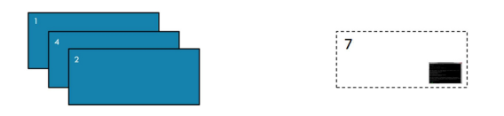
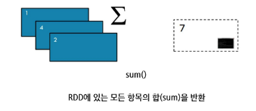
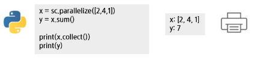

#### MEAN
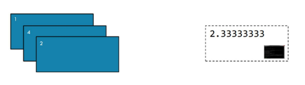
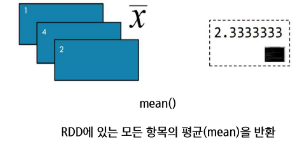
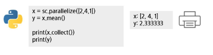
  - <span style = 'color:green'> 평균 구할 때 reducebykey를 쓰면 문제가 발생할 수 있다. </span>