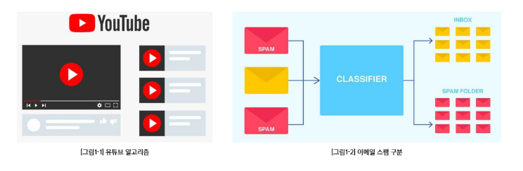
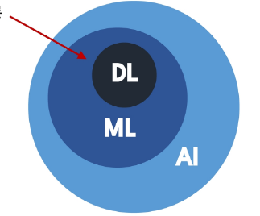

# AI & 기계학습 기초 1 - AI와 ML은 무엇인가?

# AI & 기계학습 기초 1 - AI와 ML은 무엇인가?

<strong>CONTENTS</strong>

- [AI \& 기계학습 기초 1 - AI와 ML은 무엇인가?](#ai--기계학습-기초-1---ai와-ml은-무엇인가)
- [AI \& 기계학습 기초 1 - AI와 ML은 무엇인가?](#ai--기계학습-기초-1---ai와-ml은-무엇인가-1)
    - [학습 목표](#학습-목표)
  - [0. 학습 시작(Overview)](#0-학습-시작overview)
    - [AI와 머신러닝(ML)이 내 일상에 미치는 영향](#ai와-머신러닝ml이-내-일상에-미치는-영향)
  - [1. AI, ML, DL의 정의](#1-ai-ml-dl의-정의)
    - [AI(Artificial Intelligence)](#aiartificial-intelligence)
    - [ML(Machine Learning)](#mlmachine-learning)
    - [DL(Deep Learning)](#dldeep-learning)
    - [AI - ML(ML이 아닌 AI 시스템)의 예](#ai---mlml이-아닌-ai-시스템의-예)
  - [2. 데이터의 학습의 이해](#2-데이터의-학습의-이해)
    - [1) 데이터 구성 요소(Feature/Label)](#1-데이터-구성-요소featurelabel)
      - [데이터가 왜 중요한가?](#데이터가-왜-중요한가)
  - [3. 단일 피처 기반 학습](#3-단일-피처-기반-학습)
    - [1) 1D 피처 기반 학습](#1-1d-피처-기반-학습)
    - [2) 모델의 가설공간](#2-모델의-가설공간)
    - [3) 학습이란](#3-학습이란)
  - [4. 복수 피처 기반 학습](#4-복수-피처-기반-학습)
    - [1) 2D 피처 기반 학습](#1-2d-피처-기반-학습)
    - [2) 일반적 용어 정리 및 모델 가정](#2-일반적-용어-정리-및-모델-가정)
    - [3) 왜 f(x)를 학습하는가?](#3-왜-fx를-학습하는가)

### 학습 목표
- AI, ML, DL의 정의 및 관계를 학습합니다.
- 데이터(feature 및 label), 가설공간, 모델(model)의 개념을 학습합니다.
- 학습(learning)의 정의를 학습합니다.

## 0. 학습 시작(Overview)
### AI와 머신러닝(ML)이 내 일상에 미치는 영향
- 유튜브는 어떻게 내 취향을 알아맞힐까?
- 이메일은 어떻게 스팸/정상을 가려낼까?
- **공통점** : 사람이 모든 규칙을 미리 코딩하지 않아도, 데이터에서 **규칙**을 학습해 성능을 향상함
  

## 1. AI, ML, DL의 정의
### AI(Artificial Intelligence)
- 주어진 환경/데이터를 인지·학습·추론을 통해 목표 달성을 하도록 예측·행동 선택·계획하는 시스템

### ML(Machine Learning)
- AI 범주 내에서 데이터로부터 학습하여 목적을 달성하는 접근 방법론
- 예 : 언어 모델, 이미지 분류 모델, 추천 시스템

### DL(Deep Learning)
- ML 범주 내에서 신경망(Neural Network) 함수를 사용한 학습 방법론

### AI - ML(ML이 아닌 AI 시스템)의 예
- 규칙 기반 시스템
- 휴리스틱 기반 (최적화) 알고리즘
  

## 2. 데이터의 학습의 이해
### 1) 데이터 구성 요소(Feature/Label)
#### 데이터가 왜 중요한가?
- 머신러닝은 규칙을 직접 코딩하지 않고, 데이터에서 규칙을 학습
- 데이터(Feature, Label)의 분포와 관계가 머신러닝의 학습 결과를 결정

## 3. 단일 피처 기반 학습
본문…

### 1) 1D 피처 기반 학습
본문…

### 2) 모델의 가설공간
본문…

### 3) 학습이란
본문…

## 4. 복수 피처 기반 학습
본문…

### 1) 2D 피처 기반 학습
본문…

### 2) 일반적 용어 정리 및 모델 가정
본문…

### 3) 왜 f(x)를 학습하는가?
본문…

