# AI & 기계학습 기초 1 - AI와 ML은 무엇인가?

# AI & 기계학습 기초 1 - AI와 ML은 무엇인가?

<strong>CONTENTS</strong>

- [AI \& 기계학습 기초 1 - AI와 ML은 무엇인가?](#ai--기계학습-기초-1---ai와-ml은-무엇인가)
- [AI \& 기계학습 기초 1 - AI와 ML은 무엇인가?](#ai--기계학습-기초-1---ai와-ml은-무엇인가-1)
    - [학습 목표](#학습-목표)
  - [0. 학습 시작(Overview)](#0-학습-시작overview)
    - [AI와 머신러닝(ML)이 내 일상에 미치는 영향](#ai와-머신러닝ml이-내-일상에-미치는-영향)
  - [1. AI, ML, DL의 정의](#1-ai-ml-dl의-정의)
    - [AI(Artificial Intelligence)](#aiartificial-intelligence)
    - [ML(Machine Learning)](#mlmachine-learning)
    - [DL(Deep Learning)](#dldeep-learning)
    - [AI - ML(ML이 아닌 AI 시스템)의 예](#ai---mlml이-아닌-ai-시스템의-예)
  - [2. 데이터의 학습의 이해](#2-데이터의-학습의-이해)
    - [1) 데이터 구성 요소(Feature/Label)](#1-데이터-구성-요소featurelabel)
      - [데이터가 왜 중요한가?](#데이터가-왜-중요한가)
      - [Feature (피처, 특성)](#feature-피처-특성)
      - [Label (라벨, 목표값)](#label-라벨-목표값)
    - [2) ML 실생활 예시](#2-ml-실생활-예시)
      - [예시 1 - 유튜브 추천](#예시-1---유튜브-추천)
      - [예시 2 - 스팸메일 분류](#예시-2---스팸메일-분류)
  - [3. 단일 피쳐 기반 학습](#3-단일-피쳐-기반-학습)
    - [1) 1D 피쳐 기반 학습](#1-1d-피쳐-기반-학습)
      - [1D 피쳐 기반 학습(단일 피쳐 학습)이란?](#1d-피쳐-기반-학습단일-피쳐-학습이란)
      - [$ Income\_i = f^\*(Years \\quad of \\quad Education ,\_i)  + \\epsilon\_i $](#-income_i--fyears-quad-of-quad-education-_i---epsilon_i-)
      - [피쳐와 라벨의 관계를 잘 나타낸 함수 $f$는 무엇일까?](#피쳐와-라벨의-관계를-잘-나타낸-함수-f는-무엇일까)
      - [피쳐와 라벨의 관계를 잘 나타내는 함수 $f$는 없을까?](#피쳐와-라벨의-관계를-잘-나타내는-함수-f는-없을까)
    - [2) 모델과 가설 공간](#2-모델과-가설-공간)
      - [학습 (Learning)](#학습-learning)
      - [가설 공간(Hypothesis Space)](#가설-공간hypothesis-space)
      - [모델(Model)](#모델model)
    - [3) 학습이란](#3-학습이란)
      - [학습](#학습)
  - [4. 복수 피쳐 기반 학습](#4-복수-피쳐-기반-학습)
    - [1) 2D 피쳐 기반 학습](#1-2d-피쳐-기반-학습)
      - [$ Income\_i = f^\*(Years \\quad of \\quad Education, , Seniority)  + \\epsilon $](#-income_i--fyears-quad-of-quad-education--seniority---epsilon-)
    - [2) 일반적 용어 정리 및 모델 가정](#2-일반적-용어-정리-및-모델-가정)
      - [$ Income = f^*(Years,  of , Education, , Seniority, ...) + \\epsilon \\rightarrow Y = f^*(X) + \\epsilon $](#-income--fyears--of--education--seniority---epsilon-rightarrow-y--fx--epsilon-)
    - [3) 왜 $ f(\\cdot) $를 학습하는가?](#3-왜--fcdot-를-학습하는가)
      - [예측](#예측)
      - [중요 특성 파악](#중요-특성-파악)
      - [해석 가능성](#해석-가능성)
  - [강의 정리](#강의-정리)
    - [오늘 공부한 내용 요약 및 정리](#오늘-공부한-내용-요약-및-정리)
      - [AI와 ML](#ai와-ml)
      - [데이터의 구성 요소](#데이터의-구성-요소)
      - [1D 피쳐 기반 학습](#1d-피쳐-기반-학습)
      - [모델과 가설 공간](#모델과-가설-공간)
      - [학습](#학습-1)
      - [모델 학습의 필요성](#모델-학습의-필요성)

### 학습 목표
- AI, ML, DL의 정의 및 관계를 학습합니다.
- 데이터(feature 및 label), 가설공간, 모델(model)의 개념을 학습합니다.
- 학습(learning)의 정의를 학습합니다.

## 0. 학습 시작(Overview)
### AI와 머신러닝(ML)이 내 일상에 미치는 영향
- 유튜브는 어떻게 내 취향을 알아맞힐까?
- 이메일은 어떻게 스팸/정상을 가려낼까?
- **공통점** : 사람이 모든 규칙을 미리 코딩하지 않아도, 데이터에서 **규칙**을 학습해 성능을 향상함
  

## 1. AI, ML, DL의 정의
### AI(Artificial Intelligence)
- 주어진 환경/데이터를 인지·학습·추론을 통해 목표 달성을 하도록 예측·행동 선택·계획하는 시스템

### ML(Machine Learning)
- AI 범주 내에서 데이터로부터 학습하여 목적을 달성하는 접근 방법론
- 예 : 언어 모델, 이미지 분류 모델, 추천 시스템

### DL(Deep Learning)
- ML 범주 내에서 신경망(Neural Network) 함수를 사용한 학습 방법론

### AI - ML(ML이 아닌 AI 시스템)의 예
- 규칙 기반 시스템
- 휴리스틱 기반 (최적화) 알고리즘
  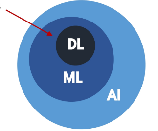

## 2. 데이터의 학습의 이해
### 1) 데이터 구성 요소(Feature/Label)
#### 데이터가 왜 중요한가?
- 머신러닝은 규칙을 직접 코딩하지 않고, 데이터에서 규칙을 학습
- 데이터(Feature, Label)의 분포와 관계가 머신러닝의 학습 결과를 결정

#### Feature (피처, 특성)
- 모델이 예측에 사용하는 입력정보
- 예측, 판단의 근거/단서

#### Label (라벨, 목표값)
- 모델이 예측하려는 정답
- 학습의 목표값
  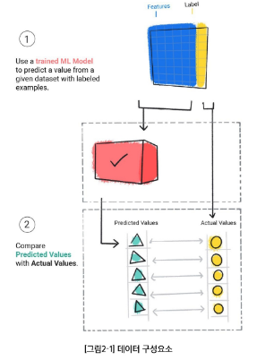

### 2) ML 실생활 예시
#### 예시 1 - 유튜브 추천
- Feature : 각 영상들의 정보 (장르, 크리에이터, 조회수, 좋아요 수 등), 사용자 정보(시청 이력, 구독 채널 등)
- Label : 영상에 대한 사용자 피드백 (시청 여부, 좋아요 클릭 여부)

#### 예시 2 - 스팸메일 분류
- Feature : 메일 제목, 발신자, 단어 빈도
- Label : 스팸 / 정상
  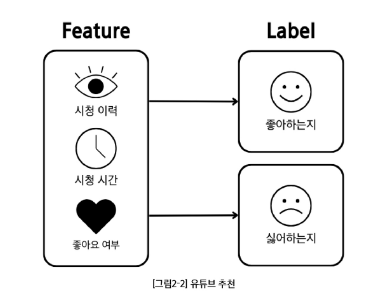

## 3. 단일 피쳐 기반 학습  
### 1) 1D 피쳐 기반 학습
#### 1D 피쳐 기반 학습(단일 피쳐 학습)이란?
- 1D = 1차원
- Feature가 하나일 때 머신러닝이 학습하는 갖아 단순한 형태
  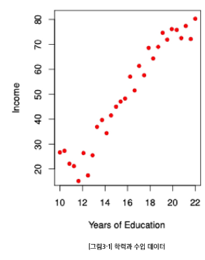

#### $ Income_i = f^*(Years \quad of \quad Education \,_i)  + \epsilon_i $
- $ f^* $ : 미지의 참 함수 / $ \epsilon_i $ : 측정 오차
- 데이터셋 D : 30명의 Years of Education (피쳐)와 Income (라벨) 쌍
- $ D = $ $ {(Years \quad of \quad Edication \,_i, Income_i)}^{30}_{i=1} $
  - 미지의 함수($ f^*$ )
    - Feature와 Label 사이의 실제 평균 관계
    - 하지만 직접 관측할 수 없음
    - 오차가 포함된 데이터(점)만 관측 가능
  - 측정오차 ($ \epsilon $)
    - 데이터에는 주로 측정 오차가 섞여 있음
    - 원인 : 측정 기기의 한계, 환경적 요인 등
    - 따라서, 데이터 = 참 함수 + 오차 ($ f^* + \epsilon $)
  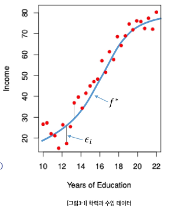

#### 피쳐와 라벨의 관계를 잘 나타낸 함수 $f$는 무엇일까?
  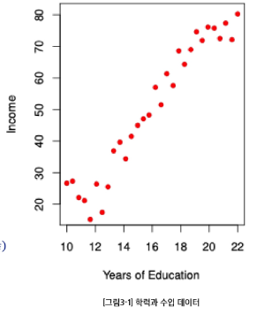

#### 피쳐와 라벨의 관계를 잘 나타내는 함수 $f$는 없을까?
- 데이터를 설명하는 여러 함수 후보가 존재
- 어떤 함수가 가장 잘 맞는지 **학습**해야 함
  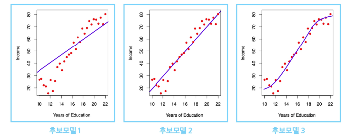

### 2) 모델과 가설 공간
#### 학습 (Learning)
- '입력(Feature) → 출력(Label)' 관계를 찾는 과정
- 평균 관계를 하나의 함수로 표현함
- 하지만 관계를 표현할 수 있는 함수는 무수히 많음

#### 가설 공간(Hypothesis Space)
- 관계를 표현할 수 있는 모든 후보 함수들의 모음
- **피쳐 공간**과 **라벨 공간** 위에서 정의된 **함수**들의 집합 $ \mathfrak{F} $

#### 모델(Model)
- 가설공간  $ \mathfrak{F} $에 속한 특정 함수 $ f $
  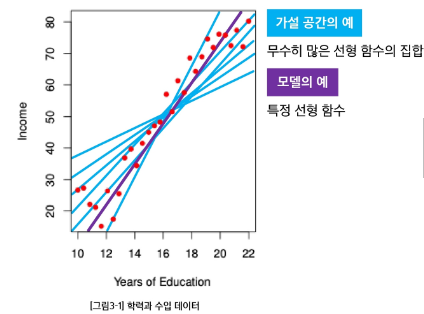
  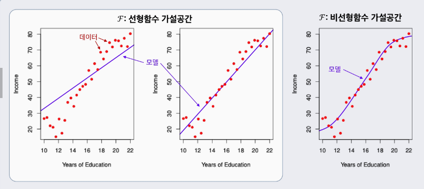

### 3) 학습이란
#### 학습
- 주어진 **데이터**와 성능척도를 바탕으로 **가설공간** $ \mathfrak{F} $의 후보들 중 최적의 **모델**을 선택하는 과정
- **데이터** $ D $ → **가설공간** $ \mathfrak{F} $ → 선택된 **모델** $ f $
  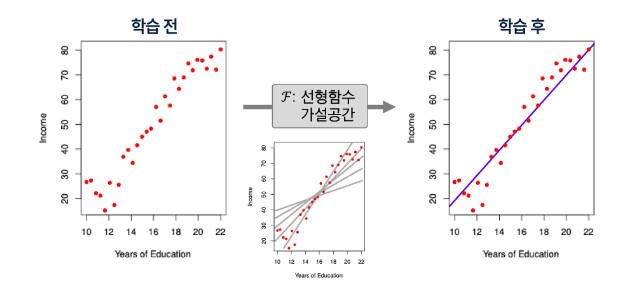

## 4. 복수 피쳐 기반 학습
### 1) 2D 피쳐 기반 학습
#### $ Income_i = f^*(Years \quad of \quad Education, \, Seniority)  + \epsilon $
- $ f^* $ : 미지의 참 함수(입력과 출력을 이어주는 숨겨진 진짜 함수)
- 파란색  **Surface(=미지의 참 함수 $ f $)는 관측 불가능**
- 빨간색 점들(=데이터)만 관측 가능함
- **학습 전** : 어떤 가설공간 $ \mathfrak{F} $을 사용할까?
- **학습 후** : 데이터를 활용하여 어떤 모델 $f$을 선택해야 할까?
  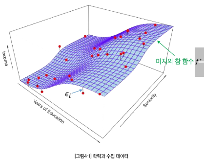
  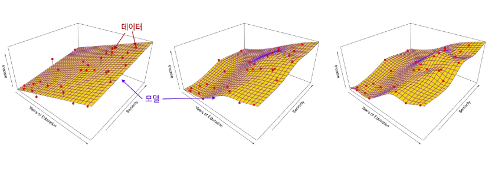
  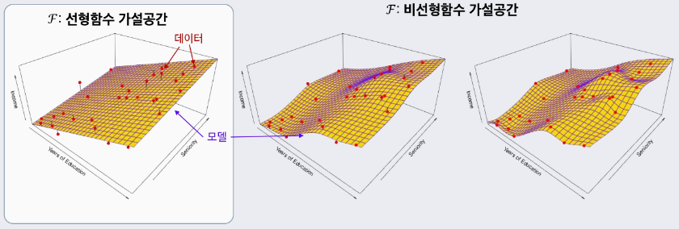

### 2) 일반적 용어 정리 및 모델 가정
#### $ Income = f^*(Years\,  of \, Education, \, Seniority, ...) + \epsilon \rightarrow Y = f^*(X) + \epsilon $
- $ Income $ : 우리가 예측하려는 라벨(반응/목표) 변수 → $ Y $로 표기
- $ Years \, of \, Education $ : 첫번째 피쳐(입력/예측) 변수 → $ X_1 $로 표기
- $ Seniority $ : 두번째 피쳐(입력/예측) 변수 → $ X_2 $로 표기
- 다른 $ i $번째 피처가 있다면 역시 $ X_i $로 표기
- 일반적인 $p$차원 피쳐(총 $p$개의 피쳐) 벡터 : $ X = \begin{bmatrix} X_1 \\ X_2 \\ \vdots \\ X_p \end{bmatrix} \in \mathbb{R}^p $
- 모델(함수형) : $ f^* : \mathbb{R}^p \rightarrow \mathbb{R} , \quad Y = f^*(X) + \epsilon $
- 측정오차 $ \epsilon $ : $ \epsilon $는 피쳐 $ X $와 독립 및 $ \mathbb{E}[\epsilon] = 0 $로 가정함

### 3) 왜 $ f(\cdot) $를 학습하는가?
#### 예측
- 잘 학습된 $ f $가 있으면, 새로운 입력 $ X = x $에서 **반응/목표** $ Y $를 예측할 수 있음

#### 중요 특성 파악
- 피쳐들 $ X = (X_1, X_2, \cdots X_p) $의 어떤 **특성**이 $ Y $를 설명하는데 **중요**하고, 어떤 것은 **덜 중요(무관)**한지 알 수 있음
  - 예 : 근속연수(Seniority), 교육기간(Years of Education)은 소득(Income)에 큰 영향을 줄 수 있지만, 혼인 여부(Marital Status)는 영향이 거의 없을 것임

#### 해석 가능성
- $ f $의 **복잡도**에 따라 각 구성요소 $ X_j $가 $ Y $에 **어떻게 영향을 미치는지**(증가/감소 방향, 민감도 등) **이해**할 수 있음

## 강의 정리
### 오늘 공부한 내용 요약 및 정리
#### AI와 ML
- AI : 주어진 환경/데이터를 인지·학습·추론하여 목표 달성을 위한 예측·행동 선택·계획을 수행하는 시스템
- ML : AI 범주 내에서 데이터로부터 학습하여 목적을 달성하는 방법론

#### 데이터의 구성 요소
- Feature : 모델 입력 정보, 예측·판단의 근거
- Label : 모델이 예측하려는 정답, 학습의 목표

#### 1D 피쳐 기반 학습
- Feature가 하나일 때(1차원) 수행되는 단순하 학습 형태
- Feature와 Label 사이의 관계를 함수 $f$로 표현하되, 실제 데이터에는 측정오차 ($\epsilon$)가 포함됨

#### 모델과 가설 공간
- 가설 공간($\mathfrak{F}$) : Feature와 Label 관계를 표현할 수 있는 함수들의 집합
- 모델 : 가설 공간 내 특정 함수 $ f $

#### 학습
- 데이터와 성능 척도를 바탕으로 가설 공간 $ \mathfrak{F} $ 내 후보 중 최적의 모델을 선택하는 과정

#### 모델 학습의 필요성
- 예측 : 새로운 입력값에 대해 Label을 추론
- 중요 특성 파악 : 어떤 Feature가 결과에 중요한지 확인
- 해석 가능성 : 각 Feature가 결과에 어떤 영향을 미치는지 이해