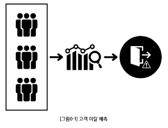
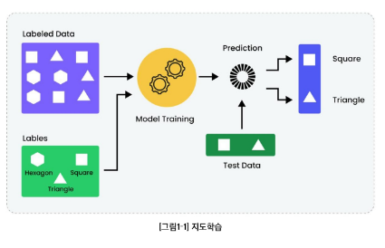
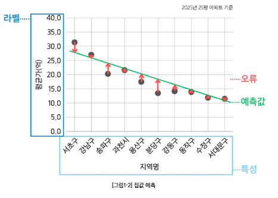
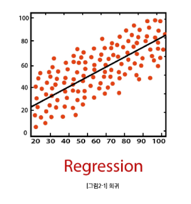
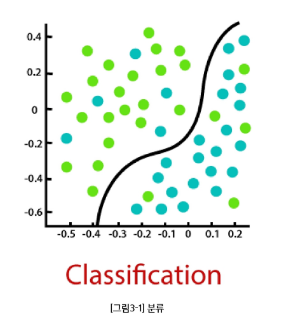
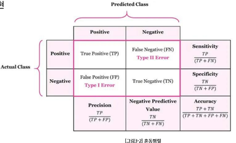
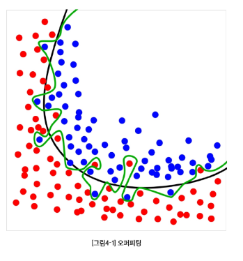
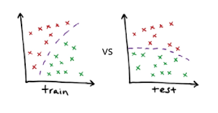
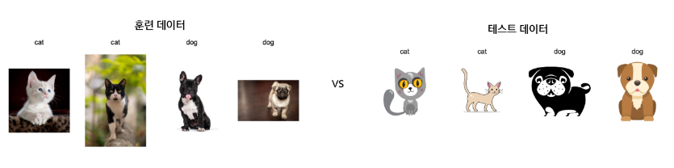
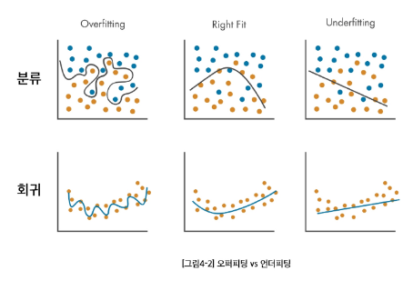

# AI & 기계학습 기초 2 - 지도학습은 무엇인가?

<strong>CONTENTS</strong>

### 학습 목표
- 회귀(연속값)와 분류(범주값)의 문제 정의와 출력 차이 이해
- 문제 유형에 맞는 오류/평가지표를 바르게 선택·해석
- 학습의 목적 : 테스트 성능 최대화(테스트 오류 최소화)에 대한 이해
- 오버피팅(overfitting)의 이해

## 0. 학습 시작(Overview)
#### 지도 학습 : '훈련 데이터가 아니라, 처음 보는 데이터에서의 예측 성능 향상'
- 지도학습은 **입력 + 정답**(레이블)을 가지고 예측 규칙을 배우는 방법
- 이미 갖고 있는 데이터를 활용하여 학습하지만, 궁극적으로 새로운 데이터에서의 예측을 잘 하고자 하는데 초첨
- 예) 어제까지 고객 데이터로 '내일 이탈할 고객' 미리 알기, 기존 거래 사기(Fraud) 데이터로 새로운 사기 탐지
  

## 1. 지도학습의 개념
### 1-1. 지도학습(supervised learning)이란?
#### 데이터
- 입력(특성)과 정답(라벨)이 쌍으로 있는 데이터

#### 목표
- 새 입력이 들어오면 정답을 잘 맞추는 규칙을 학습

#### 지도학습의 종류
- **회귀** : 예측값이 **숫자**(가격, 점수, 온도)
- **분류** : 예측값이 **범주**(스팸/정상, 질병 유/무)
  

### 1-2. 지도학습 용어
#### 특성(Feature, $x$)
- 예측에 쓰는 설명 변수
  - 예 : 
    - 집값 예측 {지역, 평수, 방수, 연식}
    - 이메일 스팸 필터링 {제목, 내용 텍스트, 송신인}
  
#### 라벨(Label, $y$)
- 맞춰야 하는 정답
  - 예 : 집값, 스팸/정상이메일

#### 예측값($ \hat{y} $)
- 모델이 내놓은 결과 (숫자 또는 범주)

#### 오류(Error)
- 예측값($\hat{y} $)과 라벨($y$)의 차이 : $ \hat{y} - y $
  

## 2. 회귀(Regression)
### 2-1. 회귀(Regression) 문제
#### 입력으로부터 숫자를 얼마나 정확히 예측할까?
- Feature : 면적·방수·연식 → Label : **집값**(원 단위)
- Feature : 매체별 광고비(TV/라디오/온라인) → Label : **매출액**

#### 라벨 및 예측 모델의 출력
- 연속적인 수치
  

### 2-2. 회귀 오류 : 평균제곱오차(MSE)
#### 평균제곱오차(Mean Squared Error)
- 각 데이터에서 정답($y_i$)과 예측($\hat{y}_i$)의 평균 제곱 차이값
$$ MSE = \frac{1}{n} \sum_{i=1}^n (y_i - \hat{y}_i)^2 $$

#### 해석
- 큰 오류를 더 크게 벌주므로, 전체 오류 수준을 한눈에 봄

#### 참고
- 데이터와 같은 단위를 쓰고 싶으면 **RMSE**(MSE의 제곱근)도 사용
$$ RMSE = \sqrt{MSE} = \sqrt{\frac{1}{n} \sum_{i=1}^n (y_i - \hat{y}_i)^2} $$

### 2-3. 회귀 설명력 : $R^2$ (결정계수)
#### 결정계수
- 라벨의 분산 중에서 특성으로 설명되는 비율
- '평균만 쓰는 단순한 예측'보다 얼마나 더 잘 맞추는지를 0~1 사이로 나타낸 값

  

  

  

    

  

  

