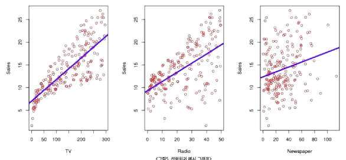
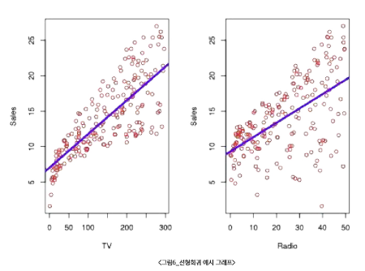
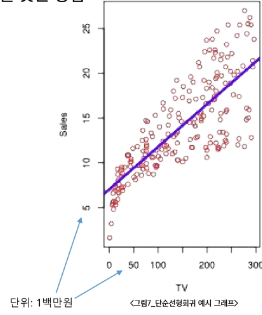
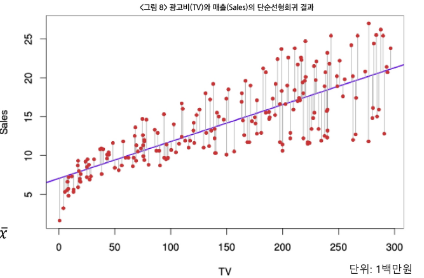
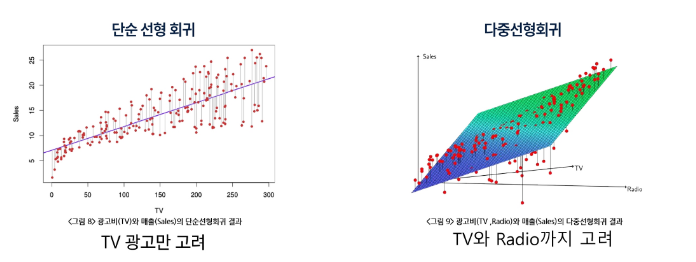

# AI & 기계학습 방법론 1 - 선형회귀(Linear Regression)

 CONTENT 

1. 선형회귀 : 입력과 출력의 선형 관계를 찾는 방법
2. 단순선형회귀 : 하나의 입력 변수로 출력 예측하기
3. 다중선형회귀 : 여러 입력 변수를 활용한 예측
4. 선형회귀 주의사항 : 변수 상관(다중공선성), 상관과 인과 구분

## 학습 목표
- 선형회귀의 핵심 개념 이해 : 입력 - 출력의 선형 관계, 단순선형회귀 이해
- 모델 적합 : 잔차제곱합(RSS)과 최소 제공 이해
- 다중선형회귀로 확장한 학습 방법 이해

## 0. 학습 시작(Overview)
#### 실제 응용 사례
- 광고비와 매출 관계 분석
- 고객 소득·소비 패턴을 활용한 신용점수 산출
  

## 1. 선형 회귀
### 1-1. 선형회귀(Linear Regression)
#### 선형회귀란?
- 입력 변수와 출력 변수 사이의 관계를 **직선 형태로 근사**하여 예측하는 통계적 방법이다.
- 지도학습의 가장 **기초가 되는 접근** 중 하나이다.
- 단순해 보이지만, 선형회귀는 **개념적으로도, 실무적으로도** 매우 유용하다.
  

### 1-2. 광고데이터 예시
#### 선형회귀를 통해 대답할 수 있는 질문들
- 광고비와 매출 사이에 관계가 있는가?
- 그 관계의 강도는 어느 정도인가?
- 어떤 매체가 매출에 기여하는가?
- 미래 매출을 얼마나 정확히 예측할 수 있는가?
- 매체 간에 상호작용(시너지)가 있는가?
  

## 2. 단순선형회귀(Simple Linear Regression)
### 2-1. 단순선형회귀 : 단일 설명변수를 이용한 선형회귀
#### 단순선형회귀(Simple Linear Regression)란?
- 한 개의 설명변수(X)와 하나의 반응변수(Y) 사이의 선형(직선) 관계를 찾는 방법
- 목표 : 데이터를 가장 잘 설명하는 직선을 찾아 예측($ \hat{y} $)에 활용

- 단일 설명변수를 이용한 단순선형회귀
  - 모형 가정 : $ Y = \beta_0 + \beta_1 X + \epsilon $
    -  $ \beta_0 $ : 절편 (X = 0일 때 Y 값)
    - $ \beta_1$ : 기울기 (X가 1 단위 증가할 때 Y의 평균 증가량)
    - $ \epsilon $ : 관측 오차
  - hat(예 : $ \hat{y}, \hat{\beta} $) 표기는 추정값을 의미

    

### 2-2. 최소제곱법(Least Squares)
#### 최소제곱법(least squares)이란?
- **실제 관측값과 예측값의 차이**(잔차, residual)를 제곱해 합한 값(RSS, **잔차제곱합**)을 최소화하는 방법
- 목표 : 데이터를 가장 잘 설명하는 직선을 찾기 위해 계수 $ \beta_0, \beta_1 $을 추정
- 잔차(residual) 정의 : $ e_i = y_i - \hat{y}_i $ (예측값 $ \hat{y}_i = \hat{\beta}_0 + \hat{\beta}_1 x_i $)
- RSS(잔차제곱합) 정의 : $$ RSS = e_i^2 + e_2^2 + \cdots +e_n^2 $$
- 다른 표현 $$ RSS = \sum_{i=1}^n e_i^2 = \sum_{i=1}^n (y_i - \hat{y}_i)^2 = \sum_{i=1}^n (y_i - \hat{\beta}_0 - \hat{\beta}_1 x_i)^2 $$

- 계수를 측정하기 위한 공식 : closed-form solution(공식으로 바로 계산할 수 있는 해) 존재함!
  - 기울기 : $$ \hat{\beta}_1 = \frac{\sum_{i=1}^n (x_i - \bar{x})(y_i - \bar{y})}{\sum_{i=1}^n (x_i - \bar{x})^2} $$
  
  - 절편 : $$ \hat{\beta}_0 = \bar{y} - \hat{\beta}_1 \bar{x}$$

- 참고 : $$ \bar{y} = \frac{1}{n} \sum_{i=1} y_i, \bar{x} = \frac{1}{n} \sum_{i=1} x_i $$

### 2-3. 단순선형회귀 : 광고 데이터
#### 사례 설명
- 목표 : TV 광고비(X)과 제품 판매량(Y)의 선형 관계 예측
- 단순선형회귀를 적용하여, 각 데이터에서 잔차 제곱을 가장 작게 만드는 직선(최소제곱법)이 선택됨
- 도형의 의미
  -  파란 직선  : 최소제곱법으로 계산한 회귀선
  -  빨간 점  : 실제 관측 데이터
  -  회색 세로선  (빨간 점에서 파란 선까지) = 잔차(residual)
  - RSS(잔차제곱합)를 최소화할 때, 최적의 $ \hat{\beta}_0, \hat{\beta}_1 $이 결정됨
  
- 수식
  - 기울기 : $$ \hat{\beta}_1 = \frac{\sum_{i=1}^n (x_i - \bar{x})(y_i - \bar{y})}{\sum_{i=1}^n (x_i - \bar{x})^2} $$

  - 절편 : $$ \hat{\beta}_0 = \bar{y} - \hat{\beta}_1 \bar{x}$$

#### 단순선형회귀 결과 해석 (광고 데이터)
- 계수 해석
  - 절편(Intercept) = 7.03 → TV 광고비가 0이어도 기본적으로 평균 판매량은 7.03백만원
  - TV 광고비 계수 = 0.0475 → TV 광고비를 1단위(1백만원) 늘리면 평균 매출이 약 0.0475 X 1단위(1백만원) = 4.72만원 증가

  |   | Coefficient | Std. Error | t-statistic | p-value |
  |:-:|:-----------:|-----------:|------------:|--------:|
  | Intercept  |  $ \hat{\beta}_0 = $  7.0325 | 0.4578 | 15.36 | < 0.0001 |
  | TV  | $ \hat{\beta}_1 = $   0.0475 | 0.0027 | 17.67 | < 0.0001   $ \beta_1 = 0 $일 때 관측값만큼 (그이상) 극단적일 확률   |

- t-statistic =  $ \frac{Coefficient}{Std.Error} $  
- 유의성 검정
  - 계수의 p-value < 0.0001 (매우 작음, <<0.05) 이므로 통계적으로 매우 유리함 →  TV 광고비와 매출 간 관계 존재 
  
  | Quantity | Value |
  |:---------|:-----:|
  | $ R^2 $ | 0.612 |
  - 모형 적합도($ R^2 $ 높을수록, 1에 가까울 수록 좋음)
    - $ R^2 = 0.612 $ → 판매량 변동의 약 61%를 광고비로 설명 가능

## 3. 다중선형회귀(Multiple Linear Regression)
### 3-1. 다중선형회귀(Multiple Linear Regression)란?
#### 단순선형회귀와 다중선형회귀
- 단순 선형 회귀 : 'TV 광고 → 매출' 한 가지 관계만 고려
- 다중 선형 회귀 : 'TV광고, Radio 광고비, 가격, 계절, 경쟁사' 등 복수 요인을 함께 고려하여 매출을 설명
  

#### 다중선형회귀의 개념
- 독립 변수(설명 변수, Feature)가 여러 개 존재할 때 사용하는 회귀 분석 기법
- 단순 선형 회귀는 하나의 변수만 고려하지만, 다중 선형 회귀는 여러 독립 변수 $(X_1, X_2, \cdots) $를 동시에 고려하여, 종속 변수(Y)와의 관계를 구함

$$ Y = \beta_0 + \beta_1 X_1 + \beta_2 X_2 + \cdots + \beta_p X_p + \epsilon $$

#### 각 변수의 의미
- Y : 종속 변수 (예측 대상, 예 : 매출)
- $ X_1, X_2, X_3, \cdots, X_p $ : p개의 독립 변수들 (예 : 광고비, 가격, 계절 등)
- $ \beta_0 $ : 절편
- $ \beta_1, \beta_2, \beta_3, \cdots, \beta_p $ : 각 독립변수에 대한 회귀 계수(모수) (뱐수의 영향력 크기와 방향을 나타냄)
- $ \epsilon $ : 관측 오차 (모델이 설명하지 못하는 부분, 오류/잔차가 아님!!)

$$ Y = \beta_0 + \beta_1 X_1 + \beta_2 X_2 + \cdots + \beta_p X_p + \epsilon $$

-  해석 : **다른 변수를 고정한 채** $ X_j $가 1 단위 증가할 때 Y가 평균적으로 $ \beta_j$만큼 변화
-  광고 데이터 예 : $ sales = \beta_0 + \beta_1 TV + \beta_2 radio + \beta_3 newspaper $

### 3-2. 다중선형회귀의 추정과 예측
#### 다중선형회귀 : 계수 추정과 예측
- 여러 변수($ x_{i1}, x_{i2}, \cdots x_{ip} $)로 반응 변수 Y를 동시에 예측하는 모형
- 예측값 :  $ \hat{y}_i $  =  $ \hat{\beta}_0 $  +  $ \hat{\beta}_1 $ $ x_{i1} $ +  $ \hat{\beta}_2 $ $ x_{i2} + \cdots + $  $ \hat{\beta}_p $ $x_{ip}$
- 추정 방법 : 실제 값과 예측 값의 차이(잔차, $ e_i = y_i - \hat{y}_i$)를 제곱해 합한 값(RSS)를 최소화
- RSS가 최소일 때 얻어지는 계수  $ \hat{\beta}_0, \hat{\beta}_1, \cdots, \hat{\beta}_p $  가 최적 추정치

$$ RSS = \sum_{i=1}^n e_i^2 = \sum_{i=1}^n (y_i - \hat{y}_i)^2 =  \sum_{i=1}^n (y_i - \hat{\beta}_0 - \hat{\beta}_1 x_{i1} - \cdots - \hat{\beta}_p x_{ip})^2 $$

여러 입력 변수를 동시에 고려하여 데이터와 가장 가까운 평면(hyperplane)을 찾는 과정 

### 3-3. 다중선형회귀 계수 추정 유도(행렬 표현)
#### 다중선형회귀 : 계수 추정의 수학적 유도
- 행렬 표현
  $$ 
  y = \begin{bmatrix}
  y_1 \\
  y_2 \\
  \vdots \\
  y_n
  \end{bmatrix} 
  = \begin{bmatrix}
  1 & x_{11} & \cdots & x_{1p} \\
  1 & x_{21} & \cdots & x_{2p} \\
  \vdots & \vdots & \ddots & \vdots \\
  1 & x_{n1} & \cdots & x_{np} \\
  \end{bmatrix}
  \begin{bmatrix}
  \beta_0 \\
  \vdots \\
  \beta_p
  \end{bmatrix}
  +
  \begin{bmatrix}
  \epsilon_1 \\
  \epsilon_2 \\
  \vdots \\
  \epsilon_n
  \end{bmatrix}
  = X \beta + \epsilon
  $$

- 최소제곱법 목적 : RSS 최소화
  - $ RSS = (y - X \hat{\beta})^T (y-X