# 워드 임베딩과 순환신경망 기반 모델 (RNN & LSTM)

목차

1. 단어를 숫자로 표현하기 : 워드 임베딩
2. 언어는 순서가 중요하다 : 순차적 데이터의 특징
3. RNN : 문맥을 기억하는 신경망
4. LSTM : 더 오래 기억하는 신경망

### 학습 목표
- 단어를 숫자로 표현하는 기본 아이디어들을 이해한다.
- 언어에서 '순서(문맥)'의 중요성을 설명할 수 있다.
- RNN의 기본 구조와 역할을 이해한다.
- LSTM의 핵심 아이디어를 설명할 수 있다.

## 0. 학습 시작(오버뷰)
#### 언어를 어떻게 숫자로 표현할까?
- One-hot encoding, word embedding 등 기본 아이디어 이해

#### 언어에서 '순서(문맥)'는 왜 중요하고 어떻게 다뤄야 할까?
- 단어 순서와 의미의 연결성

#### 순환 신경망(RNNs, LSTMs 등)은 어떻게 동작할까?
- 기본 구조와 역할
- 장기 의존성 문제와 LSTM의 핵심 아이디어

## 1. 워드 임베딩
### 1-1. 원-핫 인코딩
#### 원-핫 인코딩이란?
- 규칙 기반 혹은 통계적 자연어처리 연구의 대다수는 단어를 원자적(쪼갤 수 없는) 기호로 취급한다.
  - 예 : hotel, conference, walk 같은 단어들
- 벡터 공간 관점에서 보면, **이는 한 원소만 1이고 나머지는 모두 0인 벡터**를 의미한다.
- [0 0 0 0 0 0 0 0 1 0 0 ]

- 차원 수(=단어 사전 크기) 는 대략 다음과 같다:
  - 음성 데이터(2만) - Penn Treebank (PTB) 코퍼스(5만) - big vocab(50만) - Google 1T(1300만)
- 이를 원-핫(one-hot) 표현이라고 부르고, 단어를 원-핫 표현으로 바꾸는 과정을 원-핫 인코딩(one-hot encoding)이라고 한다.

#### 원 핫 인코딩의 문제점
- 예시 : 웹 검색
  - [삼성 노트북 배터리 사이즈] == [삼성 노트북 배터리 용량]
  - [갤럭시 핸드폰] == [갤럭시 스마트폰]
    핸드폰 $ [0 \, 0 \, 0 \, 0 \, 0 \, 0 \, 1 \, 0 \, 0 \, 0 ]^T $
    스마트폰 $ [0 \, 0 \, 0 \, 0 \, 0 \, 0 \, 0 \, 0 \, 1 \, 0 ]^T $

- 검색 쿼리 벡터와 대상이 되는 문서 벡터들이 서로 직교하게 되어, 원-핫 벡터로는 유사도를 측정할 수 없다.

- 원-핫 인코딩과 같은 전통적인 텍스트 표현 방식에는 여러 한계가 존재함
  1. 차원의 저주(Curse of Dimensionality)
       - 고차원의 희소 벡터를 다루기 위해선 많은 메모리가 필요하다.
       - 차원이 커질수록 데이터가 점점 더 희소(sparse)해져 활용이 어렵다.
          
  2. 의미적 정보 부족
        - 비슷한 단어라도 유사한 벡터로 표현되지 않는다.
        - 예시 : '은행'과 '금융'은 의미적으로 밀접하지만, 원-핫 인코딩에서는 전혀 무관한 벡터로 취급된다.
  

### 1-2. 워드 임베딩
#### 주변 단어들을 활용해보기
- 단어를 주변 단어들로 표현하면, 많은 의미를 담을 수 있다.
'You shall know a word by the company it keeps' (distributional hypothesis)
- 현대 통계적 자연어처리에서의 가장 성공적인 아이디어 중 하나이다.
  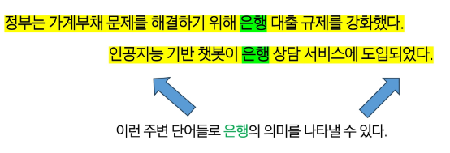

#### 워드 임베딩이란?
- 단어를 단어들 사이의 의미적 관계를 포착할 수 있는 밀집(dense)되고 연속적/분산적(distributed) 벡터 표현으로 나타내는 방법이다.
  - 원-핫 인코딩에선 은행과 금융이 완전히 독립적인(무관한) 벡터로 표현되었지만,
  - 워드 임베딩에서는 두 단어의 벡터가 공간상 서로 가깝게 위치하며, 이를 통해 의미적 유사성을 반영할 수 있다.
  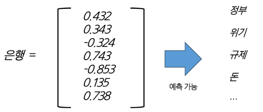

#### 대표적인 워드 임베딩 기법 - Word2Vec
- Word2Vec은 2013년 Google에서 개발한 워드 임베딩 기법이다.
- 단어의 표현을 간단한 인공 신경망을 이용해서 학습한다.
  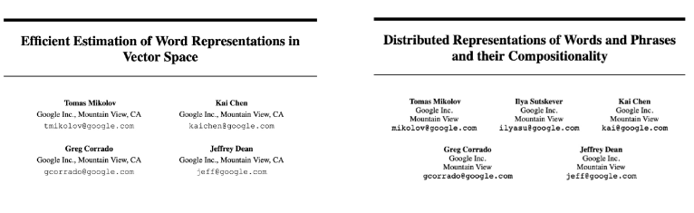

#### Word2Vec의 아이디어
- Word2Vec의 아이디어는 각 단어와 그 주변 단어들 간의 관계를 예측한다는 것이다.
- Word2Vec엔 두 가지 알고리즘이 존재한다.
  - Skip-grams(SG) 방식
    - 중심 단어를 통해 주변 단어들을 예측하는 방법이다.
    - 단어의 위치(앞/뒤)에 크게 구애받지 않는다.
  - Continuous Bag of Words(CBOW) 방식
    - 주변 단어들을 통해 중심 단어를 예측하는 방법이다.
    - 문맥 단어들의 집합으로 중심 단어를 맞춘다.

#### Skip-grams (SG) : 중심 단어를 통해 주변 단어 예측하기
- 윈도우 크기(window size) = 중심 단어 주변 몇 개 단어를 문맥으로 볼 것인가?
- 예시 (윈도우 크기 = 2)
  - 문장 : " ...problems turning into banking crises as ..."
  - 중심 단어 'banking' (위치 t)
  - 주변 단어 = {'turning', 'into', 'crises', 'as'}
    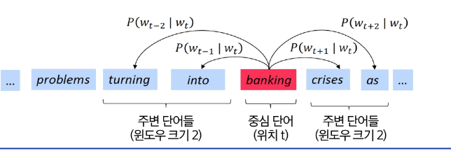

#### Continuous Bag of Words (CBOW) : 주변 단어를 통해 중심 단어 예측하기
  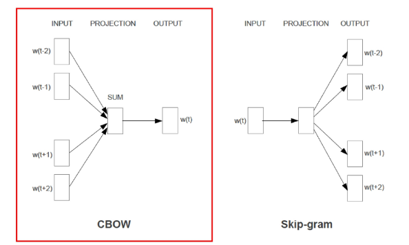

- 목표 : 주변 단어들의 집합이 주어졌을 때, 그 문맥과 함께 등장할 수 있는 단일 단어를 예측한다.
  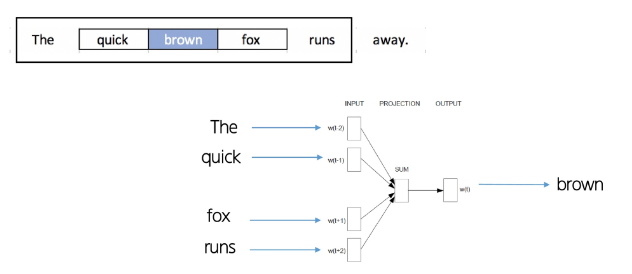

#### Skip-Gram vs. CBOW
- Skip-Gram
  - 장점
    - 적은 데이터에도 잘 동작한다.
    - 희귀 단어나 구 표현에 강하다.
  - 단점
    - 학습 속도가 느리다.
- CBOW
  - 장점
    - 학습 속도가 빠르다.
    - 자주 나오는 단어에 강하다.
  - 단점
    - 희귀 단어 표현에 약하다.

  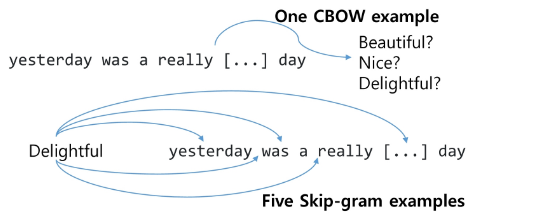

## 2. 순차적 데이터
#### 순차적 데이터란 무엇인가?
- 자연엔 수많은 순차적 데이터(Sequential Data)가 존재한다.
- 순차적 데이터란 데이터가 입력되는 순서와 이 순서를 통해 입력되는 데이터들 사이의 관계가 중요한 데이터이다.
- 예시
  - 오디오
    - 
  - 텍스트
    - 
  - 비디오
    - 

#### 순차적 데이터의 특징
- 순차적 데이터는 다른 데이터와 구별되는 특징들이 존재한다.
- 특징
    1. 순서가 중요하다.
        -  데이터의 순서가 바뀌면 의미가 달라진다.
        -  예시 : 나는 너를 사랑해 ≠ 너는 나를 사랑해
    2. 장기 의존성(Long-term dependency)
        - 멀리 떨어진 과거의 정보가 현재/미래에 영향을 준다.
        - 예시 : '여러 개의 문 중 파란 문을 열고 안으로 들어가면, 너는 (?)를 찾게 될거야.'
    3. 가변 길이(Variable length)
        - 순차 데이터는 길이가 일정하지 않고, 단어 수도 제각각이다.

#### 순차적 데이터를 처리하려면?
- 따라서, 순차적 데이터를 처리하려면 일반적인 모델들(예 : 선형 회귀, MLP 등)로는 불가능하다.
- Sequential Models이 필요하다.
  - 예시 : RNN, LSTM, Transformer 등등
    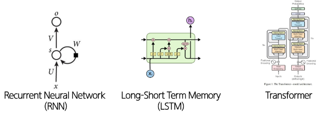

## 3. RNN
#### 전통적인 인공신경망
- 전통적인 인공신경망(MLP, CNN)들은 고정된 길이의 입력을 받아 가변 길이의 데이터를 처리하기에 적합하지 않다.
  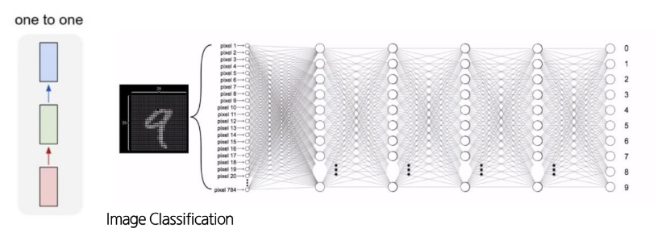

#### RNN이란?
- 하지만, RNN은 가변 길이의 입력을 받을 수 있고, 이전 입력을 기억할 수 있기 때문에, 순차적 데이터 처리에 적합한 아키텍처이다.
  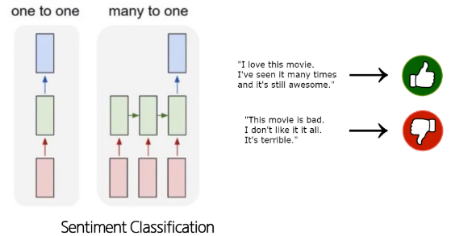
  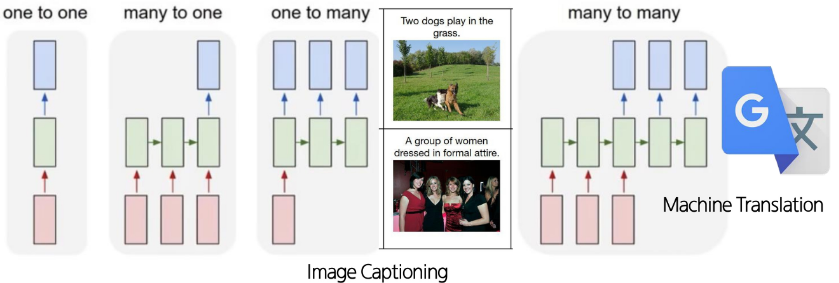

#### RNN 아키텍처 설명
- 전통적인 신경망(MLP, CNN 등)과 달리, RNN은 이전 시점의 정보를 담는 hidden state를 가지고 있다.
- 따라서, 입력 시퀀스 벡터 $ x $를 처리할 때, 각 시점마다 recurrence 수식을 적용하여 hidden state를 업데이트한다.
  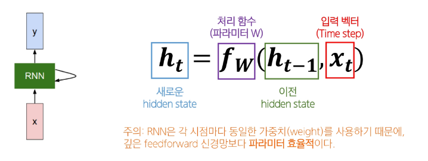

#### RNN 자세히 살펴보기
  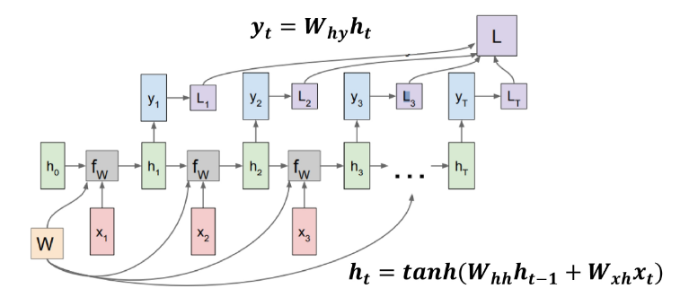

#### RNN의 특징
- RNN은 한 번에 하나의 요소를 처리하고, 정보를 앞으로 전달한다.
- 펼쳐서 보면, RNN은 각 층이 하나의 시점을 나타내는 깊은 신경망처럼 보인다.
- RNN은 hidden state를 유지하면서 가변 길이 데이터를 처리할 수 있다.
- RNN의 출력은 과거 입력에 영향을 받는다는 점에서, feedforward 신경망과 다르다.

#### RNN의 한계 : 기울기 소실(vanishing gradient) 문제
- 기울기 소실(vanishing gradient) 문제란?
  - 딥러닝에서 역전파 시 앞쪽 층으 ㅣ기울기가 0에 가까워져서 장기 의존성 학습이 어려워지는 현상
- 왜 일어날까?
    1. 역전파 과정에서 작은 값들이 게속 곱해진다.
    2. 과거 시점에서 온 오차 신호는 갈수록 더 작은 기울기를 갖게 된다.
    3. 결국 파라미터들이 장기 의존성은 학습하지 못하고, 단기 의존성만 포착하게 된다.
    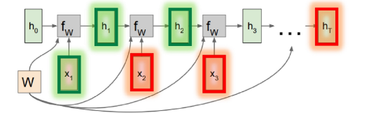

## 4. LSTM
#### LSTMs란?
- 기울기 소실 문제를 해결하기 위해, 1997년에 제안된 RNN의 한 종류
- LSTMs의 특징
  - 시점 $ t $에서 RNN은 길이가 $ n $인 벡터 hidden state $ h_t $와 cell state $ C_t $ 를 가진다.
    - Hidden state는 short-term information을 저장한다.
    - Cell state는 long-term information을 저장한다.
  - LSTMs는 cell state에서 정보를 읽고(read),지우고(erase), 기록(write)할 수 있다.

#### RNNs vs. LSTMs
  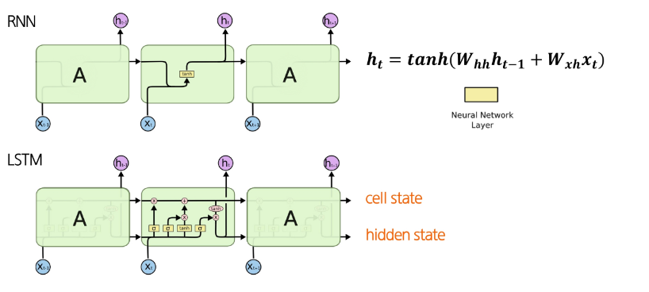

#### LSTMs
- 3가지 게이트를 통해 어떤 정보를 지우고, 쓰고, 읽을지 결정한다.
  - **Forget gate** : 이전 cell state에서 **무엇을 버리고 무엇을 유지할지** 결정
  - **Input gate** : 새 정보 중 **얼마나 cell state에 쓸지** 결정
  - **Output gate** : cell state 중 **얼마나 hidden state로 내보낼지** 결정
  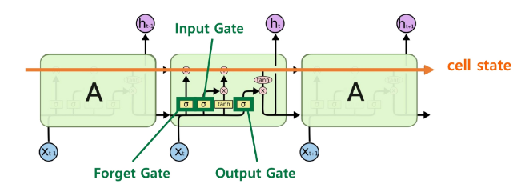

- 게이트의 동작?
  - 매 시점마다 게이트의 각 요소는 열림(1), 닫힘(0), 혹은 그 사이의 값으로 설정된다.
  - 게이트는 동적으로 계산되며, 현재 입력과 hidden state 등 문맥에 따라 값이 정해진다.
  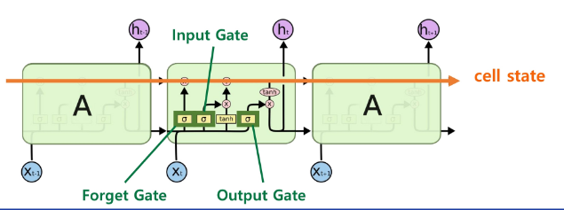

#### LSTMs - Forget gate
  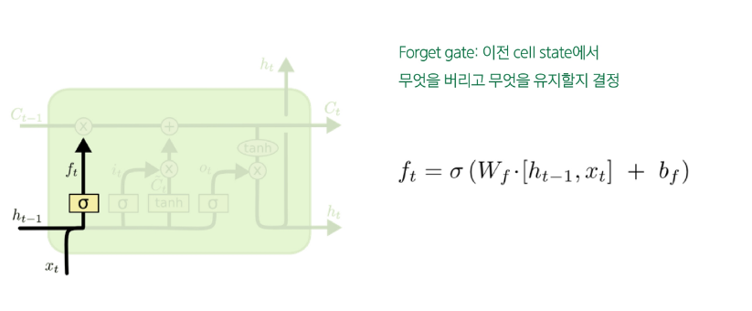

#### LSTMs - Input gate
  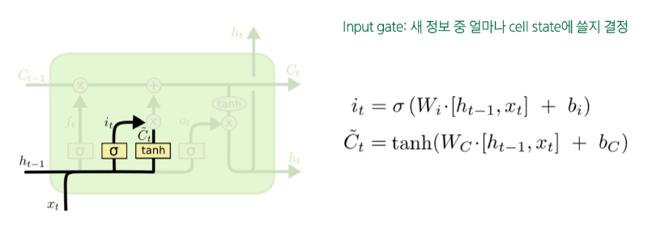

#### LSTMs - New cell content
  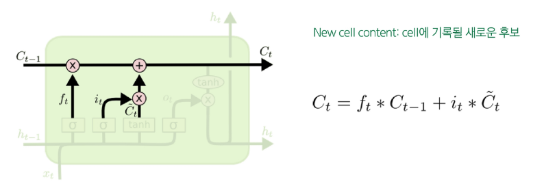

#### LSTMs - Output gate
  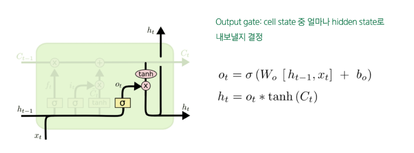
  