# Transformer

목차

1. Self-Attention
2. Transformer

### 학습 목표
- Transformer의 등장 배경과 필요성을 설명할 수 있다.
- Self-Attention의 기본 개념과 동작 원리를 이해한다.
- Transformer의 전체 구조(인코더/디코더 블록)를 설명할 수 있다.

## 0. 학습 시작(오버뷰)
#### Transformer란 무엇이며, 왜 필요한가?
- RNN의 한계와 Attention의 필요성

#### Transformer는 어떻게 작동할까?
- Self-Attention, Multi-Head Attention, Feed-Forward 구조 등

#### Transformer는 어떤 응용이 있을까?
- 번역, 요약, 대화, 대형 언어모델의 기반

## 1. Self-Attention
#### RNN이 꼭 필요할까?
- RNN은 정보를 hidden state로 전달하며 순차적 의존성을 형성한다.
- 그에 반해 Attention은 필요한 순간, 입력 전체에서 직접 정보를 전달한다.
- > RNN이 하던 '정보 전달'을 **Attention이 좀 더 효율적으로 수행할 수 있다면, 굳이 recurrence가 필요할까?**

  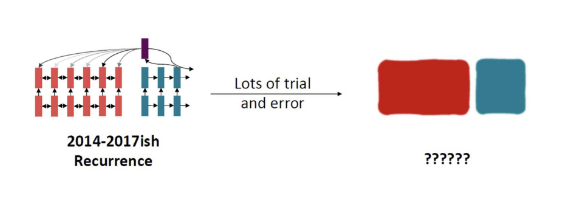

#### RNN의 한계점 1 - 장기 의존성
- RNN은 왼쪽에서 오른쪽으로 순차 전개되어, 먼 단어 싸잉 상호작용하려면 시퀀스 길이 만큼의 단계를 거쳐야 한다.
- 따라서, 길어진 단계만큼 깅루기 소실 혹은 폭발 문제가 발생해 장기 의존성을 학습하기 어렵다.
- 또한, RNN은 입력된 선형 순서를 강하게 반영되기 때문에, 언어의 비선형적 의존성을 잘 잡아내지 못한다.
  - 예시 : 그 책은 오랫동안 방치되어 먼지가 많이 쌓인 탓에 ... 매우 더러웠다
  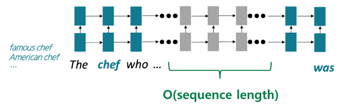

#### RNN의 한계점 2 - 병렬화
- Forward와 Backward pass 모두 시퀀스 길이 만큼의 단계가 필요하다.
- 이처럼, 순차적인 연산이 진행되기 때문에, 병렬화가 불가능하다.
- 이는, 병렬 연산에 강한 GPU 활용을 어렵게 만들며, 대규모 데이터 학습에 비효율적이다.
  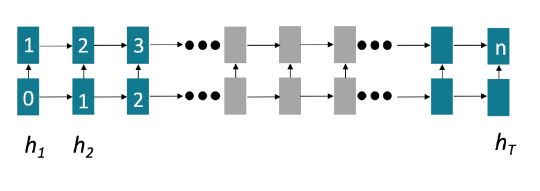

#### 그렇다면 Attention은 어떨까?
- Attention은 각 단어의 표현을 query로 두고, value 집합으로부터 필요한 정보를 직접 불러와 결합한다.
- 이러한 Attention 메커니즘을 encoder-decoder 간이 아닌, 한 문장 내부에서 적용한다면 어떨까?
- > Self-Attention

#### Self-Attention의 장점은?
1. 순차적으로 처리해야 하는 연산 수가 시퀀스 길이에 따라 증가하지 않는다.
2. 최대 상호작용 거리 = O(1) → 모든 단어가 각 층에서 직접 상호작용한다.
  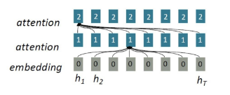

#### Seq2Seq에서의 Attention
- Attention(입력 문장 내의 단어들 | 출력 문장 내의 각 단어 'w')
  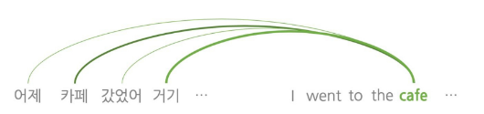

#### Self-Attention
- Attention(문장 내의 다른 단어들 | 문장 내의 각 단어 'w')
  
  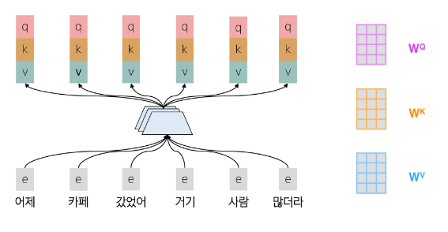
  
  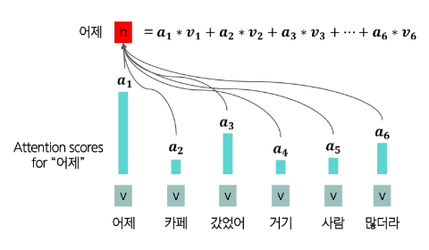
  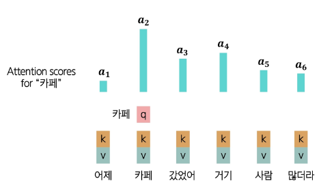
  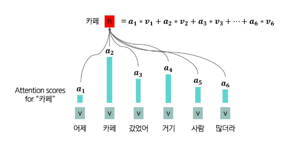
  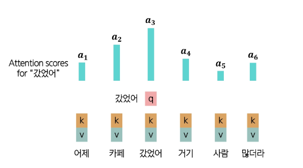

#### Self-Attention - Key, Query, Value
- Attention에서 각 단어 '$ i $'를 표현하는 Query와 Value 벡터가 있었듯이, Self-Attention에서는 각 단어 '$ i $'를 표현하는 Query, Key, Value 벡터가 존재한다.

1. 각 단어를 Query, Key, Value 벡터로 변환한다.
    - Query 벡터
      - 단어 $ i $가 다른 단어로부터 어떤 정보를 찾을지를 정의하는 벡터
    - Key 벡터
      - 단어 $ i $가 자신이 가진 정보의 특성을 표현하는 벡터
    -  Value 벡터
       -  실제로 참조되는 정보 내용을 담고 있는 벡터
  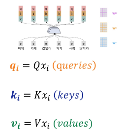

2. Query, Keys 간의 유사도를 계산해, softmax로 확률분포를 구한다.
    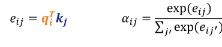

3. 각 단어의 출력을 Values의 가중합으로 계산한다.
    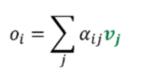
  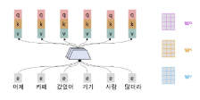

#### Self-Attention의 한계
- 이렇듯, Self-Attention은 단어 간 관계를 효율적으로 잡아내는 강력한 메커니즘이지만, 한계가 존재한다.
- 한계
    1. **순서 정보 부재** → 단어 간 유사도만 계산하기 때문에, **단어의 순서를 고려하지 않는다.**
    2. **비선형성 부족** → Attention 계산은 본질적으로 가중 평균 연산이라는 **선형 결합에 불과**하기 때문에, 복잡한 패턴이나 깊은 표현력을 담기 어렵다.
    3. **미래 참조 문제** → 언어 모델은 시퀀스를 왼쪽에서 오른쪽으로 생성해야 하지만, Self-Attention은 모든 단어를 동시에 보기 때문에, 아직 **생성되지 않아야 할 미래 단어를 참조**한다.

#### Self-Attention의 한계 해결 1 - Positional Encoding
- 순서 정보 부재 문제를 해결하기 위해, Positional Encoding이라는 기법을 사용한다.
- 각 단어 위치 $ i $를 나타내는 위치 벡터를 정의해, 단어 임베딩 값에 더해 최종 입력으로 사용한다.

- 두 가지 방법이 존재한다.
  - Sinusoidal Position Encoding
    - 서로 다른 주기의 **사인/코사인 함수를 합성** 해 위치 벡터를 만드는 방법
  - **Learned Absolute Position Embedding**
    - **위치 벡터를 모두 학습 파라미터로 설정**해 학습 과정에서 데이터에 맞춰 최적화하는 방법
  
#### Self-Attention의 한계 해결 2 - Feed-Forward Network 추가하기
- Self-Attention 연산은 비선형 변환이 없어, 복잡한 패턴 학습에 한계가 존재한다.
- 따라서, 각 단어 출력 벡터에 Feed-Forward Network (Fully Connected + ReLU 등)을 추가해 Self-Attention이 만든 표현을 깊고 비선형적인 표현으로 확장한다.
  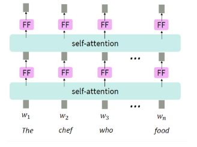

#### Self-Attention의 한계 해결 3 - Masked Self-Attention
- 단어를 생성할 때는 한 단어씩 순차적으로 미래 단어를 예측해야 하지만, Self-Attention은 기본적으로 모든 단어(미래 포함)를 동시에 참조한다.
- 따라서, Attention Score를 계산할 때, 미래 단어에 해당하는 항목을 -∞로 설정해, 계산을 수행할 때 반영되지 않도록 한다.
  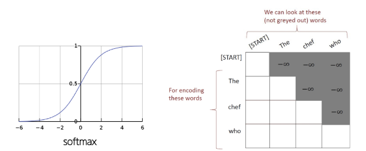

#### Self-Attention 정리
- Self-Attention은 문장 내 모든 단어가 서로 직접 상호작용하여, **1) 장거리 의존성을 효율적으로 포착**하고 **2) 병렬 처리**를 가능하게 하는 메커니즘이다.

- 한계 해결 방법
    1. 순서 정보 부재 → Positional Encoding
    2. 비선형성 부족 → Feed-Forward Network 추가
    3. 미래 참조 문제 → Masked Self-Attention
  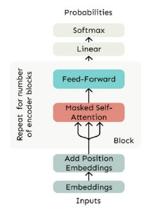

## 2. Transformer
#### Attention is All You Need
- Transformer는 2017년 Google의 'Attention Is All You Need'라는 논문에서 처음 제안된 아키텍처로, **Self-Attention을 핵심 메커니즘으로 하는 신경망 구조**이다.
  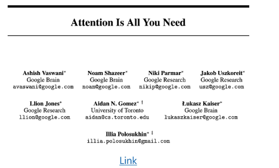

#### Transformer
- Transformer는 encoder-decoder 구조로 설계된 신경망 모델이다.
  - encoder : 입력 문장을 받아 의미적 표현으로 변환을 수행한다.
  - decoder : 인코더의 표현과 지금까지 생성한 단어들을 입력 받아, 다음 단어를 예측한다.
  - > 이 중 decoder가 언어 모델과 같은 방식으로 동작한다.
  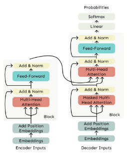

#### Multi-Headed Attention
- 문장에서 같은 단어라도 **여러 이유(문법적 관계, 의미적 맥락 등)로 다른 단어에 주목**할 수 있다.
- 하지만, 단일 Self-Attention Head로는 한 가지 관점에서의 단어 간 관계 밖에 파악할 수 없다.
- > **따라서, 여러 Attention Head를 두어 다양한 관점에서 동시에 정보를 파악**한다.
- Attention Head 1 - 단어의 문맥적 관계에 Attention
- Attention Head 2 - 단어의 시제에 Attention
- Attention Head 3 - 명사에 Attention
  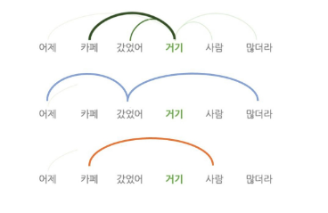

- Attention head 1 - 문법적 의존성 관계 단어들에 주목
  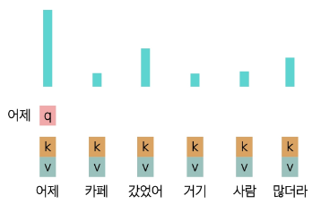

- Attention head 2 - 개체에 주목
  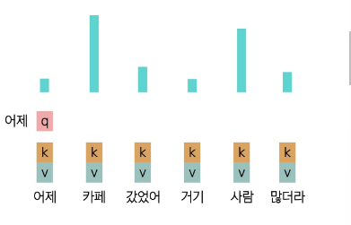

#### Scaled Dot Product
- Query와 Key의 차원이 커질수록, 두 벡터의 내적 값도 자연스럽게 커진다.
- 이 값이 너무 크면 softmax 함수가 출력이 지나치게 뾰족해져, 미세한 변화에도 큰 차이가 발생하고 gradient vanishing 문제가 생길 수 있다.
  $$ output_l = softmax(X Q_l K_l^T X^T) * XV_l $$  
  

  
    softmax([40, 50, 45]) ∽ [0.000045, 0.99326, 0.00669]
  

- 따라서, 내적 값을 그대로 사용하지 않고, 나눠주어 스케일을 조정한다.
- 이렇게 하면 값이 안정적으로 분포되어 학습이 훨씬 더 빠르고 안정적으로 진행된다.
  $$ output_l = softmax(\frac{X Q_l K_l^T X^T}{\sqrt{d/h}}) * XV_l $$

     $$ \sqrt{d/h} = 8로\quad 스케일링$$

    

  
    softmax([5.00, 6.25, 5.625]) ∽ [0.1573, 0.5489, 0.2938]
  

#### Residual Connection
- 깊은 신경망은 층이 깊어질수록 학습이 어려워진다. (Gradient vanishing / exploding)
- 따라서, 단순히 Layer의 출력만 사용한다면 정보가 소실되어, layer가 전체를 예측하는 것이 아니라, 기존 입력과의 차이만 학습하도록 하는 residual connection을 사용한다.
  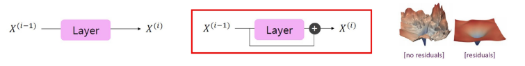

#### Layer Normalization
- 층이 깊어질수록, hidden vector 값들이 커졌다 작아졌다 하면서 학습이 불안정하다.
- Layer Normalization은 각 레이어 단위에서 hidden vector 값을 정규화해, 안정적이고 빠른 학습을 돕는다.

#### Decoder
- Transformer의 decoder는 여러 개의  decoder 블록들을 쌓아 올려서 만든 구조이다.
- 각 블록은 다음으로 구성된다:
  - **Masked Self-Attention (Multi-Head)**
    - 미래 단어를 보지 않도록 마스크를 씌운 Multi-Head Self-Attention.
  - **Add & Norm** (Residual Connection + Layer Normalization)
  - **Feed-Forward Network**
    - 각 위치 별 비선형 변환을 수행한다.
  - **Add & Norm ** (Residual Connection + Layer Normalization)
  - > 언어 모델처럼 단방향 문맥만 활용
  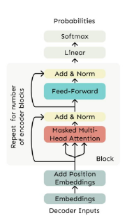

#### Encoder
- 그에 반해 Transformer의 encoder는 양방향 문맥을 모두 활용할 수 있다.
  - 입력 문장을 의미적 표현으로 변환할 수 있다.
  - 각 단어가 양방향 문맥을 모두 반영한 벡터로 인코딩된다.
- Decoder와의 차이점은 Self-Attention에서 masking을 제거한 것 뿐이다.
  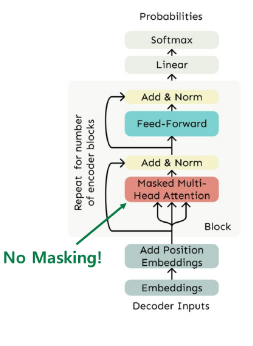

#### Encoder-Decoder
- 기계 번역에서 Seq2Seq 모델을 사용했던 것처럼, Transformer에서도 이해를 위한 encoder와 생성을 위한 decoder로 이뤄진 encoder-decoder 구조로 채택한다.
- decoder는 단순 Self-Attention만 하는 것이 아니라, encoder의 출력 표현을 참조하는 **Cross-Attention**을 추가하여 입/출력을 연결한다.

#### Cross-Attention
- **Cross-Attention**을 수행할 때는 Self-Attention과는 다르게 Query는 decoder에서, Key와 Value는 encoder에서 가져온다.
  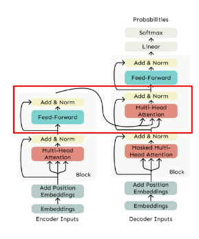

#### Transformer의 놀라운 결과
- Neural Machine Translation task에서 당시 최고 성능을 달성했을 뿐 아니라, 가장 효율적인 학습으로 비용까지 절감할 수 있었다.
  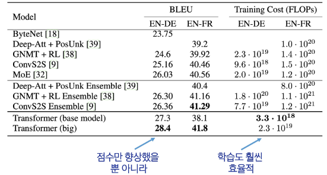

#### Transformer와 사전학습(pretraining)
- Transformer의 등장은 대부분의 최신 모델들이 성능 향상을 위해 **사전학습(pretraining)**을 결합하도록 했다.
- 또한, **뛰어난 병렬 처리 능력** 덕분에 대규모 사전학습에 적합하여 NLP의 **표준 아키텍처**로 자리 잡았다.
  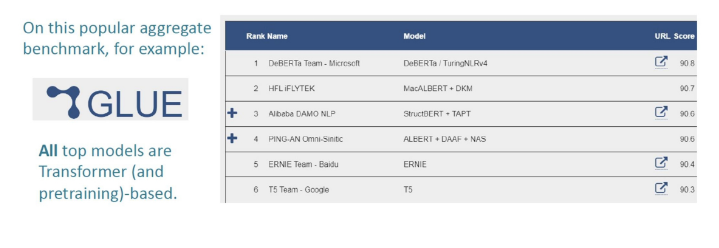