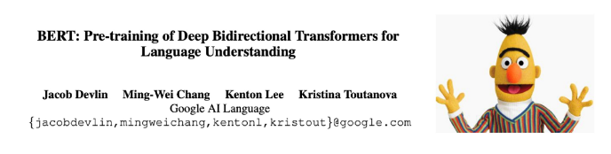

# 사전 학습 기반 언어 모델

목차

1. 사전학습이란?
2. Encoder 모델
3. Encoder - Decoder 모델
4. Decoder 모델
5. In-Context Learning

### 학습 목표
- 사전학습(Pretraining)의 개념과 필요성을 설명할 수 있다.
- Encoder 기반 모델(예 : BERT)의 구조와 주요 활용 사례를 이해한다.
- Encoder - Decoder 기반 모델 (예 : T5)의 특징과 응용 분야를 설명할 수 있다.
- Decoder 기반 모델 (예 : GPT)의 구조와 강점을 이해한다.
- In-Context Learning (ICL)이 등장하게 된 배경과 그 의미를 설명할 수 있다.
- ICL 능력을 끌어 올리기 위한 대표적인 prompting 기법 (CoT, Xero-shot CoT)을 이해한다.

## 0. 학습 시작(오버뷰)
#### 사전학습(Pretraining)이란 무엇인가? 왜 중요한가?
- 대규모 데이터 기반의 사전학습 개념과 필요성

#### 대표적 모델 유형은 어떻게 구분되는가?
- Encoder 기반, Encoder - Decoder 기반, Decoder 기반

#### 각각 어떤 모델이 존재하는가?
- BERT, T5, GPT 등 주요 모델 소개

#### In-Context Learning과 발전된 prompting 기반은 무엇인가?
- ICL의 등장 배경과 의미
- Chain-of-Thought, Zero-shot CoT 등 대표 기법

## 1. 사전학습이란?

#### 사전학습이란?
- **사전학습**이란 대규모 데이터셋을 이용해, 모델이 **데이터의 일반적인 특징과 표현을 학습하도록 하는 과정**이다.
- 특히 언어 모델은, **인터넷의 방대한 텍스트(웹 문서, 책, 뉴스 등)을 활용해 비지도학습 방식으로 학습**되어, 일반적인 언어 패턴, 지식, 문맥 이해 능력을 습득한다.
  

#### 사전학습의 고나점에서 워드 임베딩 vs. 언어 모델
- 워드 임베딩의 경우 사전학습을 통해 단어의 의미를 학습하지만 한계가 존재한다.
    1. 다운스트림 태스크(예 : 텍스트 분류)들에 적용하기엔 학습되는 데이터의 양이 적어, 언어의 풍부한 문맥 정보를 충분히 학습할 수 없다.
    2. 연결된 네트워크가 무작위 초기화되어 학습 효율이 낮고, 많은 데이터와 시간이 필요하다.
  

- 언어 모델의 경우 모델 전체를 사전학습을 통해 학습하기 때문에, 강력한 NLP 모델을 구축하는 데에 이점이 있다.
    1. 언어에 대한 표현 학습용으로 적합하다.
    2. 파라미터 초기화의 관점에서 효과적이다.
    3. 언어에 대한 확률 분포 학습을 통해 샘플링, 생성에 사용할 수 있다.
  

#### 언어모델의 사전학습
- 과거 단어들이 주어졌을 때, 다음 단어의 확률분포를 모델링하는 방법을 배움으로서, 사전학습을 수행할 수 있다.
- 인터넷의 대규모 텍스트 코퍼스에서 언어모델링 학습을 수행 후 학습된 네트워크 파라미터를 저장해, 다양한 다운스트림 태스크에 활용한다.

#### 사전 학습 → 파인튜닝(fine-tuning) 패러다임
- 사전학습을 통해, 언어 패턴을 잘 학습한 파라미터로 초기화해 NLP application 성능을 향상시킬 수 있다.
  

#### 사전학습 모델들의 역사
  

## 2. Encoder 모델
#### Encoder 모델

    
  - **Encoders**
    - 양방향 문맥을 활용할 수 있다.
    - 학습하기 위한 훈련 방법은?

  
- **Encoder - Decoders**
  - Encoder와 Decoder의 장점을 모두 결합했다.
  - 효과적인 사전학습 방법은?

  
- **Decorders**
  - 전형적인 언어 모델 구조.
  - 문장 생성에 유용 (미래 단어 참조 불가)

#### Encoder 모델의 사전 학습
- Encoder 모델은 양방향 문맥을 모두 활용하기 때문에, 전통적인 언어모델과는 차이점이 있다.
- 따라서, Encoder 모델의 사전 학습을 위해선 입력 단어의 알부를 [MASK] 토큰으로 치환해, 모델이 이 [MASK] 자리에 올 단어를 예측하도록 학습하는 방법을 사용할 수 있다.
- 이를 Masked Language Model이라 하며, 대표적인 모델이 BERT이다.
  

#### BERT
- BERT는 2018년 Google에서 공개한 transformer 기반의 모델로, Masked LM방법으로 사전학습을 수행했다.
  

#### BERT의 학습 방법 1 - Masked LM
- 학습 방식은 다음과 같다 :
  - 입력 토큰의 15%를 무작위로 선택한다.
  - [MASK] 토큰 치환(80%), 랜덤 토큰 치환(10%), 그대로 두기(10%)
- 모델이 마스크된 단어에만 집중하지 않고, **다양한 문맥 표현을 학습**해 더 강건한(robust) 표현을 학습할 수 있도록 했다.
  
  

#### BERT의 학습 방법 2 - Next Sentence PRediction (NSP)
- 또한, BERT는 입력을 두 개의 연속된 텍스트로 받아, **두번째 문장이 첫번째 문장의 실제 다음 문장인지 여부를 예측**하는 Next Sentence Prediction (NSP)을 수행했다.
  

#### BERT의 학습 방법 2 - Next Sentence Prediction (NSP)
- NSP를 통해 문장 간 관계를 학습하여 문맥적 추론 및 문장 수준 이해 태스크에 도움이 되도록 설계되었다.
- 예시 :
  - 자연어 추론(Natural Language Inference)
  - Paraphrase detection
  - 질의응답 (Question Answering)
  
  

#### BERT의 다운스트림 태스크
- BERT는 이렇게 MLM과 NSP 두 가지 태스크를 동시에 학습한다.
- [CLS] 토큰은 NSP 태스크 용으로 학습되며, 다른 토큰들은 MLM 태스크 용으로 학습된다.
  

#### BERT의 다운스트림 태스크 - Sentence Level
- 두 문장 관계 분류 태스크 :
  - MNLI
    - 전제(Premise) : 여러 남자들이 뛰고 있는 축구 경기
    - 가설(Hypothesis) : 몇몇 남자들이 스포츠를 하고 있다.
    - 분류 : { 함의(Entailment), 모순(Contradiction), 중립(Neutral)}

  - QQP
    - Q1 : 주식 투자 방법은 어디서 배울 수 있나요?
    - Q2 : 주식에 대해 더 배우려면 어떻게 해야 하나요?
    - 분류 : { 중복(Duplicate), 비중복(Not Duplicate)}
  

- 단일 문장 분류 태스크:
  - SST2
    - 문장 : 이 영화에는 재미있는 요소들이 풍부하다.
    - 분류 : {긍정(Positive), 부정(Negative)}
  

#### BERT의 다운스트림 태스크 - Token Level
- QA 태스크:
  - SQuAD
    - 질문 : 뉴욕 자이언츠와 뉴욕 제츠는 뉴욕시의 어느 경기장에서 경기를 하나요?
    - 문맥 : ... 두 팀은 뉴저지 이스트 러더퍼드에 있는 Metlife Stadium에서 홈 경기를 한다. ...
    - 정답 : Metlife Stadium
  

- 개체명 인식(Named Entity Recognition, NER):
  - CoNLL 2003 NER
    - 문장 : John Smith lives in New York
    - 라벨:
      - John → B-PER (사람 이름의 첫 단어)
      - Smith → I-PER (사람 이름에 속하는 나머지 단어)
      - lives → O (개체명이 아닌 단어)
      - In → O (개체명이 아닌 단어)
      - New → B-LOC (장소 이름의 첫 단어)
      - York → I-LOC (장소 이름에 속하는 나머지 단어)
  

#### BERT의 결과
- BERT는 다양한 태스크에 적용 가능한 범용성을 보여주었으며, fine-tuning을 통해 여러 NLP 과제에서 새로운 최첨단(SOTA) 성능을 이끌어냈다.
  

#### BERT의 결과
- Layer의 수, hidden state의 크기, attention head의 수가 클수록 성능이 향상되는 경향을 보였다.
  

#### BERT의 한계
- 인코더 기반 모델인 BERT는 주어진 입력을 잘 이해하도록 학습되지만, 시퀀스를 생성해야 하는 태스크에는 적합하지 않다. (예시 : 기계 번역, 텍스트 생성 등)
- 생성 태스크에서는 autoregressive하게, 즉 한 번에 한 단어씩 생성해야 하는데, 이를 자연스럽게 수행하지 못하기 때문에, 생성 태스크엔 디코더 기반 모델을 주로 사용한다.
  

## 3. Encoder-Decoder 모델
#### 인코더 - 디코더 모델

    
  - **Encoders**
    - 양방향 문맥을 활용할 수 있다.
    - 학습하기 위한 훈련 방법은?

  
- **Encoder - Decoders**
  - Encoder와 Decoder의 장점을 모두 결합했다.
  - 효과적인 사전학습 방법은?

  
- **Decorders**
  - 전형적인 언어 모델 구조.
  - 문장 생성에 유용 (미래 단어 참조 불가)

#### T5(Text-to-Text Transfer Transformer)
- T5는 2019년 Google Research에서 공개한 모델로 Transformer Encoder-Decoder 구조 기반의 모델이다.
- 모든 태스크를 Text-to-Text 포맷으로 변환해 하나의 모델로 학습했다.
  

#### T5의 학습 방법 - Span Corruption
- Encoder - Decoder 구조에서는 Encoder가 입력 문장을 모두 보고, 그 정보를 바탕으로 Decoder가 출력을 생성한다.
- 따라서 학습을 위해, Span Corruption이라는 과정을 수행한다.
- 과정 :
  - 입력 문장에서 연속된 토큰을 무작위로 선택해 제거
  - 제거된 부분을 특수 placeholder 토큰으로 치환 (예 : `<X>`, `<Y>`)
  - 디코더는 이 placeholder에 해당하는 원래 span을 복원하도록 학습
  - > 이를 통해 언어 모델링처럼 훈련을 수행할 수 있다.
  

#### T5의 다운스트림 태스크
- T5의 NLU(GLUE, SuperGLUE), QA(SQuAD), 요약(CNNDM), 번역(En → De, En → Fr, En → Ro)등의 태스크에서 모두 좋은 성능을 보여 범용적으로 활용될 수 있는 모델임을 입증하였다.
  

## 4. Decoder 모델
#### Decoder 모델

    
  - **Encoders**
    - 양방향 문맥을 활용할 수 있다.
    - 학습하기 위한 훈련 방법은?

  
- **Encoder - Decoders**
  - Encoder와 Decoder의 장점을 모두 결합했다.
  - 효과적인 사전학습 방법은?

  
- **Decorders**
  - 전형적인 언어 모델 구조.
  - 문장 생성에 유용 (미래 단어 참조 불가)

#### Finetuning Decoder
- Transformer의 Decoder는 사전학습 단계에서 다음 단어 예측(Next Token Prediction)을 학습한다.
- **생성 태스크에 활용할 때**:
  - 사전학습 때와 동일하게 다음 단어 예측 방식으로 fine-tuning한다.
  - 따라서, decoder는 대화나 요약 태스크 등 출력이 시퀀스인 태스크에 자연스럽게 적합한다.
    
- **분류 태스크에 활용할 때**:
  - 마지막 hidden state 위에 새로운 linear layer를 연결해 classifier로 사용한다.
  - 이때, linear layer는 아예 처음부터 다시 학습해야 하며, fine-tuning 시 gradient가 decoder 전체로 전파된다.
    

#### GPT-1
- GPT-1은 2018년 OpenAI에서 공개한 Transformer 기반의 Decoder 모델이다.
- Autoregressive LM(왼쪽 → 오른쪽 단어 예측) 방식으로 사전학습 되었다.
  

#### GPT-1의 fine-tuning 방법(분류 태스크)
- GPT-1은 다음 단어 예측이라는 언어모델의 학습 목표를 최대한 유지하면서, fine-tuning을 수행했다.

- NLI (두 문장을 입력 받아 관계를 함의(entailment) / 모순(contradiction) / 중립(neutral) 중 하나로 분류):
  - 전제(Premise) : The man is in the doorway
  - 가설(Hypothesis) : The person is near the door.
    → Entailment

- 입력 토큰에 특수한 토큰([START], [DELIM], [EXTRACT])을 붙여 분류 문제를 처리했고, [EXTRACT] 위치의 hidden state에 classifier를 연결해 사용했다.

*[START] The man is in doorway [DELIM] The person is near the door [EXTRACT]*

#### GPT-1의 fine-tuning 방법 (분류 태스크)
  

#### GPT-1의 결과
- GPT-1은 생성 태스크를 잘 수행했을 뿐만 아니라, 태스크 별 fine-tuning을 통해 분류/추론 등 이해 중심 태스크에서도 우수한 성능을 보였다.
  

#### GPT-2
- GPT-2는 GPT-1의 확장 버전으로 2019년 OpenAI에서 공개된 모델로, GPT-1에 비해 더 많은 데이터와 더 큰 parameter size로 학습되었으며, 이를 통해 **자연스러운** 텍스트 생성 **능력을 보여주었다**.
  

## 5. In-Context Learning
#### GPT-3
- GPT-3는 2020년 OpenAI에서 공개된 모델로, GPT-2에서 모델의 parameter size를 키워 (1750억개), 별도의 파인 튜닝 없이 컨텍스트 안의 예시만 보고도 새로운 태스크를 수행할 수 있게 되었다.
- 이런 능력을 In-Context Learning이라고 한다.
  

#### GPT-3 - In-Context Learning
- 모델이 예시와 함께 어떤 태스크를 할 지 지정해주면, 모델이 그 패턴을 따라가는 식으로 동작하면서, 완벽하진 않지만 그럴듯하게 태스크를 수행하는 모습을 보인다.
- 입력 :
  - **'thanks → merci
     hello → bonjour
     mint → menthe
     otter →'**

- 출력 :
  - **loutre...**
  
  

- 이러한 능력은 모델의 크기, 즉 **parameter size가 커질수록 더 강력**하게 나타났으며, zero-shot, one-shot, few-shot 모두에서 일관된 성능 개선이 관찰되었다.
  

- 또한, 모든 parameter size의 모델에서, **shot의 수가 많을수록 태스크 수행 성능이 향상**되었다.
- Zero-shot < One-shot < Few-shot
  

#### Chain-of-Thought prompting
- In-Context Learning의 발견으로 인해, Prompt의 중요성이 대두되었다.
- 하지만 단순한 Few-shot prompting만으로는, 여러 스텝을 거쳐야 하는 문제들을 풀기 어려웠는데, 이를 해결하기 위해 Chain-of-Thought (CoT) prompting 방식이 등장했다.
- CoT prompting은 모델이 문제 해결 과정에서 논리적인 사고 단계를 거쳐 최종 답을 도출하도록 유도하는 prompting 기법이다.
  
  

- **CoT prompting**은 일반적인 prompt 방식보다 **훨씬 우수한 성능**을 보이며, 새로운 SOTA(State-Of-The-Art) 성과를 달성하였다.
- 심지어, **fine-tuning을 수행한 모델들보다도 더 좋은 성능**을 보였다.
  

- Zero-Shot Chain-of-Thought prompting
  - 하지만, 기존 CoT Prompting은 few-shot 예시가 필요하다. 예시가 없을 경우, 추론 과정이 나타나지 않아 성능 저하가 발생하게 된다.
  - 이를 보완하기 위해, 질문 뒤에 'Let's think step by step'이라는 한 문장을 추가해, 모델이 스스로 추론 단계를 생성하도록 유도하는 Zero-Shot CoT prompting 방법이 등장했다.
  

- Zero-Shot CoT prompting을 통해, 별도의 예시 없이도 Few-Shot CoT에 견줄 만한 성능을 달성하였다.
  