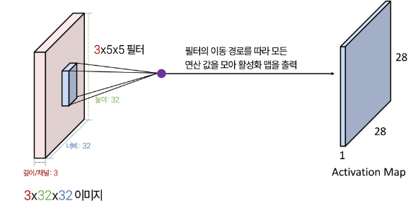
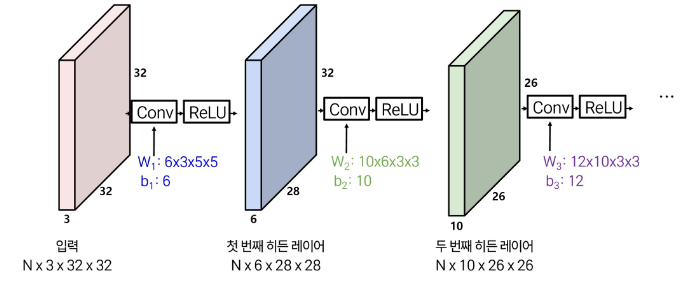
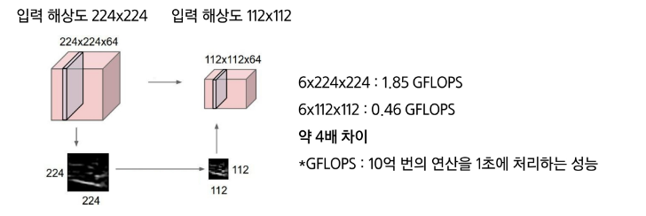
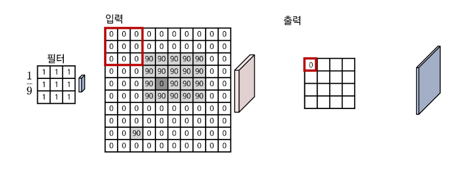
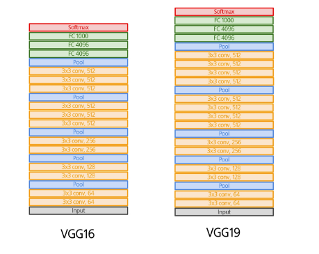

# 딥러닝 및 이미지 모델 - '1차시 : 이미지 딥러닝 모델'

### 학습 목표
- 이미지 기반 학습 모델의 구조와 작동 방식을 이해합니다.
- 대표적 CNN 기반 이미지 모델의 변천사를 배웁니다.
- 이미지 분류 문제에서 실습을 통해 주요 이미지 모델을 적용해봅니다.

## 0. 학습 시작(오버뷰)
#### CNN 모델의 기본 구조는 무엇이며, 왜 이미지 과업에서 중요한가?
- CNN 모델의 기우너 및 모델 주요 모듈 소개

#### CNN의 단위 연산과 디자인 철학은 어떻게 발전했을까
- 계층 깊이, 스케일, 학습 방법, 경량화

#### CNN 기반 주요 모델은 어떻게 변화해왔고, 왜 중요한가?
- 깊이와 효율성을 동시에 높이는 방향으로 개선

#### 산업 현장 사례
- 금형 표면 스크래치 검출
- 식품/의약품의 이물질 검출
- PCB 불량 자동 판정
  - 부품과 기판 사이의 접합이 불완전한 **냉땜**, 표면에 남은 **플럭스 잔여물**, 납땜부 미세 **크랙** 등 불량 검출
  

#### 내 일상 속에서 찾아볼 수 있는 사례
- 성동구, 픽토그램 활용 '안심우회전시설' 첫 설치
- 인공지능(AI) 카메라를 이용하여 차량, 보행자 등을 실시간으로 감지
- 상황에 맞게 움직이는 픽토그램을 모니터로 표출하는 방식으로 교통사고를 효율적으로 예방
  

## 1. CNN 살펴보기
### 1-1. CNN vs. FCN
#### 완전 연결층(Fully-Connected Layer)
- 입력을 받아서 출력으로 변환하는 신경망의 기본 모듈
- FCN 변환 예시
  - 입력 : 이미지가 32 x 32 x 3인 고차행렬이라고 가정 (이미지의 높이, 너비가 각각 32픽셀, RGB값 3개를 의미하며 RGB값은 0~255 사이)
  이미지의 모든 화소를 나열하여 1차원 벡터로 만들어 입력 데이터로 받는다.
  - 출력 : 10 x 1차원 벡터
  - 모델 상수 : 
    - 모델이 학습해야 하는 파라미터(parameter)
    - 상기 입출력 시, 모델 상수 W는 10 x 3072로 입력의 모든 값이 출력에 미치는 영향을 나타냄
  

#### 합성곱 레이어(Convolution Layer)
- 입력 이미지를 필터와 연산하여 특징 맵(feature map)을 뽑아내는 모듈
- 1차원 구조로 변환하는 FCN과 달리 3차원 구조를 그대로 보존하면서 연산
  

- Convolution(컨볼류션) : 필터를 이미지 상에서 **이동**시키면서 **내적**을 반복 수행, 내적으로 구한 모든 값을 출력 제공
  
  
  
  

- 예 : 박스필터
  
  
  
  
  
  
  
  
  

- 입력 이미지를 필터와 연산하여 특징 맵(feature map)을 뽑아내는 모듈
  
  - 입력대비 출력의 공간 해상도가 줄어듬. (32→28)
  - 출력 해상도는 입력 해상도 - 필터 해상도 + 1로 도출
  - ex) 32 - 5 + 1 = 28

- 출력 해상도 = 입력 해상도 - 필터 해상도 + 1
  ex) 8 = 10 - 3 + 1
  

  
  
  
  

### 1-2. 모델 구조 - 중첩
#### 합성곱 레이어
- 모델 상수(파라미터)를 증가시키면?
  

  - 어차피 Linear classifier인데 꼭 더 쌓아야 할까요?
    - $ W_all = W_3 W_2 W_1 $

  

  

  

  

  

  

  

  

  
  
  

  

  

  

  

  

  

  
  
  
  
  
  
  
  
  
  
  

  
  

  
  

  

  

  

  

  

  

  

  

  

  

  

  

  
  

  

  

  

  

  

  

  

  

  

  

  

