# 자연어 생성 모델 (Seq2Seq, Attention)

 목차 </sumamry>

1. 언어 모델이란?
2. Seq2Seq
3. Attention

### 학습 목표
- 언어 모델의 개념과 역할을 설명할 수 있다.
- 언어 모델이 문맥을 바탕으로 단어의 확률을 예측하는 방식을 이해한다.
- Seq2Seq 구조의 기본 아이디어(인코더-디코더)를 설명할 수 있다.
- Attention 메커니즘의 개념과 필요성을 설명할 수 있다.

## 0. 학습 시작(오버뷰)
#### 언어 모델이란 무엇일까?
- 언어 모델의 정의와 역할
- 단어 예측을 통한 문맥 이해

#### Seq2Seq은 어떻게 작동할까?
- 인코더-디코더 구조
- 입력과 출력 길이가 다른 시퀀스 처리

#### Attention은 왜 필요할까?
- Bottleneck problem 해결
- 중요한 단어에 집중하는 메커니즘

## 1. 언어모델이란?
#### 언어모델이란?
- 언어모델이란 인간의 두뇌가 자연어를 생성하는 능력ㅇ르 모방한 모델이다.
  - 단어 시퀀스 전체에 확률을 부여하여 문장의 자연스러움을 측정한다.
  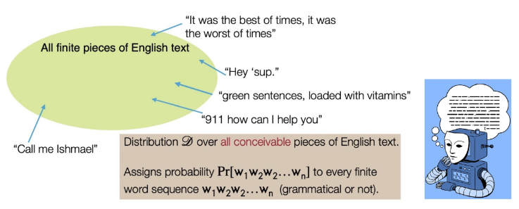

- 한 문장의 확률은 각 단어의 조건부 확률들의 곱으로 표현할 수 있다.
  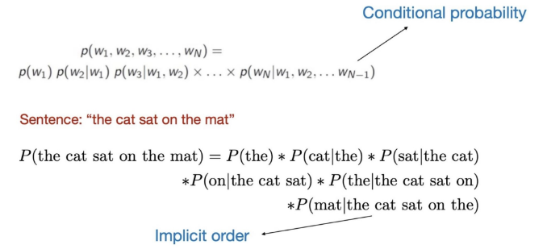

#### 일상 속의 언어모델
  
  

#### 대표적인 언어모델 - N-gram 언어모델
`The students opened their ______`
- n-gram이란, 연속된 n개의 단어 묶음을 말한다.
  - unigrams : 'The', 'students', 'opened', 'their'
  - bigrams : 'The students', 'students opened', 'opened their'
  - trigrams : 'The students opened', 'students opened their'
  - four-grams: 'The students opened their'
- 다양한 n-gram이 얼마나 자주 등장하는지 통계를 수집하고, 이를 활용해 다음 단어를 예측한다.

- 예시 : 4-gram 언어모델
  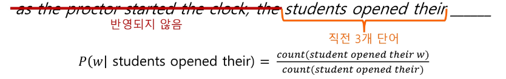
  
- 말뭉치 정보
  - 'students opened their' - 1000번 등장
  - 'students opened their books' - 400번 등장
    - > $ P( $ $ books $$ |\, students \quad opened\quad  their) = $  $ 0.4$ 
  - 'students opened their exams' - 100번 등장
    - > - > $ P( $ $ exams $$ |\, students \quad opened\quad  their) = $  $ 0.1$ 

#### 언어모델 사용 예시 : Statistical Machine Translation
- 1990년부터 2010년까지는 Machine Translation을 통계학적으로 접근했다.
- 예시 : 한국어 → 영어
  - 한국어 문장 x가 주어졌을 때, 가장 잘 맞는 영어 문장 y를 찾아야 한다.
    $$ argmax_y P(y|x) $$

  - Bayes Rule을 이용해, 식을 두 부분으로 쪼개어 번역모델과 언어모델로 나누는 방법을 사용했다.
  

- 하지만, SMT에는 한계가 존재했다.
  - 구조적 복잡성
  - 많은 수작업
  - 언어 별 자원 구축 필요
  - > **유지 및 확장에 어려움 존재**
- 이런 한계로 인해, 이후의 기계 번역 연구는 Neural Machine Translation (NMT)으로 넘어가게 되었다.

## 2. Seq2Seq
#### Neural Machine Translation
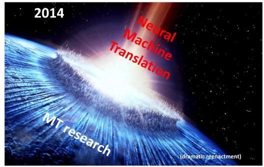

#### Neural Machine Translation이란?
- Neural Machine Translation 이란 인공 신경망을 이용해 기계 번역을 수행하는 방법이다.
- 이 때 사용되는 신경망 구조를 sequence-to-sequence (Seq2Seq)이라 하며, 두 개의 RNNs으로 이루어진다.
  - 2014년 Google의 'Sequence to Sequence Learning with Neural Networks'라는 논문에서 처음 소개되었다.
  

#### Translation이 어려운 이유
- 번역 문제는 **입력과 출력의 길이가 다를 수 있다**.
  - 영어 : the black cat drank milk (5개의 단어)
  - 프랑스어 : le chat noir a bu du lait (7개의 단어)
  - > 따라서 ,NMT에서는 길이가 다른 시퀀스 간의 매핑을 처리할 수 있어야 한다.

#### Seq2Seq의 아이디어
- 2개의 LSTM을 이용하자
  - 한 LSTM은 입력 시퀀스를 한 타임스텝씩 읽어 고정된 차원의 큰 벡터 표현을 얻기 (**Encoder**)
  - 다른 LSTM은 앞에서 얻은 벡터로부터 출력 시퀀스를 생성하기 (**Decoder**)

#### Seq2Seq Architecture
- Encoder는 입력 문장에 담긴 정보를 인코딩한다.
- Decoder는 인코딩된 정보를 조건으로 하여 타겟 문장(출력)을 생성한다.
  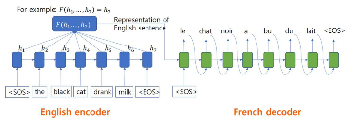

#### Seq2Seq의 다양한 적용
- Seq2Seq 구조는 기계번역 외에도 다양한 태스크에 적용할 수 있다.
  - 🗒️ 요약 : **긴 길이의 문서**를 읽고, **짧은 길이의 문장**으로 요약된 텍스트를 출력하는 태스크
  - 💬대화 : **사용자의 발화**를 기반으로, **맥락에 맞는 대답(출력 텍스트)**을 생성하는 태스크
  - 💻 코드 생성 : **자연어**로 작성된 설명 혹은 명령어를 입력 받아, 그에 대응하는 **프로그래밍 코드 혹은 쿼리**를 출력하는 태스크

#### Seq2Seq 학습 수행
- Seq2Seq 모델은 인코더와 디코더가 하나의 통합 네트워크로 연결되어 있다.
- 디코더에서 발생한 오차는 역전파 과정을 통해 입력을 처리한 인코더까지 전달되어 전체 네트워크가 End-to-End로 동시에 최적화된다.
  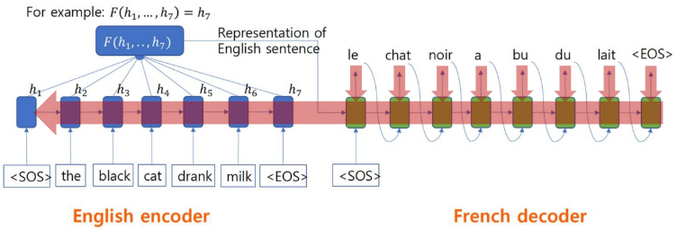

#### Seq2Seq 학습 수행 (Teacher Forcing)
- 학습 초반에는 모델의 예측 능력이 떨어지기 때문에 학습이 불안정할 수 있다.
- Teacher Forcing이란?
  - 모델이 스스로 예측한 단어 대신 정답 단어를 디코더 입력으로 강제로 넣어줌으로써 훨씬 안정적이고 빠르게 학습을 수행하는 방법이다.
  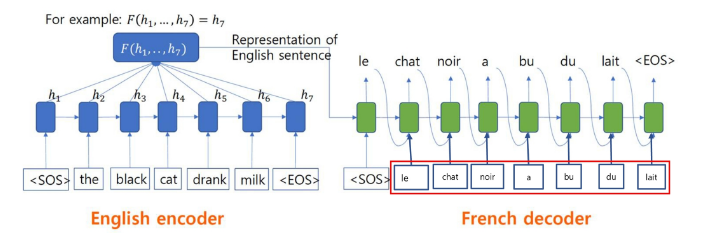

#### Seq2Seq2의 토큰 출력방법 (Greedy Inference)
- 토큰을 출력하는 방법 중 하나로, 각 단계에서 **가장 확률이 높은 단어를 선택**합니다.
- 한계
  - 되돌리기가 불가능합니다.
  - 예시 : `le____` → le chien ____ → ...
    - 오답! 하지만 되돌아갈 방법이 없음...
      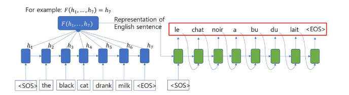

#### Seq2Seq의 토큰 출력 방법 (Beam Search)
- Beam Search
    1. 매 단계마다 k개의 가장 유망한 후보 유지
    2. 후보가 `<EOS>`에 도달하면, 완성된 문장으로 리스트 추가
    3. `<EOS>` 문장이 충분히 모이면 탐색 종료
    4. 각 후보들의 점수를 로그 확률의 합으로 구해 최종 선택
      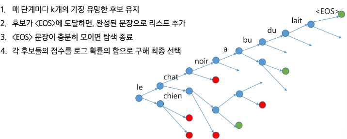

## 3. Attention
#### Seq2Seq의 한계 : the bottleneck problem
- Bottleneck problem이란?
  - 인코더는 입력 문장 전체를 하나의 벡터로 요약하는데, **마지막 hidden state에 문장의 모든 의미 정보가 담긴다.**
  - 고정 길이 벡터 하나에 모든 문장의 의미를 압축하다 보니 정보 손실이 생길 수 있는데, 이를 bottleneck problem이라고 한다.
  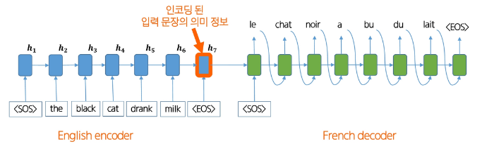

#### Attention의 인사이트
- Attention은 디코더가 단어를 생성할 때, 인코더 전체 hidden state 중 필요한 부분을 직접 참조할 수 있도록 한다.
- 즉, 매 타임스텝마다 '어떤 단어/구절에 집중할지'를 가중치로 계산해, bottleneck 문제를 완화했다.

  

#### Attention
  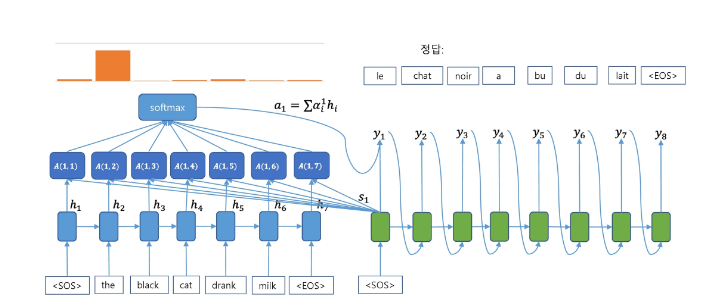
  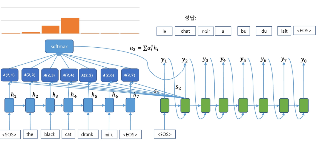
  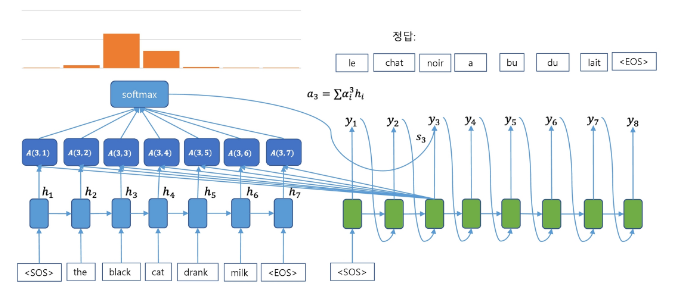

#### Attention의 효과
- Attention mechanism은 많은 장점이 존재한다.
    1. **NMT 성능 향상**
        - 디코더가 소스 문장 전체가 아닌, 필요한 부분에만 집중할 수 있기 때문이다.
    2. **Bottleneck Problem 해결**
        - 디코더가 인코더의 모든 hidden states에 직접 접근할 수 있다.
    3. **Vanihing Gradient Problem 완화**
        - Attention은 멀리 떨어진 단어도 직접 연결할 수 있게 해준다.

  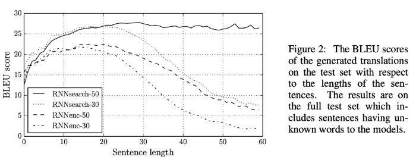
  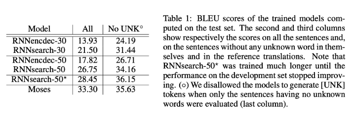

#### Attention의 효과 : 해석 가능성(Interpretability)
- Attention 분포를 보면, decoder가 어떤 단어를 생성할 때, 입력 문장의 **어느 부분에 집중했는지 확인할 수 있다.**
- 즉, 모델이 내부적으로 참고한 근거를 사람이 파악할 수 있음
- > **모델의 의사결정 과정을 해석할 수 있는 단서**

#### Attention의 효과 : 정렬(Alignment)
- 기계번역에서는 전통적으로 단어 alignment 모델을 따로 학습해야 한다.
- 하지만, attention을 통해 decoder가 필요한 입력 단어에 자동으로 집중하기 때문에, **단어와 단어 간의 매핑 관계를 자연스럽게 학습**한다.
  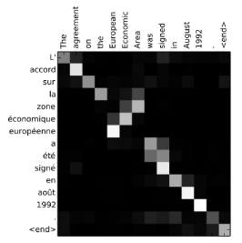

#### Attention : Query와 Values
- Seq2Seq에서 attention을 사용할 때, 각 decoder의 hidden state와 모든 encoder의 hidden states 간의 관계를 Query와 Values의 관계로 볼 수 있다.

- 이 관점에서 Attention 과정을 정리해보면:
    1. Query와 Values 사이 유사도 점수(score) 계산 (예: dot-product, multiplicaiton, additive 등)
    2. Softmax를 통해 확률 분포(attention distribution) 얻기
    3. 분포를 이용해 values를 가중합 -> context vector (attention output)
  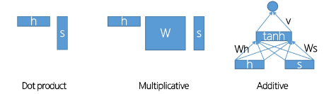