# 사전 학습 기반 언어 모델

목차

1. 사전학습이란?
2. Encoder 모델
3. Encoder - Decoder 모델
4. Decoder 모델
5. In-Context Learning

### 학습 목표
- 사전학습(Pretraining)의 개념과 필요성을 설명할 수 있다.
- Encoder 기반 모델(예 : BERT)의 구조와 주요 활용 사례를 이해한다.
- Encoder - Decoder 기반 모델 (예 : T5)의 특징과 응용 분야를 설명할 수 있다.
- Decoder 기반 모델 (예 : GPT)의 구조와 강점을 이해한다.
- In-Context Learning (ICL)이 등장하게 된 배경과 그 의미를 설명할 수 있다.
- ICL 능력을 끌어 올리기 위한 대표적인 prompting 기법 (CoT, Xero-shot CoT)을 이해한다.

## 0. 학습 시작(오버뷰)
#### 사전학습(Pretraining)이란 무엇인가? 왜 중요한가?
- 대규모 데이터 기반의 사전학습 개념과 필요성

#### 대표적 모델 유형은 어떻게 구분되는가?
- Encoder 기반, Encoder - Decoder 기반, Decoder 기반

#### 각각 어떤 모델이 존재하는가?
- BERT, T5, GPT 등 주요 모델 소개

#### In-Context Learning과 발전된 prompting 기반은 무엇인가?
- ICL의 등장 배경과 의미
- Chain-of-Thought, Zero-shot CoT 등 대표 기법

## 1. 사전학습이란?

#### 사전학습이란?
- **사전학습**이란 대규모 데이터셋을 이용해, 모델이 **데이터의 일반적인 특징과 표현을 학습하도록 하는 과정**이다.
- 특히 언어 모델은, **인터넷의 방대한 텍스트(웹 문서, 책, 뉴스 등)을 활용해 비지도학습 방식으로 학습**되어, 일반적인 언어 패턴, 지식, 문맥 이해 능력을 습득한다.
  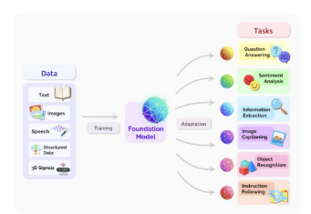

#### 사전학습의 고나점에서 워드 임베딩 vs. 언어 모델
- 워드 임베딩의 경우 사전학습을 통해 단어의 의미를 학습하지만 한계가 존재한다.
    1. 다운스트림 태스크(예 : 텍스트 분류)들에 적용하기엔 학습되는 데이터의 양이 적어, 언어의 풍부한 문맥 정보를 충분히 학습할 수 없다.
    2. 연결된 네트워크가 무작위 초기화되어 학습 효율이 낮고, 많은 데이터와 시간이 필요하다.
  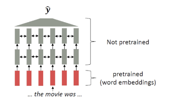

- 언어 모델의 경우 모델 전체를 사전학습을 통해 학습하기 때문에, 강력한 NLP 모델을 구축하는 데에 이점이 있다.
    1. 언어에 대한 표현 학습용으로 적합하다.
    2. 파라미터 초기화의 관점에서 효과적이다.
    3. 언어에 대한 확률 분포 학습을 통해 샘플링, 생성에 사용할 수 있다.
  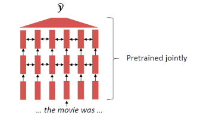

#### 언어모델의 사전학습
- 과거 단어들이 주어졌을 때, 다음 단어의 확률분포를 모델링하는 방법을 배움으로서, 사전학습을 수행할 수 있다.
- 인터넷의 대규모 텍스트 코퍼스에서 언어모델링 학습을 수행 후 학습된 네트워크 파라미터를 저장해, 다양한 다운스트림 태스크에 활용한다.

#### 사전 학습 → 파인튜닝(fine-tuning) 패러다임
- 사전학습을 통해, 언어 패턴을 잘 학습한 파라미터로 초기화해 NLP application 성능을 향상시킬 수 있다.
  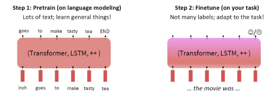

#### 사전학습 모델들의 역사
  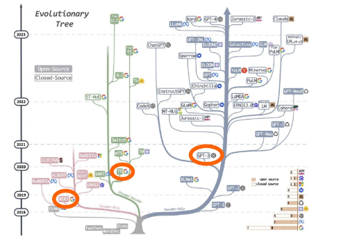

## 2. Encoder 모델
#### Encoder 모델
  
  - Encoders
    - 양방향 문맥을 활용할 수 있다.
    - 학습하기 위한 훈련 방법은?

  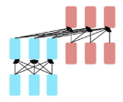
  - Encoder - Decoders
    - Encoder와 Decoder의 장점을 모두 결합했다.
    - 효과적인 사전학습 방법은?

  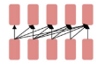
  - Decorders
    - 전형적인 언어 모델 구조.
    - 문장 생성에 유용 (미래 단어 참조 불가)

#### Encoder 모델의 사전 학습
- Encoder 모델은 양방향 문맥을 모두 활용하기 때문에, 전통적인 언어모델과는 차이점이 있다.
- 따라서, Encoder 모델의 사전 학습을 위해선 입력 단어의 알부를 [MASK] 토큰으로 치환해, 모델이 이 [MASK] 자리에 올 단어를 예측하도록 학습하는 방법을 사용할 수 있다.
- 이를 Masked Language Model이라 하며, 대표적인 모델이 BERT이다.
  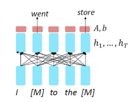

#### BERT
- BERT는 2018년 Google에서 공개한 transformer 기반의 모델로, Masked LM방법으로 사전학습을 수행했다.
  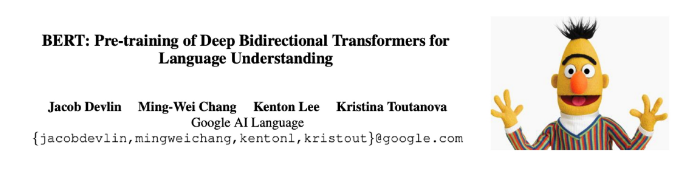

#### BERT의 학습 방법 1 - Masked LM
- 학습 방식은 다음과 같다 :
  - 입력 토큰의 15%를 무작위로 선택한다.
  - [MASK] 토큰 치환(80%), 랜덤 토큰 치환(10%), 그대로 두기(10%)
- 모델이 마스크된 단어에만 집중하지 않고, **다양한 문맥 표현을 학습**해 더 강건한(robust) 표현을 학습할 수 있도록 했다.
  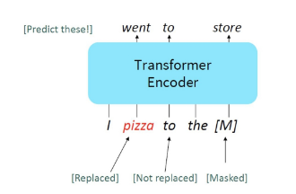
  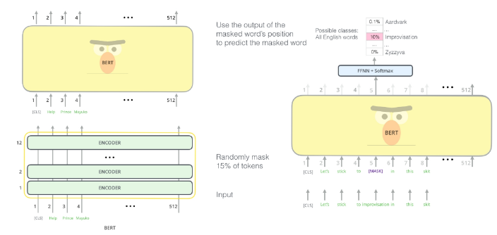

  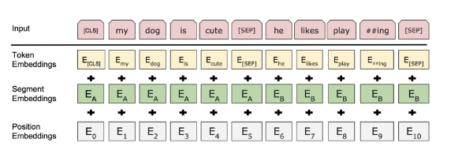

  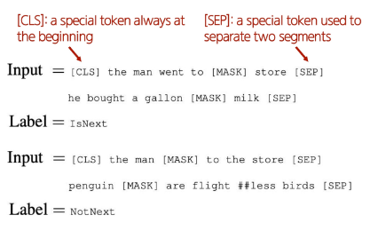

  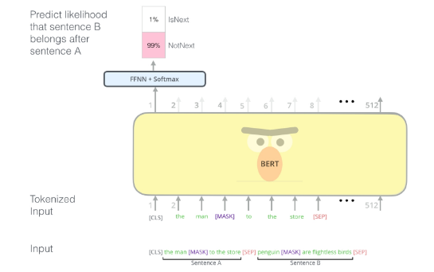

  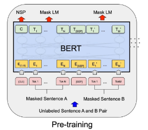

  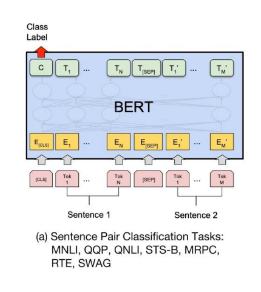

  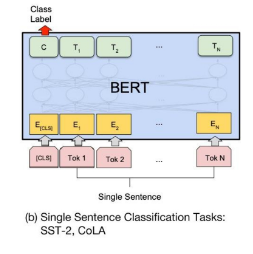

  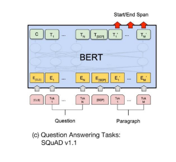

  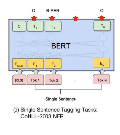

  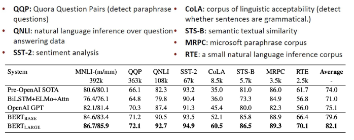

  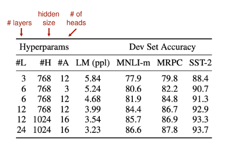

  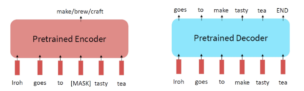

  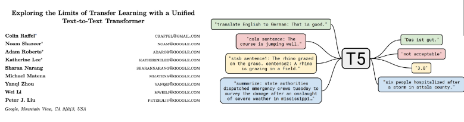

  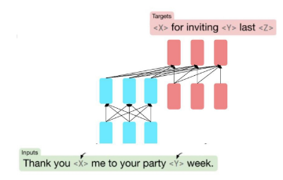

  

  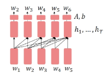

  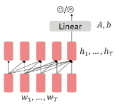

  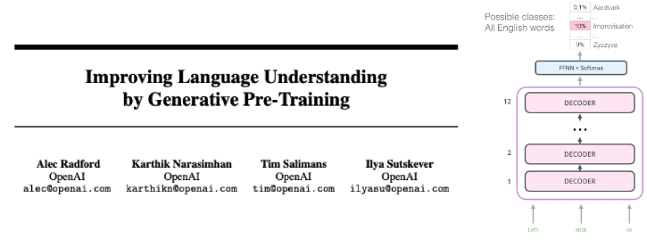

  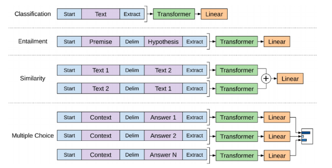

  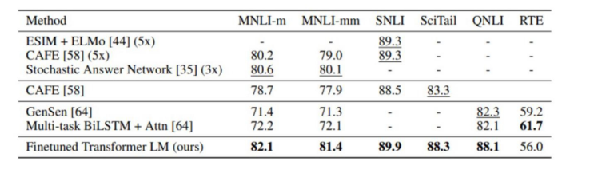

  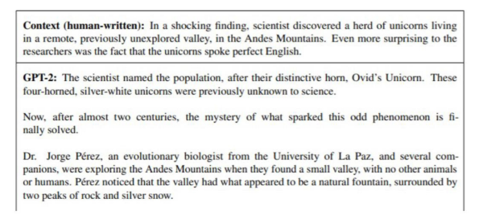

  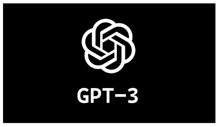

  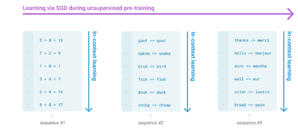

  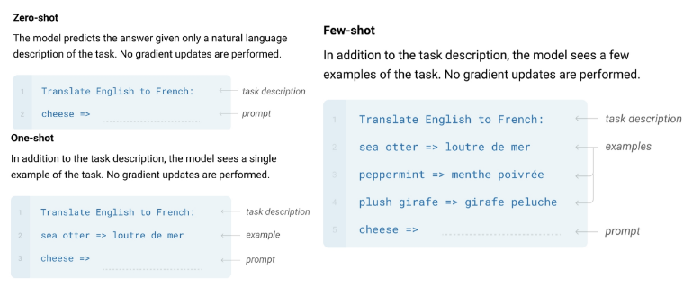

  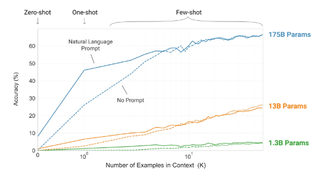

  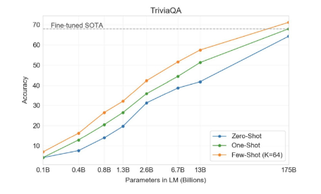

  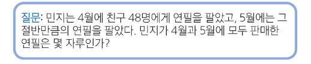

  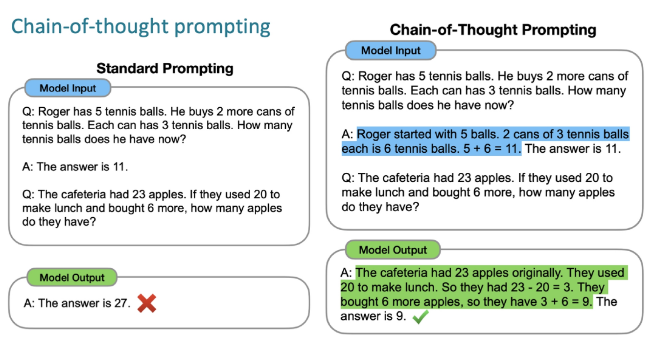

  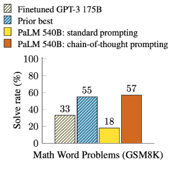

  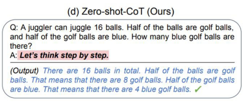

  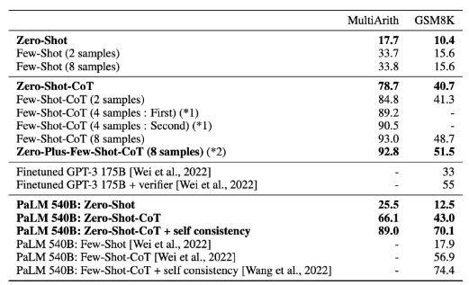