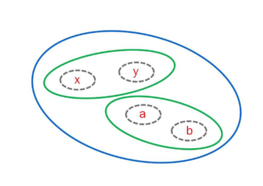
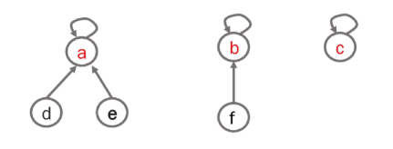
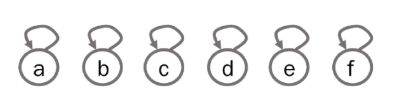
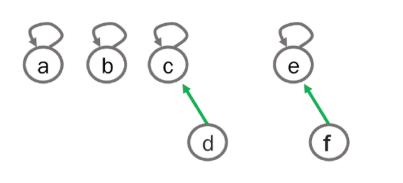
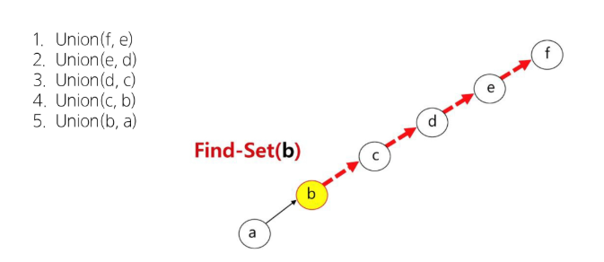
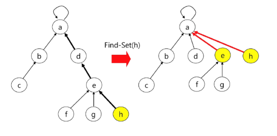
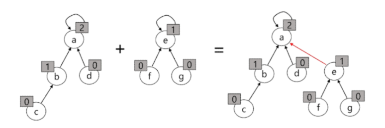
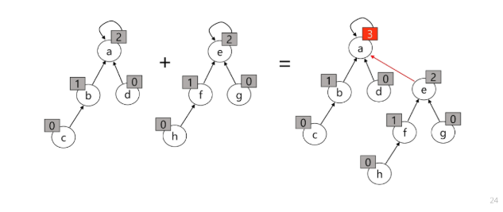

# 서로소 집합

<details>
<summary> 목차 </summary>

1. 서로소 집합
  - 개요
  - 서로소 집합 표현
  - 서로소 집합 연산
  - 서로소 집합 최적화

</details>

## 1. 서로소 집합
### 개요
#### 서로소 집합(Disjoint-set)
- 서로소 또는 상호배타 집합들은 서로 중복 포함된 원소가 없는 집합들이다.
  - > 다시 말해 교집합이 없다.
- 서로소 집합: 두 집합 간에 공통 원소가 하나도 없을 때의 두 집합
- 대표자(representative) : 집합에 속한 하나의 특정 멤버를 통해 각 집합들을 구분한다.

- 상호배타 집합을 표현하는 방법
  - 연결 리스트
  - 트리

- 상호배타 집합 연산
  - `Make-Set(x)`
  - `Find-Set(x)`
  - `Union(x, y)`

#### 서로소 집합 예
```python
  Make-Set(x)
  Make-Set(y)
  Make-Set(a)
  Make-Set(b)
  Union(x, y)
  Union(a, b)
  Find-Set(y)    # return x (representative)
  Find-Set(b)    # return a (representative)
  Union(x, a)
```


---

### 서로소 집합 표현
#### 서로소 집합 표현 - 트리
- 같은 집합의 원소들을 하나의 트리로 표현한다.
- 자식 노드가 부모 노드를 가리키며 루트 노드가 대표자가 된다.



- `Make-Set(a) ~ Make-Set(f)`



- <span style='color:yellowgreen'> Union(c, d), Union(e, f)</span>



- <span style='color:yellowgreen'> Union(d, f) </span>


- `Find-Set(d)` : `return c`
- `Find-Set(e)` : `return c`

- 서로소 집합을 표현한 트리의 배열을 이용해 저장된 모습


|  |  |  |  |  |  |  |
|:-:|:-:|:-:|:-:|:-:|:-:|:-:|
| 인덱스 | 0 | 1 | 2 | 3 | 4 | 5 |
| 노드 | a | b | c | d | e | f |
| 부모 인덱스 | 0 | 1 | 2 | 2 | 2 | 4 |
---

### 서로소 집합 연산
#### 서로소 집합에 대한 연산 - `make_set(x)`
- 유일한 멤버 x를 포함하는 새로운 집합을 생성하는 연산
```python
def make_set(n):
  """n개의 원소를 가진 초기 집합 생성"""
  return [i for i in range(n+1)]

# 6개의 원소로 테스트
parent = make_set(6)
```

#### 서로소 집합에 대한 연산 - `find_set(x)`
- x를 포함하는 집합을 찾는 연산
```python
def find_set(x):
  # 노드 x가 자기 자신을 부모 노드로 가지는 경우 그대로 반환
  if x == parent[x]:
    return x
  return find_set(parent[x])
```

#### 서로소 집합에 대한 연산 - `union(x, y)`
- x와 y를 포함하는 두 집합을 통합하는 연산
```python
def union(x, y):
    """ 두 집합을 합치기"""
    root_x = find_set(x)
    root_y = find_set(y)
    if root_x != root_y:
      parent[root_y] = root_x
```

#### 서로소 집합 연산의 문제점


---

### 서로소 집합 최적화
#### 서로소 집합의 최적화
- **Path compression**
  - Find-Set을 행하는 과정에서 만나는 모든 노드들이 직접 root를 가리키도록 포인터를 바꾸어 준다.

- **Rank를 이용한 Union**
  - 각 노드는 자신을 루트로 하는 subtree의 높이를 rank로 저장한다.
  - 두 집합을 합칠 때 rank가 낮은 집합을 rank가 높은 집합의 붙인다.

#### Path Compression 최적화
- Path Compression을 적용한 Find-Set 연산은 특정 노드에서 루트까지의 경로를 찾아 가면서 부모 노드를 갱신한다.



- Find_set(x) 최적화(x를 포함하는 집합을 찾는 오퍼레이션)
```python
# 최적화 전
def find_set(x):
  if x == parent[x]:
    return x
  return find_set(parent[x])

# 최적화 후
def find_set_pc(x):
  """경로 압축이 적용된 find_set"""
  if parent[x] == x:
    return x
  
  parent[x] = find_set_pc(parent[x])
  return parent[x]
```

#### Rank 최적화
- 랭크를 이용한 Union

  

- 랭크를 이용한 Union에서 랭크가 증가하는 예

  

- Rank를 저장할 변수 추가 및 랭크 비교 및 저장

  ```python
  # 최적화 전
  def make_set(n):
    """n개의 원소를 가진 초기 집합 생성"""
    return [i for i in range(n+1)]
  
  def union(x, y):
    """두 집합 합치기"""
    root_x = find_set(x)
    root_y = find_set(y)
    if root_x != root_y:
      parent[root_y] = root_x
  
  parent = make_set(6)
  ```

  ```python
  # 최적화 후
  def make_set(n):
    """부모 리스트와 랭크 리스트 초기화"""
    parent = [i for i in range(n+1)]
    rank = [0] * (n+1)
    return parent, rank
  
  def union_by_rank(x, y):
    """랭크를 이용한 최적화된 union"""
    root_x = find_set(x)
    root_y = find_set(y)

    if root_x != root_y:
      if rank[root_x] > rank[root_y]:
        parent[root_y] = root_x
      elif rank[root_x] < rank[root_y]:
        parent[root_x] = root_y
      else:
        parent[root_y] = root_x
        rank[root_x] += 1
  
  parent, rank = make_set(6)
  ```

#### 서로소 집합 최종 완성 코드
```python
def make_set(n):
  """부모와 랭크 리스트 초기화"""
  parent = [i for i in range(n+1)]
  rank = [0] * (n+1)
  return parent, rank

def find_set(x):
  """경로 압축이 적용된 find_set"""
  if parent[x] != x:
    parent[x] = find_set(parent[x])
  return parent[x]

def union(x, y):
  """랭크 기반으로 최적화된 union"""
  root_x = find_set(x)
  root_y = find_set(y)

  if root_x != root_y:
    if rank[root_x] > rank[root_y]:
      parent[root_y] = root_x
    elif rank[root_x] < rank[root_y]:
      parent[root_x] = root_y
    else:
      parent[root_y] = root_x
      rank[root_x] += 1
```

#### 경로 압축은 언제 일어날까?
- `find_set` 호출 시, 해당 경로만 "On-Demand"로 최적화
- 경로 압축은 union 연산의 기능이 아님
- Union이 내부적으로 find_set을 호출하기 때문에 발생하는 **부수 효과**
- 자료구조를 사용할 때마다, 필요한 부분만 자동으로 점진적으로 최적화
- 따라서 별도로 압축을 호출할 필요 없이, 자료구조를 사용하다 보면 **전체 트리가 자연스럽게 효율적인 구조로 개선**
