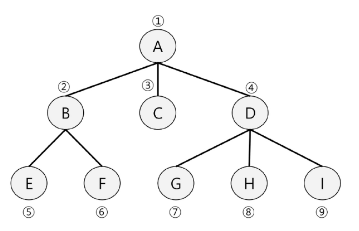

# BFS
<details>
<summary>목차</summary>

1. BFS
  - BFS(트리)
  - BFS(그래프)

2. BFS 문제풀이
  - 도로 이동시간
  - 섬 찾기

</details>

## BFS
### BFS(트리)
#### BFS(Breath First Search)
- 루트 노드의 자식 노드들을 먼저 모두 차례로 방문한 후에 / 방문했던 자식 노드들을 기준으로 하여 다시 해당 노드의 자식 노드들을 차례로 방문하는 방식
- 인접한 노드들에 대해 탐색을 한 후 / 차례로 다시 너비우선탐색을 진행해야 하므로, 선입선출 형태의 자료구조인 큐를 활용함.

#### BFS 알고리즘
```python
BFS()
  큐 생성
  루트 v를 큐에 삽입
  while (큐가 비어 있지 않은 경우) {
    t = 큐의 첫 번째 원소 반환
    t 방문
    for (t와 연결된 모든 간선에 대해) {
      u = t의 자식노드
      u를 큐에 삽입
    }
  }
end BFS()
```
  

#### BFS - 트리 예 (코드 참고)

### BFS(그래프)
#### BFS - 그래프
- 탐색 시작점의 인접한 정점들을 모두 차례로 방문한 후에 / 방문했던 정점을 시작점으로 하여 다시 인접한 정점들을 차례로 방문하는 방식
