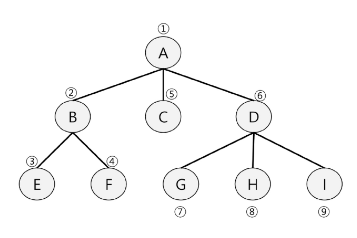

#  DFS
<details>
<summary>목차</summary>

1. DFS
  - 비선형 자료구조
  - DFS(트리)
  - DFS(그래프)

2. DFS 문제 풀이
  - 장훈이의 높은 선반
  - 동철이의 일 분배

</details>

## DFS
### 비선형 자료구조
#### 비선형 자료구조
- 비선형구조인 트리, 그래프의 각 노드(정점)를 중복되지 않게 전부 방문(visit)하는 것을 말하는데 비선형구조는 선형 구조에서와 같이 **선후 연결 관계를 알 수 없다**.

- 두 가지 방법
  - **깊이 우선 탐색(Depth First Search, DFS)**
  - 너비 우선 탐색(Breadth First Search, BFS)

### DFS(트리)
#### DFS(Depth First Search)
- 루트 노드에서 출발하여 한 방향으로 갈 수 있는 경로가 있는 곳까지 **깊이 탐색**해 가다가 더 이상 갈 곳이 없게 되면, 가장 마지막에 만났던 갈림길 간선이 있는 노드로 되돌아와서 다른 방향의 노드로 탐색을 계속 반복하여 결국 모든 노드를 방문하는 순회 방법
- 가장 마지막에 만났던 갈림길의 노드로 되돌아가서 다시 깊이 우선 탐색을 반복해야 하므로 재귀적으로 구현하거나 **후입선출 구조의 스택**을 사용해서 구현

#### DFS 알고리즘
```javascript
DFS(v)
  v 방문:
  for(v의 모든 자식노드 w) {
    DFS(w);
  }
end DFS()
```



#### DFS 예시
1) 루트노드 A를 시작으로 깊이 우선 탐색을 시작
```javascript
DFS(A)
  A 방문;
  // A의 자식노드(B, C, D) 모두에 대하여
  DFS(B)
  DFS(C)
  DFS(D)
```

### DFS(그래프)
#### DFS - 그래프
- **시작 정점**에서 출발하여 한 방향으로 갈 수 있는 경로가 있는 곳까지 깊이 탐색해 가다가 더 이상 갈 곳이 없게 되면, 가장 마지막에 만났던 갈림길 간선이 있는 정점으로 되돌아와서 다른 방향의 정점으로 탐색을 계속 반복하여 결국 모든 정점을 방문하는 순회방법
