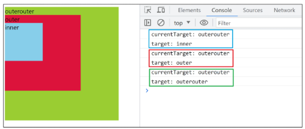
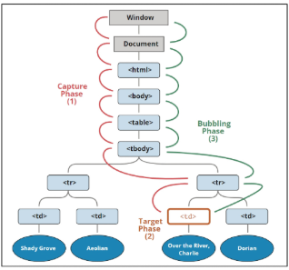

# DOM & EVENT
<details>
<summary> 목차 </summary>

1. History of JavaScript
2. 변수 데이터 타입
3. 연산자
4. 제어문
5. DOM
  - document 객체
6. DOM 선택
  - 선택 메서드
7. DOM 조작
  - 속성 조작
  - HTML 콘텐츠 조작
  - DOM 요소 조작
  - style 조작
8. 함수
  - 함수 정의
  - 매개변수
  - Spread syntax
  - 화살표 함수
9. 이벤트
  - event 객체
  - event handler
  - 버블링
10. event handler 활용
11. 이벤트 기본 동작 취소
</details>

## History of JavaScript
### ECMAScript
#### ECMAScript
- Ecma International이 정의하고 있는 표준화된 스크립트 프로그래밍 언어 명세
- 스크립트 언어가 준수해야 하는 규칙, 세부사항 등을 제공

#### ECMAScript & JavaScript
- JavaScript는 ECMAScript 표준을 구현한 구체적인 프로그래밍 언어
- ECMAScript의 명세를 기반으로 웹 브라우저나 Node.js와 같은 환경에서 실행됨
- ECMAScript는 JavaScript의 표준
- JavaScript는 ECMAScript 표준을 따르는 구체적인 프로그래밍 언어
- ECMAScript는 언어의 핵심을 정의
- JavaScript는 ECMAScript 표준을 따라 구현된 언어로 사용

#### ECMAScript의 역사
- ECMAScript 5(ES5)에서 안정성과 생산성을 크게 높임(2009)
- ECMAScript 2015(ES6)에서 객체지향 프로그래밍 언어로써 많은 발전을 이루어, 역사상 가장 중요한 버전으로 평가됨(2015)

#### JavaScript의 현재
 - 현재는 Chrome, Firefox, Safari, Microsoft Edge 등 다양한 웹 브라우저가 경쟁하고 있으며, 모바일 등 시장이 다양화되어 있음
 - 기존에 JavaScript는 브라우저에서만 웹 페이지의 동적인 기능을 구현하는 데에만 사용됨
  - ex: 사용자의 입력에 따라 웹 페이지의 내용이 동적으로 변경되거나, 애니메이션 효과가 적용되는 등의 기능
- 이후 Node.js로 인해 브라우저에서 벗어나 서버 사이드 분야뿐만 아니라, 클라이언트 사이드 등 다양한 프레임워크와 라이브러리들이 개발되면서 웹 개발 분야에서는 필수적인 언어로 자리 잡게 됨

## 변수
### 개요
#### JavaScript 문법 학습
- ECMAScript 2015(ES6) 이후의 명제를 따름

### 변수 선언 키워드
#### 식별자(변수명) 작성 규칙
- 반드시 문자, 달러('$') 또는 밑줄("_")로 시작
- 대소문자를 구분
- 예약어 사용 불가
  - for, if, function 등

#### 식별자(변수명) Naming case
- 카멜 케이스(camelCase)
  - 변수, 객체, 함수에 사용
- 파스칼 케이스(PascalCase)
  - 클래스, 생성자에 사용
- 대문자 스네이크 케이스(SNAKE_CASE)
  - 상수(constants)에 사용

#### 변수 선언 키워드 3가지
1. let
2. const
3. var

#### 1. let
- 블록 스코프(block scope)를 갖는 지역 변수를 선언
- 재할당 가능
- 재선언 불가능
- ES6에서 추가
```javascript
let number = 10 // 1. 선언 및 초기값 할당
number = 20 // 2. 재할당

let number = 10 // 1. 선언 및 초기값 할당
let number = 20 // 2. 재선언 불가능
```

#### 2. const **(<span style = "color: red">메인으로 사용 예정</span>)**
- 블록 스코프를 갖는 지역 변수를 선언
- 재할당 불가능
- 재선언 불가능
- ES6에서 추가
- 데이터 타입이 달라질 일이 없음
```javascript
const number = 10 // 1. 선언 및 초기값 할당
number = 10 // 2. 재할당 불가능

const number = 10 // 1. 선언 및 초기값 할당
const number = 20 // 2. 재선언 불가능

const number // 선언 시 반드시 초기값 설정 필요
```

#### 블록 스코프(block scope)
- if, for, 함수 등의 '중괄호({}) 내부'를 가리킴
- 블록 스코프를 가지는 변수는 블록 바깥에서 접근 불가능
```javascript
let x= 1
if (x === 1) {
  let x = 2

  console.log(x) // 2
}

console.log(x) // 1
```

#### 어떤 변수 선언 키워드를 사용해야 할까?
- 기본적으로 const 사용 권장
- 재할당이 필요하면 그때 let으로 변경해서 사용

### 데이터 타입
#### 데이터 타입
1. 원시 자료형(Primitive type)
- Number, String, Boolean, null(null이라는 값), undefined(값X)
- 변수에 값이 직접 저장되는 자료형(불변, 값이 복사)
- 예시
  - 변수에 할당될 때 값이 복사됨
  - 변수 간에 서로 영향을 미치지 않음
  ```javascript
    const bar = 'bar'
    console.log(bar) // bar

    bar.toUpperCase()
    console.log(bar) // bar
  ```

2. 참조 자료형(Reference type)
- Objects(Object, Array, Function)
- 객체의 주소가 저장되는 자료형(가변, 주소가 복사)
- 예시
  - 객체를 생성하면 객체의 메모리 주소를 변수에 할당
  - 변수 간에 서로 영향을 미침
  ```javascript
  const obj1 = {name: 'Alice', age = 30}
  const obj2 = obj1
  obj2.age = 40

  console.log(obj1.age) // 40
  console.log(obj2.age) // 40
  ```

### 원시 자료형
#### 1. Number
- 정수 또는 실수형 숫자를 표현하는 자료형
```javascript
const a = 13
const b = -5
const c = 3.14 // float - 숫자 표현
const d = 2.998e8 // 2.998 * 10^8 = 299,800,000
const e = Infinity
const f = -Infinity
const g = Nan // Not a Number를 나타내는 값
```

#### 2. String
- 텍스트 데이터를 표현하는 자료형
- '+' 연산자를 사용해 문자열끼리 결합
- 뺄셈, 곱셈, 나눗셈 불가능
```javascript
const firstName = 'Tony'
const lastName = 'Stark'
const fullName = firstName + lastName
console.log(fullName) // TonyStark
```

#### 3. Template literals (템플릿 리터럴)
- 내장된 표현식을 허용하는 문자열 작성 방식
- Backtick(``)을 이용하며, 여러 줄에 걸쳐 문자열을 정의할 수도 있고 Javascript의 변수를 문자열 안에 바로 연결할 수 있음
- 표현식은 '$'와 중괄호(${'expressison'})로 표기
- ES6+부터 지원
```javascript
const age = 100
const message = `홍길동은 ${age}세입니다.`
console.log(message) // 홍길동은 100세입니다.
```

#### 4. null과 undefined
1) null
- 변수의 값이 없음을 의도적으로 표현할 때 사용
```javascript
let a = null
console.log(a) // null
```

2) undefined
- 변수 선언 이후 직접 값을 할당하지 않으면 자동으로 할당됨
```javascript
let b
console.log(b) // undefined
```

#### '값이 없음'에 대한 표현이 null과 undefiend 2가지인 이유
- 'Javascript의 설계 실수'
- null이 원시 자료형임에도 불구하고 object로 출력되는 이유
  - Javascript 설계 당시의 버그를 해결하지 않은 것
- 해결하지 못하는 이유는 이미 null 타입에 의존성을 띄고 있는 수많은 프로그램들이 망가질 수 있기 떄문(하위 호환 유지)
```javascript
typeof null // 'object'
typeof undefiend // 'undefined'
```

#### 5. Boolean(true / false)
- 조건문 또는 반복문에서 Boolean이 아닌 데이터 타입은 '자동 형변환 규칙'에 따라 true 또는 false로 변환됨
- 

### 연산자
#### 할당 연산자
- 오른쪽에 있는 피연산자의 평가 결과를 왼쪽 피연산자에 할당하는 연산자
- 단축 연산자 지원
```javascript
let a = 0

a += 10
console.log(a) // 10

a -= 3
console.log(a) // 7

a *= 10
console.log(a) // 70

a %= 7
console.log(a) // 0
```

#### 증가 & 감소 연산자
- 증가 연산자('++')
  - 피연산자를 증가(1을 더함)시키고 연산자의 위치에 따라 증가하기 전이나 후의 값을 반환
- 감소 연산자('--')
  - 피연산자를 감소(1을 뺌)시키고 연산자의 위치에 따라 감소하기 전이나 후의 값을 반환
- '+=' 또는 '-='와 같이 더 명시적인 표현으로 작성하는 것을 권장
```javascript
let x = 3
const y = x++
console.log(x, y) // 4 3

let a = 3
const b = ++a
console.log(a, b) // 4 4
```

#### 비교 연산자
- 피연산자들(숫자, 문자, Boolean 등)을 비교하고 결과 값을 boolean으로 반환하는 연산자
```javascript
3 > 2 // true
3 < 2 // false

'A' < 'B' // true
'Z' < 'a' // true
'가' < '나' // true
```

#### 동등 연산자(==)
- 두 피연산자가 같은 값으로 평가되는지 비교 후 boolean 값을 반환
- '암묵적 타입 변환'을 통해 타입을 일치시킨 후 같은 값인지 비교
- 두 피연산자가 모두 객체일 경우 메모리의 같은 객체를 바라보는지 판별
```javascript
console.log(1 == 1) // true
console.log('hello' == 'hello') // true
console.log('1' == 1) // true
console.log(0 == false) // true
```

#### 일치 연산자(===)
- 두 피연산자의 값과 타입이 모두 같은 경우 true를 반환
- 같은 객체를 가리키거나, 같은 타입이면서 같은 값인지를 비교
- 엄격한 비교가 이뤄지며 암묵적 타입 변환이 발생하지 않음
- 특수한 경우를 제외하고는 동등 연산자가 아닌 **<span style = "color: red">일치 연산자 사용 권장</span>**
```javascript
console.log(1 === 1) // true
console.log('hello' === 'hello') // true
console.log('1' === 1) // false
console.log(0 === false) // false
```

#### 논리 연산자
- and 연산 : &&
- or 연산 : ||
- not 연산 : !
- 단축 평가 지원
```javascript
true && false // false
true && true // true

false || true // true
false || false // false

!true // false

1 && 0 // 0
0 && 1 // 0
4 && 7 // 7
1 || 0 // 1
0 || 1 // 1
4 || 7 // 4
```

### 조건문
#### if
- 조건 표현식의 결과값을 boolean 타입으로 변환 후 참/거짓을 판단
```javascript
const name = 'customer'

if (name === 'admin') {
  console.log('관리자님 환영해요')
} else if (name === 'customer') {
  console.log('고객님 환영해요')
} else {
  console.log(`반갑습니다. ${name}님`)
}
```

#### 삼항 연산자
`condition ? expression1 : expression2`
- condition
  - 평가할 조건 (true 또는 false로 평가)
- expression1
  - 조건이 true일 경우 반환할 값 또는 표현식
- expression2
  - 조건이 false일 경우 반환할 값 또는 표현식

#### 삼항 연산자 예시
- 간단한 조건부 로직을 간결하게 표현할 때 유용
- 하지만 복잡한 로직이나 대다수의 경우에는 가독성이 떨어질 수 있으므로 적절한 상황에서만 사용할 것
```javascript
const age = 20
const message = (age >= 18) ? '성인' : '미성년자'
console.log(message) // '성인'
```
### 반복문
#### 반복문 종류
- while
- for
- for ... in
- for ... of

#### while
- 조건문이 참이면 문장을 계속해서 수행
```javascript
let i = 0
while (i < 6) {
  console.log(i)
  i += 1
}
```

#### for
- 특정한 조건이 거짓으로 판별될 때까지 반복
```javascript
for (let i = 0; i < 6; i++) {
  console.log(i)
}
```

#### for ... in
- 객체의 열거 가능한 속성(property)에 대해 반복
```javascript
const fruits = {a: 'apple', b: 'banana'}

for (const property in object) {
  console.log(property) // a, b
  console.log(object[property]) // apple, banana
}
```

#### for ... of
- 반복 가능한 객체(배열, 문자열 등)에 대해 반복
```javascript
const numbers = [0, 1, 2, 3]

for (const number of numbers) {
  console.log(number) // 0, 1, 2, 3
}
```

#### 배열 반복과 for ... in
- 객체 관점에서 배열의 인덱스는 정수 이름을 가진 열거 가능한 속성
- for ... in : 정수가 아닌 이름과 속성을 포함하여 열거 가능한 모든 속성 반환
- 내부적으로 for ... in은 배열의 반복자가 아닌 속성 열거를 사용하기 때문에 특정 순서에 따라 인덱스를 반환하는 것을 보장할 수 없음
- > for ... in은 인덱스의 순서가 중요한 <span style='color:red'>배열에서는 사용하지 않음</span>
- > 배열에서는 <span style='color:red'> for 문, for ... of를 사용</span>
- 객체 관점에서 배열의 인덱스는 정수 이름을 가진 속성이기 때문에 인덱스가 출력됨 (순서 보장X)
```javascript
const arr = ['a', 'b', 'c']

for (const i in arr) {
  console.log(i) // 0, 1, 2
}

for (const i of arr) {
  console.log(i) // a, b, c
}
```

#### 반복문 사용 시 const 사용 여부
- for 문
  - `for (let i = 0; i < arr.length; i++) { ... }`의 경우에는 최초 정의한 i를 "재할당"하면서 사용하기 때문에 <span style='color:red'>const를 사용하면 에러 발생</span>
- for ... in, for ... of
  - 재할당이 아니라 매 반복마다 다른 속성 이름이 변수에 지정되는 것이므로 <span style='color:red'>const를 사용해도 에러가 발생하지 않음</span>
  - 단, const 특징에 따라 블록 내부에서 변수를 수정할 수 없음

## DOM
### 개요
#### 웹 브라우저에서의 JavaScript
- 웹 페이지의 동적인 기능을 구현

#### DOM (The Document Object Model)
- 웹 페이지(Document)를 구조화된 객체로 제공하여 프로그래밍 언어가 페이지 구조에 접근할 수 있는 방법을 제공
- 문서 구조, 스타일, 내용 등을 변경할 수 있도록 함

#### DOM API
- 다른 프로그래밍 언어가 웹 페이지에 접근 및 조작할 수 있도록 페이지 요소들을 객체 형태로 제공하며 이에 따른 메서드 또한 제공

#### DOM 특징
- DOM에서 모든 요소, 속성, 텍스트는 하나의 객체
- 모두 document 객체의 하위 객체로 구성됨
- 

#### DOM tree
- 브라우저는 HTML 문서를 해석하여 DOM tree라는 객체 트리로 구조화
- 객체 간 상속 구조가 존재
- 

#### 브라우저가 웹 페이지를 불러오는 과정
- 웹 페이지는 웹 브라우저를 통해 해석되어 웹 브라우저 화면에 나타남

#### DOM 핵심
- 문서의 요소들을 객체로 제공하여 다른 프로그래밍 언어에서 접근하고 조작할 수 있는 방법을 제공하는 API

### Document 객체
#### 'Document' 객체
- 웹 페이지 객체
- DOM Tree의 진입점
- 페이지를 구성하는 모든 객체 요소를 포함

#### 'Document' 객체 예시
- HTML의 <'title'> 변경하기
- 

## DOM 선택
### 선택 메서드
#### 선택 메서드
- `document.querySelector()`
  - 요소 한 개 선택
- `document.querySelectorAll()`
  - 요소 여러 개 선택

#### `document.querySelector(selector)`
- 제공한 선택자와 일치하는 element 한 개 선택
- 제공한 CSS selector를 만족하는 첫번째 element 객체를 반환 (없다면 null 반환)

#### `document.querySelectorAll(selector)`
- 제공한 선택자와 일치하는 여러 element를 선택
- 제공한 CSS selector를 만족하는 NodeList를 반환

#### DOM 선택 실습


### DOM 조작
#### DOM 조작
1. 속성(attribute) 조작
  - 클래스 속성 조작
  - 일반 속성 조작
2. HTML 콘텐츠 조작
3. DOM 요소 조작
4. 스타일 조작

### 속성 조작
#### 클래스 속성 조작
**'classList' property**
- 요소의 클래스 목록을 DOMTokenList(유사 배열) 형태로 반환

#### 1. classList 메서드
- `element.classList.add()`
  - 지정한 클래스 값을 추가
- `element.classList.remove()`
  - 지정한 클래스 값을 제거
- `element.classList.toggle()`
  - 클래스가 존재한다면 제거하고 false를 반환
    (존재하지 않으면 클래스를 추가하고 true를 반환)

#### 클래스 속성 조작 실습
- `add()`와 `remove()` 메서드를 사용해 지정한 클래스 값을 추가 혹은 제거
- 
- 

#### 2. 일반 속성 조작 메서드
- `Element.getAttribute()`
  - 해당 요소에 지정된 값을 반환(조회)
- `Element.setAttribute(name, value)`
  - 지정된 요소의 속성 값을 설정
  - 속성이 이미 있으면 기존 값을 갱신(그렇지 않으면 지정된 이름과 값으로 새 속성이 추가)
- `Element.removeAttribute()`
  - 요소에서 지정된 이름을 가진 속성 제거

#### 일반 속성 조작 실습
- p.95

### HTML 콘텐츠 조작
#### HTML 콘텐츠 조작
**'textContent' property**
- 요소의 텍스트 콘텐츠를 표현
- `<p> lorem </p>`

#### HTML 콘텐츠 조작 실습
- p.98

### DOM 요소 조작
#### DOM 요소 조작 메서드
- `document.createElement(tagName)`
  - 작성한 tagName의 HTML 요소를 생성하여 반환
- `Node.appendChild()`
  - 한 Node를 특정 부모 Node의 자식 NodeList 중 마지막 자식으로 삽입
  - 추가된 Node 객체를 반환
- `Node.removeChild()`
  - DOM에서 자식 Node를 제거
  - 제거된 Node를 반환

#### DOM 요소 조작 실습
- p.101

### style 조작
#### style 조작
**'style' property**
- 해당 요소의 모든 style 속성 목록을 포함하는 속성

#### style 조작 실습
- p.104

## 참고
#### Node
- DOM의 기본 구성 단위
- DOM 트리의 각 부분은 Node라는 객체로 표현됨
  - Document Node => HTML 문서 전체를 나타내는 노드
  - Element Node => HTML 요소를 나타내는 노드 (예를 들어 <p>)
  - Text Node => HTML 텍스트 (Element Node 내의 텍스트 컨텐츠를 나타냄)
  - Attribute Node => HTML 요소의 속성을 나타내는 노드

#### NodeList
- DOM 메서드를 사용해 선택한 Node의 목록
- 배열과 유사한 구조를 가짐
- Index로만 각 항목에 접근 가능
- Javascript의 배열 메서드 사용 가능
- querySelectorAll()에 의해 반환되는 NodeList는 DOM의 변경사항을 실시간으로 반영하지 않음
  - DOM이 나중에 변경되더라도 이전에 이미 선택한 NodeList 값은 변하지 않음

#### Element
- Node의 하위 유형
- DOM 트리에서 HTML 요소를 나타내는 특별한 유형의 Node
- ex: <p>, <div>, <span>, <body> 등의 HTML 태그들이 Element 노드를 생성
- Node의 속성과 메서드를 모두 가지고 있으며 추가적으로 요소 특화된 기능(ex: className, innerHTML, id 등)을 가지고 있음
- > 모든 Element는 Node이지만, 모든 Node가 Element인 것은 아님

## 함수
### 개요
#### Function
- 참조 자료형에 속하며 모든 함수는 Function object

### 함수 정의
#### 함수 구조
```javascript
function name ([param[, param, [..., param]]]) {
  statements
  return value
}
```
- function 키워드
- 함수의 이름
- 함수의 매개변수
- 함수의 body를 구성하는 statements
- return 값이 없다면 undefined를 반환

#### 함수 정의 2가지 방법
1. 선언식(function declaration)
```javascript
function funcName () {
  statements
}

function add (num1, num2) {
  return num1 + num2
}

add(1, 2) // 3
```


2. 표현식(function expression)
```javascript
const funcName = function () {
  statements
}

const sub = function (num1, num2) {
  return num1 - num2
}

sub(2, 1) // 1
```

#### 함수 표현식 특징
- 함수 이름이 없는 '익명 함수'를 사용할 수 있음
- 선언식과 달리 표현식으로 정의한 함수는 호이스팅되지 않으므로 함수를 정의하기 전에 먼저 사용할 수 없음
```javascript
// 선언식
add(1, 2) // 3
function add (num1, num2) {
  return num1 + num2
}
// 표현식
sub(2, 1) // ReferenceError: Cannot access 'sub' before initialization
const sub = function (num1, num2) {
  return num1 - num2
}
```

### 매개변수
#### 매개변수 정의 방법
1. 기본 함수 매개변수
2. 나머지 매개변수

#### 1. 기본 함수 매개변수(Default function parameter)
- 전달하는 인자가 없거나 undefined가 전달될 경우 이름 붙은 매개변수를 기본값으로 초기화
```javascript
const greeting = function (name = 'Anonymous') {
  return `Hi ${name}`
}
greeting() // Hi Anonymous
```

#### 2. 나머지 매개변수 (Rest parameters)
- 임의의 수의 인자를 '배열'로 허용하여 가변 인자를 나타내는 방법
- 작성 규칙
  - 함수 정의 시 나머지 매개변수는 하나만 작성할 수 있음
  - 나머지 매개변수는 함수 정의에서 매개변수 마지막에 위치해야 함
```javascript
const myFunc = function (param1, param2, ...restPrams) {
  return [param1, param2, restPrams]
}
myfunc(1, 2, 3, 4, 5) // [1, 2, [3, 4, ,5]]
myfunc(1, 2) // [1, 2, []]
```

#### 매개변수와 인자 개수가 불일치할 때
- 매개변수 개수 > 인자 개수
  - > 누락된 인자는 undefined로 할당
```javascript
const threeArgs = function (param1, param2, param3) {
  return [param1, param2, param3]
}
threeArgs() // [undefined, undefined, undefined]
threeArgs(1) // [1, undefined, undefined]
threeArgs(2, 3) // [2, 3, undefined]
```
- 매개변수 개수 < 인자 개수
  - > 초과 입력한 인자는 사용하지 않음
```javascript
const noArgs = function() {
  return 0
}
noArgs(1, 2, 3) // 0

const twoArgs = function (param1, param2) {
  return [param1, param2]
}
twoArgs(1, 2, 3) // [1, 2]
```

### Spread syntax
#### '...' (Spread syntax)
- 전개 구문

#### 전개 구문
- 배열이나 문자열과 같이 반복 가능한 항목을 펼치는 것(확장, 전개)
- 전개 대상에 따라 역할이 다름
  - > 배열이나 객체의 요소를 개별적인 값으로 분리하거나 다른 배열이나 객체의 요소를 현재 배열이나 객체에 추가하는 등

#### 전개 구문 활용처
1. 함수와의 사용
  1) 함수 호출 시 인자 확장
  2) 나머지 매개변수 (압축)
2. 객체와의 사용 (객체 파트에서 진행)
3. 배열과의 활용 (배열 파트에서 진행)

#### 전개 구문 활용
- 함수와의 사용
  1. 함수 호출 시 인자 확장
```javascript
function myFunc(x, y, z) {
  return x + y + z
}

let numbers = [1, 2, 3]

console.log(myFunc(...numbers)) // 6
```
  2. 나머지 매개변수 (압축)
```javascript
function myFunc2(x, y, ...restArgs) {
  return [x, y, restArgs]
}

console.log(myFunc2(1, 2, 3, 4, 5)) // [1, 2, [3, 4, 5]]
console.log(myFunc2(1, 2)) // [1, 2, []]

### 화살표 함수
#### 화살표 함수 표현식(Arrow function expressions)
- 함수 표현식의 간결한 표현법

#### 화살표 함수 작성 결과
```javascript
const arrow = function (name) {
  return `hello, ${name}`
}
// 화살표 함수 작성 전 후
const arrow = name => `hello, ${name}`
```

#### 화살표 함수 작성 과정
1. function 키워드 제거 후 매개변수와 중괄호 사이에 화살표(=>) 작성
```javascript
const arrow = function (name) {
  return `hello, ${name}`
}
// 1. function 키워드 삭제 후 화살표 작성
const arrow = name => `hello, ${name}`
```

## 참고
#### 세미콜론(semicolon)
- 자바스크립트는 문장 마지막 세미콜론(';')을 선택적으로 사용 가능
- 세미콜론이 없으면 ASI에 의해 자동으로 세미콜론이 삽입됨
  - ASI(Automatic Semicolon Insertion, 자동 세미콜론 삽입 규칙)
- JavaScript를 만든 Brendan Eich 또한 세미콜론 작성 반대

## 이벤트(EVENT)
### 개요
#### 일상 속의 이벤트
- 컴퓨터 키보드를 눌러 텍스트를 입력하는 것
- 전화벨이 울려 전화가 왔음을 알리는 것
- 손을 흔들어 인사하는 것
- 전화기의 버튼을 눌러서 통화를 시작하는 것
- 리모컨을 사용하여 채널을 변경하는 것

#### 웹에서의 이벤트
- 화면을 스크롤하는 것
- 버튼을 클릭했을 때 팝업 창이 출력되는 것
- 마우스 커서의 위치에 따라 드래그 앤 드롭하는 것
- 사용자의 키보드 입력 값에 따라 새로운 요소를 생성하는 것
- > 웹에서의 모든 동작은 <span style = "color: red">**이벤트 발생과 함께 한다.**</span>

### EVENT 객체
#### EVENT
- 무언가 일어났다는 신호, 사건
- > 모든 DOM 요소는 이러한 EVENT를 만들어 냄

#### 'EVENT' object
- DOM에서 이벤트가 발생했을 때 생성되는 객체
- 이벤트 종류
  - mouse, input, keyboard, touch, ...

#### DOM 요소는 event를 받고 받은 event를 '처리(<span style='color:red'>event handler: 이벤트 처리기</span>)'할 수 있음

### event handler
#### event handler
- 이벤트가 발생했을 때 실행되는 함수
- > 사용자의 행동에 어떻게 반응할지를 JavaScript 코드로 표현한 것

#### `.addEventListener()`
- > 특징 이벤트를 DOM 요소가 수신할 때마다 콜백 함수를 호출

#### `EventTarget.addEventListener(type, handler)`
- <span style = "color: red">`EventTarget` : DOM 요소</span>
- <span style = "color: green">`type` : 수신할 이벤트</span>
- <span style = "color: blue">`handler` : 콜백 함수</span>
- "<span style = "color: red">대상</span>에 <span style = "color: green"> 특정 Event</span>가 발생하면, <span style = "color: blue">지정한 이벤트를 받아 할 일</span>을 등록한다."

#### `addEventListener`의 인자
- type
  - 수신할 이벤트 이름
  - 문자열로 작성(ex. 'click')

- handler
  - 발생한 이벤트 객체를 수신하는 콜백 함수
  - 콜백 함수는 발생한 event object를 유일한 매개변수로 받음

### 버블링
#### 버블링 개요
- form > div > p 형태의 중첩된 구조에 각각 이벤트 핸들러가 있을 때 만약 <'p'> 요소를 클릭하면 어떻게 될까?
- <p> 요소만 클릭했는데도 불구하고 모든 핸들러가 동작함
  - > 왜 p를 클릭했는데 div와 form에 할당된 핸들러까지 동작할까?

#### 버블링(Bubbling)
- 한 요소에 이벤트가 발생하면 이 요소에 할당된 핸들러가 동작하고, 이어서 부모 요소의 핸들러가 동작하는 현상
- 가장 최상단의 조상 요소(document)를 만날 때까지 이 과정이 반복되면서 요소 각각에 할당된 핸들러가 동작
- > 이벤트가 제일 깊은 곳에 있는 요소에서 시작해 부모 요소를 거슬러 올라가며 발생하는 것이 마치 물속 거품과 닮았기 때문
- > 가장 안쪽의 <p> 요소를 클릭하면 p -> div -> form 순서로 3개의 이벤트 핸들러가 모두 동작했던 것

#### 이벤트가 정확히 어디서 발생했는지 접근할 수 있는 방법
- `event.currentTarget`
- `event.target`

#### 'currentTarget' & 'target' 속성
- 'currentTarget' 속성
  - '현재' 요소
  - 항상 이벤트 핸들로가 연결된 요소만을 참조하는 속성
  - 'this'와 같음

- 'target' 속성
  - 이벤트가 발생한 가장 안쪽의 요소(target)를 참조하는 속성
  - 실제 이벤트가 시작된 요소
  - 버블링이 진행되어도 변하지 않음

#### 'target' & 'currentTarget' 예시
- 세 요소 중 가장 최상위 요소인 outerouter 요소에만 핸들러가 부착
- 각 요소 클릭했을 때 event의 target과 currentTarget의 차이 비교


- 'currentTarget'
  - 핸들러가 연결된 outerouter 요소만을 가리킴
- 'target'
  - 실제 이벤트가 발생하는 요소를 가리킴
- 핸들러는 outerouter에만 할당되어 있지만 하위 요소 outer와 inner를 클릭해도 해당 핸들러가 작동함
- 클릭 이벤트가 어디서 발생했든 상관없이 outerouter까지 이벤트가 버블링되어 핸들러를 실행시키기 때문

#### 캡쳐링(capturing)
- 이벤트가 하위 요소로 전파되는 단계(버블링과 반대)


#### 캡쳐링과 버블링
- table 안에 td를 클릭하면 이벤트는 최상위 요소부터 아래로 전파
- 실제 이벤트가 발생한 지점(event.target)에서 실행된 후 다시 위로 전파
  - 이 과정에서 상위 요소에 할당된 이벤트 핸들러가 호출되는 것
- 캡쳐링은 실제 다루는 경우가 거의 없으므로 버블링에 집중하기

#### 버블링이 필요한 이유
- 만약 다음과 같이 각자 다른 동작을 수행하는 버튼이 여러 개 있다고 가정
- 그렇다면 각 버튼마다 서로 다른 이벤트 핸들러를 할당해야 할까?
- > 각 버튼의 <span style = 'color:red'>공통 조상인 div 요소에 이벤트 핸들러 단 하나만 할당</span>하기
- 요소의 공통 조상에 이벤트 핸들러를 단 하나만 할당하면 여러 요소를 한꺼번에 다룰 수 있음
- 공통 조상에 할당한 핸들러에서 event.target을 이용하면 실제 어떤 버튼에서 이벤트가 발생했는지 알 수 있기 때문
```HTML
<div>
  <button></button>
  <button></button>
  <button></button>
  ...
  <button></button>
  <button></button>
</div>
```

### 이벤트 기본 동작 취소
#### 이벤트의 기본 동작 취소하기
- HTML의 각 요소가 기본적으로 가지고 있는 이벤트가 때로는 방해가 되는 경우가 있어 이벤트의 기본 동작을 취소할 필요가 있음
- 예시
  - form 요소의 제출 이벤트를 취소하여 페이지 새로고침을 막을 수 있음
  - a 요소를 클릭할 때 페이지 이동을 막고 추가 로직을 수행할 수 있음

#### `.preventDefault()`
- 해당 이벤트에 대한 기본 동작을 실행하지 않도록 지정
