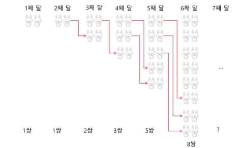
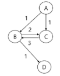
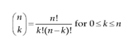
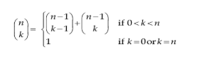

# DP
<details>
<summary>목차</summary>

1. DP
- 개요
- 피보나치 수열
- DP - 이항함수
- DP - 동전 거스름돈

</details>

## 1. DP
### 1) 개요
#### 문제 제시 : 토끼 수 구하기
- 다음과 같은 조건이 있다. n번째 달의 토끼 수는?
  - 첫 달에는 새로 태어난 토끼 한 쌍만이 존재한다.
  - 두 달 이상이 된 토끼는 번식 가능하다.
  - 번식 가능한 토끼 한 쌍은 매달 새끼 한 쌍을 낳는다.
  - 토끼는 죽지 않는다.

  

- n번째 달에 a쌍의 토끼가 있었다.
- 다음 (n+1)번째 달에는 새로 태어난 토끼를 포함해 b쌍이 있었다고 하자.
- 그러면 그 다음 (n+2)번째 달에는 (a+b)쌍의 토끼가 있게 된다.
- 이는 n번째 달에 살아있던 토끼는 충분한 나이가 되어 새끼를 낳을 수 있지만, 바로 전달인 (n+1)번째에 막 태어난 토끼는 아직 새끼를 낳을 수 없기 떄문이다.

- f(n)을 n번쨰 달의 토끼 수라고 하면
- f(n+2) = f(n) + f(n+1)이 성립하고
- 이는 유명한 레오나르도 피보나치가 연구한 피보나치 수열이다.

### 2) 피보나치 수열
#### 피보나치 수열 재귀 호출
- 이전의 두 수 합을 다음 항으로 하는 수열을 피보나치라고 한다.
  - 0, 1, 1, 2, 3, 5, 8, 13, ...
- 피보나치 수열의 i번쨰 값을 계산하는 함수 F를 정의하면 다음과 같다.
  - F_0 = 0, F_1 = 1
  - F_i = F_(i-1) + F_(i-2) for i >= 2
- 위의 정의로부터 피보나치 수열의 i번째 항을 반환하는 함수를 재귀함수로 구현할 수 있다.

#### 피보나치 수를 구하는 재귀함수
```python
def fibo(n):
  if n < 2:
    return n
  else:
    return fibo(n-1) + fibo(n-2)
```

#### 메모이제이션(memoization)
- 컴퓨터 프로그램을 실행할 때 이전에 계산한 값을 메모리에 저장해서 매번 다시 계산하지 않도록 하여 전체적인 실행속도를 빠르게 하는 기술이다.
- 동적 계획법(Dynamic Programming)의 핵심이 되는 기술이다.
- 'memoization'을 글자 그대로 해석하면 '메모리에 넣기(to put in memory)'라는 의미이며 '기억되어야 할 것'이라는 뜻의 라틴어 memorandum에서 파생되었다.
- 메모이제이션
  - 탑 다운 접근방식
  - 추가적인 메모리 공간이 필요하다.
  - 재귀 함수 호출로 인한 시스템 호출 스택을 사용하게 되고, 실행 속도 저하 또느 오버플로우가 발생할 수 있다.
- 해결책은?

#### 피보나치 수를 메모이제이션으로 구현
- `memo[n]`의 값을 계산하자마자 저장하면 (memoize), 실행시간을 O(n)으로 줄일 수 있다.
  ```python
  def fibo1(n):
    if n >= 2 and memo[n] == 0:
      memo[n] = fibo1(n-1) + fibo1(n-2)
    return memo[n]
  
  num = 10
  memo = [0] * (num + 1)
  memo[0] = 0
  memo[1] = 1

  print(fibo1(num))
  ```

#### DP(Dynamic Programming)
- 동적 계획(Dynamic Programming) 알고리즘은 그리디 알고리즘과 같이 최적화 문제를 해결하는 알고리즘이다.
- 동적 계획 알고리즘은 먼저 입력 크기가 작은 부분 문제들을 모두 해결한 후에 그 해들을 이용하여 보다 큰 크기의 부분 문제들을 해결하여, 최종적으로 원래 주어진 입력의 문제를 해결하는 알고리즘이다.

#### 동적 계획법의 적용 조건
- 동적 계획법을 적용하려는 문제는 필히 다음과 같은 요건을 가지고 있어야 한다.
  - 중복 부분문제 구조(Overlapping subproblems)
    - DP는 큰 문제를 이루는 작은 문제들을 먼저 해결하고 작은 문제들의 최적 해(Optimal solution)를 이용하여 순환적으로 큰 문제를 해결한다.
      - 순환적인 관계(recurrence relation)를 명시적으로 표현하기 위해서 동적 계획법에서는 일반적으로 수학적 도구인 **점화식**을 사용한다.
    - DP는 문제의 순환적인 성질 때문에 이전에 계산되어졌던 작은 문제의 해가 다른 어딘가에서 필요하게 되는데(Overlapping subproblems) 이를 위해 DP에서는 **이미 해결된 작은 문제드르이 해들을 어떤 저장 공간(table)에 저장**하게 된다.
    - 그리고 이렇게 저장된 해들이 다시 필요할 때마다 해를 얻기 위해 문제를 재계산하지 않고 table의 참조를 통해서 **중복된 계산을 피하게 된다.**

  - 최적 부분문제 구조(Optimal substructure)
    - 동적 계획법이 최적화에 대한 어느 문제에나 적용될 수 있는 것은 아니다.
    - 주어진 문제가 최적화의 원칙(Principle of Optimality)을 만족해야만  동적 계획법을 효율적으로 적용할 수 있다.
    - 최적화의 원칙이란?
      - **어떤 문제에 대한 해가 최적일 때 그 해를 구성하는 작은 문제들의 해 역시 최적**이어야 한다는 것
      - 동적 계획법의 방법 자체가 큰 문제의 최적해를 작은 문제의 최적해들을 이용하여 구하기 때문에 만약 큰 문제의 최적해가 작은 문제들의 최적해들로 구성되지 않는다면 이 문제는 동적 계획법을 적용할 수 없다.
  
  - 최적의 원칙이 적용되지 않는 예 : **최장경로(Longest Path) 문제**
    - A에서 D로의 최장 경로는 [A, C, B, D]가 된다.
    - 그러나, 이 경로의 부분 경로인 A에서 C로의 최장 경로는 [A, C]가 아니라 [A, B, C]이다.
    - 최적의 원칙이 적용되지 않는다.
    - 따라서 최장경로문제는 DP로 해결할 수 없다.
      
  
#### 분할 정복과 동적계획법의 비교
- 분할 정복
  - 연관 없는 부분 문제로 분할한다.
  - 부분문제를 재귀적으로 해결한다.
  - 부분문제의 해를 결합(combine)한다.
  - 예) 병합 정렬, 퀵 정렬
- DP
  - 부분 문제들이 연관이 없으면 적용할 수 없다. 즉 부분 문제들은 더 작은 부분 문제들을 공유한다.
  - 모든 부분 문제를 한 번만 계산하고 결과를 저장하고 재사용한다.
- DP에는 부분 문제들 사이에 의존적 관계가 존재한다.
  - 예를 들면, E, F, G의 해가 C를 해결하는데 사용되어지는 관계가 있다.
- 이런 관계는 문제에 따라 다르고, 대부분의 경우 뚜렷이 보이지 않아서 함축적인 순서(implicit order)라고 함.
- 분할 정복은 하향식 방법으로 DP는 상향식 방법으로 접근한다.

#### 3단계 DP 적용 접근 방법
- 최적해 구조의 특성을 파악하라.
  - 문제를 부분 문제로 나눈다.
- 최적해의 값을 재귀적으로 정의하라.
  - 부분 문제의 최적해 값에 기반하여 문제의 최적해 값을 정의한다.
- 상향식 방법으로 최적해의 값을 계산하라.
  - 가장 작은 부분 문제부터 해를 구한 뒤 테이블에 저장한다.
  - 테이블에 저장되어 있는 부분 문제의 해를 이용하여 점차적으로 상위 부분 문제의 최적해를 구한다.(상향식 방법)

#### 피보나치 수 DP 적용
- 피보나치 수는 부분 문제의 답으로부터 본 문제의 답을 얻을 수 있으므로 최적 부분 구조로 이루어져 있다.
  1. 문제를 부분 문제로 분할한다.
  2. 점화식으로 정의한다.
  3. 가장 작은 부분 문제부터 해를 구한다. 그 결과는 테이블에 저장하고, 테이블에 저장된 부분 문제의 해를 이용해 상위 문제의 해를 구한다.
  ```python
  def fibo_dp(n):
    if n <= 1:
      return n
    
    dp = [0] * (n + 1)
    dp[1] = 1

    for i in range(2, n + 1):
      dp[i] = dp[i - 1] + dp[i - 2]

    return dp[n]

  print(fibo_dp(10))
  ```

- 피보나치 수 구하기 - DP 알고리즘 분석
  - DP 알고리즘이 수행속도가 더 빠르다.
  - 이유
    - 재귀 알고리즘과는 달리 중복 계산이 없다.
    - 또한 반복문을 사용하기 때문에 함수 호출이 발생하지 않는다.
  
- 계산하는 항(fibo_dp[n])의 총 개수
  - T(n) = n+1
  - 즉, fibo_dp[0]부터 fibo_dp[n]까지 단 한번씩만 계산한다.

### 3) DP - 이항계수
#### DP - 이항계수
- 이항정리
  - 이항 다항식 x+y의 거듭제곱 (x+y)^n에 대해서, 전개한 각 항 x^k y^(n-k)의 계수 값을 구하는 정리
  - 구체적으로 x^k y^(n-k)의 계수는 n개에서 k개를 고르는 조합의 가짓수인 nC_k이고 이를 이항계수라고 부른다.
  - 예를 들어, n=2, n=3 그리고 n=4일 경우에는 다음과 같다.
    - (x+y)^2 = x^2 + 2xy + y^2
    - (x+y)^3 = x^3 + 3x^y + 3xy^2 + y^3
    - (x+y)^4 = x^4 + 4x^3y + 6x^2y^2 + 4xy^3 + y^4

- 이항계수 구하는 공식
  

- 계산량이 많은 n!이나 k!을 계산하지 않고 이항계수를 구하기 위해서 통상 다음 수식을 사용한다.
  

- 이항계수 nCk를 구하는 재귀함수
  ```python
  def bino(n, k):
    if k == 0 or k == n:
      return 1
    return bino(n-1, k-1) + bino(n-1, k)
  
  n = 5
  k = 2
  print(bino(n, k))
  ```
- 동적 계획법을 적용한 이항계수 계산 (O(n * k))
  ```python
  def bino(n, k):
    B = [[0 for _ in range(k+1)] for _ in range(n+1)]

    for i in range(n+1):
      for j in range(min(i, k)+1):
        if j == 0 or j == i:
          B[i][j] = 1
        else:
          B[i][j] = B[i-1][j] + B[i-1][j-1]
    
    return B[n][k]
  
  n = 5
  k = 2
  print(bino(n, k))
  ```

### 4) DP - 동전 거스름돈
#### DP - 동전 거스름돈
- 동전의 종류
  - 1원, 4원, 6원
- 8원을 거슬러주려 한다. 최소 몇 개의 동전을 거슬러 주면 되나?
  -그리디 방법의 접근
    - 6원, 1원, 1원
  - 최적은?
    - 4원, 4원
  - 그리디 방법이 항상 최적해를 구하는 것은 아니다. 어떻게 풀어야 하나?
    - 동적 계획법으로 접근해 보자.

  - 우선 재귀적인 8원 잔돈에 대한 알고리즘
    - 3가지 동전 각각을 선택해서 재귀적으로 해결
      ```markdown
      1원 동전 한 개 + **7원에 대한 최적해**
      4원 동전 한 개 + 4원에 대한 최적해
      6원 동전 한 개 + 2원에 대한 최적해
      위의 3가지 해 중 최적해를 선택

        7원에 대한 최적해는 다시 1원, 4원, 6원 동전을 선택하고 나머지 액수에 대한 최적해
          1원 동전 한 개 + **6원에 대한 최적해**
          4원 동전 한 개 + 3원에 대한 최적해
          6원 동전 한 개 + 1원에 대한 최적해
          위의 3가지 해 중 최적해를 선택
        ...
      ```
- DP 접근식 : 상향식
  - 1원에 대한 최적해 -> (선택) 2원에 대한 최적해 -> (선택) 3원에 대한 최적해 -> (선택) 4원에 대한 최적해 -> (선택) ...
  - C[n] = n원을 거슬러 줄 때의 최적
  - 점화식 : C[n] = MIN (n-1 >= 0 -> C[n-1]+1, n-4 >= 0 -> C[n-4]+1, n-6 >= 0 -> C[n-6]+1)

  |  n  |                            choice                      | C[n] |
  |:---:|:------------------------------------------------------:|:----:|
  |  0  |                            0                           |   0  |
  |  1  |                      C[n-1] + 1 -> 1                   |   1  |
  |  2  |                      C[n-1] + 1 -> 2                   |   2  |
  |  3  |                      C[n-1] + 1 -> 3                   |   3  |
  |  4  |         C[n-1] + 1, C[n-4] + 1 = MIN(4, 1) -> 1        |   1  |
  |  5  |         C[n-1] + 1, C[n-4] + 1 = MIN(2, 2) -> 2        |   2  |
  |  6  | C[n-1] + 1, C[n-4] + 1, C[n-6] + 1 = MIN(3, 3, 1) -> 1 |   1  |
  |  7  | C[n-1] + 1, C[n-4] + 1, C[n-6] + 1 = MIN(2, 4, 2) -> 2 |   2  |
  |  8  | C[n-1] + 1, C[n-4] + 1, C[n-6] + 1 = MIN(3, 2, 3) -> 2 |   2  |

  ```python
  def coin_change(coins, amount):
    dp = [amount + 1] * (amount + 1)

    dp[0] = 0

    for i in range(1, amount + 1):
      for coin in coins:
        if coin <= i:
          dp[i] = min(dp[i], dp[i - coin] + 1)

    return dp[amount] if dp[amount] != amount + 1 else -1
  ```
  