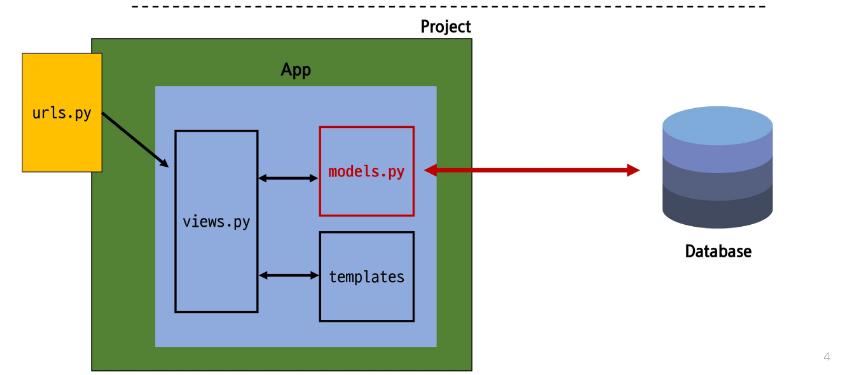
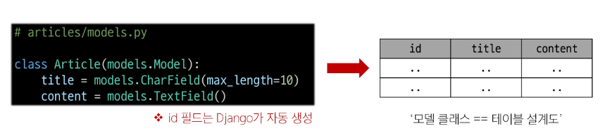
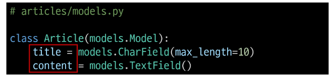
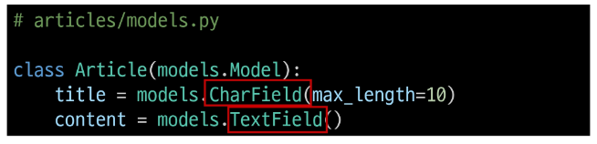
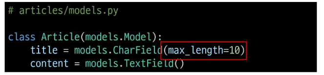
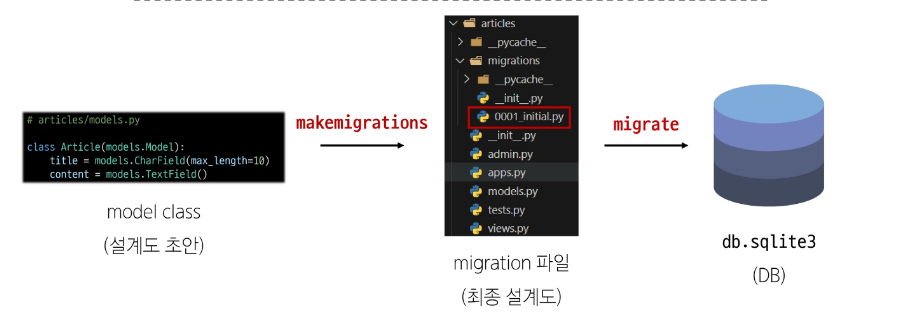
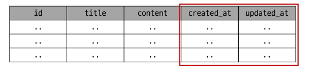
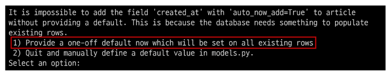
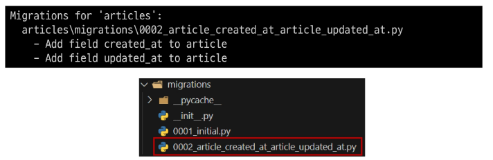

# Django Model & ORM
<details>
<summary> 목차 </summary>

1. Model

2. Migrations

3. Admin site

4. ORM
  - QuerySet API
  - QuerySet API 실습
    - CRUD

5. Django Serializer
  - 개요
  - serializer class
  - CRUD with ModelSerializer

</details>

## 1. Model
#### Model을 통한 DB(데이터베이스) 관리


#### Django Model
  - DB의 테이블을 정의하고 데이터를 조작할 수 있는 기능들을 제공
    - > 테이블 구조를 설계하는 **청사진(blueprint)**

#### model 클래스 작성
```python
# articles/models.py

class Article(models.Model):
  title = models.CharField(max_length=10)
  content = models.TextField()
```

#### model 클래스 살펴보기
- 작성한 모델 클래스는 최종적으로 DB에 다음과 같은 테이블 구조를 만듦

  

- `django.db.models` 모듈의 Model이라는 부모 클래스를 상속받음
- Model은 model에 관련된 모든 코드가 이미 작성되어 있는 클래스
- > 개발자는 가장 중요한 <span style='color:red'>테이블 구조를 어떻게 설계할지에 대한 코드만 작성하도록</span> 하기 위한 것(상속을 활용한 프레임워크의 기능 제공)

1. 클래스 변수명
  - 테이블의 각 "필드(열) 이름"

    

2. model Field 클래스
  - 테이블 필드의 "데이터 타입"

  

3. model Field 클래스의 키워드 인자(필드 옵션)
  - 테이블 필드의 "제약조건" 관련 설정

  

#### 제약 조건
- 데이터가 올바르게 저장되고 관리되도록 하기 위한 규칙
- > ex) 숫자만 저장되도록, 문자가 100자까지만 저장되도록 하는 등

## 2. Migrations
#### Migrations
  - model 클래스의 변경사항(필드 생성, 수정 삭제 등)을 DB에 최종 반영하는 방법

#### Migrations 과정


#### Migrations 핵심 명령어 2가지
1. `$ python manage.py makemigrations`
  - model class를 기반으로 최종 설계도(migration) 작성

2. `$ python manage.py migrate`
  - 최종 설계도를 DB에 전달하여 반영

#### migrate 후 DB 내에 생성된 테이블 확인
- Article 모델 클래스로 만들어진 articles_article 테이블

### 추가 Migrations
#### 이미 생성된 테이블에 필드를 추가해야 한다면?


#### 추가 모델 필드 작성
```python
# articles/models.py

class Article(models.Model):
  title = models.CharField(max_length=10)
  content = models.TextField()
  created_at = models.DateTimeField(auto_now_add = True) ## 생설될 때만 저장
  updated_at = models.DateTimeField(auto_now = True) ## 업데이트될 때마다 저장
```

- 이미 기존 테이블이 존재하기 때문에 필드를 추가할 때 필드의 기본값 설정이 필요
  ```bash
  $ python manage.py makemigrations
  ```
- 1번은 현재 대화를 유지하면서 직접 기본값을 입력하는 방법
- 2번은 현재 대화에서 나간 후 models.py에 기본값 관련 설정을 하는 방법
  

- 추가하는 필드의 기본값을 입력해야 하는 상황
- 날짜 데이터이기 때문에 직접 입력하기보다 Django가 제안하는 기본 값을 사용하는 것을 권장
- 아무것도 입력하지 않고 enter를 누르면 Django가 제안하는 기본 값으로 설정됨
- migrations 과정 종료 후 2번째 migration 파일이 생성됨을 확인
- 이처럼 Django는 설계도를 쌓아가면서 추후 문제가 생겼을 시 복구하거나 되돌릴 수 있도록 함(마치 `git commit`과 유사)

  

- migrate 후 테이블 필드 변화 확인
  - `$ python manage.py migrate`

#### model class에 변경사항(1)이 생겼다면, 반드시 새로운 설계도를 생성(2)하고, 이를 DB에 반영(3)해야 한다.
1. model class 변경
2. makemigraitons
3. migrate

### 모델 필드
#### Model Field
- DB 테이블의 필드(열)을 정의하며, 해당 필드에 저장되는 데이터 타입과 제약조건을 정의

## 4. ORM
#### ORM (Object - Relational - Mapping)
- 객체 지향 프로그래밍 언어를 사용하여 호환되지 않는 유형의 시스템 간에 데이터를 변환하는 기술

#### ORM의 역할
  - 사용하는 언어가 다르기 때문에 소통 불가
  - Django에 내장된 ORM이 중간에서 이를 해석

### QuerySet API
#### QuerySet API
  - ORM에서 데이터를 검색, 필터링, 정렬 및 그룹화하는 데 사용하는 도구
    - > API를 사용하여 SQL이 아닌 Python 코드로 데이터를 처리

#### QuerySet API 구문
`Article.objects.all()`
- Article : Model class
- objects : Manager
- all() : QuerySet API

#### Query
- 데이터베이스에 특정한 데이터를 보여 달라는 요청
- "쿼리문을 작성한다."
  - > 원하는 데이터를 얻기 위해 데이터베이스에 요청을 보낼 코드를 작성한다.
- 파이썬으로 작성한 코드가 ORM에 의해 SQL로 변환되어 데이터베이스에 전달되며, 데이터베이스의 응답 데이터를 ORM이 QuerySet이라는 자료 형태로 변환하여 우리에게 전달

#### QuerySet
- 데이터베이스에게서 전달받은 객체 목록(데이터 모음)
  - 순회가 가능한 데이터로써 1개 이상의 데이터를 불러와 사용할 수 있음
- Django ORM을 통해 만들어진 자료형
- 단, 데이터베이스가 단일한 객체를 반환할 때는 QuerySet이 아닌 모델(Class)의 인스턴스로 반환됨

#### QuerySet API는 python의 모델 클래스와 인스턴스를 활용해 DB에 데이터를 저장, 조회, 수정, 삭제하는 것

### QuerySet API 실습

## 5. Django Serializer
### 개요
#### Serialization (직렬화)
- 여러 시스템에서 활용하기 위해 데이터 구조나 객체 상태를 나중에 재구성할 수 있는 포맷으로 변환하는 과정

#### Serialization 예시
- 데이터 구조나 객체 상태를 나중에 재구성할 수 있는 포맷으로 변환하는 과정

### Serializer Class
#### Serializer
  - Serialization을 진행하여 Serialized data를 반환해주는 클래스

#### ModelSerializer
  - Django 모델과 연결된 Serializer 클래스
    - > 일반 Serializer와 달리 사용자 입력 데이터를 받아 자동으로 모델 필드에 맞추어 Serialization을 진행


> 주연아... 필기 너무 잘했다... 무슨일이야... 루팡해가야지 하하하하하
  와 그리고 소리 너무좋아!! 오빠가 탐내는 이유 파악 완료 하하하하하 계속 치게 되네 앞으로 많은 필기 부탁해 소리가 좋으니까 (그리고 주연이도 좋아 하하하하ㅏ)