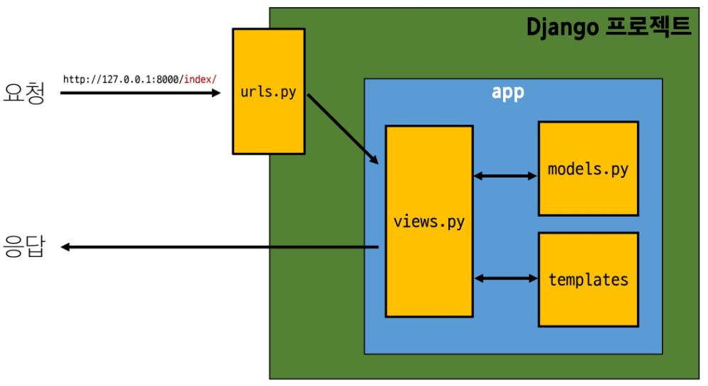

# Django Web Framework
<details>
<summary> 목차 </summary>

1. Web Application
  - 클라이언트와 서버
  - Frontend & Backend

주여나 피곤해 집에 가고 싶어 ai 시러시러시러시러시러시러시러

2. Django Framework
  - 개요
  - 가상환경
  - Django Design Pattern
  - Django Project & App

3. REST API
  - 개요
  - 자원의 식별, 행위, 표현
  - 요청과 응답
  - Django URLs
    - 변수와 URL
    - APP과 URL
  - JsonResponse
</details>

## Web Application
### 개요
#### Web Application (web service) 개발
- 인터넷을 통해 사용자에게 제공되는 소프트웨어 프로그램을 구축하는 과정
- 다양한 디바이스(모바일, 태블릿, PC 등)에서 웹 브라우저를 통해 접근하고 사용할 수 있음

### 클라이언트와 서버
#### 웹의 동작 방식
- 우리가 컴퓨터 혹은 모바일 기기로 웹 페이지를 보게 될 때까지 무슨 일이 일어날까?


#### 클라이언트(Client)
- 서비스를 요청하는 주체
  (웹 사용자의 인터넷이 연결된 장치, 웹 브라우저)

#### 서버(Server)
  - 클라이언트의 요청에 응답하는 주체
    (웹 페이지, 앱을 저장하는 컴퓨터)

#### 우리가 웹 페이지를 보게 되는 과정


1. 웹 브라우저(클라이언트)에서 'google.com'을 입력
2. 브라우저는 인터넷에 연결된 전세계 어딘가에 있는 구글 컴퓨터(서버)에게 'Google 홈페이지.html' 파일을 달라고 요청
3. 요청을 받은 구글 컴퓨터는 데이터 베이스에서 'Google 홈페이지.html'파일을 찾아 응답
4. 전달받은 "Google 홈페이지.html' 파일을 사람이 볼 수 있도록 웹 브라우저가 해석해주면서 사용자는 구글의 메인 페이지를 보게 됨

### Fronted & Backend
#### 웹 개발에서의 Frontend와 Backend
- Fronted(프론트엔드)
  - 사용자 인터페이스(UI)를 구성하고, 사용자가 애플리케이션과 상호작용할 수 있도록 함
  - > HTML, CSS, JavaScript, 프론트엔드 프레임워크 등

- Backend(백엔드)
  - 서버 측에서 동작하며, 클라이언트의 요청에 대한 처리와 데이터베이스와의 상호작용 등을 담당
  - > 서버 언어(Python, Java 등) 및 백엔드 프레임워크, 데이터베이스, API, 보안 등

## Framework
### Web Framework
#### '웹 서비스 개발'에는 무엇이 필요할까?
- 로그인, 로그아웃, 회원관리, 데이터베이스, 보안 등.. 너무 많은 기술들이 필요
- 하나부터 열까지 개발자가 모두 작성하는 것은 현실적으로 어려움
- 하지만 모든 걸 직접 만들 필요가 없음
- 잘 만들어진 것들을 가져와 좋은 환경에서 내 것으로 잘 사용하는 것도 능력인 시대

#### Web Framework
- 웹 애플리케이션을 빠르게 개발할 수 있도록 도와주는 도구 (개발에 필요한 기본 구조, 규칙,라이브러리 등을 제공)

### Django framework
#### Django
- Python 기반의 대표적인 웹 프레임워크

#### 왜 Django를 사용할까?
- 다양성
  - Python 기반으로 소셜 미디어 및 빅데이터 관리 등 광범위한 서비스 개발에 적합
- 확장성
  - 대량의 데이터에 대해 빠르고 유연하게 확장할 수 있는 기능을 제공
- 보안
  - 취약점으로부터 보호하는 보안 기능이 기본적으로 내장되어 있음
- 커뮤니티 지원
  - 개발자를 위한 지원, 문서 및 업데이터를 제공하는 활성화된 커뮤니티

#### 검증된 웹 프레임워크
- 대규모 서비스에서도 안정적인 서비스 제공
  - Spotify, Instagram, Dropbox, Delivery Hero

#### 가장 인기있는 Backend Framework
1. Laravel
2. Django
3. Spring
4. Flask
5. Express JS

#### Django를 사용해서 서버를 구현할 것

### 가상 환경
#### 가상 환경
- Python 애플리케이션과 그에 따른 패키지들을 격리하여 관리할 수 있는 <span style='color:red'>독립적인</span> 실행 환경

#### 가상 환경이 필요한 시나리오 1
1. 한 개발자가 2개의 프로젝트(A와 B)를 진행해야 한다.
2. 프로젝트 A는 requests 패키지 버전 1을 사용해야 한다.
3. 프로젝트 B는 requests 패키지 버전 2를 사용해야 한다.
4. 하지만 파이썬 환경에서 패키지는 1개의 버전만 존재할 수 있다.
5. A와 B 프로젝트의 다른 패키지 버전 사용을 위한 <span style='color:red'>독립적인 개발 환경</span>이 필요하다.

#### 가상 환경이 필요한 시나리오 2
1. 한 개발자가 2개의 프로젝트(A와 B)를 진행해야 한ㄷ다.
2. 프로젝트 A는 water라는 패키지를 사용해야 한다.
3. 프로젝트 B는 fire라는 패키지를 사용해야 한다.
4. 하지만 파이썬 환경에서 water 패키지와 fire 패키지를 함께 사용하면 충돌이 발생하기 때문에 설치할 수 없다.
5. A와 B 프로젝트의 패키지 충돌을 피하기 위해 각각 <span style='color:red'>독립적인 개발 환경</span>이 필요하다.

#### 환경 구조 예시


#### 1. 가상 환경 venv 생성
`$ python -m venv venv`

#### 2. 가상 환경 활성화
`$ source venv/Scripts/activate`

#### 3. 환경에 설치된 패키지 목록 확인
```bash
$ pip list
  Package       Version
  -----------   --------
  pip           23.0.1
  setuptools    58.1.0
```

#### 패키지 목록이 필요한 이유
- 만약 2명(A와 B)의 개발자가 하나의 프로젝트를 함께 개발한다고 하자.
- 팀원 A가 먼저 가상 환경을 생성 후 프로젝트를 설정하고 관련된 패키지를 설치하고 개발하다가 협업을 위해 github에 프로젝트를 push한다.
- 팀원 B는 해당 프로젝트를 clone 받고 실행해보려 하지만 실행되지 않는다.
- 팀원 A가 이 프로젝트를 위해 어떤 패키지를 설치했고, 어떤 버전을 설치했는지 A의 가상 환경 상황을 알 수 없다.
- 가상 환경에 대한 정보 즉 <span style='color:red'>패키지 목록</span>이 공유되어야 한다.

#### 의존성 패키지
- 한 소프트웨어 패키지가 다른 패키지의 기능이나 코드를 사용하기 때문에 그 패키지가 존재해야만 제대로 작동하는 관계
- 사용하려는 패키지가 설치되지 않았거나, 호환되는 버전이 아니면 오류가 발생하거나 예상치 못한 동작을 보일 수 있음

#### 의존성 패키지 예시
- requests 설치 후 설치되는 패키지 목록 변화 (단순히 1개만 설치되는 것이 아님)

#### 4. 의존성 패키지 목록 생성
`$ pip freeze > requirements.txt`

#### 의존성 패키지 관리의 중요성
- 개발 환경에서는 각각의 프로젝트가 사용하는 패키지와 그 버전을 정확히 관리하는 것이 중요
- **<p style='font-size:20px;'> 가상 환경 & 의존성 패키지 관리**

#### [번외] 패키지 목록 기반 설치
- 처음부터 requirements.txt를 받은 상태로 진행하는 경우, 가상환경 활성화 후 requirements.txt 기반으로 패키지 설치가 필요
(가상환경 폴더 venv는 .gitignore에 의해 공유되지 않음)
- `$ pip install -r requirements.txt`

### Django 프로젝트
#### Django 프로젝트 생성 전 루틴
```bash
# 1. 가상환경(venv) 생성
$ python -m venv venv

# 2. 가상환경 활성화
$ source venv/Scripts/activate

# 3. Django 설치
$ pip install django

# 4. 의존성 파일 생성
$ pip freeze > requirements.txt
```

#### Django 프로젝트 생성
- `$ django-admin startproject firstpjt .`

#### Django 서버 실행
- `$ python manage.py runserver`

#### 서버 확인
- 'http://127.0.0.1:8000/' 접속 후 확인

## Django Design Pattern
### 개요
#### 디자인 패턴
- 소프트웨어 설계에서 발생하는 문제를 해결하기 위한 일반적인 해결책 (공통적인 문제를 해결하는 데 쓰이는 형식화된 관행)
- > "애플리케이션의 구조는 이렇게 구성하자"라는 관행

#### MVC 디자인 패턴(Model, View, Controller)
- 애플리케이션을 구조화하는 대표적인 패턴
- ("데이터" & "사용자 인터페이스" & "비즈니스 로직"을 분리)
- > <span style='color:red'>시각적 요소와 뒤에서 실행되는 로직을 서로 영향 없이, 독립적이고 쉽게 유지 보수할 수 있는 애플리케이션을 만들기 위해</span>
- Django에서 애플리케이션을 구조화하는 패턴
- (기존 MVC 패턴과 동일하나 단순히 명칭을 다르게 정의한 것)
- View --> Template
- Controller ---> View
  - > 단순한 명칭 변경

### Project & App
#### 프로젝트와 앱
```
Project
 -----------------------
|   app A     app B     |
|   -----     ------    |
|  |     |   |      |   |
|  |     |   |      |   |
|  |     |   |      |   |
|   -----     ------    |
|                       |
 -----------------------
```

 #### Django project
 - 애플리케이션의 집합(DB 설정, URL 연결, 전체 앱 설정 등을 처리)

#### Django application
- 독립적으로 작동하는 기능 단위 모듈
- (각자 특정한 기능을 담당하며 다른 앱들과 함께 하나의 프로젝트를 구성)

#### 만약 온라인 커뮤니티 카페를 만든다면?
1. 프로젝트
  - 카페(전체 설정 담당)

2. 앱
  - 게시글, 댓글, 회원 관리 등(DB, 인증, 화면)

#### 앱을 사용하기 위한 순서
1. 앱 생성
  - 앱의 이름은 '복수형'으로 지정하는 것을 권장
  - `$ python manage.py startapp articles`

2. 앱 등록
  - 반드시 <span style='color:red'>앱을 생성한 후에 등록</span>해야 함 (등록 후 생성은 불가능)
  ```python
  # settings.py

  INSTALLED_APPS = [
    'articles',
    'django.contrib.admin',
    'django.contrib.auth',
    'django.contrib.contenttypes',
    'django.contrib.sessions',
    'django.contrib.messages',
    'django.contrib.staticfiles',
  ]
  ```
#### 프로젝트 구조
- settings.py
  - 프로젝트의 모든 설정을 관리
- urls.py
  - 요청 들어오는 URL에 따라 이에 해당하는 적절한 views를 연결
- __init__.py
  - 해당 폴더를 패키지로 인식하도록 설정하는 파일
- asgi.py
  - 비동기식 웹 서버와의 연결 관련 설정
- wsgi.py
  - 웹 서버와의 연결 관련 설정
- manage.py
  - Django 프로젝트와 다양한 방법으로 상호작용하는 커맨드라인 유틸리티

#### 앱 구조
- admin.py
  - 관리자용 페이지 설정
- models.py
  - DB와 관련된 Model을 정의
  - MTV 패턴의 M
- views.py
  - HTTP 요청을 처리하고 해당 요청에 대한 응답을 반환(url, model, template과 연계)
  - MTV의 V
- apps.py
  - 앱의 정보가 작성된 곳
- tests.py
  - 프로젝트 테스트 코드를 작성하는 곳

## REST API
### 개요
#### API(Application Programming Interface)
- 두 소프트웨어가 서로 통신할 수 있게 하는 메커니즘
- > 클라이언트 - 서버처럼 서로 다른 프로그램에서 요청과 응답을 받을 수 있도록 만든 체계

#### API 예시
- 기상 데이터가 들어있는 기상청의 시스템
- 스마트폰의 날씨 앱, 웹 사이트의 날씨 정보 등 다양한 서비스들이 이 기상청 시스템으로부터 데이터를 요청해서 받아 감

- 날씨 데이터를 얻으려면?
  - 기상청 시스템에는 정보들을 요청하는 지정된 형식이 있음
  - 지역, 날짜, 조회할 내용들(온도, 바람 등)을 제공하는 매뉴얼

-<span style='color:red'>"이렇게 요청을 보내면, 이렇게 정보를 제공해줄 것이다"</span>라는 매뉴얼
  - 소프트웨어와 소프트웨어 간 지정된 정의(형식)으로 소통하는 수단 -> API
- > 스마트폰의 날씨 앱은 기상청에서 제공하는 API를 통해 기상청 시스템과 대화하여 매일 최신 날씨 정보를 표시할 수 있음

#### API 역할
- 예를 들어 우리 집 냉장고에 전기를 공급해야 한다고 가정해보자
- 우리는 그냥 냉장고의 플러그를 소켓에 꽂으면 제품이 작동한다.
- 중요한 것은 우리가 가전 제품에 "전기를 공급하기 위해 직접 배선을 하지 않는다"는 것이다.
- 이는 매우 위험하면서도 비효율적인 일이기 때문이다.
- > 복잡한 코드를 추상화하여 대신 사용할 수 있는 몇 가지 더 쉬운 구문을 제공

#### Web API
- 웹 서버 또는 웹 브라우저를 위한 API
- 현재 웹 개발은 하나부터 열까지 직접 개발하기보다 여러 Open API들을 활용하는 추세
- 대표적인 Third Party Open API 서비스 목록
  - YOUTUBE API
  - Google Map API
  - Naver Papago API
  - Kakao Map API

#### REST(Representational State Transfer)
- API Server를 개발하기 위한 일종의 소프트웨어 설게 "방법론"
- > 모두가 API Server를 설계하는 구조가 다르니 이렇게 맞춰서 설계하는 게 어때? : "규칙X"

#### RESTful API
- REST 원리를 따르는 시스템을 RESTful하다고 부름
- <span style='color:red'>"자원을 정의"</span>하고 <span style='color:red'>"자원에 대한 주소를 지정"</span>하는 전반적인 방법을 서술
- > "각각 API 서버 구조를 작성하는 모습이 너무 다르니 어느 정도 약속을 만들어서 다같이 API 서버를 구성하자!"

#### REST API
- REST라는 설계 디자인 약속을 지켜 구현한 API

#### REST에서 자원을 사용하는 법 3가지
1. 자원의 "식별"
  - URI
2. 자원의 "행위"
  - HTTP Methods
3. 자원의 "표현"
  - JSON 데이터

### 자원의 식별
#### URI(Uniform Resource Identifier : 통합 자원 식별자)
- 인터넷에서 리소스(자원)를 식별하는 문자열
- > 가장 일반적인 URI는 웹 주소로 알려진 URL

#### URL(Uniform Resource Locator : 통합 자원 위치)
- 웹에서 주어진 리소스의 주소
- > 네트워크 상에 리소스가 어디 있는지를 알려주기 위한 약속
- `http://www.example.com:80/path/to/myfile.html?key1=value1&key2=value2#SomewhereInTheDocument`
  - Scheme : `http`
  - Domain Name : `www.example.com`
  - Port : `80`
  - Path to the file : `/path/to/myfile.html`
  - Parameters : `?key1=value1&key2=value2`
  - Anchor : `#SomewhereInTheDocument`

#### Schema (or Protocol)
- 브라우저가 리소스를 요청하는 데 사용해야 하는 규약
- URL의 첫 부분은 브라우저가 어떤 규약을 사용하는지를 나타냄
- 기본적으로 웹은 http(s)를 요구하며 메일을 열기 위한 mailto:, 파일을 전손하기 위한 ftp: 등 다른 프로토콜도 존재

#### Domain Name
- 요청 중인 웹 서버를 나타냄
- 어떤 웹 서버가 요구되는지를 가리키며 직접 IP 주소를 사용하는 것도 가능하지만, 사람이 외우기 어렵기 때문에 주로 Domain Name으로 사용
- 예를 들어 도메인 google.com의 IP 주소는 142.251.42.142

#### Port
- 웹 서버의 리소스에 접근하는데 사용되는 기술적인 문(Gate)
- HTTP 프로토콜의 표준 포트
  - HTTP - 80
  - HTTPS - 443
- 표준 포트만 작성 시 생략 가능

#### Path
- 웹 서버의 리소스 경로
- 초기에는 실제 파일이 위치한 물리적 위치를 나타냈지만, 오늘날은 실제 위치가 아닌 추상화된 형태의 구조를 표현
- 예를 들어 /articles/create/라는 주소가 실제 articles 폴더 안에 create 폴더 안을 나타내는 것은 아님

#### Parameter
- 웹 서버에 제공하는 추가적인 데이터
- '&' 기호로 구분되는 key-value 쌍 목록
- 서버는 리소스를 응답하기 전에 이러한 파라미터를 사용하여 추가 작업을 수행할 수 있음

#### Anchor
- 일종의 "북마크"를 나타내며 브라우저에 해당 지점에 있는 콘텐츠를 표시
- fragment identifier(부분 식별자)라고 부르는 '#' 이후 부분은 서버에 전송되지 않음
- `hhtps://docs.djangoproject.com/en/5.2/intro/install/#quick-install-guide` 요청에서 `#quick-install-guide`는 서버에 전달되지 않고 브라우저에게 해당 지점으로 이동할 수 있도록 함

### 자원의 행위
#### HTTP Request Methods
- 리소스에 대한 행위(수행하고자 하는 동작)를 정의
- > HTTP verbs 라고도 함

#### 대표 HTTP Request Methods
1. GET
  - 서버에 리소스의 표현을 요청
  - GET을 사용하는 요청은 데이터만 검색해야 함

2. POST
  - 데이터를 지정된 리소스에 제출
  - 서버의 상태를 변경

3. PUT
  - 요청한 주소의 리소스를 수정

4. DELETE
  - 지정된 리소스를 삭제

#### HTTP response status codes
- 특정 HTTP 요청이 성공적으로 완료되었는지 여부를 나타냄

#### HTTP response status codes
- 5개의 응답 그룹
  1. 100-199 (Informational responses, 정보성 응답)
    - 요청은 정상적으로 수신되었고, 계속 진행해도 된다는 임시 응답
    - 예 : 100 Continue, 101 Switching Protocols
  2. 200-299 (Successful responses, 성공 응답)
    - 요청이 성공적으로 처리되었다는 뜻
    - 예
      - 200 OK : 요청 성공
      - 201 Created : 새로운 리소스가 생성됨
      - 204 No Content : 성공했지만 응답 데이터 없음
  3. 300-399 (Redirection messages, 리다이렉션)
    - 클라이언트가 요청한 리소스가 다른 곳에 있다는 뜻 -> 다른 URL로 이동 필요
    - 예
      - 301 Moved Permanently : 영구 이동
      - 302 Found : 임시 이동
      - 304 Not Modified : 캐시 사용해도 됨
  4. 400-499 (Client error responses, 클라이언트 오류)
    - 요청에 문제가 있어서 서버가 처리할 수 없다는 뜻
    - 예
      - 400 Bad Request : 잘못된 요청
      - 401 Unauthorized : 인증 필요
      - 403 Forbidden : 권한 없음
      - 404 Not Found : 해당 리소스 없음
5. 500-599 (Server error responses, 서버 오류)
  - 서버 쪽에서 요청은 이해했지만 내부 문제로 처리 실패
  - 예
    - 500 Internal Server Error : 서버 내부 오류
    - 502 Bad Gateway : 게이트웨이 문제
    - 503 Service Unavailable : 서버 과부하 / 점검 중
    - 504 Gateway Timeout : 게이트웨이 응답 시간 초과

### 자원의 표현
#### 현재 Django가 응답(자원을 표현)하는 것
- Django는 Full Stack framework에 속하기 때문에 기본적으로 사용자에게 페이지(html)를 응답한다.
- 하지만 서버가 응답할 수 있는 것은 페이지뿐만 아니라 다양한 데이터 타입을 응답할 수 있음
- REST API는 이 중에서도 <span style='color:red'>JSON</span> 타입으로 응답하는 것을 권장

#### 응답 데이터 타입의 변화
- 페이지(html)만을 응답했던 서버
- 이제는 JSON 데이터를 응답하는 REST API 서버로의 변환
- Django는 더 이상 Template 부분에 대한 역할을 담당하지 않게 되며, 본격적으로 Front-end와 Back-end가 분리되어 구성됨
- 이제부터 Django를 사용해 RESTful API 서버를 구축할 것

## 요청과 응답
### DRF
#### Django REST framework (DRF)
- Django에서 RESTful API 서버를 쉽게 구축할 수 있도록 도와주는 오픈소스 라이브러리

### Django URLs
#### Django와 요청 & 응답
```
                         ---------------------------------------------------
                        |                                    Django 프로젝트 |
                     ---------                                              |
                    |         |                                             |
                    |         |                                             |
      요청  -------->| urls.py |\ 2 ------------------------------------     |
                    |         | \ |                app                 |    |
                    |         |  \|                                    |    |
                     ---------    |↘ ----------                        |    |
                        |         | |          |          -----------  |    |
                        |         | |          |         |           | |    |
                        |         | |          | <-----> | models.py | |    |
                        |         | |          |         |           | |    |
                        |         | | views.py |          -----------  |    |
                        |         | |          |          -----------  |    |
                        |         | |          |         |           | |    |
      응답 <-------------------------|          | <-----> | templates | |    |
                        |         | |          |         |           | |    |
                        |         |  ----------           -----------  |    |
                        |         |                                    |    |
                        |          ------------------------------------     |
                         ---------------------------------------------------
```

#### 요청과 응답에서 Django URLs의 역할


#### URL dispatcher (운항 관리자, 분배기)
- URL 패턴을 정의하고 해당 패턴이 일치하는 요청을 처리할 view함수를 연결(매핑)

#### 1. URLs
```python
# urls.py

from django.contrib import admin
from django.urls import path
from articles import views ## 중요
# articles 패키지에서 views모듈을 가져오는 것

urlpatterns = [
  path('admin/', admin.site.urls),
  path('index/', views.index),  ## 중요
  # url 경로는 반드시 '/'(slash)로 끝나야 함
]
```
- `http://127.0.0.1:8000/index/`로 요청이 왔을 떄 views 모듈의 view 함수 index를 호출

#### Django와 요청 & 응답


#### 2. View
```python
# views.py

from django.http import JsonResponse
from rest_framework.decorators import api_view

# Create your views here.
@api_view(["GET"])
def index(request):
  return JsonResponse({"message": "Hello, world!"})
```
- Json 응답 객체를 반환하는 index view 함수 정의
- <span style='color:red'> 모든 view 함수는 첫번째 인자로 request 요청 객체를 필수적으로 받음 </span>
- <span style='color:red'> 매개변수 이름이 request가 아니어도 되지만 그렇게 작성하지 않음 </span>
  
#### @api_view()
- DRF view 함수에서는 <span style='color:red'> 필수로 작성 </span>되며 view 함수를 실행하기 전 HTTP 메서드를 확인
- 기본적으로 GET 메서드만 허용되며 다른 메서드 요청에 대해서는 **405 Method Not Allowed**로 응답
- DRF view 함수가 응답해야 하는 HTTP 메서드 목록을 작성

#### JsonResponse()
- Django에 내장된 HTTP 응답 클래스
- 첫번째 위치 인자로 JSON으로 변환 가능한 데이터를 받아와 응답 객체를 반환해준다.
- <span style='color:red'> 필요시 http response의 응답 코드도 설정하여 반환 가능 </span>

  ```python
  from django.http import JsonResponse
  from rest_framework.decorators import api_view

  # Create your views here.
  @api_view(["GET", "POST"])
  def index(request):
    if request.method == "POST":
      return JsonResponse({"data" : request.data})
    return JsonResponse({"message" : "Hello, world!"})
  ```
- view 함수의 첫번째 인자 request는 httpRequest 객체를 받아 옵니다.
- HTTP 메소드, 요청 데이터, 사용자 정보 등 request 객체를 활용하여 요청 데이터를 처리하고 적절한 응답을 생성할 수 있습니다.

### 변수와 URL
#### 현재 URL 관리의 문제점
- 템플릿의 많은 부분이 중복되고, URL의 일부만 변경되는 상황이라면 계속해서 비슷한 URL과 함수를 작성해 나가야 할까?
  ```python
  urlpatterns = [
    path('articles/1/', ...),
    path('articles/2/', ...),
    path('articles/3/', ...),
    path('articles/4/', ...),
    path('articles/5/', ...),
  ]
  ```

#### Variable Routing
- URL 일부에 변수를 포함시키는 것
- (변수는 view 함수의 인자로 전달할 수 있음)

#### Variable routing 작성법
- <path_converter : variable_name>
  ```python
  path('articles/<int:num>/', views.detail)
  path('hello/<str:name>/', views.greeting)
  ```

#### Path converters
- URL 변수의 타입을 지정
- (str, int 등 5가지 타입 지원)

#### Variable routing 실습
```python
# urls.py

urlpatterns = [
  path('hello/<str:name>/', views.greeting),
]

# views.py

@api_view(["GET"])
def greeting(request, name):
  context = {
    'name' : name,
  }
  return JsonResponse(context)
```
```python
# urls.py

urlpatterns = [
  path('articles/<int:num>/', views.detail),
]

# views.py
@api_view(["GET"])
def detail(request, num):
  context = {
    'num' : num,
  }
  return JsonResponse(context)
```

### App과 URL
#### App URL mapping
- 각 앱에 URL을 정의하는 것
- > 프로젝트와 각 앱이 URL을 나누어 관리를 편하게 하기 위함

#### 2번째 앱 pages 생성 후 발생할 수 있는 문제
- view 함수 이름이 같거나 같은 패턴의 URL 주소를 사용하게 되는 경우
- 아래 코드와 같이 해결해 볼 수 있으나 더 좋은 방법이 필요
- > <span style='color:red'> "URL을 각자 app에서 관리하자" </span>
  ```python
  # firstpjt/urls.py

  from articles import views as articles_views
  from pages import views as pages_views

  urlpatterns = [
    ...,
    path('pages', pages_views.index),
  ]
  ```

#### 변경된 url 구조


#### url 구조 변화
```python
# firstpjt/urls.py

from django.urls import path, include

urlpatterns = [
  path('admin/', admin.site.urls),
  # path('articles/<int:num>/', views.detail),
  # path('hello/<str:name>/', views.greeting),
  # path('index/', view.index),

  path('articles/', include('articles.urls')),
  path('pages/', include('pages.urls')),
]
```
```python
# articles/urls.py

from django.urls import path
from . import views

urlpatterns = [
  path('index/', views.index),
  path('<int:num>/', views.detail),
  path('hello/<str:name>/', view.greeting),
]
```
```python
# pages/urls.py

from django.urls import path
from . import views

urlpatterns = [
  path('index/', views.index),
]
```

#### include()
- 프로젝트 내부 앱들의 URL을 참조할 수 있도록 매핑하는 함수
- > URL의 일치하는 부분까지 잘라내고, 남은 문자열 부분은 후속 처리를 위해 include된 URL로 전달

#### Include 적용
- 변경된 프로젝트의 urls.py
```python
# firstpjt/urls.py

from django.urls import path, include

urlpatterns = [
  path('admin/', admin.site.urls),
  path('articles/', include('articles.urls')),
  path('pages/', include('pages.urls')),
]
```

### 참고
#### View 함수의 request
- 클라이언트로부터 서버로 전달된 모든 정보를 포함하는 객체
- request 객체는 Django의 HttpRequest 클래스를 기반으로 함

#### MTV 디자인 패턴 정리
- Model
  - 데이터와 관련된 로직을 관리
  - 응용프로그램의 데이터 구조를 정의하고 데이터베이스의 기록을 관리
- Template
  - 레이아웃과 화면을 처리
  - 화면상의 사용자 인터페이스 구조와 레이아웃을 정의
- View
  - Model & Template과 관련한 로직을 처리해서 응답을 반환
  - 클라이언트의 요청에 대해 처리를 분기하는 역할
- View 예시
  - 데이터가 필요하다면 model에 접근해서 데이터를 가져오고,
  - 가져온 데이터를 template으로 화면을 구성하고,
  - 구성된 화면을 응답으로 만들어 클라이언트에게 반환

#### 지금까지 나온 Django의 규칙
1. `urls.py`에서 각 url 경로는 반드시 '/'로 끝남
2. `views.py`에서 모든 view 함수는 첫번째 인자로 요청 객체를 받음
  - 매개변수 이름은 반드시 request로 저장
3. Django는 정해진 경로에 있는 template 파일만 읽어올 수 있음
  - app폴더/templates/ 이후

#### 프레임워크의 규칙
- 프레임워크를 사용할 때는 일정한 규칙을 따라야 하며 이는 저마다의 설계 철학이나 목표를 반영하고 있음
  - 일관성 유지, 보안 가오하, 유지보수성 향상, 최적화 등과 같은 이유
- > 프레임워크는 개발자에게 도움을 주는 도구와 환경을 제공하기 위해 규칙을 정해 놓은 것이며 우리는 이를 잘 활용하여, 특정 기능을 구현하는 방법을 표준화하고 개발 프로세스를 단순화할 수 있도록 해야 함