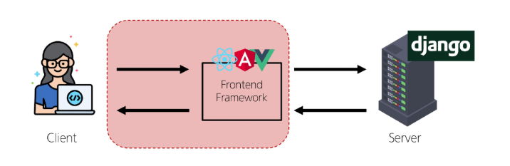
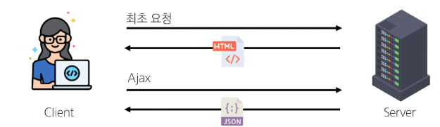
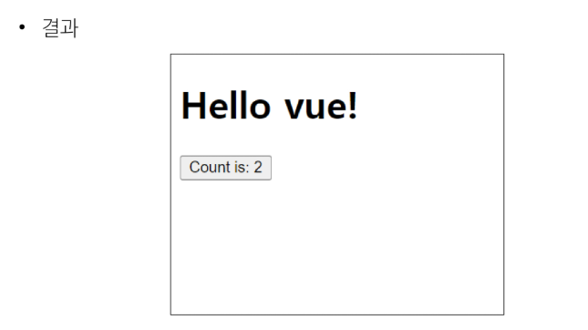
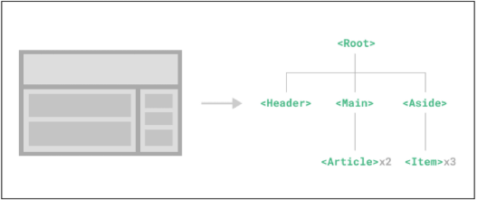

# Introduction of Vue

<details>
<summary>목차</summary>

1. Frontend Development
   - Client-side frameworks
   - SPA

2. Vue
   - What is Vue
   - Vue Style Guid

3. Vue Tutorial
    
4. Single-FIle Components
    - Component
    - SFC 문법

5. Node

6. SFC build tool
    - Vite
    - 모듈과 번들러

7. Vue 프로젝트
    - 프로젝트 구조

8.  Vue Component 활용

</details>

## 1. Frontend Development
### 1) Client-side frameworks
#### Frontend Development
- 웹사이트와 웹 애플리케이션의 사용자 인터페이스(UI)와 사용자 경험(UX)을 만들고 디자인하는 것
- > HTML, CSS, JavaScript 등을 활용하여 사용자가 직접 상호작용하는 부분을 개발

    

#### Client-side frameworks
- 클라이언트 측에서 UI와 상호작용을 개발하기 위해 사용되는 JavaScript 기반 프레임워크
  
#### Client-side frameworks가 필요한 이유 - <"웹에서 하는 일이 많아졌다.">
1. 단순히 무언가를 읽는 곳 → 무언가를 하는 곳
    - 사용자는 이제 웹에서 문서만을 읽는 것이 아닌 음악을 스트리밍하고, 영화를 보고, 지구 반대편 사람들과 텍스트 및 영상 채팅을 통해 즉시 통신하고 있음
    - 이처럼 현대적이고 복잡한 대화형 웹 사이트를 <span style='color:red'>"웹 애플리케이션(web applications)"</span>이라 부름
    - JavaScript 기반의 Client-side frameworks가 등장하면서 매우 동적인 대화형 애플리케이션을 훨씬 더 쉽게 구축할 수 있게 됨

2. "다루는 데이터가 많아졌다."
    - 만약 친구가 이름을 변경했다면?
    - 친구 목록, 타임라인, 스토리 등 친구 이름이 출력되는 모든 곳이 함께 변경되어야 함
    - 애플리케이션의 기본 데이터를 안정적으로 추적하고 업데이트(렌더링, 추가, 삭제 등)하늩 도구가 필요
    - > <span style='color:red'>애플리케이션의 상태를 변경할 때마다 일치하도록 UI를 업데이트해야 함</span>

#### Vanilla JS만으로는 쉽지 않다.
```html
<label for = 'inputArea'> Username : </label>
<input type='text' id = 'inputArea' name = 'inputArea'>
<hr>

<h1>안녕하세요 <span id = 'username1'></span></h1>

<div>
    <span id='username2'></span>님의 친구 목록
</div>
<div>
    <span id='username3'></span>님의 알림 목록
</div>
<div>
    <span id='username4'></span>님의 친구 요청 목록
</div>
```
```javascript
const initalText = 'Unknown User'
const inputArea = document.querySelector('#inputArea')
const username1 = document.querySelector('#username1')
const username2 = document.querySelector('#username2')
const username3 = document.querySelector('#username3')
const username4 = document.querySelector('#username4')

username1.textContent = initalText
username2.textContent = initalText
username3.textContent = initalText
username4.textContent = initalText

inputArea.addEventListener('input', function (e) {
    username1.textContent = e.target.value
    username2.textContent = e.target.value
    username3.textContent = e.target.value
    username4.textContent = e.target.value
})
```
- > <span style='color:red'>불필요한 코드의 반복</span>

### 2) SPA
#### Single Page Application (SPA)
- 단일 페이지로 구성된 애플리케이션

#### SPA
- 하나의 HTML 파일로 시작하여, 사용자가 상호작용할 때마다 페이지 전체를 새로 로드하지 않고 화면의 필요한 부분만 동적으로 갱신
- 대부분 JavaScript 프레임워크를 사용하여 클라이언트 측에서 UI와 렌더링을 관리
- > CSR 방식 사용

#### Client-side Rendering(CSR)
- 클라이언트에서 화면을 렌더링하는 방식

#### CSR 동작 과정

1. 브라우저는 서버로부터 최소한의 HTML 페이지와 해당 페이지에 필요한 JavaScript 응답 받음
2. 그런 다음 클라이언트 측에서 JavaScript를 사용하여 DOM을 업데이트하고 페이지를 렌더링
3. 이후 서버는 더 이상 HTML을 제공하지 않고 요청에 필요한 데이터만 응답
- > Google Maps, Facebook, Instagrame 등의 서비스에서 페이지 갱신 시 새로고침이 없는 이유

#### CSR 장점
1. 빠른 페이지 전환
    - 페이지가 처음 로드된 후에는 필요한 데이터만 가져오면 되고 JavaScript는 전체 페이지를 새로 고칠 필요 없이 페이지의 일부를 다시 렌더링할 수 있기 때문
    - 서버로 전송되는 데이터의 양을 최소화 (서버 부하 방지)

2. 사용자 경험
    - 새로고침이 발생하지 않아 네이티브 앱과 유사한 사용자 경험을 제공

3. Frontend와 Backend의 명확한 분리
   - Frontend는 UI 렌더링 및 사용자 상호 작용 처리를 담당 & Backend는 데이터 및 API 제공을 담당
   - 대규모 애플리케이션을 더 쉽게 개발하고 유지 관리 가능

#### CSR 단점
1. 느린 초기 로드 속도
    - 전체 페이지를 보기 전에 약간의 지연을 느낄 수 있음
    - JavaScript가 다운로드, 구문 분석 및 실행될 때까지 페이지가 완전히 렌더링 되지 않기 때문

2. SEO(검색 엔진 최적화) 문제
    - 페이지를 나중에 그려 나가는 것이기 때문에 검색에 잘 노출되지 않을 수 있음
    - 검색엔진 입장에서 HTML을 읽어서 분석해야 하는데 아직 콘텐츠가 모두 존재하지 않기 때문

#### SPA vs. MPA    / CSR vs. SSR
- Multi Page Application (MPA)
  - 여러 개의 HTML 파일이 서버로부터 각각 로드
  - 사용자가 다른 페이지로 이동할 때마다 새로운 HTML 파일이 로드됨

- Server-side Rendering(SSR)
  - 서버에서 화면을 렌더링하는 방식
  - 모든 데이터가 담긴 HTML을 서버에서 완성 후 클라이언트에게 전달

## 2. Vue
### 1) What is Vue
#### Vue.js
- 사용자 인터페이스를 구축하기 위한 JavaScript 프레임워크

#### What is Vue?
- Evan You에 의해 발표(2014)
  - 학사 - 미술, 미술사 / 석사 - 디자인 & 테크놀로지 전공
  - Angular 개발팀 출신

- 최신 버전은 'Vue 3' (2024)
  - [Vuejs 정보](https://vuejs.org/)

- **Vue 2 문서에 접속하지 않도록 주의**

#### Vue 체험하기
```html
<!-- first-vue.html -->

<div id = 'app'>
    <h1>{{ message }}</h1>
    <button @click='count++'>
        Count is : {{ count }}
    </button>
</div>

<script src='https://unpkg.com/vue@3/dist/vue.global.js'></script>
<script>
    const { createApp, ref } = Vue

    const app = createApp({
        setup() {
            const message = ref('Hello vue!')
            const count = ref(0)

            return {
                message,
                count
            }
        }
    })

    app.mount('#app')
</script>
```
- 

#### Vue의 2가지 핵심 기능
1. 선언적 렌더링(Declarative Rendering)
    - 표준 HTML을 확장하는 '템플릿 구문'을 사용하여 JavaScript 상태(데이터)를 기반으로 화면에 출력될 HTML을 선언적으로 작성

2. 반응성(Reactivity)
    - JavaScript 상태(데이터) 변경을 추적하고, 변경사항이 발생하면 자동으로 DOM을 업데이트

### 2) Vue Style Guide
#### Vue Style Guide
- Vue의 스타일 가이드 규칙은 우선순위에 따라 4가지 범주로 나눔
- 규칙 범주
  - 우선순위 A : 필수(Essential)
  - 우선순위 B : 적극 권장(Strongly Recommended)
  - 우선순위 C : 권장(Recommended)
  - 우선순위 D : 주의 필요(Use with Caution)
- [Vue Style Guide](https://vuejs.org/style-guide/)

#### 우선순위 별 특징
- A : 필수 (Essential)
  - 오류를 방지하는 데 도움이 되므로 어떤 경우에도 규칙을 학습하고 준수

- B : 적극 권장 (Strongly Recommended)
  - 가독성 및 개발자 경험을 향상시킴
  - 규칙을 어겨도 코드는 여전히 실행되겠지만, 정당한 사유가 있어야 규칙을 위반할 수 있음
- C : 권장 (Recommended)
  - 일관성을 보장하도록 임의의 선택을 할 수 있음
- D : 주의 필요 (Use with Caution)
  - 잠재적 위험 특성을 고려함

## 3. Vue tutorial
#### Vue를 사용하는 방법
1. 'CDN' 방식
2. "NPM' 설치 방식

### 1) Vue Application 생성
#### Vue Application 생성하기
- CDN 작성
    ```html
    <!-- vue-instance.html -->
    <script src = 'https://unpkg.com/vue@3/dist/vue.global.js'></script>
    <script>
    </script>
    ```

#### 첫번째 Vue 작성하기
- Application instance
  - CDN에서 Vue를 사용하는 전역 Vue 객체를 불러오게 됨
  - 구조분해할당 문법으로 Vue 객체의 createApp 함수를 할당
  - 모든 Vue 애플리케이션은 **createApp** 함수로 새 **Application instance**을 생성하는 것으로 시작함

    ```html
    <!-- vue-instance.html -->

    <script src='https://unpkg.com/vue@3/dist/vue.global.js'></script>
    <script>
        const { createApp } = Vue

        const app = createApp({})
    </script>
    ```

  -  Root Component
     -  **createApp** 함수에는 객체(컴포넌트)가 전달됨
     -  모든 App에는 다른 컴포넌트들을 하위 컴포넌트로 포함할 수 있는 Root(최상위) 컴포넌트가 필요(현재는 단일 컴포넌트)

  - Mouting the App (앱 연결)
    - HTML 요소에 Vue Application instance를 탑재(연결)
    - 각 앱 인스턴스에 대해 mount()는 한 번만 호출할 수 있음
      ```html
      <!-- vue-instance.html -->

      <div id='app'></div>

      <script src = 'https://unpkg.com/vue@3/dist/vue.global.js'></script>
      <script>
        const { createApp } = Vue

        const app = createAPP({})

        app.mount('#app')
      </script>
      ```
  - setup 함수
    - 컴포넌트가 동작하기 전에 미리 준비하는 '시작점', '초기 설정용 함수'
    - 이 함수 안에서 데이터를 정의하거나, 화면에 표시할 값을 계산하거나, 각종 로직(함수)을 준비할 수 있음
    - setup에서 준비한 값들은 이후 템플릿이나 컴포넌트의 다른 부분에서 바로 사용 가능
    ```html
    <!-- vue-instance.html -->

    const app = createApp({
        setup() {}
    })
    ```

### 2) 반응형 상태
#### `ref()`
- 반응형 상태(데이터)를 선언하는 함수 (Declaring Reactive State)

#### ref 함수
- .value 속성이 있는 ref 객체로 래핑(wrapping)하여 반환하는 함수
- ref로 선언된 변수의 값이 변경되면, 해당 값을 사용하는 템플릿에서 자동으로 업데이트
- 인자는 어떠한 타입도 가능
    ```html
    
    <script>
        const { createApp, ref } = Vue

        const app = createApp({
            setup() {
                const message = ref('Hello vue!')
                console.log(message)  // ref 객체
                console.log(message.value)  // Hello vue!
            }
        })
    </script>
    ```

- 템플릿의 참조에 접근하려면 setup 함수에서 선언 및 반환 필요
- 편의상 템플릿에서 ref를 사용할 때는 .value를 작성할 필요 없음(automatically unwrapped)
  ```html
  <script>
    const app = createApp({
        setup() {
            const message = ref('Hello vue!')
            return {
                message
            }
        }
    })
  </script>
  <!-- vue-instance.html -->

  <div id='app'>
    <h1> {{ message }}</h1>
  </div>
  ```

#### `ref()`
- 반응형 상태(데이터)를 선언하는 함수
- > 반응형을 가지는 참조 변수를 만드는 것(ref === reactive reference)

### 4) Vue 기본 구조
#### Vue 기본 구조
- **createApp()**에 전달되는 객체는 Vue 컴포넌트(Component)
- 컴포넌트의 상태는 **setup()** 함수 내에서 선언되어야 하며 <span style='color:red'>객체를 반환해야 함</span>
    ```html
    <script>
        const app = createApp({
            setup() {
                const message = ref('Hello vue!')
                return {
                    message
                }
            }
        })
    </script>
    ```

#### 템플릿 렌더링
- 반환된 객체의 속성은 템플릿에서 사용할 수 있음
- **Mustache syntax**(콧수염 구문)을 사용하여 메시지 값을 기반으로 동적 텍스트를 렌더링
    ```html
    <div id='app'>
        <h1>{{ message }}</h1>
    </div>

    <script>
        const app = createApp({
            setup() {
                const message = ref('Hello vue!')
                return {
                    message
                }
            }
        })
    </script>
    ```
- 콘텐츠는 식별자나 경로에만 국한되지 않으며 유효한 JavaScript 표현식을 사용할 수 있음
- `<h1>{{ message.split('').reverse().join('') }}</h1>`

#### Event Listeners in Vue
- **'v-on'** directive를 사용하여 DOM 이벤트를 수신할 수 있음
  - <span style='color:red'>자세한 directive 학습은 다음 시간에 진행</span>
- 함수 내에서 반응형 변수를 변경하여 구성 요소 상태를 업데이트
    ```html
    <!-- event-listener.html -->

    <div id='app'>
        <button v-on:click='increment'>{{ count }}</button>
    </div>

    <script>
        const { createApp, ref } = Vue

        const app = createApp({
            setup() {
                const count = ref(0)
                const increment = function () {
                    count.value++
                }
                return {
                    count,
                    increment
                }
            }
        })
    </script>
    ```

## 4. Single-File Components
### 1) Component
#### Component
- 재사용 가능한 코드 블록

#### Component 특징
- UI를 독립적이고 재사용 가능한 일부분으로 분할하고 각 부분을 개별적으로 다룰 수 있음
- 자연스럽게 애플리케이션은 중첩된 Component의 트리 형태로 구성됨
    

#### Component 예시
- 웹 서비스는 여러 개의 Component로 이루어져 있음

#### Single-File Coomponents (SFC)
- 컴포넌트의 템플릿, 로직 및 스타일을 하나의 파일로 묶어낸 특수한 파일 형식(*.vue 파일)

#### SFC 파일 예시
- Vue SFC는 HTML, CSS 및 JavaScript를 단일 파일로 합친 것
- `<template>, <script>, <style>` 블록은 하나의 파일에서 컴포넌트의 뷰, 로직 및 스타일을 독립적으로 배치

```html
<!-- MyComponent.vue -->

<template>
    <div class='greeting'>{{ msg }}</div>
</template>

<script setup>
    import { ref } from 'vue'

    const msg = ref('Hello World!')
</script>

<style scoped>
    .greeting {
        color: red;
    }
</style>
```

### 2) SFC 문법
#### SFC 문법 개요
- 각 *.vue파일은 세 가지 유형의 최상위 언어 블록 `<template>, <script>, <style>`으로 구성됨
- > 언어 블록의 작성 순서는 상관없으나 일반적으로 template -> script -> style 순서로 작성

#### 언어 블록 - `<template>`
- 각 *.vue 파일은 최상위 `<template>` 블록을 하나만 포함할 수 있음
    ```html
    <template>
        <div class='greeting'>{{ msg }}</div>
    </template>
    ```

#### 언어 블록 - `<script setup>`
- 각 *.vue 파일은 `<script setup>` 블록을 하나만 포함할 수 있음(일반 `<script>` 제외)
- 컴포넌트의 setup() 함수로 사용되며 컴포넌트의 각 인스턴스에 대해 실행
- > 변수 및 함수는 동일한 컴포넌트의 템플릿에서 자동으로 사용 가능
```html
<script setup>
    import { ref } from 'vue'

    const msg = ref('Hello World!')
</script>
```

#### 언어 블록 - `<style scoped>`
- *.vue 파일에는 여러 `<style>` 태그가 포함될 수 있음
- scoped가 지정되면 CSS는 현재 컴포넌트에만 적용됨
```html
<style scoped>
    .greeting {
        color: red;
    }
</style>
```

#### 컴포넌트 사용하기

## 5. Node.js
####  Node.js 의 영향
- 기존에 브라우저 안에서만 동작할 수 있었던 JavaScript를 브라우저가 아닌 서버 측에서도 실행할 수 있게 함
  - > 프로트엔드와 백엔드에서 동일한 언어로 개발할 수 있게 됨
- NPM을 활용해 수많은 오픈 소스 패키지와 라이브러리를 제공하여 개발자들이 손쉽게 코드를 공유하고 재사용할 수 있게 함

#### Node Package Manager (NPM)
- Node.js의 기본 패키지 관리자

### 3) 모듈과 번들러
#### Module
- 프로그램을 구성하는 독립적인 코드 블록(*.js파일)

#### Module의 필요성
- 개발하는 애플리케이션의 크기가 커지고 복잡해지면서 파일 하나에 모든 기능을 담기가 어려워짐
- 따라서 자연스럽게 파일을 여러 개로 분리하여 관리를 하게 되었고, 이때 분리된 각 파일이 바로 모듈(module)
- > *.js 파일 하나가 하나의 모듈

#### Module의 한계
- 하지만 애플리케이션이 점점 더 발전함에 따라 처리해야 하는 JavaScript 모듈의 개수도 극적으로 증가
- 이러한 상황에서 성능 병목 현상이 발생하고 모듈 간의 의존성(연결성)이 깊어지면서 특정한 곳에서 발생한 문제가 어떤 모듈 간의 문제인지 파악하기 어려워 짐
- 복잡하고 깊은 모듈 간 의존성 문제를 해결하기 위한 도구가 필요
  - > Bundler

#### node_modules의 의존성 깊이

#### Bundler
- 여러 모듈과 파일을 하나 (혹은 여러 개)의 번들로 묶어 최적화하여 애플리케이션에서 사용할 수 있게 만들어주는 도구

#### Bundler의 역할
- 의존성 관리, 코드 최적화, 리소스 관리 등
- Bundler가 하는 작업을 Bundling이라 함
- > [참조] Vite는 Rollup이라는 Bundler를 사용하며 개발자가 별도로 기타 환경설정에 신경쓰지 않도록 모두 설정해두고 있음

## 6. SFC build tool
### 1) Vite
#### Vite
- 프론트 엔드 개발 도구
- > 빠른 개발 환경을 위한 빌드 도구와 개발 서버를 제공

#### Build
- 프로젝트의 소스 코드를 최적화하고 번들링하여 배포할 수 있는 형식으로 변환하는 과정
- 개발 중에 사용되는 여러 소스 파일 및 리소스(JavaScript. CSS, 이미지 등)를 최적화된 형태로 조합하여 최종 소프트웨어 제품을 생성하는 것
- > Vite는 이러한 빌드 프로세스를 수행하는 데 사용되는 도구
- 