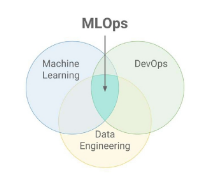
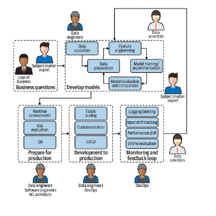
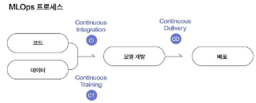
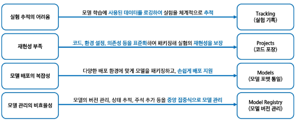
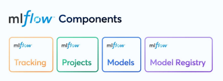
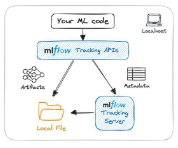
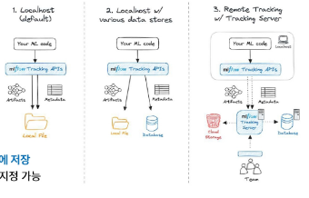
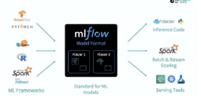
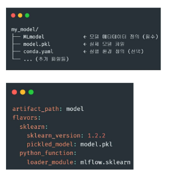
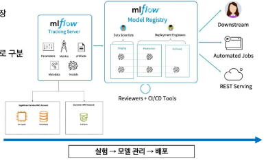

# 데이터사이언스 활용 - MLFlow 기본 개념과 세팅

목차

1. MLOps 개념 및 MLFlow의 역할
2. MLFlow의 주요 구성 요소
3. MLFlow 설치

## 1. MLOps 개념 및 MLFlow의 역할
### 1) MLOps
#### MLOps(Machine Learning Operations)란?
- 머신러닝 모델의 개발과 운영을 통합하여 모델의 개발, 배포, 모니터링, 유지 보수 등의 전 과정을 자동화하여 효율적으로 하는 일련의 관행
- MLOps를 사용하면 조직은 ML 수명 주기 전반의 프로세스를 자동화하고 표준화 가능
  - 여기서 말하는 프로세스는 모델 개발, 테스트, 통합, 릴리스 및 인프라 관리 포함
- MLOps는 협업 기능이며, 주로 데이터 사이언트, DevOps 엔지니어, IT로 구성

    

### 2) 기존 머신러닝 프로세스
#### 기존 머신러닝 프로세스의 한계점은 무엇인가?
- 데이터 품질과 양에 대한 의존성 문제
  - > 머신러닝 모델은 대량의 고품질 데이터를 필요로 하는데, 대부분의 실제 데이터는 노이즈와 불완전한 데이터가 많아 모델의 성능을 저하 시킴
- 특징 추출의 어려움
  - > 특정 도메인 전문가가 수동으로 특징을 추출해야 하므로 비용과 시간이 많이 소모
- 새로운 상황에 대한 대응 문제
  - > 머신러닝 모델이 학습한 데이터의 범위 내에서만 정확한 예측이 가능
- 모델 해석의 어려움
  - > 복잡한 모델일수록 내부 동작 방식을 이해하기 어려움
- 데이터 분포 변화에 대한 민감성
  - > 시간에 따라 변화하는 데이터의 분포에서 기존에 학습된 모델은 성능 저하를 일으킴
- > 이러한 한계점을 극복하기 위해 딥러닝과 MLOps등의 새로운 접근법이 개발

### 3) MLOps의 필요성
#### 반복 실험의 체계화
- 수많은 하이퍼파라미터 조합 실험
- 데이터 전처리 방식, 피처 선택 변화
- 실험 결과 비교를 위한 자동 기록

#### 협업 효율성 향상
- 여러 팀원이 같은 실험을 반복하지 않음
- 실험 결과를 다른 사람과 쉽게 공유
- 버전 관리로 변경 사항 추적 용이

#### 재현성 확보
- 실험이 시간이 지나도 재현 가능한 구조
- 동일한 코드 + 데이터 + 환경 → 동일한 결과

#### 추적성 확보
- 어떤 실험에 어떤 성능이 나왔는지 확인
- 실험 조건, 환경, 결과가 모두 기록

    

### 4) MLOps 주요 단계
#### MLOps 핵심 4단계
1. 데이터 준비
 - 데이터 수집
 - 데이터 전처리
 - 특성 엔지니어링

2. 모델 학습 및 검증
 - 모델 개발
 - 모델 학습
 - 모델 검증

3. 모델 배포
 - 배포 준비
 - 배포
 - 배포 전략

4. 모델 모니터링 및 관리
 - 성능 모니터링
 - 데이터 드리프트 감지
 - 모델 업데이트

### 5) 자동화 구조로서의 MLOps (CI / CT / CD)
#### CI(Continuous Integration)
- 코드 변경 시 자동 테스트 → 코드 품질 보장
- 코드(모델 스크립트, 파이프라인) 변경 시 자동으로 통합 및 테스트
- 데이터 전처리 코드, 모델 구조 변경 사항 포함

#### CT(Continuous Training)
- 데이터 변화에 따른 재학습 → 최신 모델 유지
- 새로운 데이터가 들어오면 모델을 자동으로 재학습
- 정기적 스케줄 또는 이벤트 기반으로 작동
- 실험 추적 도구(MLFlow)와 함께 사용시 강력함

#### CD(Continuous Delivery)
- 모델 자동 배포 → 운영 자동화, 실시간 대응
- 학습이 완료된 모델을 자동으로 서빙 환경에 배포
- REST API 형태, 클라우드 환경 등 다양하게 적용 가능

    

### 6) MLFlow란?
#### MLFlow 정의
- MLFlow는 실험 전체 생애주기(Lifecycle)를 관리하는 오픈소스 플랫폼
- 머신러닝 모델을 만들고 실험하고 배포하기까지의 과정을 더 체계적으로 재현 가능하게 관리해주는 도구
  
#### MLFlow의 등장 배경
- 2018년도 Databricks에서 개발
- 다양한 프레임워크에 독립적이고, 설치도 간편한 오픈소스
- 실험 기록, 모델 저장, 버전 관리, 배포를 하나로 지원
- MLFlow는 "머신 러닝 실험의 Git" & "운영 자동화 도구"

#### 예시(붕어빵 장사)
- 쉽게 표현한다면, 붕어빵 장사를 한다고 가정
- > (붕어빵 장사를 위한 레시피 실험 → 결과 비교 → 최적 레시피 선택 → 판매까지 전 과정을 자동화) =  MLFlow의 역할 

1. 여러 시행 착오를 겪으며 요리 = 머신러닝 모델링에서 많이 실험하는 행위
   - ex) 반죽, 팥, 굽는 시간 등 = 하이퍼파라미터
2. 가장 맛있는 붕어빵 레시피 발견 = MLFlow을 통해 가장 성능 좋은 모델 선택
3. 실험하면서 만들어진 붕어빵 = Artifact, 이미지, 로그 등
4. 각 붕어빵에 대한 정보(맛, 재료, 칼로리 등) = MLFlow에서 기록하는 메타데이터
5. 팥, 슈크림, 김치 붕어빵 판매 = 여러 모델 운영

#### MLFlow는 왜 필요한가?
- 기존 머신러닝 운영의 문제점을 MLFlow의 핵심 기능 4가지로 해결 (Tracking, Projects, Models, Model Registry)

    

### 7) MLFlow 4대 컴포넌트
#### Tracking
- 머신러닝 실험에서 사용된 파라미터, 메트릭, 아티팩트 등을 기록하고 추적
- Projects : 재사용 가능한 형태로 머신러닝 코드를 패키징하여 표준 형식으로 제공
- Models :다양한 배포 환경에 맞게 모델을 패키징 가능
- Models Registry : 모델의 버전 관리, 상태 추적, 주석 추가 등을 통해 중앙 집중식으로 모델을 관리
    

### 8) MLFlow의 장점
#### 협업 향상
- 중앙 집중화된 실험 관리
  - > MLFlow는 실험 데이터를 중앙에서 관리하여, 팀원들이 실험 결과를 공유하고 협업하도록 지원

#### 실험 추적 효율화
- 자동 로깅
  - > 모델 학습 시 사용된 파라미터, 메트릭, 아티팩트 등 로그를 자동으로 기록하여 실험을 체계적으로 추적

#### 재현성 강화
- 환경 및 코드 패키징
  - > MLFlow는 코드와 실행 환경을 패키징하여, 동일한 조건에서 실험을 재현 가능

## 2. MLFlow의 주요 구성 요소
### 1) MLFlow 주요 구성 요소
#### MLFlow Tracking
- Tracking은 머신러닝 실험과 실행을 체계적으로 관리하기 위한 API와 UI를 제공하는 컴포넌트
- Tracking은 실험의 각 실행으로 구성되며, 실험의 각 실행으로 발생하게 된다.
- MLFlow Tracking의 기능을 통해 멋니러닝 실험의 재현성, 투명성, 효율성 향상
  
#### MLFlow Tracking의 주요 기능
- Parameter(파라미터) : 모델 학습에서 사용된 입력 데이터를 키-값 쌍으로 저장 및 추적 
- Metric(지표) : 모델의 성능 지표(예 : 정확도, 손실 함수 값 등)를 숫자 형태로 저장 및 추적
- Artifact(산출물) : 모델 파일, 이미지, 데이터 파일 등 실행 결과로 생성된 모든 형식의 출력 파일을 저장 및 추적
- 코드 버전(소스코드) : 실행에 사용된 GIT 커밋 해시 등을 기록하여 코드 버전을 추적
- Tags : 실험을 설명하는 커스텀 라벨
    

#### MLFlow Tracking 환경 구성 3가지
- 실험 기록을 어디에 저장하고 어떻게 접근할지 설정 가능

#### 1. 로컬 호스트 사용(기본값)
- MLFlow는 기본값으로 현재 폴더에 실험 기록을 저장
- 메타데이터 & 모델 파일 모두 내 PC 폴더에 저장

#### 2. 로켈 데이터베이스 연결
- 기록은 로컬로 하고 실험 정보만 SQLite와 같은 데이터베이스에 저장
- Tracking server 실행 시, '--backend-store-uri'로 DB 위치 지정 가능
- miruns 폴더는 유지되지만, 메타데이터는 DB에서 관리

#### 3. MLFlow 추적 서버 구성(원격 추적)
- 'mlflow server' 명령어로 실행
- 여러 사람이 함께 실험할 수 있도록 서버를 하나 두고 모두가 여기에 실험 기록을 저장
- Artifact는 S3, GCS, 서버 디렉토리 등에 저장
- 서버를 통해 접근 권한 관리도 가능

#### MLFlow Projects
- Projects은 머신러닝 코드를 재사용하고 재현성 있게 패키징하기 위한 표준 형식을 제공
- 데이터 과학자들은 일관된 환경에서 코드를 실행하고 공유할 수 있음
- MLFlow Projects의 기능을 통해 머신러닝 실험의 재현성 향상
    

#### MLFlow Projects의 주요 특징
- 각 프로젝트의 구조는 코드, 데이터, 환경 설정 등을 포함하는 디렉토리 또는 Git 저장소로 구성
- MLproject 파일 내에서 실행 가능한 스크립트와 파라미터를 정의 가능
- MLFlow Project는 다양한 실행 환경을 지원

#### MLFlow Models
- MLFlow Models는 머신러닝 모델을 다양한 환경에서 일관되게 패키징하고 배포하기 위한 표준 형식을 제공
- 이를 통해 모델의 재현성과 호환성을 보장하고 다양한 라이브러리와 프레임워크 지원

#### MLFlow Models의 주요 특징
- 모델 포맷 : MLFlow는 모델을 여러 가지 'Flavor'로 저장하여, 다양한 도구와 호환성을 유지
- 저장 구조 : 각 모델은 디렉토리 형태로 저장되며, 루트에는 'MLmodel'파일이 위치하며, 파이르이 메타데이터가 포함
- 저장한 모델을 명령어 한 줄로 Serving할 수 있음

    

#### MLFlow Models의 구조
- 모델은 하나의 디렉토리로 저장되며, 내부는 그림처럼 구성

#### MLmodel 파일
- MLmodel 파일 예시를 살펴보면, Flavors가 있음
- Flavors : 모델을 어떤 형식으로 저장했는지 나타냄
  - 예시 : sklearn, python_function, keras, pytorch 등
    

#### MLFlow Model Registry
- MLFlow Model Registry는 머신러닝 모델의 전 생애 주기를 체계적으로 관리하기 위한 중앙 집중화된 저장소
- 이를 통해 모델의 생성, 버전 관리, 배포 단계 전환, 주석 추가 등 다양한 작업을 수행
- 모델을 코드처럼 버전 관리 + 승인 워크플로까지 적용할 수 있게 해주는 도구

#### MLFlow Model Registty의 주요 기능
- 모델 계보 추적 : 각 모델이 어떤 실험과 실행에서 생성되었는지 추적 가능
- 버전 관리 : 모델의 각 버전을 체계적으로 관리하여, 특정 버전의 모델을 재현하거나 비교 가능
- 단계 전환 : 모델의 상태를 'Staging'에서 'Production'으로 전환하는 등 배포 단계 관리를 지원
- 주석 및 태그 추가 : 각 모델의 버전에 설명이나 태그를 추가 가능

### 2) MLFlow 아키텍처
#### MLFlow 아키텍처란?
- 실험 기록, 모델 저장, 프로젝트 실행, 모델 배포 등 MLOps 전 과정을 지원하는 아키텍처

#### MLFlow Tracking Server 실험 기록
- 실험 실행 시 parameter, metric model 등 자동 저장

#### 모델 등록 및 상태 관리 : Model Registry
- 실험에서 나온 모델을 등록
- 테스트 모델은 Staging, 운영 모델은 Production으로 구분

#### 리뷰 및 배포 연동
- 모델 승격은 리뷰어가 승인
- CD 툴이나 자동화 스크립트가 배포까지 연결

#### Serving 및 활용
- 배포된 모델은 REST API로 실시간 서빙
- 다운스트림 시스템에 연동되어 사용
    

### 3) MLFlow vs. 다른 MLOps 도구

## 3. MLFlow 
- ds_lectures 파일 참고