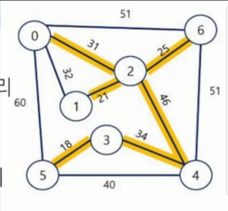

# 최소 신장 트리

 목차 

1. 최소 신장 트리
  - 개요
  - KRUSKAL 알고리즘
  - PRIM 알고리즘

## 1. 최소 신장 트리
### 1) 개요
#### 최소 신장 트리(MST)
- 신장 트리(Spanning Tree)
  - n개의 정점으로 이루어진 무향 그래프에서 n개의 정점과 (n-1)개의 간선으로 이루어진 트리
- 최소 신장 트리(Minimum Spanning Tree)
  - 무향 가중치 그래프에서 신장 트리를 구성하는 간선들의 가중치의 합이 최소인 신장 트리
- 그래프에서 최소 비용 문제
  - 모든 정점을 연결하는 간선들의 가중치의 합이 최소가 되는 트리
  - 두 정점 사이의 최소 비용의 경로 찾기

- 모든 노드들의 가장 효율적으로 도달할 수 있는 방법이 주목적
  - 이미지에서 0 1 2만 봤을 때
    - 0 - 1을 갈 때 32의 값으로 가면 되는데 31 + 21로 가는 이유
      - 0 1 2를 모두 도달해야 할 떄 0 - 1만 고려해서 32로 간다면 1 - 2로 갈 떈 21로 가야함. 즉 32 + 21
      - 따라서 0 1 2를 모두 도달하려면 가장 짧은 길은 31 + 21

  

### 2) KRUSKAL 알고리즘
#### KRUSKAL 알고리즘
- **간선**을 하나씩 선택해서 MST를 찾는 알고리즘
  1. 최초, 모든 간선을 가중치에 따라 오름차순으로 정렬
  2. 가중치가 가장 낮은 간선부터 선택
    - 선택한 간선의 두 정점에 대해서 아래 상황에 따라 진행
      1. 두 대표자가 다르다면, 엣지를 최소 비용 집합에 추가
      2. 두 대표자가 같다면, 사이클이 생성되므로 무시
  3. (n-1)개의 간선이 선택될 때까지 2번 과정 반복

  - ~p.14 참고

### 3) PRIM 알고리즘
#### PRIM 알고리즘
- 하나의 **정점**에서 연결된 간선들 중에 하나씩 선택하면서 MST를 만들어가는 방식
  1. 임의 정점을 하나 선택해서 시작
  2. 우선순위 큐를 사용하여 간선의 가중치가 가장 작은 간선을 선택
  3. 가장 가중치가 작은 간선을 선택하고, 이 간선이 연결하는 정점이 이미 방문한 정점이 아니라면, 이 간선을 최소 신장 트리에 추가하고, 그 정점을 방문한 것으로 표시
  4. 우선순위 큐가 빌 때까지 위 과정을 반복
  