# 데이터사이언스 활용 - RAG 구조와 생성형 AI

목차

1. 생성형 AI와 RAG
2. LangChain

## 1. 생성형 AI와 RAG
### 1) LLM의 한계
#### 생성형 AI의 문제점
- 오래된 정보(Outdated information)
- 도메인 특화 능력 부족
- 거짓말을 잘한다(Hallucination)
- 지식 매개변수화(parameterizing knowledge) 효율성이 낮음

#### 실제 우리의 요구사항
- 도메인별 정확한 답변
- 빈번한 데이터 업데이트
- 생성된 콘텐츠의 추적성 및 설명성
- 데이터의 개인정보 보호

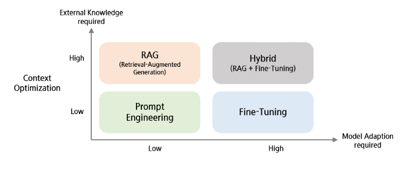
- Model Adaption : 모델 적응도
- Prompt Engineering : 프롬프트 잘 짜기
- External Knowledge : 외부 지식
- Fine-Tuning : 추가 학습
- RAG(Retrieval - Augmented Generation) : 모델을 건드리지 않고 외부에서 검색해서 context를 가져와서 생성하려는 프롬프트에 추가해서 LLM에게 전달
  - Fine-Tuning보다 비용이 low
- Hybrid : RAG + Fine-Tuning을 둘 다 쓰는 방법

### 2) LLM 한계 극복
#### Prompt Engineering
- 특정 작업에 대해 모델이 더 잘 반응하도록 입력 텍스트(프롬프트)를 최적화하는 방식
    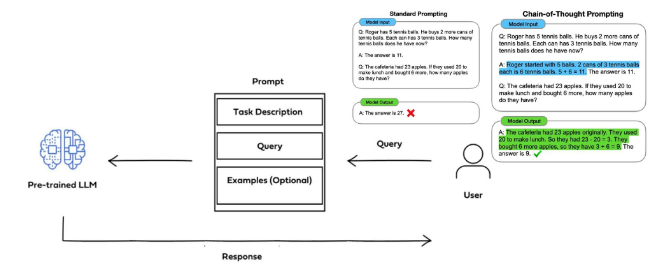
    - Chain-of-Thought Prompting : 단계적으로 생각하기

#### RAG
- 연결 프롬프트와 검색 기반의 정보를 결합(증강)하여, 증강된 정보를 기반으로  답변을 생성하도록 하는 방식
    

#### Fine-Tuning
- 사전 훈련된 모델을 특정 작업이나 데이터셋에 맞게 추가적으로 조정하는 방식
    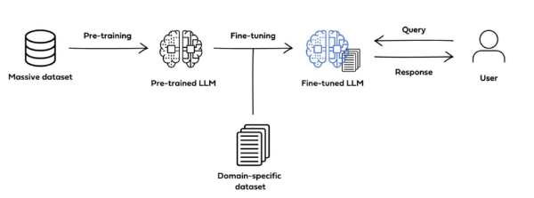

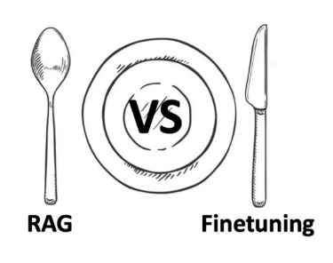
- Fine-tuning : 정교한 작업

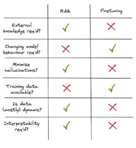
- 외부지식이 필요한가?
- 모델이 학습이 필요한가?
- 환각현상을 줄일 수 있는가?
- 훈련 데이터가 필요한가?
- 데이터가 자주 바뀌나?
- 결과 해석(?)

### RAG(Retreival-Augmented-Generation)란?
#### RAG 이해를 위한 이론
- RAG의 장점
  - 환각 현상(Hallucination) 감소
  - 도메인 적응성 개선
  - Open domain QA 성능 향상
  - 참고한 Knowledge base가 적절한지 판단 가능
  - 정보 검색에 강함
  
- RAG vs. Fine Tuning
    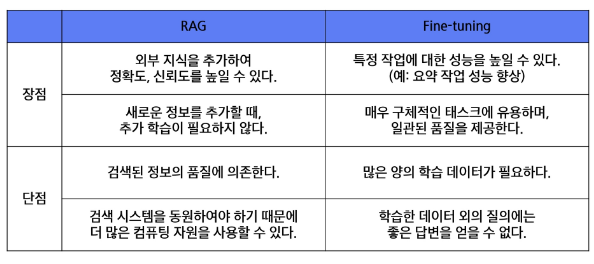

- 정보 검색(Retrieval)
  - 필요한 정보를 검색하는 작업
  - 데이터베이스, 인터넷 또는 다른 정보 저장소에서 관련 정보를 찾아내는 과정
  - 사용자의 쿼리에 가장 잘 맞는 데이터를 식별하고 추출하는 기술과 알고리즘
  - 웹 검색 엔진, 디지털 도서관, 온라인 데이터베이스, 정보 검색 시스템 등 다양한 분야에서 중요한 역할 수행

- 역색인(Inverted Index)
  - 색인 : 1 -> 1페이지 호출, 100 -> 100페이지 호출
  - 각 데이터에 빠르게 접근할 수 있도록 도움
  - 역색인 : '학교' -> 3, 49, 100 페이지
  - 각 단어로 색인 정보를 연결시켜 놓음으로 단어 기반 검색이 가능케 함
    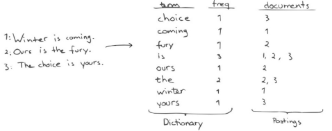

- TF-IDF
  - $ TF-IDF(t, d, D) = TF(t, d) \times IDF(t, D) $ 
  - t = 단어, d = 문서, D = 전체 문서
  $$ TF(t, d) = \frac{문서 d에서 단어 t가 등장한 횟수}{문서 d에 등장한 모든 단어의 수}
  \qquad
  IDF(t, D) = log(\frac{총 문서의 개수}{단어t를 포함하는 문서의 수}) $$

    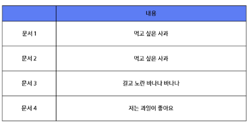
    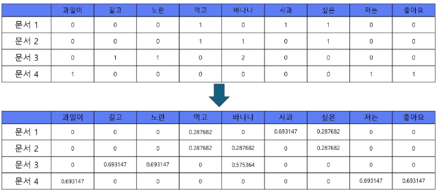

- BM25
  - TF-IDF의 정보검색에서의 단점을 보완
  - Q : 사용자가 입력한 쿼리
  - D : 대조해보려는 문서
  - 대부분의 텍스트 기반 검색을 진행할 때 가장 자주 쓰이는 방식
  - $$ score(D, Q) = \sum^{n}_{i=1}IDF(q_i) \times \frac{f(q_i, D) \times (k_1 + 1)}{f(q_i, D)+k_1 \times (1-b+b \times \frac{|D|}{avgdl})} $$

- 유사도 알고리즘
  - 코사인 유사도 
    - $ similarity = cos(\theta) = \frac{A \cdot B}{||A|| ||B||} = \frac{\sum^{n}_{i=1} A_i B_i}{\sqrt{\sum_{i=1}^{n} A_i^2} \sqrt{\sum_{i=1}^{n} B_i^2}} $
    - 
  - L2 거리
    - $ d(p, q) = d(q, p) = \sqrt{(q_1-p_q)^2 + (q_2-p_2)^2 + ... + (q_n-p_n)^2} = \sqrt{\sum_{i=1}^{n} (q_i - p_i)^2} $

- 벡터 임베딩을 통한 문서 검색
  - 검색에 더 좋은 벡터는 없을까?
    

- BERT의 임베딩과 BM25의 성능 비교
  - BM25는 문서의 벡터 크기가 크지만, BERT에서의 문서 벡터는 768차원(논문 기준)
    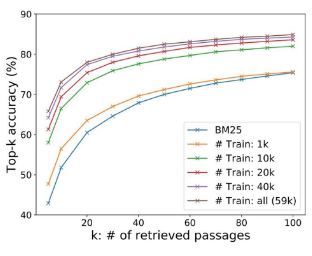

#### RAG(Retrieval-Augmented-Generation)
- Retrieval(검색) : 외부 데이터 및 소스를 검색하여 정보 획득
- Augmented(증강) : 사용자의 질문을 보강하여 보다 정확한 문맥 제공
- Generation(생성) : 향상된 정보를 기반으로 더 좋은 답변 생성
- 답변할 때 확실한 출처를 기반으로 생성하게 됨

#### RAG 없는 일반 챗봇
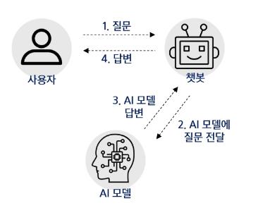

#### RAG를 활용한 챗봇
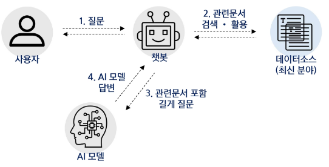

#### RAG 이해를 위한 기초 이론
- 상용 LLM
  - 텍스트 생성, 이해, 번역 등 다양한 NLP 작업을 수행
  - 매우 큰 텍스트 데이터 세트에서 학습
  - 높은 정확도와 자연스러운 언어 생성

- RAG
  - 정보 검색(retrieval)과 응답 생성(generation)을 결합한 모델
  - 사용자의 질문이 주어지면, Retreiver는 관련된 정보나 문서를 데이터베이스에서 검색
  - 검색된 정보로 질문에 대한 답변 생성
  - 보다 풍부하고 정확한 정보를 제공 가능
    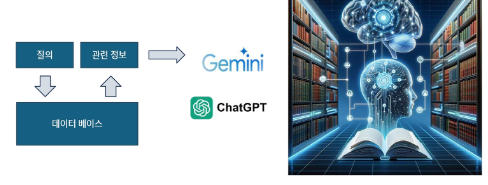

## 2. Langchain
### 1) Langchain이란?
#### Langchain이란?
- ChatGPT 프로그램 안에서 벗어나 LLM의 기능을 나만의 코드(Javascript/Python)으로 가져와서 이를 자유자재로 사용할 수 있게 해주는 강력한 '프레임워크'
- LLM으로 하는 모든 것을 LangChain을 통해서 할 수 있음을 의미
  - 프롬프트 엔지니어링
  - RAG
  - Agent
  - 외부 LLM API 사용 및 Local LLM 구동
  - Moderation
  - ...

- LangChain을 통해서 다양한 외부 및 내부 라이브러리 통합을 쉽게 할 수 있음
- LLM과 여러 다른 소스들을 Chaining해서 복잡한 애플리케이션도 쉽게 구현
    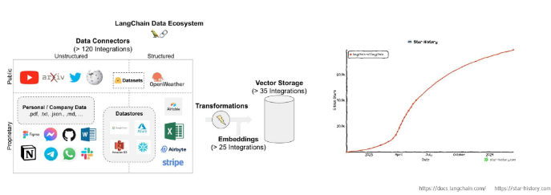

### 2) LangChain의 구성도

- LLM
  - 초거대 언어모델로,  생성 모델의 엔진과 같은 역할을 하는 핵심 구성 요소
  - 예시 : GPT-4, PALM, LLAMA, Deepseek ...
- Prompts
  - 초거대 언어모델에게 지시하는 명령문
  - 예시 : Prompt Templates, Chat Prompt Template, Example Selectors, Output Parsers
- Index
  - LLM이 문서를 쉽게 탐색할 수 있도록 구조화하는 모듈
  - 예시 : Document Loaders, Text Splitters, Vectorstores, Retrievers
- Memory
  - 채팅 이력을 기억하도록 하여 이를 기반으로 대화가 가능하도록 하는 모듈
  - 예시 : ConversationBufferMemory, Entity Memory, Conversation Knowledge Graph Memory
- Chain
  - LLM 사슬을 형성하여 연속적인 LLM 호출이 가능하도록 하는 핵심 구성 요소
  - 예시 : LLM Chain, Question Answering, Summarization, Retrival Question/Answering
- Agents
  - LLM이 기존 Prompt Template으로 수행할 수 없는 작업을 가능케 하는 모듈
  - 예시 : Custom Agent, Custom MultiAction Agent, Conversation Agent

### 3) LangChain의 구성
#### (1) LLM 추상화(Abstraction) 제공
- 추상화(Abstraction)란 사용자에게 불필요한 세부 사항을 숨겨 복잡성을 처리하는 것
- 사용자는 숨겨진 복잡성을 모두 이해하거나 생각하지 않고 제공된 추상화에서 나만의 로직 구현 가능
- Language Model + Chain = LangChain
- 언어모델(Language Model)을 연결(Chain)하여 애플리케이션 구축 가능
- 모든 LLM 모델을 자세히 공부하지 않고도 간단히 접속을 위한 API 키를 통해 사용 가능

#### (2) Prompts
- Context와 Query를 수동으로 작성할 필요 없이 프롬프트의 구성을 구조화 함
    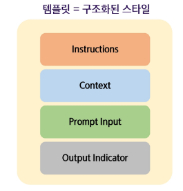

- You are an assistant for question-answering tasks : 이 프롬프트는 AI 모델이 답변 도우미 역할을 수행하는 것을 지정
- Use the following pieces of retrieved context to answer the question : 모델이 질문에 답변할 때, 검색된 문서의 컨텍스트를 사용하도록 지시
- If you don't know the answer, just say that you don't know : 모델이 답변을 모를 경우, 그냥 모른다고 답변하도록 지시 / 이는 모델이 부정확하거나 잘못된 정보를 생성하는 것을 방지하기 위함
- Answer in Korean : 이 지시를 통해 답변이 항상 한국어로 생성
- "#Question:{question}:" 여기서 {question}은 사용자가 입력한 질문이 들어갈 자리 / 템플릿이 실행될 때 이 부분이 실제 질문으로 대체
- '#Context:{context}': {context}는 검색된 문서의 컨텍스트가 들어갈 자리 / 이 문맥 정보를 바탕으로 모델이 질문에 답변을 생성
- '#Answer': 이 부분은 모델이 답변을 작성하는 곳

#### (3) Chain
- 체인을 연결하여 응답 처리를 연속적으로 실행할 수 있도록 연결하는 기능
    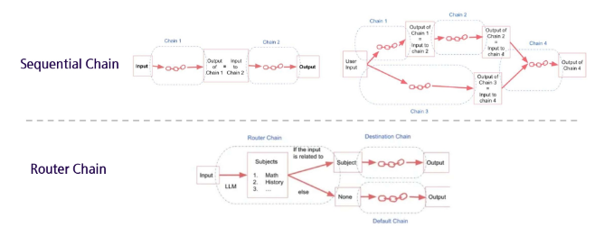

#### (4) Index
- 자체 학습 데이터 셋에 포함되어 있지 않은 특정 외부 데이터 소스 총칭
  - Document Loader
    - 파일 저장 서비스와 같은 소스에서 데이터 소스를 가져옴
        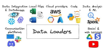

  - VectorDB
    - 데이터 포인터를 벡터 임베딩으로 변환하여 표현 
    - > 효율적인 검색 지원
        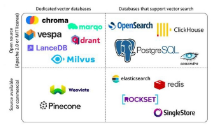

  - Text Splitters
    - 의미 있는 작은 덩어리로 분할 
    - > 깔끔한 요약 정리 가능
        

#### (5) Memory
- 사용자가 LLM과 대화하는 동안 사용자의 정보를 포함하여 대화에 대한 주요 사실을 기억하고 향후 상호 작용에 해당 정보 적용 가능
    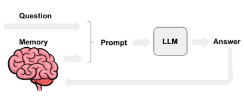

#### (6) Agents
- LLM과 다른 데이터 소스나 도구 두 가지 이상 조합하여 사용 가능
- 선택한 LLM을 추론 엔진으로 사용하여 어떤 작업을 수행할 지 결정
    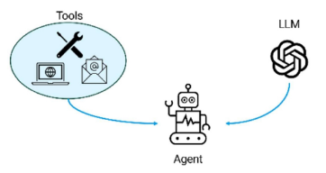

#### Chat Model
- LLM은 다양한 언어 작업을 수행할 수 있는 범용 대규모 언어 모델이라면,
- Chat Model은 대화 상호작용 및 대화에 최적화된 LLM의 특화된 버전
    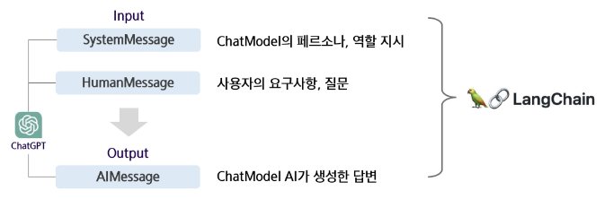

### 4) LangChain의 Chaining
#### LCEL(LangChain Expression Language)
 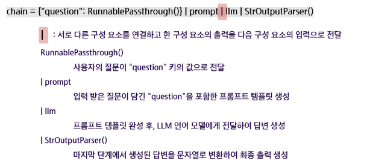

- 여러 체인을 연결하여 복잡한 워크플로우를 제어하거나 여러 논리적 흐름 생성 가능
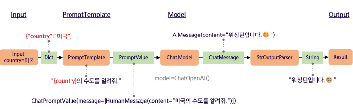

#### LangChain으로 할 수 있는 것들
- 데이터 분석하기 - Excel
    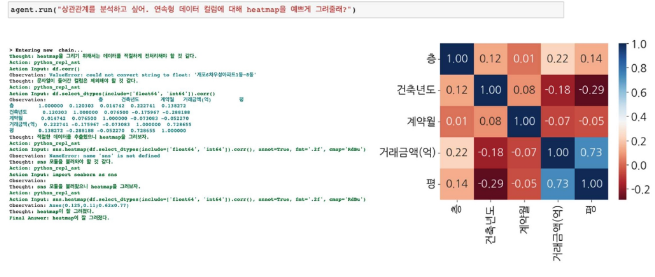
    

- 웹에서 정보 수집하기 - URL
    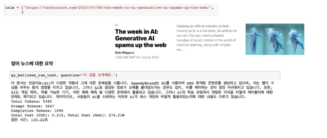

- 영상 내용 요약하기 - Youtube
    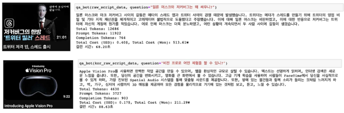

- RAG을 활용한 문서 QA 챗봇
  - RAG 기법을 활용해서 문서를 근거로 하는 QA 챗봇을 개발할 수 있다.
    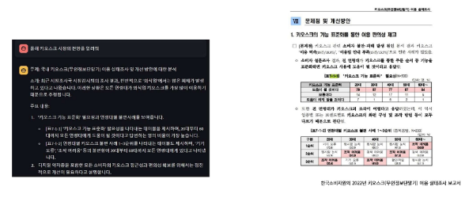

#### LangChain 챗봇 아키텍쳐
- 비정형 데이터(pdf, txt, docs, ...)를 QA Chain으로 바꾸는 형태
    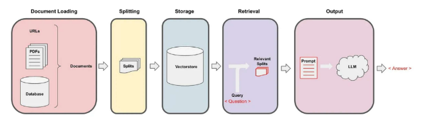

### 5) LangChain의 핵심 Retrieval
#### RAG(Retrieval Augmented Generation)
- 외부 데이터를 참조하여 LLM이 답변할 수 있도록 도움
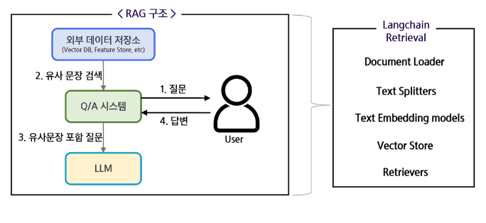

#### PDF 챗봇 구축 예시
- 문서를 기반으로 챗봇을 구축하는 경우, 아래와 같은 과정을 통해 대화가 가능하도록 함
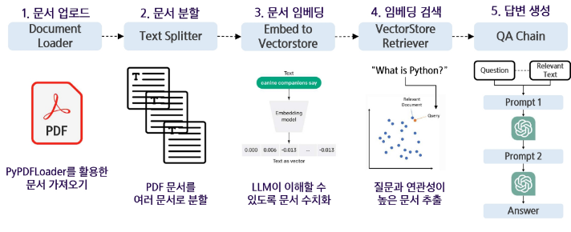

#### LangChain의 Retrieval
- Retrieval은 RAG의 대부분의 구성 요소를 아우르며, 구성 요소 하나하나가 RAG의 품질의 좌우
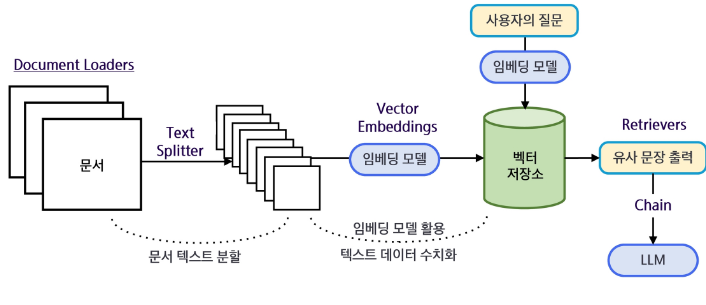

### 6) AI Agent의 기본 개념
#### AI Agent에 대하여
- AI Agent란?
  - 사용자의 목표를 달성하기 위해 스스로 문제를 분석하고, 해결 가능한 작은 단위로 분해(Planning)한 뒤, 필요 시 외부 틀이나 API를 활용하여 작업을 수행하며, 결과를 반복적으로 검토(Self-Reflection)하고 개선하는 시스템
    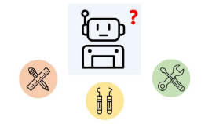

  - LLM과 다른 데이터 소스나 도구 두 가지 이상 조합하여 사용 가능 선택한 LLM을 추론 엔진으로 사용하여 어떤 작업을 수행할 지 결정
    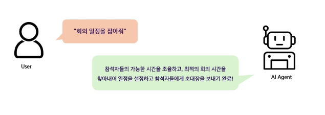

  - ChatGpt는 AI Agent의 하위 개념 또는 구성 요소로 볼 수 있으며, 단순히 텍스트를 생성하는 언어모델
  - AI Agent는 ChatGPT 같은 LLM을 코어 엔진으로 활용하되, 추가적으로 툴 사용, 계획, 자율적 실행 기능이 결합된 시스템
    - AI Agent
      - 자율성과 상호작용 능력
      - 사용자가 요구한 작업의 완료를 위해 활용 가능한 여러 도구와의 상호작용을 **연쇄적**으로, **자율적**으로 수행할 수 있는 기술
    - ChatGPT
      - 주로 단일 플러그인을 사용하여 질문에 답변
      - 기본 ChatGPT는 툴과 직접 상호작용하지 않음

- Tool
  - 에어전트가 활용할 수 있는 기능적 요소
    - AI가 혼자 해결하기 어려운 작업을 도와주는 보조 도구
    - 특정 작업을 위해 외부 기능이나 전문가를 불러오는 개념
    - 예 : PDF 읽기, 웹 검색, 코드 실행 등
    - > 역할 기반 설정 + 배경 지식 제공 + 실질적인 작업 처리 능력을 갖춘 자동화 에이전트 구성 가능

