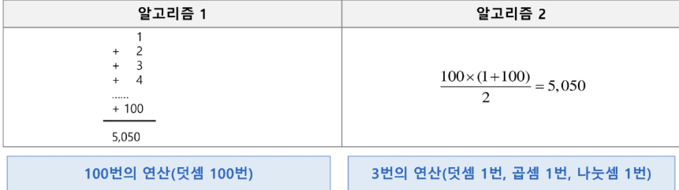

# 알고리즘 기본 1
<details>
<section> 목차 </section>

1. 알고리즘 기본
  - 알고리즘
  - 복잡도

2. 재귀 호출
  - 재귀 함수
  - 하노이의 탑

3. 완전 탐색
  - 베이비진 게임

4. 참고
  - 하노이의 탑 구현
</details>

## 알고리즘 기본
### 알고리즘
#### 알고리즘
- 유한한 단계를 통해 문제를 해결하기 위한 절차나 방법
- 주로 컴퓨터용어로 쓰이며, 컴퓨터가 어떤 일을 수행하기 위한 단계적 방법
- 간단하게 다시 말하면 어떠한 문제를 해결하기 위한 절차라고 볼 수 있음
- 예: 1부터 100까지의 합을 구하는 문제를 생각해보자


#### 알고리즘 표현 방법
- 컴퓨터 분야에서 알고리즘을 표현하는 방법은 크게 세 가지
  - 의사 코드와 순서도 그리고 프로그래밍 언어
  ```javascript
  CalcSum(n) {
    sum <- 0ㅏ
    for (i <- 1; i <= n; i <- i + 1) {
      sum <- sum + i;
    }
    return sum;
  }
  ```


#### 알고리즘 성능
- APS 과정의 목표 중 하나는 보다 좋은 알고리즘을 이해하고 활용하는 것이다.
- 무엇이 좋은 알고리즘인가?
  - 정확성 : 얼마나 정확하게 동작하는가
  - 효율성 : 얼마나 최적화되었는가
  - 확장성 : 입력 크기에 상관없이 항상 성능이 일정한가
  - 단순성 : 얼마나 단순한가

#### 알고리즘의 성능 분석
- 주어진 문제를 해결하기 위해 여러 개의 다양한 알고리즘이 가능
  - 어떤 알고리즘을 사용해야 하는가?
- 알고리즘의 성능 분석 필요
  - 많은 문제에서 성능 분석의 기준으로 알고리즘의 작업량을 비교

#### 알고리즘의 성능 분석 예시
  - 예 : 1부터 100까지 합을 구하는 문제
  