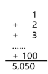
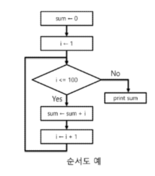
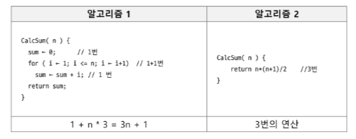
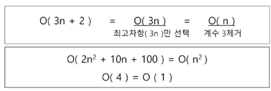
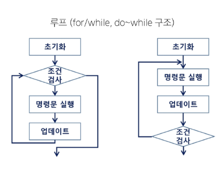

# 알고리즘 기본 1
<details>
<section> 목차 </section>

1. 알고리즘 기본
  - 알고리즘
  - 복잡도

2. 재귀 호출
  - 재귀 함수
  - 하노이의 탑

3. 완전 탐색
  - 베이비진 게임

4. 참고
  - 하노이의 탑 구현
</details>

## 알고리즘 기본
### 알고리즘
#### 알고리즘
- 유한한 단계를 통해 문제를 해결하기 위한 절차나 방법
- 주로 컴퓨터용어로 쓰이며, 컴퓨터가 어떤 일을 수행하기 위한 단계적 방법
- 간단하게 다시 말하면 어떠한 문제를 해결하기 위한 절차라고 볼 수 있음
- 예: 1부터 100까지의 합을 구하는 문제를 생각해보자



#### 알고리즘 표현 방법
- 컴퓨터 분야에서 알고리즘을 표현하는 방법은 크게 세 가지
  - 의사 코드와 순서도 그리고 프로그래밍 언어
  ```javascript
  CalcSum(n) {
    sum <- 0ㅏ
    for (i <- 1; i <= n; i <- i + 1) {
      sum <- sum + i;
    }
    return sum;
  }
  ```


#### 알고리즘 성능
- APS 과정의 목표 중 하나는 보다 좋은 알고리즘을 이해하고 활용하는 것이다.
- 무엇이 좋은 알고리즘인가?
  - 정확성 : 얼마나 정확하게 동작하는가
  - 효율성 : 얼마나 최적화되었는가
  - 확장성 : 입력 크기에 상관없이 항상 성능이 일정한가
  - 단순성 : 얼마나 단순한가

#### 알고리즘의 성능 분석
- 주어진 문제를 해결하기 위해 여러 개의 다양한 알고리즘이 가능
  - 어떤 알고리즘을 사용해야 하는가?
- 알고리즘의 성능 분석 필요
  - 많은 문제에서 성능 분석의 기준으로 알고리즘의 작업량을 비교

#### 알고리즘의 성능 분석 예시
  - 예 : 1부터 100까지 합을 구하는 문제
  

### 복잡도
#### 복잡도
- 시간 복잡도 : 연산의 작업량, 수행 시간
  - 최선의 경우 (Best Case)
    - 빅 오메가 표현법 사용(&Omega; (n)), 알고리즘이 가장 빠르게 실행될 때의 성능
  - 평균적인 경우 (Average Case)
    - 빅 세타 표기법 사용(&Theta;(n)), 일반적인 알고리즘의 성능
  - 최악의 경우 (Worst Case)
    - 빅 오 표기법 사용(O(n)), 알고리즘이 가장 느리게 실행될 때의 성능
  - 공간 복잡도 : 메모리 사용량

#### 복잡도의 점근적 표기
- 시간 (또는 공간)복잡도는 입력 크기에 대한 함수로 표기하는데, 이 함수는 주로 여러 개의 항을 가지는 다항식
- 이를 단순한 함수로 표현하기 위해 점근적 표기(Asymptotic Notation)를 사용한다.
- 입력 크기 n이 무한대로 커질 때의 복잡도를 간단히 표현하기 위해 사용하는 표기법


#### 빅-오(O) 표기법
- 시간 복잡도 함수 중에서 가장 큰 영향력을 주는 n에 대한 항만을 표시
- 계수(Coefficient)는 생략하여 표시


- n개의 데이터를 입력받아 저장한 후 각 데이터에 1씩 증가시킨 후 각 데이터를 화면에 출력하는 알고리즘의 시간복잡도는 어떻게 되나?

#### 다양한 시간 복잡도 비교
- 요소 수가 증가함에 따라 각각의 시간복잡도 알고리즘은 아래와 같은 연산 수를 보임


## 재귀 호출
### 재귀 함수
#### 반복(Iteration)과 재귀(Recursion)
- 반복과 재귀는 유사한 작업을 수행할 수 있다.
- 반복은 수행하는 작업이 완료될 때까지 반복
- 재귀는 주어진 문제의 해를 구하기 위해 동일하면서 더 작은 문제의 해를 이용하는 방법
  - 재귀 함수로 구현


#### 재귀 함수(Recursive Function)
- 함수 내부에서 직접 혹은 간접적으로 **자기 자신을 호출하는 함수**
- 일반적으로 재귀적 정의를 이용해서 재귀 함수를 구현
- 따라서, 기본 부분(basis part)과 유도 부분(inductive part)으로 구성
- 재귀적 프로그램을 작성하는 것은 반복 구조에 비해 간결하고 이해하기 쉬움
  - 그러나 재귀에 대해 익숙하지 않은 개발자들은 재귀적 프로그램이 어렵다고 느낌
- 함수 호출은 프로그램 메모리 구조에서 **스택**을 사용
- 따라서 재귀 호출은 반복적인 스택의 사용을 의미하며 메모리 및 속도에서 성능저하가 발생

#### 피보나치 수열 재귀 호출
- 피보나치 : 이전의 두 수 합을 다음 항으로 하는 수열
  - 0, 1, 1, 2, 3, 5, 8, 13, ...
- 피보나치 수열의 i번째 값을 계산하는 함수 F를 정의하면 다음과 같다.
  - F_0 = 0, F_1 = 1
  - F_i = F_(i-1) + F_(i-2) >= 2
- 위의 정의로부터 피보나치 수열의 i번쨰 항을 반환하는 함수를 재귀함수로 구현할 수 있다.
