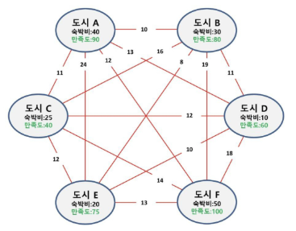
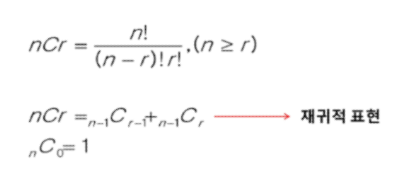

# 알고리즘 기본 2
<details>
<summary>목차</summary>

1. 완전 탐색
  - 순열
  - 조합
  - 순열과 조합 활용
  - 부분집합 (반복문과 재귀)
  - 부분집합 (바이너리 카운팅)

2. 참고
  - 베이비진 구현

</details>

## 완전 탐색
### 순열
#### 여행 계획 문제
- 출발, 도착 도시를 선택하면 모든 도시를 여행하는 코스를 알려드립니다. (어떤 코스가 경비가 가장 적게 들까?)
- 3개의 도시를 선택하면 숙박비를 지원해 드립니다. (여행자는 어느 도시를 선택했을 때 가장 이득일까?)
- 여행 경비를 넘지 않으며 최대 만족도를 갖도록 선택하려면? (여행경비 70만원이 있고, 이동 경로는 고려하지 않는다.)


#### 순열(Permutation)
- 서로 다른 것 중 몇 개를 뽑아서 순서대로 나열하는 것
- 서로 다른 n개 중 r개를 택하는 순열은 아래와 같이 표현한다.
  `nPr`
- 그리고 `nPr`은 다음과 같은 식이 성립한다.
  ```
  nPr = n * (n-1) * (n-2) * ... * (n-r+1)
  ```
- `nPn = n!`이라고 표기하며 Factorial이라 부른다.
  ```
  n! = n * (n-1) * (n-2) * ... * 2 * 1
  ```
- 다수의 알고리즘 문제들은 순서화된 요소들의 집합에서 최선의 방법을 찾는 것과 관련이 있다.
- N개의 요소들에 대해서 n!개의 순열들이 존재한다.
  - 12! = 471,001,600
  - N > 12인 경우, 시간 복잡도는 폭발적으로 증가

#### 반복문을 통한 순열 생성
- {1, 2, 3}을 포함하는 모든 순열을 생성
```python
for i in range(1, 4):
  for j in range(1, 4):
    if j != i:
      for k in range(1, 4):
        if k != i and k != j:
          print(i, j, k)
```

### 조합
#### 조합(Combination)
- 서로 다른 n개의 원소 중 r개를 순서 없이 골라낸 것
- 조합의 수식


#### 반복문을 통한 조합 생성
- {1, 2, 3, 4} 중 원소 3개를 포함하는 모든 조합을 생성
  ```python
  for i in range(1, 5) :
    for j in range(i+1, 5) :
      for k in range(j+1, 5) :
        print(i, j, k)
  ```

모든 경우에 대해서 완전히 동일한 조건 하에 내 제약사항을 도출(?)하는 반복
