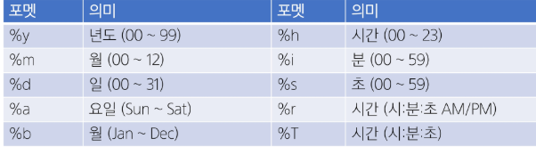

# Basic SQL
<details>
<summary>Index</summary>

1. DML
   - INSERT/UPDATE/DELETE

2. DQL
    - SELECT

3. Filtering Data
    - DISTINCT/WHERE/Database Operator

4. MySQL Built-in Function
    - 문자형/숫자형/날짜형/NULL 관련 함수

5. Sorting data
    - ORDER BY/LIMIT

6. Grouping data
    - Aggregate Function/GROUP BY
  
7. 참고
</details>

## 1. DML
### 1) 개요
#### SQL Statements 유형
| 유형 | 역할 | SQL 키워드 |
|:----:|:----:|:----------:|
| DDL(Data Definition Language) | 데이터의 기본 구조 및 형식 변경 | CREATE DROP ALTER TRUNCATE |
| DQL (Data Query Language) | 데이터 검색 | SELECT |
| DML (Data Manipulation Language) | 데이터 조작(추가, 수정, 삭제) | INSERT, UPDATE, DELETE |
| DCL (Data Control Language) | 데이터 및 작업에 대한 사용자 권한 제어 | COMMIT ROLLBACK GRANT REVOKE |

#### Data Manipulation Language
- 테이블 내의 데이터를 추가, 수정, 삭제, 조회를 위한 언어
- 데이터 조회는 기능이 많아 Data Query Language로 구분하기도 함

### 2) INSERT
#### 사전 준비
- 실습 테이블 생성
    ```sql
    CREATE TABLE articles (
        id INT PRIMARY KEY AUTO_INCREMENT,
        title VARCHAR(100) NOT NULL,
        content VARCHAR(200) NOT NULL,
        createAt DATE NOT NULL
    );
    ```

#### <span style='color:red'>INSERT</span> statement
- 테이블 레코드 삽입

#### INSERT syntax
```sql
INSERT INTO table_name (c1, c2, ...)
VALUES (v1, v2, ...);
```
- INSERT INTO 절 다음에 테이블 이름과 괄호 안에 필드 목록 작성
- VALUES 키워드 다음 괄호 안에 해당 필드에 삽입할 값 목록 작성

#### INSERT 활용 1
- articles 테이블에 다음과 같은 데이터 입력
  
  | id | title | content |  createAt  |
  |:---|:------|:--------|:-----------|
  | 1  | hello | world   | 2000-01-01 |
  
  ```sql
  INSERT INTO
    articles (title, content, createAt)
  VALUES
    ('hello', 'world', '2000-01-01');
  ```

#### INSERT 활용 2
- articles 테이블에 다음과 같은 데이터 추가 입력
  | id | title  | content  |  createAt  |
  |:---|:-------|:---------|:-----------|
  | 1  | hello  | world    | 2000-01-01 |
  | 2  | title1 | content1 | 1900-01-01 |
  | 3  | title2 | content2 | 1800-01-01 |
  | 4  | title3 | content3 | 1700-01-01 |

  ```sql
  INSERT INTO
    articles (title, content, createAt)
  VALUES
    ('title1', 'content1', '1900-01-01'),
    ('title2', 'content2', '1800-01-01'),
    ('title3', 'content3', '1700-01-01');
  ```

#### INSERT 활용 3
- NOW 함수를 사용해 articles 테이블에 다음과 같은 데이터 추가 입력
  | id | title   | content   |  createAt  |
  |:---|:--------|:----------|:-----------|
  | 1  | hello   | world     | 2000-01-01 |
  | 2  | title1  | content1  | 1900-01-01 |
  | 3  | title2  | content2  | 1800-01-01 |
  | 4  | title3  | content3  | 1700-01-01 |
  | 5  | mytitle | mycontent | 2025-09-09 |

  ```sql
  INSERT INTO
    articles (title, content, createAt)
  VALUES
    ('mytitle', 'mycontent', NOW());
  ```

### 3) UPDATE
#### UPDATE statement
- 테이블 레코드 수정

#### UPDATE syntax
```sql
UPDATE table_name
SET column_name = expression,
[WHERE
    condition];
```
- SET 절 다음에 수정할 필드와 새 값을 지정
- WHERE 절에서 수정할 레코드를 지정하는 조건 작성
- WHERE 절을 작성하지 않으면 모든 레코드를 수정

#### UPDATE 활용 1
- articles 테이블 1번 레코드의 title 필드 값을 'update Title'로 변경
  | id | title   | content   |  createAt  |
  |:---|:--------|:----------|:-----------|
  | 1  | update Title  | world     | 2000-01-01 |
  | 2  | title1  | content1  | 1900-01-01 |
  | 3  | title2  | content2  | 1800-01-01 |
  | 4  | title3  | content3  | 1700-01-01 |
  | 5  | mytitle | mycontent | 2025-09-09 | 

  ```sql
  UPDATE
    articles
  SET
    title = 'update Title'
  WHERE
    id = 1;
  ```

#### UPDATE 활용 2
- articles 테이블 2번 레코드의 title, content 필드 값을 'update Title', 'update Content'로 변경
  | id | title   | content   |  createAt  |
  |:---|:--------|:----------|:-----------|
  | 1  | update Title  | world     | 2000-01-01 |
  | 2  | update Title  | update Content  | 1900-01-01 |
  | 3  | title2  | content2  | 1800-01-01 |
  | 4  | title3  | content3  | 1700-01-01 |
  | 5  | mytitle | mycontent | 2025-09-09 | 

  ```sql
  UPDATE
    articles
  SET
    title = 'update Title',
    content = 'update Content'
  WHERE
    id = 2;
  ```

### 4) DELETE
#### DELETE statement
- 테이블 레코드 삭제

#### DELETE syntax
```sql
DELETE FROM table_name
[WHERE
    condition];
```
- DELETE FROM 절 다음에 테이블 이름 작성
- WHERE 절에서 삭제할 레코드를 지정하는 조건 작성
- WHERE 절을 작성하지 않으면 모든 레코드 삭제

#### DELETE 활용
- articles 테이블의 1번 레코드 삭제
  | id | title   | content   |  createAt  |
  |:---|:--------|:----------|:-----------|
  | 2  | update Title  | update Content  | 1900-01-01 |
  | 3  | title2  | content2  | 1800-01-01 |
  | 4  | title3  | content3  | 1700-01-01 |
  | 5  | mytitle | mycontent | 2025-09-09 | 

  ```sql
  DELETE FROM
    articles
  WHERE
    id = 1;
  ```
  
### 5) 참고
#### DDL의 Truncate와 DML의 Delete 비교
- Truncate와 Delete 모두 테이블의 모든 테이블 삭제 가능
- Delete는 데이터를 삭제하기 때문에 PK값이 초기화되지 않음
- Truncate은 Table을 DROP 후 재성성하기 때문에 PK도 초기화 됨

#### Truncate와 비교
- DDL 언어인 TRUNCATE과 DELETE 동작 차이
  ```sql
  DELETE FROM articles;

  INSERT INTO
    articles (title, content, createAt)
  VALUES
    ('hello', 'world', '2000-01-01');

  SELECT * FROM articles;
  ```

  - DELETE 동작
    | id | title   | content   |  createAt  |
    |:---|:--------|:----------|:-----------|
    | 6  | hello  | world  | 2000-01-01 |

  ```sql
  TRUNCATE articles;

  INSERT INTO
    articles (title, content, createAt)
  VALUES
    ('hello', 'world', '2000-01-01');
  SELECT * FROM articles;
  ```
  - TRUNCATE 동작
    | id | title   | content   |  createAt  |
    |:---|:--------|:----------|:-----------|
    | 1  | hello  | world  | 2000-01-01 |

## 2. DQL
### 1) 사전 준비
#### <span style='color:red'>USE</span> statement
- `USE world;`
- 사용할 database를 선택
- 앞으로 진행할 실습을 위해, MySQL 설치 시 제공되는 world DB 사용
- world DB를 삭젷나 경우, 공용 노션 참고

### 2) SELECT
#### <span style='color:red'>SELECT</span> statement
- 테이블에서 데이터를 조회
- `SELECT select_list FROM table_name;`
- SELECT 키워드 이후 데이터를 선택하려는 필드를 하나 이상 지정
- FROM 키워드 이후 데이터를 선택하려는 테이블의 이름을 지정

#### SELECT 활용 1
- 테이블 country에서 Name 필드의 모든 데이터를 조회
  
  | Name |
  |:----:|
  | Aruba |
  | Afghanistan |
  | Angola |
  | Anguilla |
  | ... |

  ```sql
  SELECT
    Name
  FROM
    country;
  ```

#### SELECT 활용 2
- 테이블 country에서 Code, Name 필드의 모든 데이터를 조회

  | Code | Name |
  |:----:|:----:|
  | ABW | Aruba |
  | AFG | Afghanistan |
  | AGO | Angola |
  | AIA | Anguilla |
  | ... | ... |

  ```sql
  SELECT
    Code, Name
  FROM
    country;
  ```

#### SELECT 활용 3
- 테이블 country에서 모든 필드 데이터를 조회
  
  ```sql
  SELECT
    *
  FROM
    country;
  ```

#### SELECT 활용 4
- 테이블 country에서 Name 필드의 모든 데이터를 조회 (단, 조회 시 Name이 아닌 '국가'로 출력될 수 있도록 변경)
  
  ```sql
  SELECT
    Name AS '국가'
  FROM
    country;
  ```

#### SELECT 활용 5
- 테이블 country에서 Name, Population 필드의 모든 데이터 조회 (단, Population 필드는 1000으로 나눠 k 단위 값으로 출력)
  ```sql
  SELECT
    Name,
    Population / 1000 AS '인구 (k)'
  FROM
    country;
  ```

#### SELECT 정리
- 테이블의 데이터를 조회 및 반환
- '*'(asterisk)를 사용하여 모든 필드 선택
- 'AS' 키워드를 통해 컬럼명 임시 네이밍 가능

## 3. Filtering data
### 1) 개요
#### Filtering data 관련 Keywords
- Clause
  - **DISTINCT**
  - **WHERE**
- Operator
  - **BETWEEN**
  - **IN**
  - **LIKE**
  - Comparison
  - Logical

### 2) DISTINCT
#### <span style='color:red'>DISTINCT</span> statement
- 조회 결과에서 중복된 레코드를 제거

### DISTINCT syntax
```sql
SELECT DISTINCT
    select_list
FROM
    table_name;
```
- SELECT 키워드 바로 뒤에 작성해야 함
- SELECT DISTINCT 키워드 다음에 고유한 값을 선택하려는 하나 이상의 필드 를 지정

#### DISTINCT 활용
- 테이블 country에서 Continent 필드의 데이터를 중복없이 조회
  ```sql
  SELECT
    DISTINCT Continent
  FROM
    country;
  ```

### 3) WHERE
#### <span style='color:red'>WHERE</span>
- 조회 시 특정 검색 조건을 지정

#### WHERE syntax
```SQL
SELECT
    select_list
FROM
    table_name
WHERE
    search_condition;
```
- FROM clause 뒤에 위치
- search_condition은 비교연산자 및 논리연산(AND, OR, NOT 등)를 사용하는 구문이 사용됨

#### WHERE 활용 1
- 테이블 country에서 Region 필드 값이 'Eastern Asia'인 데이터의 Name, Population 조회
  ```sql
  SELECT
    Name, Population
  FROM
    country
  WHERE Region = 'Eastern Asia';
  ```
- 테이블 country에서 IndepYear 필드 값이 Null이 아닌 데이터의 Name, Region, Population, IndepYear 조회
  ```sql
  SELECT
    Name, Region, Population, IndepYear
  FROM
    country
  WHERE
    IndepYear IS NOT NULL;
  ```
- 테이블 country에서 Population 필드 값이 천 만 이상이고 LifeExpectancy 필드가 78 이상인 데이터의 Name, Region, LifeExpectancy 조회
  ```sql
  SELECT
    Name, Region, LifeExpectancy
  FROM 
    country
  WHERE
    Population >= 1000000
    AND LifeExpectancy >= 78;
  ```

### 4) Database Operator
#### Logical Operators (논리 연산자)
- AND(&&), OR(||), NOT(!)

#### Comparison Operators (비교 연산자)
- =, >=, <=, !=, BETWEEN...AND, IN, LIKE, IS
  
#### <span style='color:red'>BETWEEN</span> Operator
- 컬럼의 데이터가 A와 B 사이에 있는지 확인
- `Column BETWEEN A AND B`

#### BETWEEN 연산자
- 테이블 country에서 Population 필드 값이 백만 이상 오백만 이하이고 GNPOId가 GNP보다 큰 데이터의 Name, Region, Population 그리고 GNPOId와 GNP 차이를 GNP diff로 작성하여 조회
  ```sql
  SELECT
    Name, Region, Population,
    GNP - GNPOId AS 'GNP Diff'
  FROM
    country
  WHERE
    Population BETWEEN 1000000 AND 5000000
    -- Population >= 1000000 AND Population <= 5000000
    AND GNP < GNPOId;
  ```

#### <span style='color:red'>IN</span> Operator
- 값이 특정 목록 안에 있는지 확인

#### IN Operator 활용
- 테이블 country에서 Continent 필드 값이 'North America' 또는 'Asia'인 데이터의 Code, Name, Continent 조회
  ```sql
  SELECT
    Code, Name, Continent
  FROM
    country
  WHERE
    Continent IN ('North America', 'Asia');
  ```

#### <span style='color:red'>LIKE</span> Operator
- 값이 특정 패턴에 일치하는지 확인 (Wildcards와 함께 사용)

#### Wildcard Characters
- '%' : <span style='color:red'>0개 이상의 문자열</span>과 일치하는지 확인
- '_' : <span style='color:red'>단일 문자</span>와 일치하는지 확인

#### LIKE Operator 활용 1
- 테이블 country에서 Name 필드 값이 'South'으로 시작하는 데이터의 Name, Region, Population, GNP 조회
  ```sql
  SELECT
    Name, Region, Population, GNP
  FROM
    country
  WHERE
    Name LIKE 'South%';
  ```
- 테이블 country에서 Name 필드 값이 'South'으로 시작하고, 공백을 포함하여 6자리를 가지는 데이터의 Name, Region, Population, GNP 조회
  ```sql
  SELECT
    Name, Region, Population, GNP
  FROM
    country
  WHERE
    Name LIKE 'South______';
  ```

#### <span style='color:red'>IS</span> Operator
- NULL 값은 = 연산자를 활용하여 비교 불가
  - 잘못된 코드
    ```sql
    SELECT
        Name, GNPOId, IndepYear
    FROM
        country
    WHERE
        GNPOId = NULL
        AND IndepYear != NULL;
    ```

- <span style='color:red'>IS</span> 연산자를 통해 NULL인지 확인
```sql
SELECT
    Name, GNPOId, IndepYear
FROM
    GNPOId IS NULL
    AND IndepYear IS NOT NULL;
```

#### 연산자 우선순위
1. 괄호
2. NOT 연산자
3. 비교 연산자
4. AND
5. OR
- 우선 순위를 고려하지 않고 작성하면 의도치 않은 동작 발생

#### 연산자 우선순위 관련 오동작 예시
- 테이블 country에서 IndepYear가 1981이거나 1901이고, LifeExpectancy가 75 이하인 데이터의 Name, IndepYear, LifeExpectancy를 조회
```sql
SELECT
    Name, IndepYear, LifeExpectancy
FROM
    country
WHERE
    IndepYear = 1981 OR IndepYear = 1901
    AND LifeExpectancy <= 75;
```
- 정상적으로 동작하는 것 같지만
-  <span style='color:red'>AND의 우선순위가 OR보다 높기 때문에 예상과 다른 결과 발생</span>

```sql
SELECT
    Name, IndepYear, LifeExpectancy
FROM
    country
WHERE
    (IndepYear = 1981 OR IndepYear = 1901)
    AND LifeExpectancy <= 75;
```
- <span style='color:red'>실수하기 쉬운 논리 연산자의 경우 괄호를 사용하여 우선 순위 표시를 권장</span>

## 4. MySQL Built-in Function
### 1) 개요
#### MySQL 내장 함수
1. 문자형
    - CONCAT, TRIM, REPLACE
    - LOCATE
2. 날짜형
    - CURDATE, CURTIME, NOW
    - DATE_FORMAT
3. 숫자형
    - ABS, MOD, POW
    - CEIL, FLOOR, ROUND
4. NULL 관련
    - IFNULL, COALESCE, NULLIF

### 2) 문자형 함수
#### 문자형 함수
- CONCAT(str1, str2, ...)
  - 인자로 들어오는 문자열을 하나로 연결해주는 함수
  - `SELECT CONCAT('FirstName', '_', 'LastName');`
- TRIM([[BOTH | LEADING | TRAILING]remove_str] target_str)
  - 왼쪽 혹은 오른쪽의 특정 문자를 삭제하는 함수
  - remove_str을 생략한 경우 공백 문자를 삭제
  - `SELECT TRIM('    PHONE    ');`
  - `SELECT TRIM('-'  FROM '---TITLE---');`
  - `SELECT TRIM(LEADING '-' FROM '---TITLE---');`
  - `SELECT TRIM(TRAILING '-' FROM '---TITLE---');`
- REPLACE(target_str, from_str, to_str)
  - 문자열을 수정하기 위해 사용하는 함수
  - `SELECT REPLACE('$10000', '$', '￦');`
- LOCATE(sub_str, target_str [, pos])
  - 찾으려는 문자가 있다면, 그 문자의 첫 번째 위치를 반환
  - 찾으려는 문자가 없으면, 0을 반환
  - pos에 숫자를 작성하면 해당 위치부터 탐색
  - `SELECT LOCATE('path', 'www.web-path-site.com/path/');`
  - `SELECT LOCATE('path', 'www.web-path-site.com/path/', 10);`

### 3) 숫자형 함수
#### 숫자형 함수
- ABS(x)
  - x의 절대값을 반환
  - `SELECT ABS(-12);`
- MOD(n, m)
  - n을 m으로 나누었을 때 나머지를 반환
  - n % m도 동일
  - `SELECT MOD(10, 7);`
- POW(n, m)
  - n의 m승의 결과를 반환
  - `SELECT POW(2, 6);`
- CEIL(x)
  - x의 올림 값을 반환
  - `SELECT CEIL(3.3);`
- FLOOR(x)
  - x의 내림 값을 반환
  - `SELECT FLOOR(3.7);`
- ROUND(x[,d])
  - x의 반올림 값을 반환
  - d는 소수점 자리수를 의미
  - `SELECT ROUND(3.7);`
  - `SELECT ROUND(3.2);`

### 4) 날짜형 함수
#### 날짜형 함수
- CURDATE()
  - 현재 날짜를 반환
  - `SELECT CURDATE();`
- CURTIME()
  - 현재 시간을 반환
  - `SELECT CURTIME();`
- NOW()
  - 현재 날짜와 시간을 반환
  - `SELECT NOW();`
- DATE_FORMAT(date, format)
  - 날짜 정보를 원하는 format 형태로 변환
  - 
  - `SELECT DATE_FORMAT ('2024-08-23 13:35:20', '%b-%d (%a) %r');`

### 5) NULL 관련 함수
#### IFNULL 함수
- IFNULL(expr1, expr2)
  - expr1이 NULL이면 expr2 반환
  - expr1이 NULL이 아니면 expr1이 반환
  - `SELECT IFNULL(NULL, 'expr1 is NULL');`
  - `SELECT IFNULL('expr1', 'expr1 is NULL');`

#### IFNULL 함수 활용
- 'North America'에 속한 국가의 이름과 독립년도 만약 독립 연도가 없으면 'no_data'가 출력될 수 있도록 조회
  ```sql
  SELECT
    Name, IFNULL(IndepYear, 'no_data')
  FROM
    country
  WHERE
    Continent = 'North America';
  ```

#### NULLIF 함수
- NULLIF(expr1, expr2)
  - expr1이 expr2와 동일한 경우 NULL을 반환
  - expr1이 expr2와 동일하지 않다면 expr1을 반환
  - `SELECT NULLIF('expr1', 'expr1');`
  - `SELECT NULLIF('expr1', 'expr2');`

#### NULLIF 함수 활용
- 모든 국가의 정보 중 인구가 0인 경우 NULL로 표시되도록 조회
    ```SQL
    SELECT
        Name,
        NULLIF(Population, 0)
    FROM country;
    ```

#### COALESCE 함수
- COALESCE(value1, value2, value3, ..., valueN)
  - 첫 번째 인자 value1부터 순서대로 확인하여 NULL이 아닌 값을 반환
  - 모두 NULL인 경우 NULL을 반환
  - `SELECT COALESCE('expr1', 'expr2', NULL);`
  - `SELECT COALESCE(NULL, 'expr2', NULL);`
  - `SELECT COALESCE(NULL, NULL, NULL);`

#### COALESCE 함수 활용
- 'Africa'의 기대 수명이 70세 미만인 국가의 GNP 조회
- GNP의 값이 0이거나 NULL인 경우, GNPOId 값을 출력하고 만약 GNPOId 값도 NULL인 경우 'NO data'를 출력
- p.121