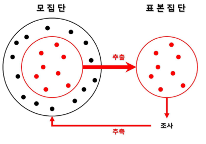
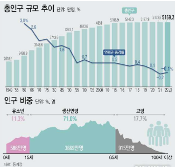
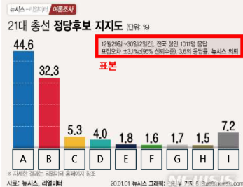
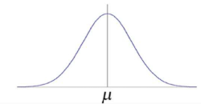
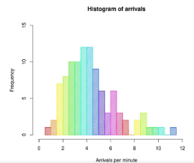
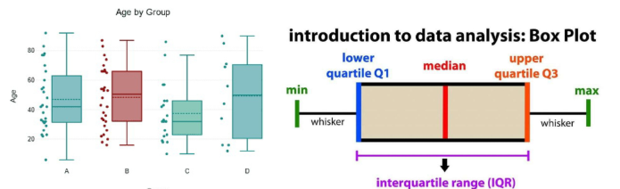
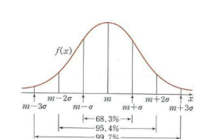
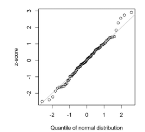
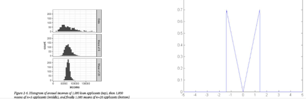

# 데이터사이언스 기초 - 데이터 분석을 위한 기초 수학 1

INDEX

1. 임의표본 추출과 표본 편향, 선택편향
2. 분포에 대한 이해

## 1. 임의표본 추출과 표본 편향, 선택 편향
### 1) 임의표본 추출과 표본 편향, 선택 편향
#### 모집단과 표본의 개념
- 모집단 : 연구 대상이 되는 전체 집단
- 표본 : 모집단에서 일부를 선택한 것
- 모든 사람(모집단)을 조사할 수 없으므로, 일부(표본)을 뽑아서 조사한 후 이를 바탕으로 모집단의 특성을 추정

    

#### 표본 조사의 필요성
- 인구 조사 vs. 표본 조사
  1. 인구 조사(Census) -> 모집단 조사
     - 전체 국민을 조사하는 방법
     - 가장 정확하지만, 시간과 비용이 많이 소모
     - ex) 대한민구의 인구 총 조사(모든 국민 조사)
    

  2. 여론조사(Survey) -> 표본 조사
     - 모든 사람을 조사하는 것이 어렵기 때문에 일부만 조사
     - 정확한 결과를 위해 표본을 신중히 선택
     - ex) 대선 후보 지지율 조사
     - 주의점
       - 만약 표본이 특정 지역이나 연령대에 편향된다면, 전체 국민의 의견을 제대로 반영하지 못함 (표본 편향 발생)
         - 표본편향 : 모집단을 잘못 대표하는 표본을 의미
    
        

#### 표본 추출의 개념
- 표본 추출 : 모집단에서 일부를 선택(추출)하는 과정

#### 표본 추출의 방법
| 표본추출 방법 | 설명 | 예시 |
|:-----------:|:---:|:----:|
| 단순 무작위 추출 | 모든 사람이 동일한 확률로 뽑힘 | 모자 속에서 랜덤하게 종이 한 장 뽑기 |
| 층화추출 | 모집단을 그룹(층)으로 나눈 후, 각 층에서 표본 추출 | 학년별 반 대표 한 명씩 뽑기 |
| 계통추출 | 모집단을 일정 간격으로 나누어, 표본을 추출 | 첫 번째 학생을 랜덤하게 선택한 후, 5명마다 한 명씩 조사 |
| 군집추출 | 모집단을 여러 그룹(군)으로 나눈 후, 몇 개의 군을 랜덤 선택 | 한 반을 통째로 뽑아 조사 |
| 편의추출 | 쉽게 접근할 수 있는 표본을 선택 (비추천) | 길거리에서 가까운 사람들만 설문조사 |
##### 편향된 표본 추출은 잘못된 결론을 내릴 수 있음 

#### 임의 추출(무작위 추출)의 개념
- 임의 추출(무작위 추출) : 모집단에서 특정한 규칙 없이 무작위로 표본을 선택하는 방법
- 표본추출의 종류
  - 복원 추출
  - 비복원 추출
- 임의 추출이 필요한 이유
  1. 공정성 유지 : 모든 대상이 동일한 확률로 선택될 기회 제공
  2. 대표성 확보 : 특정 그룹에 치우치지 않고 모집단 전체를 반영
  3. 편향 방지 : 의도적인 선택(예 : 특정 지역, 특정 연령대만 조사)을 막아 객관적인 데이터 확보
  4. 통계 분석의 신뢰도 증가 : 모집단을 잘 반영한 표본이면, 정확한 결론을 도출할 가능성이 높아짐

#### 표본 편향의 개념
- 표본 편향 : 모집단을 대표하지 못하는 잘못된 표본을 선택하여 조사 결과가 왜곡된 현상
  - 대표성을 담보하는 방법은 여러 가지 있지만, 핵심은 임의 표본 추출

#### 표본 편향을 줄이는 방법
- 임의 추출 강화
  - 무작위로 표본을 선택하여 공정성을 높이는 방법
  - 모든 개체가 동일한 확률로 선택될 기회를 가져야 함
- ex) 대통령 지지율 조사
  - 전국에서 유권자를 무작위로 선택
  - 특정 나이대, 지역을 대상으로만 조사하면 편향 발생
- 장/단점
  - 장점 : 모집단을 공정하게 대표할 가능성 증가
  - 단점 : 모집단이 크면 랜덤으로 뽑기 어려움
- 방법
  - 제비 뽑기
  - 난수 생성기 활용

- 층화 추출 활용
  - 모집단을 그룹(층)으로 나눈 후, 각 층에서 무작위로 표본을 추출
  - 모집단 내 특정 특성(성별, 연령, 지역, 직업 등)에 따라 그룹을 나눈 후, 각 그룹에서 무작위로 표본을 추출
- ex) 선거 여론 조사
  - 유권자를 성별, 나이대, 지역별로 나눈 후, 각 그룹에서 비율에 맞게 표본을 추출
- 장/단점
  - 장점 : 모집단의 다양한 특성을 고려 가능하며, 과소/과대 대표되는 문제를 방지
  - 단점 : 모집단을 층화하는 과정이 시간과 비용이 소요
- 방법
  - 모집단을 비슷한 특성으로 가잔 그룹으로 나눔
  - 각 그룹에서 비율에 맞게 표본 추출

- 계통 추출 적용
  - 일정한 간격으로 표본을 추출하는 방법
- ex) 공장 품질 검사
  - 생산된 1000개의 제품 중 처음 제품을 무작위로 선택한 후, 이후 매 100번째 제품마다 품질 검사를 진행
- 장/단점
  - 장점 : 쉽고 빠르게 표본 추출이 가능하다.
  - 단점 : 모집단의 특정 패턴이 있다면, 편향 발생 가능
- 방법
  - 모집단 크기 : N, 표본 크기 : n, k(간격) = N/n
  - 첫번째 표본을 무작위 선택
  - 이후 k 간격마다 표본 선택

- 표본 크기 확대
  - **표본 크기를 늘려** 모집단을 더 정확히 반영
- ex) 대선 여론 조사
  - 표본이 500명일 때보다 5000명일 때 더 정확한 결과 예측 가능
- 장/단점
  - 장점 : 표본이 클수록 결과의 신뢰도 증가
  - 단점 : 표본이 너무 크면, 비용과 시간이 많이 소요
- 방법
  - 가능하면 더 많은 표본을 확보
  - 비용과 시간을 고려하여 적절한 표본 크기 선정

- 편향을 보정하는 가중치 적용
  - 특정 그룹이 과소/과대 대표된 경우, **보정**하는 방법
- ex) 대선 여론 조사
  - 만약 여론 조사에서 20대 남성의 표본이 부족하다면, 결과 해석 시, 20대 남성의 응답 비율을 더 높게 반영
- 장/단점
  - 장점 : 모집단을 더 정확하게 반영 가능
  - 단점 : 가중치가 잘못 설정되면 오히려 결과 왜곡될 가능성 발생
- 방법
  - 부족한 그룹의 응답을 보정하기 위해 가중치를 적용해 결과 반영

#### 선택 편향의 개념
- 선택 편향 : 관측 데이터를 **선택하는 방식** 때문에 생기는 **편향**
- 즉 특정한 선택으로 표본이 모집단을 대표하지 못해 연구 결과가 왜곡되는 문제
- 중요한 이유
  - 선택 편향이 있으면, 연구 결과를 모집단 전체에 적용하기 어려움
  - 특정 그룹의 과소/과대 평가될 위험이 있음
  - 특히, 의학 연구, 사회과학 연구, 정책 결정 등에서는 큰 영향을 미침

#### 특정 사례
- 사례1 : 신약 임상 시험에서 선택 편향
  - 어떤 신약을 건강한 사람들만 임상 시험을 진행했다면,
    - > 실제로 약이 필요한 고령자, 만성질환 환자에게 효과가 다를 수 있음
- 사례2 : 병원 방문자를 대상으로 한 연구
  - 병원에 오는 환자를 대상으로만 질병 위험 요인을 분석한다면,
    - > 병원을 방문하지 않는 사람들은 포함하지 않아 연구 결과가 편향 가능성이 있음

#### 선택 편향이 발생하는 이유
- 특정 그룹만 포함되는 경우
  - 연구 설계 과정에서 특정 특성을 갖은 사람들만 표본으로 포함
- 자발적 참여
  - 연구에 참여하는 사람이 스스로 결정하면,
  - 연구에 적극적으로 참여하는 사람만 포함될 가능성이 높음
- ex) 건강 검진
  - 건강검진 연구에서 건강에 관심 있는 사람만 참여한다면 편향 발생

#### 선택 편향 vs. 표준 편향의 차이점
| 구분 | 표본 편향(Sampling Bias) | 선택 편향(Selection Bias) |
|:---:|:------------------------:|:---------------:|
| 정의 | 모집단을 대표하지 않는 표본을 선택하는 문제 | 특정한 방식으로 표본이 선택되어 결과가 왜곡되는 문제 |
| 원인 | 잘못된 표본 추출 방법(편향된 모집단에서 샘플 추출) | 연구에 포함될 대상이 특정 기준으로 선택됨 |
| 예시 | 여론조사를 할 때 특정 지역 사람들만 조사 | 건강검진 연구에서 건강한 사람들만 참여 |
|해결 방법 | 무작위 추출, 층화 샘플링 | 랜덤화, 비교 그룹 분석 |

## 2. 분포에 대한 이해
### 1) 분포에 대한 이해
#### 분포(Distribution)
- 분포 : 데이터가 어떤 값 주변에 어떻게 **퍼져 있는지(흩어져 있는지)**를 나타내는 것
- ex) 키 조사
  - 모든 친구의 키가 170cm라면?
    - > 데이터가 한 곳에 집중되어 있음(변동이 적음)
  - 친구들이 키가 150cm ~ 190cm로 다양하다면?
    - > 데이터가 넓게 퍼져 있음 (변동이 큼)
- 즉, 분포를 보면 데이터가 어떻게 생겼는지(좁게 모여 있는지, 넓게 퍼져 있는지)를 알 수 있음
  

#### 분포(Distribution)의 필요성
- 데이터의 패턴 파악
  - 데이터가 대체로 **어디에 몰려 있는지(중심경향)** 확인
- 이상치 발견
  - 데이터를 분석할 때 극단적으로 **크거나 작은 값(이상치)**을 찾는 것이 중요
  - 예 : 평균 몸무게가 60kg인데, 120kg이 포함되어 있다면 이상치 가능성
- 비교와 예측 가능
  - 두 개 이상의 그룹을 비교할 때 **어떤 차이**가 있는지 시각적으로 확인 가능
  - 예 : 남학생과 여학생의 키 분포 비교
- 적절한 분석 방법 선택
  - 데이터의 분포 형태에 따라 **평균, 중앙값 등을 선택**하여 분석 가능
  - 예 : 정규분포(대칭형)라면 평균을 사용, 왜곡된 분포라면 중앙값이 더 적절

### 2)  분포(Distribution) 시각화 방법
#### 히스토그램
  - 히스토그램은 데이터를 막대 그래프로 나타낸 것
  - 데이터의 **전체적인 분포를 쉽게 확인 가능**
  

#### 박스플롯(Box Plot)
  - 데이터의 범위, 중앙값, 이상치를 한눈에 볼 수 있는 그래프
  - 데이터의 최솟값, 최댓값, 중앙값(50%), 1사분위(25%), 3사분위(75%)를 표현
  - **데이터의 퍼짐 정도(분산)**와 이상치를 확인하는 데 유용

  

#### 밀도 곡선(Density Plot)
- 데이터를 연속적인 곡선 형태로 나타내어 데이터의 분포를 부드럽게 표현한 그래프
- 히스토그램처럼 데이터를 나누지 않고 **연속적인 곡선으로 표현**
- **데이터의 중심**과 **분포의 형태**를 더 부드럽게 볼 수 있음

#### 기술 통계량의 개념
- 기술 통계량 : 데이터의 특징을 요약한 것
  - 중앙값 : 데이터를 크기 순으로 정렬했을 떄 중앙에 있는 값
  - 평균값 : 데이터 값들의 평균 값
  - 분산 : 데이터 평균을 기준으로 얼마나 퍼져 있는지를 나타내는 값
  - 표준편차 : 분산의 제곱근, 데이터의 필요성을 나타냄
- 이상치 발견
  - 데이터를 분석할 때 극단적으로 **크거나 작은 값(이상치)**을 찾는 것이 중요
  - 예: 평균 몸무게가 60kg인데, 120kg이 포함되어 있다면 이상치 가능성
- 비교와 예측 가능
  - 두 개 이상의 그룹을 비교할 때 **어떤 차이**가 있는지시각적으로 확인 가능
  - 예 : 남학생과 여학생의 키 분포 비교
- 적절한 분석 방법 선택
  - 데이터의 분포 형태에 따라 **평균, 중앙값 등을 선택**하여 분석 가능
  - 예 : 정규분포(대칭형)라면 평균을 사용, 왜곡된 분포라면 중앙값이 더 적절

#### 확률분포 (Probability Distribution)
- 데이터가 특정 값 주위에 어떻게 분포하는지를 설명하는 개념
- 데이터의 패턴을 분석하고 예측 모델을 선택하는 데 유용
  | 분포 유형 | 설명 | 활용 |
  |:--------:|:---:|:----:|
  | 정규분포 | 평균을 중심으로 대칭적인 종 모양 분포 | 키, 몸무게, 시험 점수 |
  | 균등분포 | 모든 값이 같은 확률을 가짐 | 난수 생성, 시뮬레이션 |
  | 이항 분포 | 성공/실패 같은 이진 결과 모델링 | 이메일 클릭률, 제품 불량품 예측 |
  | 포아송 분포 | 일정한 시간/공간 내에서 사건 발생 횟수 모델링 | 콜센터 문의 수, 기계 고장 예측 |

### 3) 통계학에서의 표본 분포
#### 표본분포
- 같은 모집단에서 동일한 크기 n의 표본을 많이 추출했을 때, 어떤 통계량이 만들어내는 확률 분포
- 특징
  - 단일 표본 하나만 봤을 때는 샘플 평균이 모집단의 평균에 가까울 수도 아닐 수도 있음
  - 많은 표본 평균을 모으면 **특정한 패턴**을 띠게 됨
- 예) 전국 고등학생의 평균 키
  - 전국 고등
  학생의 평균 키를 알고 싶다면, 모든 학생의 키를 조사해야 함
    - > 시간과 비용이 많이 소모됨
  - **랜덤하게 100명씩 뽑아서 평균을 구하는 것**을 **여러 번 반복**하여 평균값들이 다르는 분포가 만들어지게 함

#### 정규분포(Normal Distribution / Gaussian Distribution)
- 종 모양의 분포
- 데이터가 평균을 중심으로 **대칭적인 종 모양**을 띠는 분포
- 특징
  - 평균(μ)과 표준편차(σ)로 정확히 모양이 결정됨
  - 가운데 값이 가장 많고 양옆으로 갈수록 빈도가 적어짐
  - 현실에서 가장 흔히 나타나는 분포
  - 많은 자연 현상과 금융 데이터가 이 분포를 따르는 경우가 많음
    

#### 정규분포(Normal Distribution)의 주요 특성
- 대칭성
  - 평균(μ)을 중심으로 좌우 대칭
  - 평균(μ) = 중앙값(median) = 최빈값(mode)
- 68-95-99.7 법칙
  - 데이터의 68%가 ±1 표준편차(σ) 내에 존재
  - 데이터의 95%가 ±2 표준편차(σ) 내에 존재
  - 데이터의 99.7%가 ±3 표준편차(σ) 내에 존재

- 즉, 정규분포는 많은 자연적/사회적 현상에서 발견되며, 데이터 분석에서 필수적인 개념

#### QQ-plot
- 데이터의 **실제 분포가 정규분포와 얼마나 가까운지** 그래프상으로 확인하는 방법
- QQ-plot 보는 방법
  - x축은 이론적인 정규분포, Y축은 실제 데이터 분포를 의미
  - 점들이 직선 위에 가까이 있으면 정규 분포에 가까운 것
- 예) 반 학생들의 키
  - 반 학생들의 키가 정규분포인지 궁금하다면
  - 키 데이터를 QQ-plot으로 확인했을 때 점들이 직선을 잘 따라가면 정규분포라고 판단
  - 만약 특정 구간에서 크게 벗어난다면, 정규분포가 아닌 가능성이 높음
  

#### 중심극한정리(Central Limit Theorem, CLT)
- 표본의 크기 n이 충분히 크다면, **모집단의 분포 형태와 관계 없이** 표본평균의 분포는 정규분포를 따르는 원리
- 특징
  - 모집단이 어떤 모양(정규분포가 아니어도)이라도 상관 없음
  - 표본 크기 n이 커질수록 표본평균의 분포가 정규분포에 가까워짐
  - **다양한 모집단**에서도 **정규 분포를 활용한 분석**이 가능함
    

- 현실에서의 중요성
  - 금융, 경제, 데이터 분석에서는 모집단의 분포를 알 수 없음
  - 하지만 표본 평균을 사용하면 정규 분포를 가정할 수 있음
  - 주식 수익률, 경제 지표 분석, 리스크 평가 등에서 **정규 분포를 가정하여 확률을 계산**할 수 있어 유용함
- 사례 : 주식 수익률 분석(금융)
  - **어떤 회사의 하루 수익률**은 일정하지 않고 들쑥날쑥(비정규분포)한 상태
  - **30일간의 평균 수익률을 여러 번 구하면**, 그 평균값들은 정규분포를 따르게 됨
  - **표본 크기를 키우면서 시각적으로** 어떻게 정규분포에 가까워지는지 보여주면 효과적
- 즉, **중심극한정리를 활용하면 불규칙한 데이터도 정규분포를 가정하여 예측이 가능해짐**

#### 균등분포(Uniform Distribution)
- 특정 범위 내에서 **모든 값이 같은 확률**을 가짐
- 확률 밀도 함수
  - 연속형 균등 분포에서는 **구간 [a, b]에서 모든 값이 동일한 확률로 나타남**
    - f(x) = 1 / (b-a), a≤x≤b (a : 최소값, b : 최대값, b-a : 전체 구간 길이, 특정 값이 나올 확률은 항상 1/(b-a)로 일정)

- 사례) 로또 번호 추첨(이산형 균등분포)
  - 로또(1~45번)에서 특정 숫자가 나올 확률
  - 각 숫자(1~45)는 동일한 확률(1/45)로 나옴
  - 1번이든 45번이든 당첨될 확률은 동일
  
- 즉, **랜덤하게 숫자를 추천할 때, 모든 숫자가 같은 확률로 선택된다면 "균등 분포"**

#### 이항분포 (Binomial Distribution)
- 성공/실패 같은 **이진(두 가지) 결과** 다루는 확률 모델
- 확률 질량 함수
  - P(X = k) = nCk p^k (1-p)^(n-k)
    - n : 총 시행 횟수
    - k : 성공 횟수
    - p : 성공 확률

- 조건
  - 독립적인 실험이 반복
  - 각 실험은 성공 또는 실패(두 가지 결과) 중 하나만 가능
    - 예 : 동전 앞면 or 뒷면
  - 각 실험의 성공 확률은 일정함
  - 실험을 여러 번 반복하면서 성공 횟수를 세는 것

- 즉, **이항 분포는 여러 번의 독립적인 실험에서 성공하는 횟수의 분포를 나타냄**

#### 이항분포 주요 특성
- 평균(기대값, Expect Value)
  - E(X) = n * p

- 분산(Variance) 및 표준편차(Standard Deviation)
  - 실험 횟수(b)가 커질수록 분산도 커짐
  - 성공 확률(p)이 0.5일 때 가장 분산이 큼
  - Var(X) = np(1-p)
  - σ(X) = sqrt(np(1-p))

- 이항분포의 그래프 모양 변화
  - p = 0.5일 때 대칭적인 분포를 가짐
  - p가 작거나 크면 비대칭적인 형태를 가짐

-  즉, **실험 횟수(n)와 성공 확률(p)에 따라 이항분포의 형태가 달라짐**

#### 포아송 분포(Poisson Distribution)
- **일정한 시간** 또는 **공간에서 사건이 발생하는 횟수를 모델링하는 확률 분포**
- 확률 질량 함수
  - P(X = k) = λ^ke^-λ / k!
    - λ : 단위 시간당 평균 발생 횟수
    - k : 실제 발생한 사건 수 (0, 1, 2, 3, ...)
    - e : 자연 상수 (2.718)

- 조건
  - 사건 발생이 **독립적**이어야 함(예: 은행 방문자가 서로 영향을 주지 않음)
  - 일정한 단위에서 사건이 발생할 확률이 일정함 (예: 1시간 동안 발생하는 전화 문의 수)
  
- 즉, **포아송 분포는 "어떤 사건이 몇 번 발생할지"를 예측하는 데 사용**

#### 포아송 분포 주요 특성
- 평균과 분산이 같음
  - E(X) = λ, Var(X) = λ

- λ(람다)에 따른 그래프 모양 변화
  - λ(평균 사건 수)가 작으면 -> 그래프가 왼쪽에 치우침(비대칭)
  - λ가 커지면 -> 그래프가 정규분포와 비슷해짐

- 이항분포와의 관계
  - 사건 발생할 확률이 매우 작고, 시행 횟수가 많다면 **이항분포 = 포아송 분포**
  - 예) 1000명 중 극소수만 특정 질병에 걸리는 경우 -> 포아송 분포로 근사 가능

- 즉, **포아송 분포는 희귀한 사건(낮은 확률)의 발생횟수를 모델링하는 데 적합**

