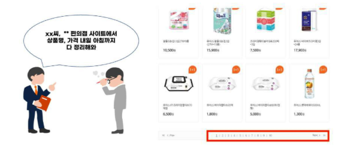
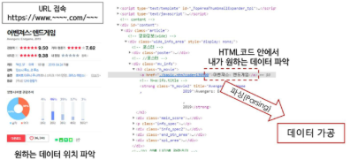
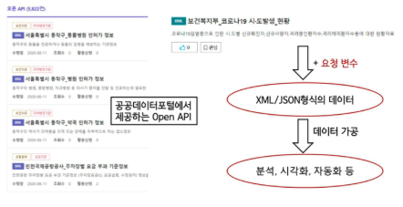
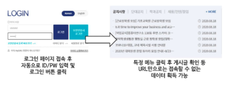
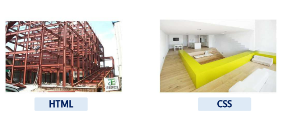

# 데이터사이언스 기초 - 데이터 수집

목차

1. 웹 크롤링의 구조와 이해
2. Beautiful Soup의 활용
3. OpenAPI의 활용

## 1. 웹 크롤링의 구조와 이해
### 1) 웹 크롤링이란?
- **Web(거미줄) + Crawling(기어다니다)**
- 인터넷 상의 웹 페이지를 자동으로 탐색하고 데이터를 수집하는 기술
- **스크래핑**
  - 특정 웹페이지에서 원하는 데이터(텍스트, 이미지, 표 등)를 추출하는 과정

### 2) 웹 크롤링의 특징
- 자동화
- 대량 데이터 수집
- 구조화된 데이터 추출

### 3) 웹 데이터 수집 방법
- 웹 페이지를 가져와서 필요한 정보만 추출하기(스크래핑)
- WebDriver를 이용해 웹 브라우저 자동화하기(스크래핑 or 크롤링)
- 제공된 OpenAPI를 이용해 실시간으로 데이터 가져오기

### 4) 웹 크롤링의 필요성

### 5) 웹 페이지에서 데이터 추출
- 웹 페이지는 HTML(Hyper Text markup language)을 중심으로 이루어져 있음
- 원하는 주소의 웹 페이지로 들어가 HTML 내용을 가져오고, 그 안에서 원하는 데이터가 어디 있는지 가져오는 직업(parsing)
- Python에는 BeautifulSoup 라이브러리 주로 사용
    

### 6) 공개된 Open API 사용하기
- 만약 기관 등의 서버에서 Open API를 제공하고 있다면, 손쉽게 정제된 형태의 데이터를 가져올 수 있음
- 주로 XML이나 JSON이라는 데이터 형식으로 인코딩 있음
    

### 7) WebDriver로 웹 브라우저 자동화
- 크롬, 파이어폭스, IE등의 웹 브라우저에서 클릭, 텍스트 입력 등의 행동을 코드로 제어할 수 있게끔 만든 브라우저를 WebDriver라고 함
- 로그인이 필요한 서비스 등 단순 URL만으로는 접속할 수 없는 세션 유지가 필요한 작업이나, 옵션이나 드롭다운 메뉴를 클릭해야 함
- 데이터를 얻을 수 있는 작업에 필요함
  - 꼭 크롤링이 아니더라도, 웹 브라우저의 행동을 자동화하는 다른 작업(게시판에 자동 글쓰기, 새 메일 자동 읽기 등)에도 사용할 수 있따.
- Python에서는 Selenium 라이브러리를 사용함
    

### 8) 기타 고급 작업
- 아주 드물게 HTML이나 WebDriver만으로는 접근이 불가능한 데이터도 있음(공인인증서 등 추가 팝업 프로그램을 사용하는 경우, 이미지 내의 텍스트 등)
- 웹 브라우저를 넘어서는 수준의 조작이 필요한 경우, Python에서는 win32api나 pyautogui 등의 라이브러리를 사용하면 데스크탑 수준에서 마우스 강제이동, 클릭, 키보드 입력 등을 제어할 수 있어, 거의 모든 작업을 자동화할 수 있음
- 이미지 인식이 필요한 경우 opencv-python(cv2), DirectPython, PyGTK, PIL 등의 라이브러리를 사용하면 화면을 실시간으로 캡쳐하고 이미지 인식까지 구현할 수 있음
- 보통은 크롤링한 정보를 python 코드 내에서 바로 활용하거나, 저장이 필요한 경우 *.txt *.csv 형태로 저장하거나 혹은 pickle 라이브러리를 써서 내보냄
- 그러나 간혹 엑셀 형태로 가공하여, 셀 크기나 색상 등의 속성, 글꼴 속성 등을 설정하고자 하는 경우가 있음
  - 이 경우 openpyxl을 사용하면 python으로 엑셀 문서의 거의 모든 것을 편집할 수 있음
  - 비슷하게 MS Word는 python-docx, 아래아 한글은 pyHWP로 편집할 수 있음

### 9) 웹 페이지의 구조
- 웹 페이즈는 HTML, JavaScript의 조합으로 구성됨
- HTML(Hyptertext markup language)는 웹 페이지를 구성하는 필수 언어로 제목, 단락, 목록 등과 같은 본문을 위한 구조적 의미를 나타내는 것 뿐만 아니라 링크, 인용과 그 밖의 항목으로 구조적 문서를 만들 수 있는 방법을 제공
- 웹 크롤링을 통해 얻고자 하는 데이터는 HTML의 어딘가에 들어 있음
  - 따라서 웹 페이지 내의 어느 정보가 HTML의 어디에 위치하는지를 파악하기 위해 HTML의 구조를 알아야 함
  - 데이터를 뽑아내 원하는 형태로 가공하는 작업을 파싱(parsing)이라 함
- CSS(Cascading StyleSheets)는 HTML의 요소의 외관을 디자인 함

### 10) HTML vs. CSS

### 11) HTML 기본 구성 요소
`
Hyper Text Markup Language
`

- `

`: Opening Tag, Closing Tag
- `Hyper Text Markup Langauge` : Content(내용)
- `
Hyper Text Markup Language
` : Element(요소)

`
Hello, HTML!
`
- `align='center'` : Attribute
  - 해당 요소에 추가적인 내용을 담고 싶을 때
    - ex) 글자색, 크기, 배경색, 배경이미지, 여백 등 ...

### 12) HTML 구조

