# 데이터 사이언스 기초 - 데이터 시각화

INDEX

1. 시각화 기본 개념
2. Matplotlib을 활용한 시각화
3. Seaborn을 활용한 시각화
4. Plotly를 활용한 시각화

## 1. 시각화 기본 개념
### 1) 탐색적 데이터 분석에 필요한 시각화
#### 데이터 시각화의 필요성
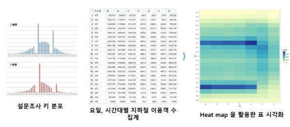

#### 알맞은 시각화 방식을 선택해야 하는 이유
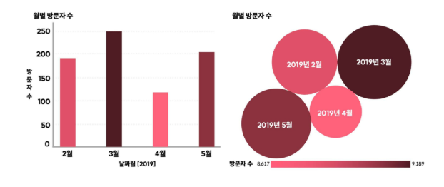

#### 통계적인(Statistical) 시각화
- 히스토그램
- 바이올린 플롯
- 산포도
- 바 차트
- 분위
- 상관 히트맵

#### 업무 분석(Business Analysis) 시각화
- 바 차트
- 라인 플롯
- 파이 차트
- 영역 차트
- 산포도
- 방사형 차트
- 버블 차트
- 깔때기 차트

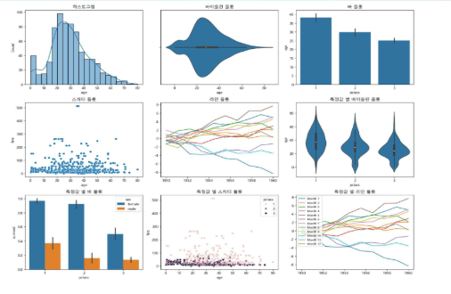

| 시각화 유형 | 설명 | 용도 |
|:---------:|:----|:-----|
| 히스토그램 (Histogram) | **연속형** 데이터의 도수 분포를 나타냄 X축은 특정 구간, Y축은 해당 구간에 속한 데이터 개수 | 데이터의 분포 확인, 특정 값이 많이 나타나는지 분석 |
| 막대 그래프 (Bar Plot) | X축에 **범주형** 데이터, Y측에 연속형 데이터를 배치하여 특정 범주형 평균 또는 합계를 비교 | 범주별 데이터 비교, 그룹별 평균값 또는 합계 비교 |
| 산포도   (Scatter Plot) | 두 개의 연속형 변수 간 관계를 나타내는 산점도  점들이 특정 패턴을 따르는지 확인 가능 | 변수 간 관계 분석, 상관관계 확인, 데이터 분포 패턴 분석 |
| 선 그래프 (Line Plot) | 시계열 데이터를 시각화하는 그래프  X축에 시각 요소(년/월/일 등), Y축에 연속형 데이터를 배치 | 시간에 따른 데이터 변화 분석, 추세(Trend) 파악 |

#### 히스토그램
- 히스토그램은 분포 확인, 특정 값이 많이 나타나는지 분석할 때 주로 사용

    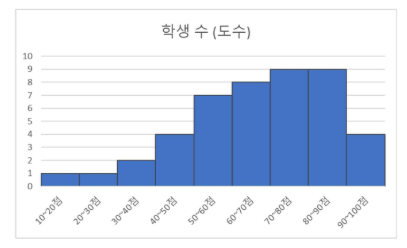

#### 막대 그래프
- 가로 막대 그래프는 항목별 차이를 비교할 때 자주 사용
- 긴 텍스트 라벨을 가독성 좋게 표시

    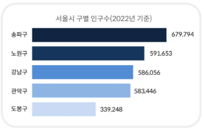

- 세로 막대 그래프는 항목별 차이를 나타낼 때 자주 사용
- 시간 흐름이나 순차적인 데이터를 표현

    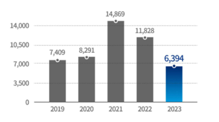

#### 산포도
- 복수의 변수를 비교하거나 상관관계를 파악할 때 자주 사용
    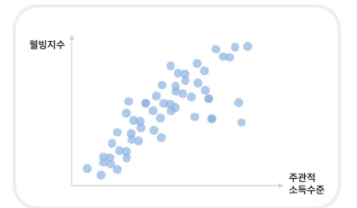

#### 선 그래프
- 시계열의 변화를 나타낼 때 자주 사용
    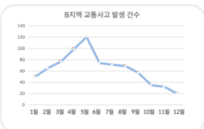

#### 다양한 그래프
| 시각화 유형 | 설명 | 용도 |
|:---------:|:----|:-----|
| 박스 플롯 (Box Plot) | 데이터의 분포와 이상치를 시각화하는 그래프, 중앙값, 사분위수, 이상값을 표시 | 데이터 분포 비교, 이상치 탐지 |
| 바이올린 플롯 (Violin Plot) | 박스 플롯과 KDE(커널 밀도 추정)을 결합한 형태로 데이터 분포를 더욱 직관적으로 표현 | 데이터의 밀도와 분포 형태 분석 |
| 히트맵   (Heatmap) | 행렬 형태의 데이터를 색상으로 표현하여 관계를 시각화 | 상관관계 분석, 행렬 데이터 시각화 |
| 버블 차트 (Bubble Chart) | 산포도와 유사하지만, 점의 크기를 추가적인 변수를 통해 표현 | 다차원 데이터 시각화, 변수 간 관계 분석 |

#### 박스 플롯
- 하나 이상의 연속형 변수의 분포와 이상값을 시각화
    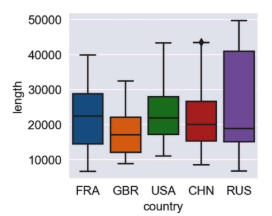

#### 바이올린 플롯
- 박스 플롯 + 커널 밀도 추정(KDE)를 합친 형태로 분포의 형태와 밀도를 함께 시각화
    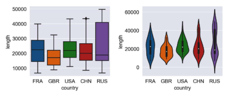

#### 히트맵
- 이차원 형태의 데이터 값의 크기를 색상 농도로 시각화해 패턴 및 상관관계 파악
    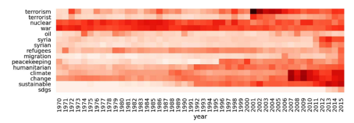

#### 버블 차트
- 산포도(Scatter Plot)에 크기라는 차원(변수)을 추가한 형태
    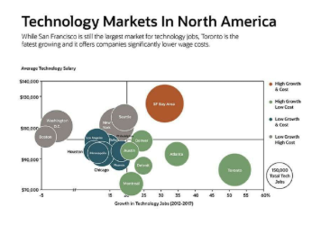

## 2. Matplotlib을 활용한 시각화
### 1) Matplotlib의 장단점
- 장점
  - 유연성 : 모든 종류의 플롯 가능, 세밀한 커스터마이징
  - 넓은 사용자층과 문서 : 풍부한 자료와 커뮤니티 지원
  - 정교한 제어 : 그래프의 모든 요소 조정 가능
- 단점
  - 복잡서 : 간단한 작업도 많은 코드 필요
  - 기본 스타일 : 추가 스타일링이 필요할 수 있음

#### Matplotlib의 시각화 구성요소
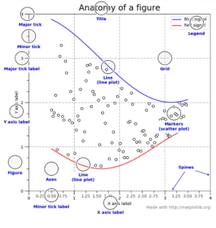

#### pyplot의 중요 요소
- Figure
  - 그림을 그리기 위한 Canvas 역할
  - 그림판의 크기 등을 조절
- Axes
  - 실제 그림을 그리는 메소드들을 가짐
  - x축, y축, Title 등의 속성 설정
    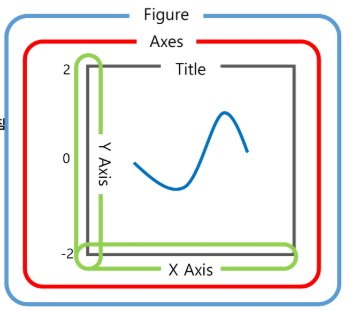

## 3. Seaborn을 활용한 시각화
### 1) Seaborn을 활용한 시각화
#### seaborn의 장단점
- 장점
  - 간결함 : 적은 코드로 세련된 시각화 가능
  - 기본 스타일 : 매력적인 기본 스타일 제공
  - 데이터프레임 친화적 : Pandas와 잘 통합됨
  - 고급 통계 기능 : 통계적 시각화 쉽게 구현
- 단점
  - 제한된 커스터마이징 : 세부적인 조정이 어려움
  - 유연성 부족 : 특정 그래프나 기능에 한계

#### seaborn을 사용한 시가고하
- Figure level 함수와 Axes level 함수
  - Figure-level 함수는 Figure 전체를 관리
  - Axes-level 함수는 개별 Axes에서 하나의 플롯을 그리는 데 사용

## 4. Plotly를 활용한 시각화
### 1) Plotly을 활용한 시각화
#### Plotly의 장단점
- 장점
  - 상호작용성 : 상호작용 가능한 그래프 기본 제공
  - 웹 통합 : 웹 기반 시각화에 최적화
  - 3D 및 지리적 시각화 : 고급 시각화를 간단히 구현
  - 시각적 미학 : 세련된 기본 그래프 제공
- 단점
  - 학습 곡선 : 고급 기능 활용을 위해 학습 필요
  - 대규모 데이터 처리 한계 : 성능 문제 발생 가능
  - 복잡한 커스터마이징 : 세밀한 조정이 복잡할 수 있음
