# 데이터사이언스 활용 - 데이터 분석을 위한 딥러닝 기초

INDEX

1. 딥러닝 개념 및 흐름
2. 이미지 데이터 처리
3. 시퀀스 데이터 처리

## 1. 딥러닝 개념 및 흐름
### 1) 딥러닝(Deep Learning)이란?
- 데이터를 반복 학습하며 패턴을 찾는 인공지능 기술
- 영상, 음성, 텍스트 등 다양한 데이터에 활용됨

### 2) 딥러닝과 머신러닝의 차이
- 머신러닝은 사람이 특징을 설계해야 한다.
- 딥러닝은 특징 추출까지 모델이 자동으로 수행한다.
- 모두 학습 기반이지만 처리 방식에 차이가 있다.

    | 구분 | 머신러닝 | 딥러닝 |
    |:---:|:-------:|:-----:|
    | 특징 추출 방식 | 사람이 수동으로 특징을 설계함 | 인공신경망이 자동으로 특징을 학습함 |
    | 학습 구조 | 전통적인 알고리즘 기반 | 다층 신경망 기반 |
    | 데이터 요구량 | 적은 양의 데이터로도 학습 가능 | 대규모 데이터가 필요함 |
    | 대표 알고리즘 | SVM, 결정트리, 랜덤포레스트 등 | CNN, RNN, LSTM, Transformer 등 |

### 3) 딥러닝의 모델 구조
- 수능 점수 예측 모델

    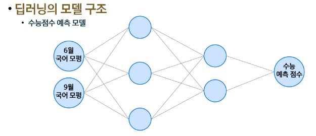
    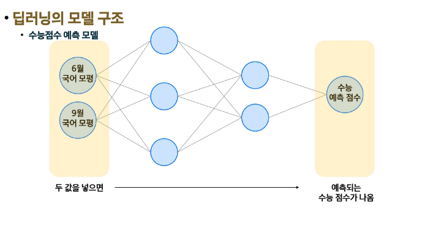
    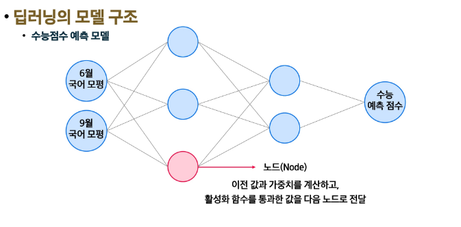
    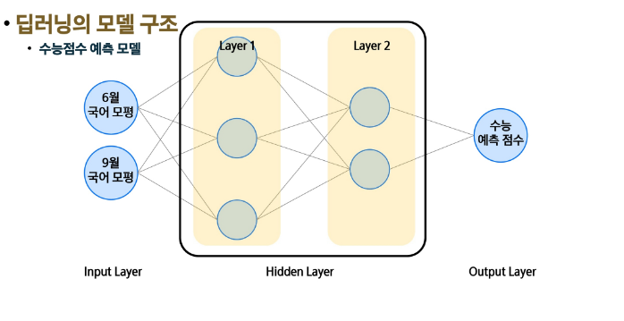

- 모델의 학습 방법
    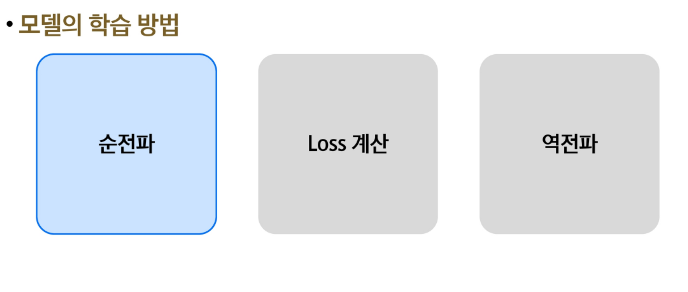

  - 순전파
    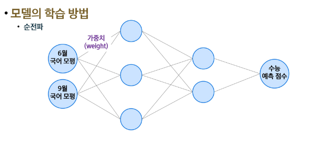
    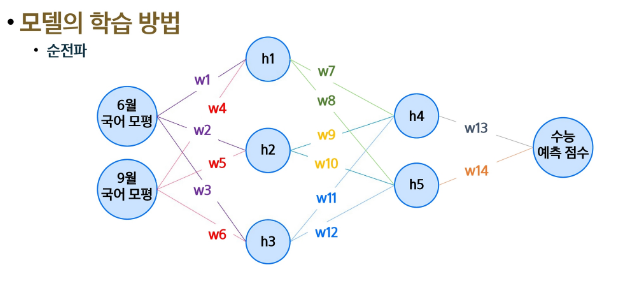
    
    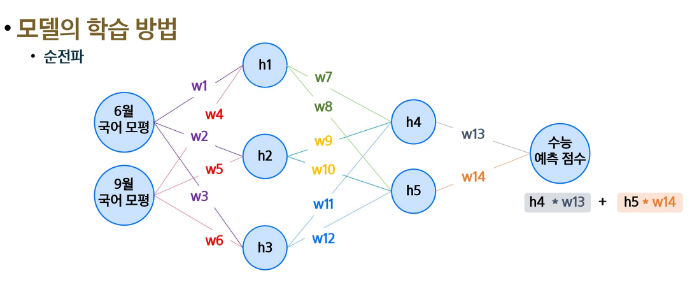
    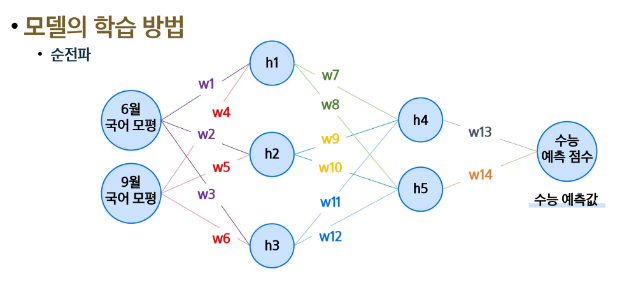
    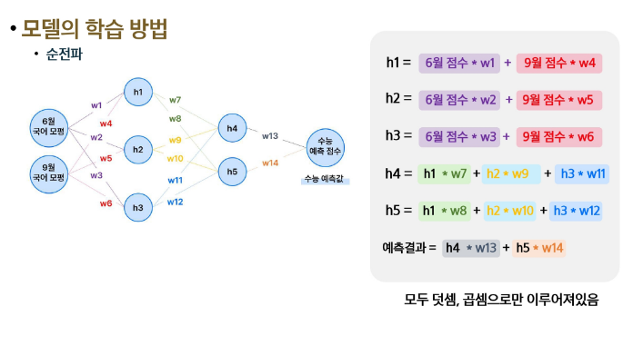

  - 대표적인 활성화 함수
    - sigmoid
    - Hyperbolic tangent
    - Rectified Linear Unit
      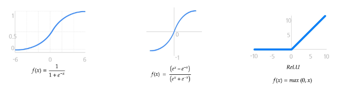

  - Loss 계산
    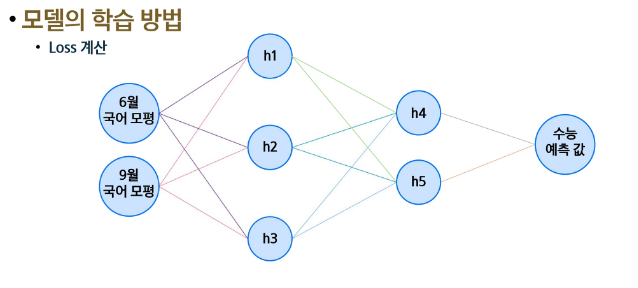
    