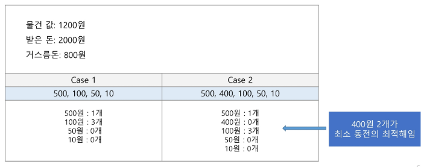
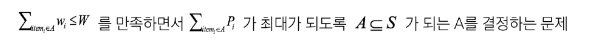
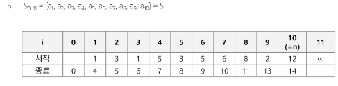
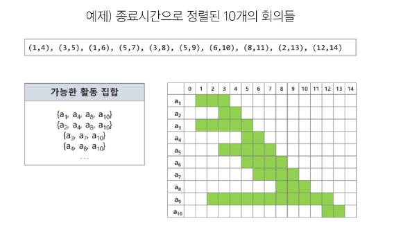
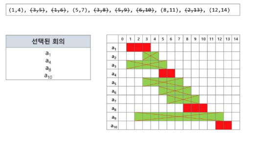

# 탐욕 알고리즘
<details>
<summary>목차</summary>

1. 탐욕 알고리즘
- 개요
- 활용1 : 배낭 짐싸기
- 활용2 : 활동 선택 문제
- 탐욕 알고리즘의 필수 요소
- 대표적인 탐욕 기법의 알고리즘

2. 문제풀이
- 원자 소멸 시뮬레이션
- 요리사

</details>

## 탐욕 알고리즘
### 개요
#### 문제 제시 : 거스름돈 줄이기
- 손님이 지불한 금액에서 물건값을 제한 차액(거스름돈)을 지불하는 문제를 생각해보자.
- "어떻게 하면 손님에게 거스름돈으로 주는 지폐와 동전의 개수를 최소한으로 줄일 수 있을까?"

#### 탐욕 알고리즘
- 최적해를 반드시 구한다는 보장이 없다.


- 최적해를 구하는 데 사용되는 근시안적인 방법
- 최적화 문제(optimization)란 가능한 해들 중에서 가장 좋은 (최대 또는 최소)해를 찾는 문제
- 일반적으로 머리 속에 떠오르는 생각을 검증 없이 바로 구현하면 Greedy 접근이 된다.
- 여러 경우 중 하나를 선택할 때마다 그 순간에 최적이라고 생각되는 것을 선택해 나가는 방식으로 진행하여 최종적인 해답에 도달
- 각 선택 시점에서 이루어지는 결정은 지역적으로 최적이지만, 그 선택들을 계속 수집하여 최종적인 해답을 만들었다고 하여, <span style='color:red'>그것이 최적이라는 보장은 없다.</span>
- 일단 한 번 선택된 것은 번복하지 않는다.
  - 이런 특성 때문에 대부분의 탐욕 알고리즘은 단순하며 또한 제한적인 문제들에 적용된다.

### 활용1 : 배낭 짐싸기
#### 활용1 : 배낭 짐싸기(knapsack)
- 도둑은 부자들의 값진 물건들을 훔치기 위해 보관 창고에 침입하였다.
- 도둑은 훔친 물건은 배낭에 담아 올 계획이다. 배낭은 담을 수 있는 물건의 총 무게(W)가 정해져 있다.
- 창고에는 여러 개 (n개)의 물건들이 있고 각각의 물건에는 무게와 값이 정해져 있다.
- 경비원들에게 발각되기 전에 배낭이 수용할 수 있는 무게가 초과하지 않으면서, 값이 최대가 되는 물건들을 담아야 한다.

- Knapsack 문제의 정형적 정의
  - S = {item_1, item_2, ..., item_n}, 물건들의 집합
  - W_i = item_i의 무게, P_i : item_i의 값
  - W: 배낭이 수용 가능한 총 무게
- 문제 정의
  - 

- Knapsack 문제 유형
  - 0-1 knapsack
    - 배낭에 물건을 통째로 담아야 하는 문제
    - 물건을 쪼갤 수 없는 경우
  - Factional Knapsack
    - 물건을 부분적으로 담는 것이 허용되는 문제
    - 물건을 쪼갤 수 있는 경우
- 0-1 knapsack에 대한 완전 검색 방법
  - 완전 검색으로 물건들의 집합 S에 대한 모든 부분집합을 구한다.
  - 부분집합의 총 무게가 W를 초과하는 집합들은 버리고, 나머지 집합에서 총 값이 가장 큰 집합을 선택할 수 있다.
  - 물건의 개수가 증가하면 시간 복잡도가 지수적으로 증가한다.
    - 크기 n인 부분집합의 수 2^n

- 0-1 knapsack에 대한 탐욕적 방법1
  - 값이 비싼 물건부터 채운다.
  - W = 30kg

  - 탐욕적 방법의 결과
    - (물건1) => 25kg, 10만원
  - 최적해
    - (물건2, 물건3) => 20kg, 14만원
  - 최적이 아니다.

- 0-1 knapsack에 대한 탐욕적 방법2
  - 무게가 가벼운 물건부터 채운다.
  - W = 30kg

  - 탐욕적 방법의 결과
    - (물건2 + 물건3) => 14만원

### 활용2 : 활동 선택 문제
#### 활용2 : 활동 선택 문제(회의실 배정)
- 김대리는 소프트웨어 개발팀들의 회의실 사용 신청을 처리하는 업무를 한다. 이번 주 금요일에 사용 가능한 회의실은 하나만 존재하고 다수의 회의가 신청된 상태이다.
- 회의는 시작 시간과 종료 시간이 있으며, 회의 시간이 겹치는 회의들은 동시에 열릴 수 없다.
- 가능한 많은 회의가 열리기 위해서는 회의들을 어떻게 배정해야 할까?
- 입력 예
  - 회의 개수
  - (시작 시간, 종료 시간)
  ```python
  10
  1 4  1 6  6 10  5 7  3 8  5 9  3 5  8 11  2 13  12 14
  ```
- 시작시간과 종료시간 (s_i, f_i)이 있는 n개의 활동들의 집합 A = {A_1, A_2, ..., A_n}, 1 <= i <= n에서 **서로 겹치지 않는(non-overlapping) 최대갯수의 활동들의 집합 S**를 구하는 문제
- 양립 가능한 활동들의 크기가 최대가 되는 S_0, n+1의 부분집합을 선택하는 문제
  - **종료 시간 순으로 활동들을 정렬한다.**
  - S_0, n+1는 a_0의 종료 시간부터 a_n+1의 시작시간 사이에 포함된 활동들
  - 

- 탐욕 기법을 적용한 반복 알고리즘
  - 종료 시간이 빠른 순서대로 활동들을 정렬한다.
  - 첫 번째 활동(A1)을 선택한다.
  - 선택한 활동(A1)의 종료시간보다 빠른 시작 시간을 가지는 활동은 무시하며 같거나 늦은 시작시간을 갖는 활동을 선택한다.
  - 선택된 활동의 종료시간을 기준으로 뒤에 남은 활동들에 대해 앞의 과정을 반복한다.

- 예제 : 종료시간으로 정렬된 10개의 회의들



### 탐욕 알고리즘의 필수 요소
#### 탐욕 알고리즘의 필수 요소
- **탐욕적 선택 속성(greedy choice property)**
  - 탐욕적 선택은 최적해로 갈 수 있음을 보여라.
    - > 즉, 탐욕적 선택은 항상 안전하다.
- **최적 부분 구조(optimal substructure property)**
  - 최적화 문제를 정형화하라.
    - > 하나의 서택을 하면 풀어야 할 하나의 하위 문제가 남는다.
- <span style='color:red'>[원문제의 최적해 = 탐욕적 선택 + 하위 문제의 최적해]</span> 임을 증명하라.

### 대표적인 탐욕 기법의 알고리즘
#### 대표적인 탐욕 기법의 알고리즘
- Prim
  - 목적 : N개의 노드에 대한 최소 신장 트리(MST)를 찾는다.
  - 설명 : 서브트리를 확장하면서 MST를 찾는다.
  - 유형 : 그래프
- Kruskal
  - 목적 : N개의 노드에 대한 최소 신장 트리(MST)를 찾는다.
  - 설명 : 싸이클이 없는 서브 그래프를 확장하면서 MST를 찾는다.
  - 유형 : 그래프
- Dijkstra
  - 목적 : 주어진 정점에서 다른 정점들에 대한 최단 경로를 찾는다.
  - 설명 : 주어진 정점에서 가장 가까운 정점을 찾고, 그 다음을 정점을 반복해서 찾는다.
  - 유형 : 그래프
  