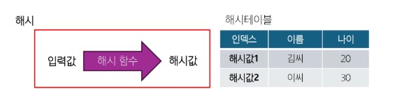
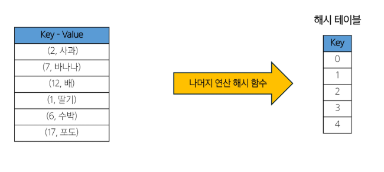
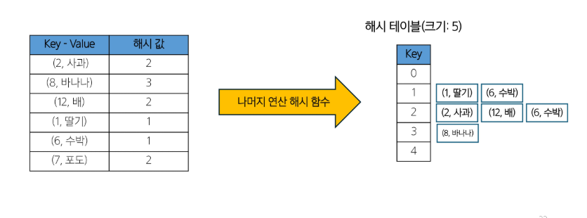
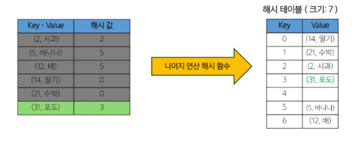

# Hash

목차

1. Hash
  - 개요
  - 헤시 함수
    - Division Hash Function
    - Multiplication Hash Function
    - Folding Hash Function
    - Polynomial Hash Function
    - SHA - 256
  - 해시 충돌
    - 체이닝(Chaining)
    - 주소 개방법(Open Addressing)
      - 선형 탐사(Linear Probing)
      - 제곱 탐사(Quadratic Probing)
      - 이중 해싱(Double Hashing)

## 1. Hash
### 1) 개요
#### 문제 제시
- 데이터 급증
- 전통적인 검색 방법의 한계
  - 선형 검색 : 데이터가 정렬되지 않은 경우, 시간 복잡도 O(N)
  - 이진 검색 : 데이터가 정렬된 경우에만 사용이 가능하며, 시간 복잡도 O(logN)
- 특정한 상황에서는 효율적이지 않으며, 특히 데이터의 양이 매우 클 때 한계가 두드러짐
- 새로운 방법이 없을까?

#### 해시
- 데이터를 고정된 크기의 값으로 변환하는 과정
- 변환된 해시값(Hash Value)은 원본 데이터를 고유하게 식별하거나 데이터를 빠르게 검색하는 데 사용

#### 해시 함수
- 입력값을 고정된 크기의 해시 값으로 변환하는 함수
- 결정론적 특성 : **동일한 입력은 항상 동일한 해시값을 생성**
- 균등한 분포 : 해시 값이 균등하게 분포되어야 좋은 해시함수
- 충돌 최소화 : 다른 입력값이 동일한 해시값을 생성하는 경우가 낮아야 좋은 해시함수

#### 해시 테이블
- 해시 값을 인덱스로 사용하여 데이터를 저장하고 검색하는 자료구조
- 대부분의 경우 상수 시간(O(1)) 내에 데이터 검색/삽입/삭제
- 데이터베이스 인덱싱, 캐싱, 보안 등 다양하게 응용
- **해시 함수의 성능에 큰 영향 => 충돌 처리 필요(Chaining, Open Addressing)**
  

#### 해시 특징
- **빠른 데이터 검색** : 키를 통해 데이터에 직접 접근할 수 있어서 검색이 매우 빠름 (시간 복잡도 :O(1))
- **데이터 무결성 검증** : 작은 변화에도 해시값이 크게 달라지는 특성을 활용하여 변조 여부를 확인할 수 있음
- **암호화** : 원본 대신 해시값을 저장하여 보안을 강화 (단방향 변환으로, 해시값에서 원본을 유추하기 어려움)
- **중복 제거** : 동일한 데이터는 같은 해시값을 가지므로 중복을 쉽게 식별할 수 있음 (ex : 라빈-카프 알고리즘)
- 해시 충돌 : 서로 다른 입력값이 동일한 해시값을 생성할 수 있음
- 메모리 사용량 : 해시 테이블은 배열보다 더 많은 메모리를 차지하며, 충돌 해결을 위한 추가 공간이 필요
- 순서 보존 불가 : 해시 함수는 입력 데이터의 순서를 보존하지 않으며, 정렬된 데이터가 필요한 경우에는 적합 X

### 2) 해시 함수
#### 좋은 해시 함수란?
- **결정론적 특성** : 동일한 입력은 항상 동일한 해시값을 생성
- **균등한 분포** : 해시 값이 균등하게 분포되어야 좋은 해시함수
- **충돌 최소화** : 다른 입력값이 동일한 해시값을 생성하는 경우가 낮아야 좋은 해시함수
- **눈사태 효과** : 입력의 작은 변화가 출력의 큰 변화를 야기해야 함 (유사한 입력들이 다른 해시 값을 가지게 하여 클러스터링 방지)
- **효율성** : 계산 속도가 빨라야 함
- **저항성** : 입력값을 예쌍하기 어려워야 함
  
### 3) Division Hash Function
#### Division Hash Function
- 나머지 연산 해시 함수
- 가장 기본적인 해시 함수
- 키(Key)를 해시 테이블의 크기로 나눈 나머지를 해시 값으로 사용
- 구현이 매우 간단하고, 이해하기 쉬움
- 계산 속도가 빠름 (**효율성**)
- **h(k) = k % m(k = 해시할 키 값, m = 해시 테이블 크기)**
- 장점
  - 정수 키에 대해 효과적으로 작동
  - **해시 테이블의 크기를 적절히 선택**하면 좋은 성능을 발휘
- 단점
  - **테이블 크기 선택에 민감**
  - 특정 패턴의 키에 대해 성능이 저하될 수 있음
  - 문자열이나 복잡한 키는 추가적인 처리가 필요함
- > 테이블 크기 선택이 중요함(소수, 2의 거듭제곱)
- > **보조 해시** 사용, **MAD(Muliply-Add-divide)** 등을 사용하여 성능을 개선시킬 수 있음

### 4) Multiplication Hash Function
#### Mulitiplication Hash Function
- 곱셈 해시 함수
- 나머지 연산 해시 함수보다 더 균일한 분포를 제공
- 키(Key)를 0과 1 사이의 실수로 변환한 후, 이를 해시 테이블의 크기와 곱하여 해시 값을 생성
- 해시 테이블의 크기에 덜 민감함
- **h(k) = m(kA % 1)(k = 해시할 키 값, m = 해시 테이블 크기, A는 0과 1 사이의 실수)**
- A 값의 선택이 성능에 큰 영향을 미침
- 장점
  - 키의 분포에 덜 민감함
  - 나머지 연산 해시 함수에 비해 더 균일한 분포를 제공
- 단점
  - **구현이 조금 더 복잡함**
  - 부동 소수점 연산을 사용하므로 정밀도 문제가 발생할 수 있음
- A 값의 선택이 매우 중요함 (일반적으로 (sqrt(5)-1)/2 ∽ 0.6180339887)
- **비트 연산, 다양한 A값으로 실험하기** 등의 방법을 사용하여 성능을 개선시킬 수 있음

### 5) Folding Hash Function
#### Folding Hash Function
- 폴딩 해시 함수
- 키(Key)를 **여러 부분으로 나누고**, 이 부분들을 **조합**하여 최종 해시 값을 생성
- **주로 긴 숫자나 문자열 키에 사용**
- 작동 원리
  1. 키를 일정 크기의 부분으로 나눈다. (예 : 2자리 / 3자리 단위)
  2. 나눈 부분ㄷ들을 모두 더한다.
  3. 최종 합을 해시 테이블 크기로 나눈 나머지를 해시 값으로 사용
- 키의 모든 부분을 사용하므로 비교적 균일한 분포를 보이며, 폴딩 크기를 조절하여 다양하게 사용 가능
- 장점
  - 긴 키나 문자열에 효과적
  - 키의 모든 부분이 최종 해시 값에 기여 => 균일한 분포
  - 구현이 간단
- 단점
  - **짧은 키에 대해서는 오버헤드가 있을 수 있음**
  - 폴딩 크기가 성능에 영향을 미침
- **가중치 부여, 덧셈 대신 다른 방식(XOR), 순환 시프트** 등의 방법을 사용하여 성능으 개선시킬 수 있음

### 6) Polynomial Hash Function
#### Polynomial Hash Function
- 다항식 해시 함수
- 문자열을 다항식으로 표현하여 해시 값을 계산
- **문자열 처리에 유용**
- **h(s) = (s[0] * p^0 + s[1] * p^1 + ... + s[n-1] * p^(n-1)) mod m**
  (s = 해시할 문자열, p = 기수(base, 일반적으로 소수), m = 큰 소수 값)
- 적절한 p와 m을 선택하면 균일한 해시 분포를 얻을 수 있음(p는 보통 소수, m은 큰 소수)
- 문자열의 순서가 해시 값에 영향을 미침
- 장점
  - 문자열 비교에 효과적
  - 문자열 패턴 매칭 알고리즘에 유용(라빈-카프)
  - 간단하면서도 효과적인 해시 분포를 제공
- 단점
  - **긴 문자열에 대해서는 오버 플로우가 있을 수 있음**
  - P와 m 값의 선택이 성능에 큰 영향을 미침
- **라빈-카프 알고리즘, 데이터베이스 인덱싱** 등 다양한 분야에서 활용됨

### 7) SHA - 256
#### Secure Hash Algorithm 256-bit
- SHA - 256
- 임의의 길이의 입력 데이터를 고정된 크기의 256비트(32바이트) 해시 값으로 변환하는 함수
- **현대적이고 널리 사용되는 암호학적 해시 함수**
- 입력 크기에 관계없이 항상 256비트 해시 값을 생성함
- 해시 값에서 원본 메시지를 복원하는 것이 실질적으로 불가능
- 입력의 작은 변화가 출력의 큰 변화를 야기함(**눈사태 효과**)
- 같은 해시 값을 가진 두 개의 다른 입력을 찾기가 매우 어려움(**저항성**)

### 8) 해시 충돌
#### 해시 충돌
- 충돌(Collision)은 두 개 이상의 서로 다른 키가 동일한 해시 값을 생성하는 상황( birthday problem)
- 해시 함수의 결과로 동일한 인덱스가 나오고, 서로 다른 키가 동일한 버킷에 저장되어야 하는 경우
- 해시 충돌의 원인 
  - 해시 값의 범위가 제한적이기 때문에 서로 다른 입력 데이터가 동일한 해시 값을 가질 가능성이 존재(비둘기집 원리)
  - 해시 함수가 입력 데이터를 균등하게 분포시키지 못하면 충돌이 빈번하게 발생
  - 무한한 입력을 유한한 출력(한정된 해시 테이블)로 매핑하는 과정에서 발생
- 해시 충돌의 영향
  - **성능 저하** : 해시 테이블의 검색, 삽입, 삭제 연산 속도가 저하
  - **보안 위험** : 해시 충돌은 보안 취약점이 될 수 있음
  - **데이터 무결성 문제**
- 해시 충돌 해결 방법
  - 오픈 어드레스(Open Addresssing)
    - 선형 탐사(Linear Probing)
    - 이차 탐사(Quadratic Probing)
    - 이중 해싱(Double hasing)
  - 체이닝(Chaining), 분리 연결법(Separate Chaining)

### 9) 체이닝(Chaining)
#### 체이닝(Chaining)
- 해시 테이블에서 충돌을 해결하는 가장 일반적인 방법
- 해시 테이블의 각 버킷에 연결 리스트(다른 자료구조도 가능)를 사용하여 **충돌이 발생한 항목을 저장**
- 작동 원리
  1. 해시 함수를 통해 키의 해시 값을 계산
  2. 계산도니 해시 값에 해당하는 버킷에 항목을 저장
  3. 충돌이 발생하면, 해당 버킷의 연결 리스트에 새 항목을 추가

#### 체이닝(Chaining) 과정
- 해시 충돌 해결(체이닝)
  

  

#### 체이닝(Chaining) 정리
- 장점
  - 구현이 비교적 **간단**
  - 해시 테이블의 크기를 **동적으로 조절하기 쉬움**
  - 키의 전체 또는 일부를 저장할 수 있어 보안에 유리함
- 단점
  - **연결 리스트를 위한 추가 메모리가 필요**
  - 최악의 경우 **검색 시간이 O(n)**이 될 수 있음 => 캐시 성능이 개방 주소법에 비해 떨어질 수 있음
- **자료구조를 변경**(AVL 사용), **더 좋은 해시 함수 사용**으로 성능을 향상시킬 수 있음

### 10) 주소 개방법(Open Addressing)
#### 주소 개방법(Open Addressing)
- 해시 테이블에서 충돌을 해결하는 또 하나의 방법
- 모든 키-값 쌍을 해시 테이블 배열 내에 직접 저장, 충돌이 발생하면 다른 빈 슬롯을 찾아 데이터 저장
- 특징
  - 모든 데이터가 해시 테이블 배열 내에 저장
  - 별도의 체인이나 추가 데이터 구조가 필요 없음
- 충돌이 발생했을 경우, 빈 슬롯을 찾는 여러 가지 방법이 있음
  - 선형 탐사(Linear Probing)
  - 제곱 탐사(Quadratic Probing)
  - 이중 해싱(Double Hashing)

### 11) 선형 탐사(Linear Probing)
#### 선형 탐사(Linear Probing)
- 해시 충돌을 해결하는 간단하면서도 효과적인 방법
- 충돌이 발생했을 때, **순차적**으로 다음 버킷을 검사하여 빈 슬롯을 찾는 방식
- 작동 원리
  1. 해시 함수로 초기 버킷 위치를 계산
  2. 해당 버킷이 이미 사용중이라면, **다음 버킷으로 이동**
  3. 빈 버킷을 찾을 때까지 위 과정을 반복

#### 선형 탐사 과정
- 해시 충돌 해결(선형 탐사)
  

#### 선형 탐사(Linear Probing) 정리
- 장점
  - 구현이 간단
  - 캐시 선능이 좋음(연속된 메모리를 사용하기 때문)
  - 추가 메모리가 필요 없음(정해진 테이블 내에 저장하기 때문)
- 단점
  - **클러스터링 문제** : 연속된 항목들이 몰리는 현상이 발생할 수 있음
  - **테이블이 거의 가득 찼을 때** 성능이 크게 저하
  - 최악의 경우 검색이 **O(N)**
- 테이블의 효율성을 위해 **로드 팩터**가 **특정 입계값(0.6~0.75)을 초과하면 테이블 크기를 늘리고, 모든 항목을 재삽입**
(**로드 팩터** : 해시 테이블에 저장된 항목의 수를 테이블 크기로 나눈 값, 성능을 나타내는 중요한 지표)

### 12) 제곱 탐사(Quadratic Probing)
#### 제곱 탐사(Quadratic Probing)
- 해시 충돌을 해결하는 방법 중 선형 탐사의 단점을 보완하기 위해 고안된 방법
- 충돌이 발생했을 때, 원래의 해시 값에서 **제곱수만큼 떨어진 위치**를 순차적으로 탐색
- 작동원리
  1. 해시 함수로 초기 버킷 위리를 계산
  2. 해당 버킷이 이미 사용중이라면, **1^1, 2^2, 3^2, 4^2, ...만큼 떨어진 위치**를 순차적으로 확인
  3. 빈 버킷을 찾을 때까지 위 과정을 반복
- 장점
  - 선형 탐사에 비해 클러스터링 문제가 덜함
  - 충돌 해결이 더 넓은 범위로 함으로 충돌 해결 능력이 조금 더 향상됨
  - 캐시 성능이 좋음(연속된 메모리)
- 단점
  - **이차 클러스터링**이 발생할 수 있음 (충돌 해결 과정에서 동일한 탐사 순서를 따르는 현상)
  - 테이블이 절반 이상 차면 성능이 급격히 저하될 수 있음
  - 모든 버킷을 탐색하지 못할 수도 있음(순환 패턴으로 인해) => 테이블 크기를 소수로 선택하면 모든 버킷 탐색
- **이중 해싱과의 결합, 동적 해시**를 통해 성능을 개선할 수 있음

### 13) 이중 해싱(Double Hashing)
#### 이중 해싱(Double Hashing)
- 두 개의 해시 함수를 사용하여 충돌을 해결
- 첫 번째 해시 함수는 초기 위치를 결정하고, 두 번째 해시 함수는 충돌 시 탐사 간격을 결정
- 작동 원리
  1. 첫 번째 해시 함수(h1)로 초기 버킷 위치를 계산
  2. 해당 버킷이 이미 사용중이라면, 두 번째 해시 함수(h2)로 탐사 간격을 계산
  3. 해당 간격으로 다음 위치를 탐색
  4. 빈 버킷을 찾을 때까지 위 과정을 반복
- 장점
  - 클러스터링 문제를 크게 감소시킴
  - 선형 탐사나 제곱 탐사보다 더 균일한 분포를 제공
  - 두 번째 해시 함수로 인해 충돌 해결 패턴이 다양함
- 단점
  - 두 개의 해시 함수를 계산해야 하므로 **약간의 추가 연산**이 필요함
  - 구현이 조금 더 복잡함
  - 두 번째 해시 함수를 잘못 선택하면 성능이 저하될 수 있음
