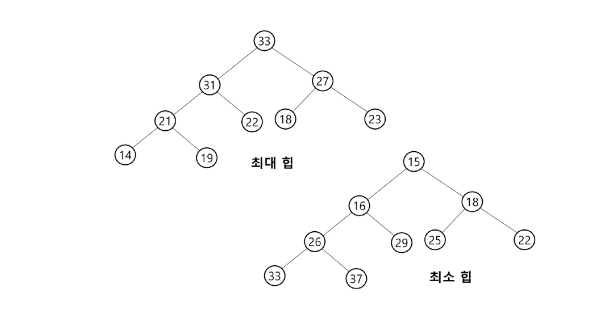
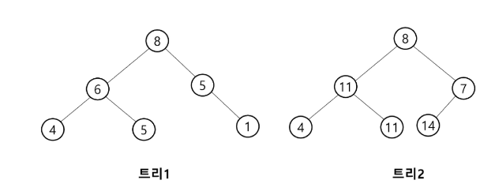
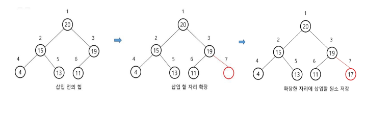
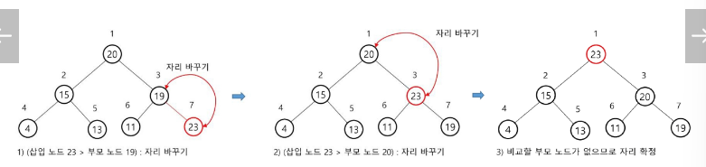
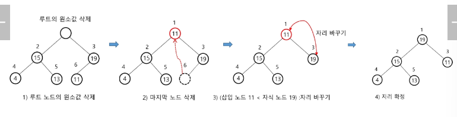

# Heap & 백트래킹

목차

1. 힙
- 개요
- 연산
- 구현
- 우선순위 큐
- 문제풀이 : 진용이네 주차타워

2. 백트래킹
- 개요
- N-Queen
- 연습문제 : 부분 집합의 합

## 힙
### 개요
#### 힙(heap)
- 완전 이진 트리에 있는 노드 중에서 키 값이 가장 큰 노드나 키 값이 가장 작은 노드를 찾기 위해서 만든 자료구조
- 최대 힙(max heap)
  - 키 값이 가장 큰 노드를 찾기 위한 완전 이진 트리
  - 부모 노드의 키 값 > 자식 노드의 키 값
  - 루트 노드 : 키 값이 갖아 큰 노드
- 최소 힙(min heap)

#### 힙(heap) 예시

#### 힙이 아닌 이진 트리의 예

### 연산
#### 힙 연산 - 삽입
- 최대 힙에서 17 삽입

- 최대 힙에서 23 삽입

#### 힙 연산 - 삭제
- 힙에서는 루트 노드의 원소만을 삭제할 수 있다.
- 루트 노드의 원소를 삭제하여 반환한다.
- 힙의 종류에 따라 최대값 또는 최소값을 구할 수 있다.

### 우선순위 큐
#### 우선순위 큐(Priority Queue)
- 우선순위를 가진 항목들을 저장하는 큐
- FIFO 순서가 아니라 우선순위가 높은 순서대로 먼저 나가게 된다.
- 우선순위 큐를 구현하는 가장 효율적인 방법은 힙을 사용하는 것이다.
- 노드 하나의 추가 / 삭제의 시간 복잡도가 O(log(N))이며, 최대값 / 최소값을 O(1)에 구할 수 있다.

## 백트래킹
### 개요
#### 문제 제시: N-Queen
- N * N 서양 장기판에서 배치한 Queen들이 서로 위협하지 않도록 n개의 Queen을 배치하는 문제
  - 어떤 두 Queen도 서로를 위협하지 않아야 한다.
  - Queen을 배치한 n개의 위치는?

#### 백트래킹(Back Tracking)
- 여러 가지 선택지(옵션)들이 존재하는 상황에서 한 가지를 선택한다.
- 선택이 이루어지면 새로운 선택지들의 집합이 생성된다.
- 이런 선택을 계속하면 목표 상태(goal state)에 도달한다.
- 당첨 리프 노드 찾기
  - 루트에서 갈 수 있는 노드를 선택한다.
  - 꽝 노드까지 도달하면 최근의 선택으로 되돌아와서 다시 시작한다.
  - 더 이상의 선택지가 없다면 이전의 선택지로 돌아가서 다른 선택을 한다.
  - 루트까지 돌아갔을 경우 더 이상 선택지가 없다면 찾는 답이 없다.

- 8-Queens 문제
  - 퀸 8개를 크기 8의 체스판 안에 서로를 공격할 수 없도록 배치하는 모든 경우를 구하는 문제
- 후보 해의 수 : _64C_8 = (64!)/(8!(64-8)!) = 4,426,165,368
- 실제 해의 수 : 이 중에서 실제 해는 92개뿐
- 즉, 44억 개가 넘는 후보 해의 수 속에서 92개를 최대한 효율적으로 찾아내는 것이 관건
- 4-Queens 문제로 축소해 생각해 보자.
  - 같은 행에 위치할 수 없다.
  - 모든 경우의 수 : 4 * 4 * 4 * 4 = 256
- 루트(root) 노드에서 리프(leaf) 노드까지의 경로는 해답후보(candidate solution)가 되는데, 완전 탐색을 하여 그 해답후보 중에서 해답을 찾을 수 있다.
- 그러나 이 방법을 사용하면 해답이 될 가능성이 전혀 없는 노드의 후손 노드(descendant)들도 모두 검색해야 하므로 비효율적이다.
- 모든 후보를 검사? => No!
- 백트래킹 기법
  - 어떤 노드의 유망성을 점검한 후 유망(promising)하지 않다고 결정되면 그 노드의 부모로 되돌아가(backtracking) 다음 자식 노드로 간다.
  - 유망(promising)하다.
    - 어떤 노드를 방문하였을 때 그 노드를 포함한 경로가 해답이 될 수 있으면 유망하다고 한다.
  - 가지치기(pruning)
    - 유망하지 않은 노드가 포함되는 경로는 더 이상 고려하지 않는다.
- 백트래킹을 이용한 알고리즘은 다음과 같은 절차로 진행된다.
  - 상태 공간 트리의 깊이 우선 탐색을 실시한다.
  - 각 노드가 유망한지를 점검한다.
  - 만일 그 노드가 유망하지 않으면, 그 노드의 부모 노드로 돌아가서 다른 노드로의 검색을 계속한다.

#### 백트래킹과 DFS의 차이
- 어떤 노드에서 출발하는 경로가 해결책으로 이어질 것 같지 않으면 더이상 그 경로를 따라가지 않음으로써 시도횟수 줄임(Punning 가지치기)
- DFS는 모든 경로를 추적하는 데 비해 백트래킹은 불팔요한 경로를 초기에 차단
- 백트래킹 알고리즘을 적용하면 일반적으로 경우의 수가 줄어들지만 이 역시 최악의 경우에는 여전히 지수함수 시간(Exponential Time)을 요하므로 처리 불가능

### N-Queen
#### N-Queen
- 백트래킹은 모든 가능한 경우의 수 중에서 **특정한 조건**을 만족하는 경우에만 살펴보는 것
- 답이 될 만한지 판단하고 그렇지 않으면 그 부분까지 탐색하는 것을 하지 않고 **가지치기**하는 것
- 주로 문제 풀이에서는 DFS로 모든 경우의 수를 탐색하는 과정에서, 조건으로 답이 절대로 될 수 없는 상황을 정의하여 체크하고, 그러한 상황일 경우에는 탐색을 중지시킨 뒤 그 이전으로 돌아가서 다시 다른 경우를 탐색하게끔 구현할 수 있다.

