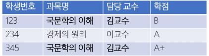

# Introduction to DataBase

<details>
<summary>Index</summary>

1. Database
   - 개요
   - Relation Database
   - RDBMS

2. Database Modeling
    - Proceeding with Database modeling

3. Database Normalization
    - 1NF ~ 3NF, BCNF

4. SQL 기본
    - SQL Statements

5. DDL
    - CREATE TABLE
    - ALTER TABLE
    - DROP TABLE
    - TRUNCATE TABLE

6. 참고
</details>

## 1. Database
### 1) 개요
#### 데이터베이스
- 체계적인 데이터 모음

#### 데이터
- 저장이나 처리에 효율적인 형태로 변환된 정보

#### 데이터를 저장하고 잘 관리하여 활용할 수 있는 기술이 중요해짐
- > 우리가 알고 있는 데이터 저장 방식은 어떤 것이 있을까?

### 2) Relational Database
#### 데이터베이스 역할
- 데이터를 <span style='color:red'>저장(구조적 저장)</span>하고 조작(CRUD)

#### 관계형 데이터베이스
- 데이터 간에 <span style='color:red'>관계</span>가 있는 데이터 항목들의 모음
- 테이블, 행, 열의 정보를 구조화하는 방식
- <span style='color:red'>서로 관련된 데이터 포인터를 저장</span>하고 이에 대한 <span style='color:red'>액세스</span>를 제공
- 주문 테이블
  | id|   주문일   |  주문 상태  |고객 ID|
  |:-:|:----------:|:-----------:|:-:|
  | 1 | 2002/01/01 |   배송완료  | 3 |
  | 2 | 2002/03/04 | 상품 준비중 | 3 |
  | 3 | 2002/02/03 |   배송중    | 1 |

- 고객 테이블
  | id|  이름  | 청구지 | 주소지 |
  |:-:|:------:|:------:|:------:|
  | 1 | 김한웅 |  서울  |  강원  | 
  | 2 | 유미선 |  강원  |  경기  |
  | 3 | 박지수 |  경기  |  서울  |

  

#### 관계
- 여러 테이블 간의 (논리적) 연결

#### 관계로 할 수 있는 것
- 이 관계로 인해 두 테이블을 사용하여 데이터를 다양한 형식으로 조회할 수 있음
  - 특정 날짜에 구매한 모든 고객 조회
  - 지난 달에 배송일이 지연된 고객 조회 등

#### 관계형 데이터베이스 예시
- 다음과 같이 고객 데이터가 테이블에 저장되어 있다고 가정
- 고객 데이터 간 비교를 위해서는 어떤 값을 활용해야 할까?
  - > 이름? 주소? 만약 동명이인이나 같은 주소지가 있다면?
  - 고객 테이블
    |  이름  | 청구지 | 주소지 |
    |:------:|:------:|:------:|
    | 김한웅 |  서울  |  강원  | 
    | 유미선 |  강원  |  경기  |
    | 박지수 |  경기  |  서울  |

  - > 각 데이터에 고유한 식별 값을 부여하기 <span style='color:red'>(기본 키, Primary Key)</span>
  - 고객 테이블
    | id|  이름  | 청구지 | 주소지 |
    |:-:|:------:|:------:|:------:|
    | 1 | 김한웅 |  서울  |  강원  | 
    | 2 | 유미선 |  강원  |  경기  |
    | 3 | 박지수 |  경기  |  서울  |
    <span style='color:red'>ex) 주민등록번호</span>

- 누가 어떤 주문을 했는지 어떻게 식별할 수 있을까?
  - > 고객 이름? 마찬가지로 동명이인이 있다면?
    - 주문 테이블
      | id|   주문일   |  주문 상태  |고객 ID|
      |:-:|:----------:|:-----------:|:-:|
      | 1 | 2002/01/01 |   배송완료  | 3 |
      | 2 | 2002/03/04 | 상품 준비중 | 3 |
      | 3 | 2002/02/03 |   배송중    | 1 |

    - 고객 테이블
      | id|  이름  | 청구지 | 주소지 |
      |:-:|:------:|:------:|:------:|
      | 1 | 김한웅 |  서울  |  강원  | 
      | 2 | 유미선 |  강원  |  경기  |
      | 3 | 박지수 |  경기  |  서울  |

  - > 주문 정보에 고객의 고유한 식별 값을 저장하기 <span style='color:red'>(외래 키, Foreign Key)</span>
    - 주문 테이블
      | id|   주문일   |  주문 상태  |<span style='color:red'>고객 ID</span>|
      |:-:|:----------:|:-----------:|:-:|
      | 1 | 2002/01/01 |   배송완료  |<span style='color:red'> 3 </span>|
      | 2 | 2002/03/04 | 상품 준비중 |<span style='color:red'> 2 </span>|
      | 3 | 2002/02/03 |   배송중    | <span style='color:red'>1 </span>|

    - 고객 테이블
      | id|  이름  | 청구지 | 주소지 |
      |:-:|:------:|:------:|:------:|
      | 1 | 김한웅 |  서울  |  강원  | 
      | 2 | 유미선 |  강원  |  경기  |
      | 3 | 박지수 |  경기  |  서울  |

#### 관계형 데이터베이스 관련 키워드
1. Table(aka Relation)
   - 테이블을 기록하는 곳
   - 고객 테이블
      | id|  이름  | 청구지 | 주소지 |
      |:-:|:------:|:------:|:------:|
      | 1 | 김한웅 |  서울  |  강원  | 
      | 2 | 유미선 |  강원  |  경기  |
      | 3 | 박지수 |  경기  |  서울  |

2. Field (aka Column, Attribute)
    - 각 필드에는 고유한 데이터 형식(타입)이 지정됨
    - 고객 테이블
      | id|  <span style='color:red'> 이름 </span> | 청구지 | 주소지 |
      |:-:|:------:|:------:|:------:|
      | 1 | <span style='color:red'> 김한웅 </span>|  서울  |  강원  | 
      | 2 | <span style='color:red'> 유미선 </span>|  강원  |  경기  |
      | 3 | <span style='color:red'> 박지수 </span>|  경기  |  서울  |

3. Record (aka Row, Tuple)
    - 각 레코드에는 구체적인 데이터 값이 저장됨
    - 고객 테이블
      | id|  이름  | 청구지 | 주소지 |
      |:-:|:------:|:------:|:------:|
      | 1 | 김한웅 |  서울  |  강원  | 
      |<span style='color:yellowgreen'> 2 </span>|<span style='color:yellowgreen'> 유미선 </span>| <span style='color:yellowgreen'> 강원 </span> | <span style='color:yellowgreen'> 경기 </span> |
      | 3 | 박지수 |  경기  |  서울  |

4. Database (aka Schema)
    - 테이블의 집합
    - 

5. Primary Key(기본 키, PK)
   - 각 레코드의 고유한 값
   - 관계형 데이터베이스에서 <span style='color:red'>레코드의 식별자</span>로 활용
   - 주문 테이블
      |<span style='color:red'> id</span>|   주문일   |  주문 상태  |고객 ID|
      |:-:|:----------:|:-----------:|:-:|
      |<span style='color:red'> 1 </span>| 2002/01/01 |   배송완료  | 3 |
      |<span style='color:red'> 2 </span>| 2002/03/04 | 상품 준비중 | 2 |
      |<span style='color:red'> 3 </span>| 2002/02/03 |   배송중    | 1 |

    - 고객 테이블
      |<span style='color:red'> id</span>|  이름  | 청구지 | 주소지 |
      |:-:|:------:|:------:|:------:|
      |<span style='color:red'> 1 </span>| 김한웅 |  서울  |  강원  | 
      |<span style='color:red'> 2 </span>| 유미선 |  강원  |  경기  |
      |<span style='color:red'> 3 </span>| 박지수 |  경기  |  서울  |

6. Foreign Key (외래 키, FK)
    - 테이블의 필드 중 다른 테이블의 레코드를 식별할 수 있는 키
    - 다른 테이브르이 기본 키를 참조
    - 각 레코드에서 서로 다른 테이블 간의 <span style='color:red'>관계를 만드는 데</span> 사용
    - 주문 테이블
      | id|   주문일   |  주문 상태  |<span style='color:red'>고객 ID</span>|
      |:-:|:----------:|:-----------:|:-:|
      | 1 | 2002/01/01 |   배송완료  |<span style='color:red'> 3 </span>|
      | 2 | 2002/03/04 | 상품 준비중 |<span style='color:red'> 2 </span>|
      | 3 | 2002/02/03 |   배송중    |<span style='color:red'> 1 </span>|

    - 고객 테이블
      | id|  이름  | 청구지 | 주소지 |
      |:-:|:------:|:------:|:------:|
      | 1 | 김한웅 |  서울  |  강원  | 
      | 2 | 유미선 |  강원  |  경기  |
      | 3 | 박지수 |  경기  |  서울  |

#### 데이터베이스 정리
- Table은 데이터가 기록되는 곳
- Table에는 해엥서 고유하게 식별 가능한 기본 키라는 속성이 있으며, 외래 키를 사용하여 각 행에서 서로 다른 테이블 간의 관계를 만들 수 있음
- 데이터는 기본 키 또는 외래 키를 통해 결합(join)될 수 있는 여러 테이블에 걸쳐 구조화됨

### 3) RDBMS
#### DBMS (Database Management System)
- 데이터베이스를 관리하는 소프트웨어 프로그램
- 데이터 저장 및 관리를 용이하게 하는 시스템
- 데이터베이스와 사용자 간의 인터페이스 역할
- 사용자가 데이터 구성, 업데이트, 모니터링, 백업, 복구 등을 할 수 있도록 도움

#### RDBMS (Relational Database Management System)
- 관계형 데이터베이스를 관리하는 소프트웨어 프로그램

#### RDBMS 서비스 종류
- SQLite
- MySQL
- PostgreSQL
- Oracle Database
- ...

## 2. Database Modeling
### 1) 개요
#### Database Modeling
- 데이터베이스 시스템을 구축하기 위한 과정으로, 데이터의 구조, 관계, 특성을 결정하는 작업
- 효율성, 일관성, 무결성을 보장하기 위해 진행하는 중요한 단계

#### 무결성 제약 조건
- 데이터베이스의 데이터 일관성을 유지하고 부적절한 데이터의 삽입, 수정, 삭제를 방지히여 데이터의 신뢰성을 보장하는 조건

#### 1. 개체 무결성 (Entity Integrity)
- 기본 키의 값이 중복되지 않고, NULL 값이 허용되지 않는 것을 보장하는 제약 조건
  - 각 레코드는 유일한 식별자를 가져야 한다.
  - 기본 키는 NULL 값을 가질 수 없다.
    ```SQL
    CREATE TABLE Student (
        student_id INT PRIMARY KEY,    -- NULL 불가능, 중복 불가능
        name VARCHAR(50) NOT NULL
    );
    ```

#### 2. 참조 무결성 (Referential Integrity)
- 외래 키와 기본 키 간의 관계를 유지하고, 무효한 참조를 방지하는 제약 조건
  - 외래 키 값은 참조하는 테이블의 기본 키 값을 참조하거나 NULL 값을 가질 수 있다.
  - 존재하지 않는 기본 키는 참조할 수 없다.
    ```SQL
    CREATE TABLE Department (
        dept_id INT PRIMARY KEY,
        dept_name VARCHAR(50) NOT NULL
    );

    CREATE TABLE Employee (
        emp_id INT PRIMARY KEY,
        emp_name VARCHAR(50) NOT NULL,
        dept_id INT,
        FOREIGN KEY (dept_id) REFERENCES Department(dept_id)    -- 참조 무결성 적용
    );
    ```

#### 3. 도메인 무결성 (Domain Integrity)
- 각 속성의 값이 정의된 도메인에 속하는 것을 보장하는 제약 조건
  - 도메인은 속성이 가질 수 있는 값의 범위, 형식, 제약 조건 등을 정의해야 한다.
  - 속성 값이 도메인에 속하지 않는 경우에는 삽입 또는 수정을 제한하거나 오류를 발생시킨다.
    ```SQL
    CREATE TABLE Product (
        product_id INT PRIMARY KEY,
        price DECIMAL(10, 2) CHECK (price > 0),   -- 가격은 0보다 커야 함
        category VARCHAR(20) CHECK (category IN ('전자제품', '의류', '도서'))  -- 특정 값만 허용
    );
    ```

#### 4. 그 외 무결성 제약 조건
1. 고유성(UNIQUE) 무결성
   - 특정 컬럼의 값이 테이블 내에서 중복되지 않도록 제한함.
2. NULL 무결성 (NOT NULL)
    - 특정 컬럼이 NULL 값을 가질 수 없도록 강제함
3. 일반 무결성 (General Integrity)
    - 위의 특정 제약조건 외에도, 비즈니스 로직에 따라 추가로 정의하는 무결성 규칙.
    - 예시 : 은행 계좌 잔액이 0 미만으로 내려가지 않도록 하는 규칙을 설정하는 경우.

### 2) Proceeding with Database Modeling
#### 데이터베이스 모델링 진행
- 요구사항 수집 및 분석 -> 개념적 설계 -> 논리적 설계 -> 물리적 설계

#### 1. 요구사항 수집 및 분석
- 어떤 종류의 데이터를 정리하는지 정보 수집하고 어떤 작업을 수행해야 하는지 파악하는 단계
  - 객체 (Entity)
    - 업무에 필요하고 유용한 정보를 저장하고 집합적인 것
    - ex) 고객, 제품, 사원, 부서
  - 속성 (Attribute)
    - 관리하고자 하는 것의 의미를 더 이상 작은 단위로 분리되지 않은 데이터 단위
    - ex) 고객명, 고객 전화번호, 상품명, 상품 가격
  - 관계 (Relationship)
    - 객체 사이의 논리적인 연관성을 의미하는 것
    - ex) 고객 - 상품, 부서 - 사원

#### 2. 개념적 설계
- 요구사항을 기반으로 데이터베이스의 **개념적 모델**을 설계
- 객체(Entity)와 관계(Relationship)를 식별하고, 객체 간의 관계를 정의하여 ER Diagram을 작성

  

#### ERD 표기 방법
- 까마귀 발 모델 (Crow's Foot Model) 표기법
  

- N:M 관계 예시
  

#### 3. 논리적 설계
- 개념적 설계를 기반으로 데이터베이스의 **논리적 구조**를 설계
- 테이블, 칼럼(속성), 제약 조건 등과 같은 구체적인 데이터베이스 개체를 정의
- 정규화를 수행하여 데이터의 중복을 최소화하고 일관성을 유지

    

#### 4. 물리적 설계
- 논리적 설계를 기반으로 데이터베이스를 실제 **저장 및 운영**할 수 있는 형태로 변환하는 단계
- 테이블의 인덱스, 파티션, 클러스터링 등 물리적인 구조와 접근 방식을 결정
- 보안, 백업 및 복구, 성능 최적화 등을 고려하여 데이터베이스를 설정

## 3. Database Normalization
### 1) Database Normalization
#### 정규화 (Normalization)
- 중복을 최소화하고 데이터의 일관성과 효율성을 유지하기 위해 데이터를 구조화하는 과정
  
#### 정규화의 목적
- 불필요한 데이터를 제거하여 중복을 최소화하기 위해
  - 각 종 이상 현상(Anomaly)을 방지하기 위해
- 데이터베이스 구졸르 변경할 때 다시 구조화해야 하는 영역을 최소화

#### 이상 현상(Anomaly)
- 데이터베이스를 잘못 설계했을 때 발생할 수 있는 불필요한 데이터
- 중복으로 인한 부작용
- 삽입 이상 / 갱신 이상 / 삭제 이상

#### 1. 이상 현상 (Anomaly)
1. 삽입 이상 (Insertion Anomaly)
   - 새로운 데이터를 삽입하기 위해 **불필요한 데이터도 함께 삽입해야 하는 문제**

2. 갱신 이상 (Update Anomaly)
   - 중복된 데이터 중 **일부만 변경하여 데이터가 불일치되는 문제**

3. 삭제 이상 (Delection Anomaly)
   - 데이터를 삭제하는 경우, **반드시 있어야 하는 데이터까지 같이 삭제되는 문제**

### 2) 1NF ~ 3NF, BCNF
#### 데이터베이스 정규화의 종류
- 1NF ~ 6NF ( + BCNF)가 있지만 일반적으로 3NF만 되면 정규화가 되었다고 표현

#### 정규화 종류 및 규칙
- 제 1 정규화 (1NF)
  - 각 요소의 **중복되는 항목은 없어야** 한다.

- 제 2 정규화 (2NF)
  - 제 1 정규화를 만족하면서 PK가 아닌 모든 속성이 PK에 **완전 함수 종속되어야** 한다.

- 제 3 정규화 (3NF)
  - 제 2 정규화를 만족하면서 모든 속성이 PK에 **이행적 함수 종속이 되지 않아야** 한다.

- BCNF (Boyce Codd Normalization Form)
  - 제 3 정규형을 만족하면서, **모든 결정자가 후보 키(Candidate Key)여야 한다.**

### 3) 1NF
#### 제 1 정규화 (1NF)
- 각 속성이 원자적(Atomic)이어야 함
  - 각 속성(컬럼)이 **원자값(Atomic Value, 하나의 값)**만을 가져야 함.
- 각 행이 유일한 식별자(Primary Key)를 가져야 함
  - 중복된 데이터를 허용하지 않음

    | 고객번호 | 고객 이름 |           전화 번호          |
    |:--------:|:---------:|:----------------------------:|
    |   123    |   파이썬  |        010-1111-2222         |
    |   234    |    자바   | 010-3333-4444, 010-1234-5678 |
    |   345    |    장고   | 010-5555-6666, 070-0987-6543 |

#### 제 1 정규화 (1NF) 시도
- 2개를 초과하는 전화번호를 저장할 수 없음
- 해결을 위해 column을 추가하는 경우, 불필요한 NULL 값을 가지게 됨
    | 고객번호 | 고객 이름 |  전화 번호 1  |  전화 번호 2  |
    |:--------:|:---------:|:-------------:|:-------------:|
    |   123    |   파이썬  | 010-1111-2222 |               |
    |   234    |    자바   | 010-3333-4444 | 010-1234-5678 |
    |   345    |    장고   | 010-5555-6666 | 070-0987-6543 |

- 동일한 데이터를 여러 row로 나누어져 저장하는 경우, 기본 키가 중복됨
    | 고객번호 | 고객 이름 |   전화 번호   |
    |:--------:|:---------:|:-------------:|
    |   123    |   파이썬  | 010-1111-2222 |
    |   234    |    자바   | 010-3333-4444 |
    |   234    |    자바   | 010-1234-5678 |
    |   345    |    장고   | 010-5555-6666 |
    |   345    |    장고   | 070-0987-6543 |

- 고객 번호를 참조하여, **전화 번호를 저장하는 테이블을 분리**
    | 고객번호 | 고객 이름 |
    |:--------:|:---------:|
    |   123    |   파이썬  |
    |   234    |    자바   |
    |   345    |    장고   |

    | ID | 고객번호 |  전화 번호 |
    |:--:|:--------:|:-------------:|
    | 1 | 123 | 010-1111-2222 |
    | 2 | 234 | 010-3333-4444 |
    | 3 | 234 | 010-1234-5678 |
    | 4 | 345 | 010-5555-6666 |
    | 5 | 345 | 070-0987-6543 |

### 4) 2NF
#### 제 2 정규화 (2NF)
- 제 1 정규형을 만족하면서, 부분 함수 종속(Partial Dependency)이 없어야 함
  - 즉, 테이블의 **모든 컬럼이 기본키에 대해 완전하게 종속**되어야 함
  - 기본 키의 일부만으로 결정될 수 있는 속성 제거(새로운 테이블로 분리)
    

- 완전 함수적 종속
    

- 부분 함수적 종속
    

- 생산자와 생산지가 완전 함수적 종속이 되도록 테이블 분리
    

### 5) 3NF
#### 제 3 정규화 (3NF)
- 제 2 정규형을 만족하면서, 기본 키 이외의 속성이 기본 키에 **이행적 함수 종속(Transitive Dependency)되지 않아야 함.
- **이행적 함수 종속**이란
  - A -> B, B -> C기 성립할 때, A -> C가 성립하는 것
  - 기본 키가 아닌 다른 속성에 종속된 경우를 의미함
- 즉, **기본 키(PK)가 아닌 속성 간의 종속성을 제거해야 함.**
- 비 기본 키 컬럼이 다른 비 기본 키 컬럼을 결정하면 안됨.
  - 학생번호 -> 학과, 학과 -> 학과장
  - 학생 번호는 학과장을 직접 결정하지 않음. -> 이행적 함수 종속 발생
    

- 학생정보와 학과정보를 분리
    

### 6) BCNF
#### 후보 키 (Candidate Key)
- 후보키란?
  - 테이블에서 각 행을 유일하게 식별할 수 있는 속성(또는 속성의 조합) 중, 최소성을 만족하는 키를 의미
- 후보키의 조건
  - **유일성(Unique)** : 테이블의 각 행을 **고유하게 식별**할 수 있어야 함
  - **최소성(Minimality)** : 불필요한 속성을 포함하지 않는 **최소한의 속성** 조합이어야 함

- **학생번호** : 각 학생을 유일하게 식별 가능 -> **후보키**
- **주민등록번호** : 각 학생을 유일하게 식별 가능 -> **후보키**
- **전화번호** : 일반적으로 유일할 가능성이 높지만, 변경될 수 있음 -> 후보키 가능성 있음 X
- **이름** : 동명이인이 존재할 수 있음 -> 후보 키 불가능 X

    

#### BCNF (Boyce Codd Normal Form)
- 제 3 정규형을 만족하면서 ,모든 결정자가 **후보 키(Candidate Key)**여야 함
  - 제 3 정규형(3NF)을 적용한 후에도 일부 이상현상(Anomaly)이 남아 있을 수 있음
  - 3NF는 모든 비 기본 키 속성이 기본 키에 이행적 종속되지 않아야 함을 요구하지만, **후보 키가 아닌 속성이 결정자가 되는 문제**를 해결하지 못할 수 있음
- **모든 결정자가 후보 키가 되도록 강제**함으로써 보다 엄격한 정규화
  - 기본 키가 아닌 속성이 다른 속성을 결정할 수 없어야 함

- 담당 교수가 하나의 과목만 맡고 있다고 가정했을 때
- **김교수**가 **'국문학의 이해'** 과목을 **'고전 문학의 이해'**로 명칭을 변경할 수 있음
    

p. 76
