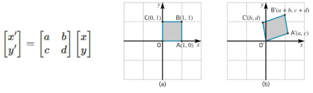
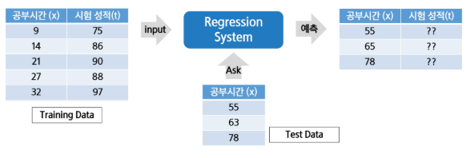
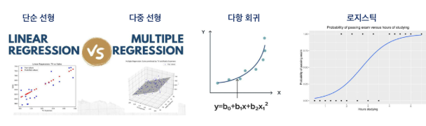
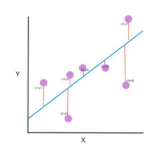

# 데이터사이언스 활용 - 데이터 분석을 위한 머신러닝 알고리즘1
<details>
<summary>INDEX</summmary>

1. 선형변환 및 행렬 연산
2. Regression(회귀)
3. 베이즈 정리, 나이브 베이즈(분류)
4. Classification(분류)
5. KNN(분류)

</details>

## 1. 선형 변환 및 행렬 연산 이론
### 1) 머신러닝에서 행렬 연산이 필요한 이유
#### 머신러닝과 데이터 분석에서 행렬의 중요성
- 데이터를 효율적으로 표현하고, 모델을 학습시키기 위해 행렬 사용
- 데이터 표현 : 대부분의 데이터(이미지, 텍스트, 수치 데이터)는 행렬 형태로 저장
- 머신러닝 알고리즘 : 선형 회귀, 로지스틱 회귀, 신경망 등에서 가중치와 데이터 처리 연산 및 데이터 변형, 차원 축소를 위해 행렬 사용
- 최적화 및 학습 과정 : 경사 하강법 등 최적화 알고리즘 및 딥러닝에서 미분과 행렬 연산 사용

### 2) 행렬의 기초
#### 행렬(Matrix)란?
- 행렬 : 숫자가 행(row)과 열(column)로 배열된 2차원 구조

    $ A = \begin{bmatrix}
    1 & 2 \\
    3 & 4
    \end{bmatrix} $

    ```python
    A = np.array([[1, 2], [3, 4]])
    print(A)
    ```

### 3) 벡터와 행렬의 기초
#### 행렬 덧셈과 스칼라 곱
- 행렬 간 덧셈 : 같은 크기의 행렬끼리 요소별로 더함
- 스칼라 곱 : 행렬의 각 요소에 숫자를 곱함
```python
A = np.array([[1, 2], [3, 4]])  # 2X2 행렬
B = np.array([[5, 6], [7, 8]])  # 2X2 행렬
C = A + B # 행렬 덧셈
D = 2 * A # 스칼라 곱
print(C)
print('='*50)
print(D)
```
$ C = \begin{bmatrix}
6 & 8 \\
10 & 12
\end{bmatrix} $

=======================

$ D = \begin{bmatrix}
2 & 4 \\
6 & 8
\end{bmatrix} $

#### 행렬 곱(Matrix Multiplication)
- 두 개의 행렬을 곱하는 연산
- A(mxn) x B(nxp) → 결과 행렬 C(mxp)
- 첫 번째 행렬(A)의 열 개수와 두 번째 행렬(B)의 행 개수가 같아야 곱셈 가능
- 예제 : A(2x3) x B(3x2) → 결과 행렬 C(2x2)

    $$
    A = \begin{bmatrix}
    1 & 2 & 3 \\
    4 & 5 & 6
    \end{bmatrix}
    \qquad
    B = \begin{bmatrix}
    7 & 8 \\
    9 & 10 \\
    11 & 12
    \end{bmatrix} 
    $$

    $$
    C = A X B = \begin{bmatrix}
    (1 \times 7 + 2 \times 9 + 3 \times 11) & (1 \times 8 + 2 \times 10 + 3 \times 12) \\
    (4 \times 7 + 5 \times 9 + 6 \times 11) & (4 \times 8 + 5 \times 10 + 6 \times 12)
    \end{bmatrix}
    \qquad
    C = \begin{bmatrix}
    58 & 64 \\
    139 & 154
    \end{bmatrix}
    $$

- 1 x n 행렬과 n x 1 행렬의 곱으로 표현하는 형태를 벡터의 내적이라 볼 수 있음
- 머신러닝에서 행렬 곱 활용
- 선형 회귀 (Linear Regression) : 모델의 가중치와 입력 데이터(X)의 행렬 곱을 통해 예측값 계산
- 신경망 (Neural Networks) : 각 레이어에서 가중치와 입력 데이터의 행렬 곱 수행
```python
import numpy as np

A = np.array([[1, 2, 3], [4, 5, 6]])
B = np.array([[7, 8], [9, 10], [11, 12]])

C = np.dot(A, B) # 행렬 곱
print(C)
```

#### 전치 행렬 (Transpose Matrix)
- 행과 열을 바꾸는 연산
- 행렬 A(mxn)의 전치 행렬 → $ A^T (n \times m) $
- 원소 : $ A^T[i, j] = A[j, i] $
    $$ 
    A = \begin{bmatrix}
    1 & 2 & 3 \\
    4 & 5 & 6
    \end{bmatrix}
    \qquad
    A^T = \begin{bmatrix}
    1 & 4 \\
    2 & 5 \\
    3 & 6
    \end{bmatrix}
    $$
    ```python
    import numpy as np

    A = np.array([[1, 2, 3], [4, 5, 6]])
    B = np.array([[7, 8], [9, 10], [11, 12]])

    C = np.dot(A, B) #  행렬 곱
    print(C)
    ```

### 3) 선형 변환 (Linear Transformation)
#### 선형 변환이란?
- 공간을 변형시키는 규칙(한 벡터를 다른 벡터 공간으로 변환하는 과정)
- 크기(배율을 조절), 회전, 대칭, 변형(왜곡) 같은 작업을 위해 사용
- 행렬 연산(특히 행렬 곱)을 통해 구현
- 선형 변환은 공간의 점들을 일정한 규칙에 따라 이동시키는 것
- 데이터 분석에서 차원을 줄여서 중요한 정보만 남길 때 사용 가능
    

### 4) 선형 변환의 대표적인 예시
#### 크기 변경(Scaling)
- 벡터를 일정 배율로 확대 또는 축소하는 변환
- 스칼라 곱으로 표현 가능
  $$
  A = \begin{bmatrix}
  2 & 0 \\
  0 & 2
  \end{bmatrix}
  \qquad
  v = \begin{bmatrix}
  3 \\
  4
  \end{bmatrix}
  \qquad
  Av = \begin{bmatrix}
  2 \times 3 + 0 \times 4 \\
  0 \times 3 + 2 \times 4
  \end{bmatrix}
  = \begin{bmatrix}
  6 \\
  8
  \end{bmatrix}
  $$

  ```python
  import numpy as np

  A = np.array([[2, 0], [0, 2]])
  v = np.array([3, 4])

  result = np.dot(A, v)
  print(result)
  ```

## 2. Regression
### 1) Regression 개론
#### 회귀(Regression)란 무엇인가?
- 회귀의 정의
  - 회귀는 연속적인 숫자 값을 예측하는 지도 학습의 한 유형
  - 입력 데이터를 기반으로 특정 연속적 목표 값(출력)을 예측하는 것이 목적
- 회귀 문제의 목표
  - 입력 변수(특징)을 사용하여 출력 값의 추세를 학습하고, 이를 기반으로 새로운 데이터에 대해 예측을 수행
- 회귀의 활용 예시
  - 주택 가격 예측 : 집의 크기, 위치, 연도 등의 정보를 바탕으로 가격을 예측
  - 주식 시장 분석 : 과거 주가 데이터를 바탕으로 미래 주가를 예측
  - 날씨 예측 : 기온, 습도, 풍속 등의 데이터를 사용해 내일의 기온을 예측
- 회귀와 분류의 차이점
  - 회귀는 연속적인 값을 예측하는 문제(예 : 온도, 가격)
  - 분류는 이산적인 범주를 예측하는 문제(예 : 스팸/비스팸, 고양이/개)

#### 회귀 문제의 예시
- 주택 가격 예측
  - 주택의 크기, 방 개수, 위치 등의 특징(입력 변수)을 기반으로 주택의 가격(출력 변수)을 예측하는 문제
  - 예시 : 100㎡의 아파트가 5억원일 가능성을 예측
- 주식 시장 분석
  - 과거 주가 데이터, 거래량, 경제 지표 등을 바탕으로 미래 주가를 예측하는 문재
  - 예시 : 주식 X의 다음 달 가격을 예측
- 날씨 예측
  - 기온, 습도, 풍속 등의 환경 데이터를 바탕으로 다음 날의 기온을 예측
- 자동차 연비 예측
  - 자동차의 배기량, 마력, 중량 등의 데이터를 기반으로 연비를 예측
  - 예시 : 특정 차량이 1리터당 12km를 갈 가능성 예측
- 판매량 예측
  - 과거 판매 기록, 계절, 마케팅 투자 등을 통해 미래의 판매량을 예측
  - 예시 : 특정 제품이 다음 달에 1000개 판매될 가능성 예측

#### 입력 변수(Features, 독립 변수)
- 회귀 문제에서 입력 변수는 예측에 필요한 다양한 특성을 의미
- 입력 변수는 하나일 수도 있고, 여러 개일 수도 있음
- 예시
  - 주택 가격 예측에서의 입력 변수 : 주택 크기, 위치, 방 개수 등
  - 자동차 연비 예측에서의 입력 변수 : 배기량, 중량, 마력 등

#### 출력 변수(Target, 종속 변수)
- 회귀 문제의 출력은 예측하고자 하는 연속적인 값
- 출력 변수는 모델이 학습하여 예측하는 목표 값
  - 주택 가격 예측에서의 출력 변수 : 예측된 주택의 가격
  - 자동차 연비 예측에서의 출력 변수 : 1리터 당 이동할 수 있는 거리(km/L)

#### 모델의 목적
- 입력 변수(특성)와 출력 변수(목표 값) 간의 관계를 학습해, 새로운 입력이 주어졌을 때 적절한 출력 값을 예측
- 예시 : 주택의 크기와 위치 정보를 입력으로 받아 주택 가격을 예측

#### 회귀
- Training Data를 이용해서 데이터의 특성과 상관 관계 등을 파악하고, 그 겨로가를 바탕으로 Training Data에 없는 미지의 데이터가 주어졌을 경우에, 그 결과를 연속적인 (숫자) 값으로 예측하는 것
- (예) 공부시간과 시험 성적 관계 등


#### 회귀의 종류
- 단순 선형회귀 : 한 개의 독립변수로 종속변수를 예측, 선형적(1차항 이상의 연산없음), 직선으로 표현
- 다중 선형회귀 : 두 개 이상의 독립변수로 종속변수를 예측, 선형적, 3차원 이상에서 평면으로 표현
- 다항 회귀 : 2차항 이상의 항으로 계산, 다항식
- 로지스틱 회귀 : 범주형 종속변수를 예측하는 분류 모델


### 2) 선형 회귀
#### 선형 회귀란?
- 입력 변수(특성)와 출력 변수(목표 값) 간의 선형 관계를 가정하여 예측하는 모델
- 데이터가 직선으로 표현될 수 있을 때, 가장 간단하고 직관적인 방법

#### 모델의 수식
$$
y = wx + b
$$
- 여기서는 y는 예측 값, x는 입력 값, w는 가중치, b는 편향

#### 예측 방법
- 주어진 데이터를 기반으로 최적의 직선(회귀선)을 찾아 입력 값에 대한 출력 값을 예측
- 모델은 오차를 최소화하는 방향으로 직선의 기울기 w와 절편 b를 학습

#### 장점
- 해석이 용이하고 계산이 빠름
- 비교적 단순한 문제에 대해 좋은 성능을 발휘

#### 단점
- 입력 변수와 출력 변수 간의 관계가 비선형적일 경우 성능이 저하될 수 있음
- 과적합의 위험이 있으며, 다중 공산성이 있을 때 문제가 발생할 수 있음

#### 사용 예시
- 주택 가격 예측 : 주택 크기에 따른 가격 예측
- 광고 비용과 판매량의 관계 분석

    

### 3) 다중 회귀
#### 다중 회귀란?
- 여러 개의 입력 변수(특성)를 사용하여 출력 변수를 예측하는 선형 회귀 모델
- 단일 입력 변수를 사용하는 선형 회귀와 달리, 다중 회귀는 다수의 변수를 고려하여 보다 정확한 예측 가능

#### 모델의 수식
$$
y = w_1x_1 + w_2x_2 + ... + w_nx_n + b
$$
- 여기서 y는 예측값, $ x_1, x_2, ..., x_n $ 은 입력 변수들, $ w_1, w_2, ..., w_n $은 각 특성의 가중치, b는 편향

#### 예측 방법
- 각 입력 변수에 해딩하는 가중치를 곱한 후, 그 값을 모두 더하여 예측 값을 계산
- 모델은 모든 입력 변수의 영향을 고려하여 오차를 최소화하는 방향으로 가중치와 절편 학습

### 4) 다항 회귀
#### 다항 회귀란?
- 입력 변수와 출력 변수 간의 비선형 관계를 모델링하는 회귀 방법
- 선형 회귀와 달리, 입력 변수의 거듭제곱을 포함한 다항식을 사용하여 비선형 패턴을 학습

#### 모델의 수식
$$
y = w_1x + w_2x^2+w_3x^3 + ... + w_nx^n + b
$$
- 여기서 y는 예측값, x는 입력 변수, $ w_1, w_2, ..., w_n$은 각 특성의 가중치, b는 편향

#### 예측 방법
- 입력 값 x의 거듭제곱을 사용해 곡선 형태의 관계를 모델링
- 선형 회귀로는 설명할 수 없는 비선형 패턴을 더 잘 포착 가능

#### 장점
- 데이터 가 비선형적인 경우, 선형 회귀보다 더 나은 예측 성능을 보임
- 다양한 비선형 패턴을 유연하게 모델링할 수 있음

#### 단점
- 과적합(Overfitting)의 위험이 큼
- 특히 다항 차수가 높아질수록 모델이 복잡해져 과적합 가능성이 증가
- 데이터가 부족할 경우, 모델이 안정적이지 않을 수 있음

#### 사용 예시
- 곡선 패턴이 있는 데이터 예측 : 예를 들어 온도 변화에 따른 전력 사용량 예측
- 주택 가격 예측에서 방 개수와 가격 간의 비선형 관계 모델링

## 3. 베이즈 정리, 나이브 베이즈
### 1) 나이브 베이즈 분류
#### 문제
- 문제 정의
  - 10만개의 메일 중 스팸 메일과 정상 메일을 분류하고 싶다면?
- 메일
  - 독립 사건으로 가정하는 텍스트 데이터
- 해결방안
  - 나이브 베이즈 분류 알고리즘 활용

#### 나이브 베이즈 분류
- 각 특징들이 독립적(서로 영향을 미치지 않을 것)이라는 가정 설정
- 베이즈 정리(Bayes Rule)를 활용한 확률 통계학적 분류 알고리즘

- 베이즈 정리(Bayes Rule)
$$
P(A|B) = \frac{P(A \cap B)}{P(B)} = \frac{P(B|A)P(A)}{P(B)}
$$
  - $ P(A|B) $: 사건 B가 발생했을 때, A도 같이 발생했을 확률

#### 베이즈 정리
- 맑은 날 비가 오지 않을 확률은?
  $$
  P(비가 안옴 | 맑은 날) = \frac{P(맑은 날 | 비가 안옴) \times P(비가 안옴)}{P(맑은 날)}
  $$

- 스팸 메일 분류
    1. 스팸 메일과 정상 메일의 단어를 체크
    2. 새로운 메일의 단어들에 대한 확률로 스팸 메일을 구분
        - $ P(스팸 |단어1, 단어2, 단어3, ...) > P(정상 | 단어1, 단어2, 단어3, ...)$ 이면 스팸
  
#### 나이브 베이즈 분류
- 베이즈 정리를 활용하여 입력값이 해당 클래스에 속할 확률을 계산하여 분류
  - $ P(스팸 |단어1, 단어2, 단어3, ...) > P(정상 | 단어1, 단어2, 단어3, ...)$ 이면 스팸
- 각 특징들이 독립이라면 다른 분류 방식에 비해 결과가 좋고, 학습 데이터도 적게 필요
- 각 특징들이 독립이 아니라면 즉, 특징들이 서로 영향을 미치면 분류 결과 신뢰성 하락
- 학습 데이터에 없는 범주의 데이텅리 경우 정상적 예측 불가능

## 4. Classification
### 1) Classification 개론
#### 분류(Classificaiton)란 무엇인가?
- 분류의 정의
  - 분류는 입력 데이터가 여러 개의 카테고리 중 하나에 속하도록 지정하는 작업
  - 주로 지도 학습(Supervised Learning) 방식으로 이루어지며, 데이터의 특징(Feature)을 기반으로 해당 데이터가 어느 범주에 속하는지를 예측
- 분류 문제의 목표
  - 학습 알고리즘은 함수 f을 생성하여 입력 벡터 x가 어떤 카테고리 y에 속하는지를 예측
  - 예를 들어, 이미지 인식에서 입력은 이미지의 픽셀 값으로 이루어지고, 출력은 이미지에 포함된 객체를 나타내는 카테고리 번호
- 분류 문제의 예시
  - 객체 인식(Object Recognition) : 이미지 속 사물(예 : 음료수 종류)을 인식하여 해당 사물이 무엇인지 분류하는 작업
  - 얼굴 인식(Face Recognition) : 사진 속 인물을 인식하고 자동으로 태그하는 기술로, 사용자와 컴퓨터 간의 자연스러운 상호작용을 가능하게 함

#### 분류와 회귀의 차이
- 분류(Classification)
  - 정의 : 데이터를 미리 정의된 카테고리(범주)로 분류하는 작업
  - 출력값 : 이산적인 값(카테고리 또는 레이블)
  - 예시 : 이메일이 스팸인지 아닌지 구분, 암 진단 여부(양성/음성) 분류, 이미지 속 개체 인식
- 회귀(Regression)
  - 정의 : 연속적인 숫자 값을 예측하는 작업
  - 출력값 : 연속적인 실수 값
  - 예시 : 주택 가격 예측, 온도 변화 예측, 주식 시장 가격 예측
- 핵심 차이점
  - 분류는 결과가 '카테고리'로 나타나며, 이산적인 값으로 분류
  - 회귀는 결과가 '숫자'로 나타나며, 연속적인 값을 예측

#### 분류
- Training Data를 이용해서 데이터의 특성과 상관 관계를 등을 파악하고. 그 결과를 바탕으로 Training Data에 없는 미지의 데이터가 주어졌을 경우에, 그 결과를 어떤 종류의 값을 분류될 수 있는지 예측하는 것
- 예 : 스팸문자 분류(Spam or Ham), 암 판별(악성종양 or 종양)

#### 분류 문제의 입력과 출력
- 입력 데이터 (Features, 입력 변수)
  - 분류 문제에서 입력 데이터는 하나 이상의 특징(Feature)으로 이루어진 벡터로 표현
  - 특징 벡터
    - 예시 : 이미지 인식에서 이미지의 각 픽셀 값이 특징이 될 수 있음
    - 입력 데이터는 연속형(숫자) 또는 이산형(범주형) 값으로 구성될 수 있음
- 출력 데이터 (Labels, 출력 변수)
  - 분류 문제의 출력은 데이터가 속한 클래스(범주)를 나타냄
  - 출력 레이블 : y
    - 예시 : 이진 분류에서 출력은 0(음성) 또는 1(양성)
    - 다중 클래스 분류에서는 y가 1, 2, 3 등 여러 클래스를 나타냄
- 입력과 출력의 관계
  - 분류 모델은 주어진 입력 x에 대해 적절한 출력 y를 예측하는 함수 f(x)를 학습
  - 예시 : f(x)는 특정 사진을 입력받아 그것이 고양이인지, 개인지, 또는 새인지를 예측

### 2) 결정 경계
#### 결정 경계(Decision Boundaires)란?
- 분류 모델이 데이터를 분류하기 위해 공간을 나누는 경계선
- 입력 데이터를 특정 공간(Feature Space)에서 서로 다른 클래스 영역으로 구분

#### 결정 경계의 역할
- 각 클래스에 속하는 데이터 포인트를 구분하는 기준을 제공
- 새로운 데이터가 주어졌을 때, 그 데이터가 어느 클래스에 속하는지 결정

#### 결정 경계의 예시
- 선형 결정 관계
  - 단순한 직선이나 평면으로 클래스 간의 경계를 나눔
  - 예 : 로지스틱 회귀, 선형 서포트 머신(SVM)
- 비선형 결정 경계
  - 더 복잡합 경계를 만들어 클래스 간의 관계를 나눔
  - 예 : 겨렁트리, 랜덤 포레스트, 심층 신경망(Deep Neural Networks)

#### 결정 경계 시각화
- 2차원 특징 공간에서는 결정 경계를 쉽게 시각화 가능
- 각 클래스 영역이 어떻게 나누어져 있는지를 ㅍ현하면 모델의 동작을 더 쉽게 이해할 수 있음

