# 데이터사이언스 활용 - 데이터분석을 위한 머신러닝 알고리즘2

목차

1. SVM
2. 앙상블
3. 군집(Clustering)
4. Bias, Variance, Regularization

## 1. SVM
### 1) SVM
#### 서포트 벡터 머신(SVM)
- 여백(Margin)을 최대화하는 초평면(Hyperplane)을 찾는 지도 학습 알고리즘
- 딥러닝의 대두 이전까지 분류, 회귀에 모두 사용할 수 있는 매우 강력한 모델
    

#### 서포트 벡터 머신(SVM)이란?
- 데이터를 고차원 공간에 매핑하여 두 클래스를 최대한 잘 구분할 수 있는 최적의 초평면(Hyperplane)을 찾는 분류 알고리즘
- 이 초평면과 가장 가까운 데이터 포인트(서포트 벡터)들에 의해 결정

#### 작동 방식:
1. 초평면 결정 : 두 클래스 사이의 간격을 최대화하는 초평면을 찾음
2. 서포트 벡터 : 초평면에 가장 가까운 데이터 포인트들이 서포트 벡터 역할을 하며, 이들이 결정 경계를 형성
3. 비선형 데이터 처리 : 커널 트릭(Kernel Trick)을 사용하여 비선형 데이터를 고차원 공간으로 변환한 후, 선형 분리를 수행할 수 있음
    

#### 장점
- 상대적으로 데이터의 이해도가 떨어져도 사용이 용이함
- 예측 정확도가 통상적으로 높음

#### 단점
- C(에러에 부여하는 가중치)를 결정해야 함
- 파라미터의 결정과 모형의 구축에 시간이 오래 걸림

# 여백(Margin)의 의미
- 주어진 데이터가 오류를 발생시키지 않고 움직일 수 있는 최대공간
- 분류 문제와 회귀 문제 각각의 문제에 따라 정의가 다름
    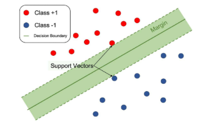

# 최적의 결정 경계(Decision Boundary)
- 최적의 결정 경계는 데이터 군집으로부터 최대한 멀리 떨어지는 것
  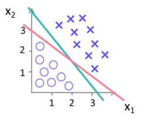

# 분류에서의 여백(Margin)
- 데이터가 2차원이며, 라벨은 파란색과 빨간색 두 개의 클래스가 있다고 가정
- 이를 분류하는 초평면은 초록색 직선이고, 1번 데이터를 기준으로 해당 데이터가 직선과 수직으로 움직인다면, 1번 데이터가 직선을 초과해 움직이면, 해당 데이터를 직선이 빨간색 데이터로 예측해 오류가 발생
- 즉, 파란색 1번 데이터와 직선과의 거리가 여백(Margin)임
  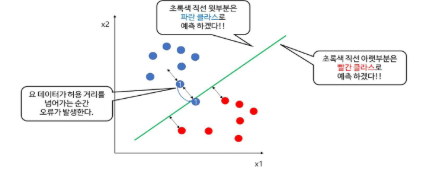

#### 회귀에서의 여백(Margin)
- 단순 선형 모델(설명 변수 1개)를 생성하고, 데이터들이 초평면으로부터 ε > 0 범위 내에 있다고 가정
- 데이터들은 초록색 직선으로부터 ε 범위(양쪽 점선 사이)에 있으며, 데이터들은 x축 상에서 움직임
- 양 점선 사이의 수평거리를 데이터가 넘어가게 되면 ε 범위를 넘어가게 되어 오류를 발생시킴
- 즉, 양 점선 사이의 수평거리가 여백(Margin)임
    

### 2) Soft Margin vs. Hard Margin
#### Soft Margin
- Soft Margin은 결정 경계를 조금씩 넘어가는 데이터들을 어느 정도 허용하며 유연한 결정 경계를 만듦
- 아래와 같은 데이터 분포는 직선으로 두 클래스를 분류하기 어렵기 때문에 어느 정도의 비용(Cost, C)을 감수하면서 가장 최선의 결정 경계를 찾음
- Cost는 모델링을 하면서 설정이 가능하고, 이 값이 크면 클수록 Hard Margin을, 작으면 작을수록 Soft Margin을 만듦
    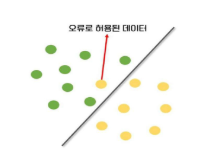

#### Hard Margin
- Hard Margin은 이상치들을 허용하지 않고, 분명하게 나누는 결정 경계를 만듦
- 과적합(Overfitting)의 오류가 발생하기 쉬움
- 노이지로 인해 최적의 결정 경계를 잘못 설정하거나 못 찾는 경우가 발생할 수 있음

#### Kernel Trick
- SVM은 기본적으로 선형 분류를 위한 결정 경계를 만들지만, Kernel Trick을 사용한다면 비선형 분류도 가능
- 아래와 같은 데이터 분포는 저차원(2D)에서는 선형 분리가 되지 않을 수 있지만, 고차원(3D)에서는 선형 분리가 가능
- 데이터를 고차원으로 보내서 서포트 벡터를 구하고 다시 저차원으로 축소하는 과정은 복잡하고 많은 연산량이 필요하기 때문에 Kernel Trick을 사용
- Kernel Trick은 선형 분리가 불가능한 저차원 데이터를 고차원으로 보내 선형 분리를 하는 이론을 이용한 일종의 Trick 기법 
- Kernel Trick은 고차원 Mapping과 고차원에서의 연산이 가능함
    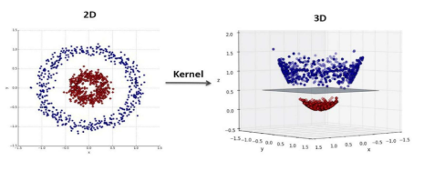

#### 대표적인 Kernel 함수
- Linear : 선형 함수
- Poly : 다항식 함수
- RBF : 방사 기저 함수
- Hyperbolic Tangent : 쌍곡선 탄젠트
    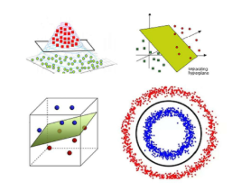

## 2. 앙상블
### 1) Tree 기반 모델과 앙상블 기법
#### 의사결정 트리(Decision Tree)
- 의사결정 트리(Decision Tree)는 분류, 회귀 문제에 모두 사용할 수 있는 모델
- 의사결정 트리는 입력 변수를 특정한 기준으로 분기해 트리 형태의 구조를 분류하는 모델
  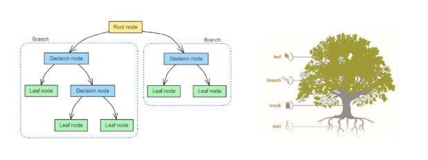
- 장점
  - 해석이 쉬움
  - 입력 값이 주어졌을 때 설명 변수의 영역의 흐름을 따라 출력값이 어떻게 나오는지 파악하기 용이
- 단점
  - 예측력이 떨어짐
  - 단순히 평균 또는 다수결 법칙에 의해 예측을 수행
  - 회귀모델에서 반응 변수의 평균을 예측값으로 추정할 때 평균을 사용해 이상치에 영향을 많이 받음

- 구성
  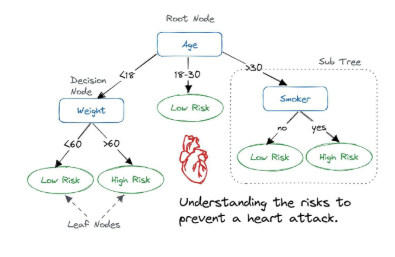

#### 앙상블 학습(Ensemble Learning)
- 여러 개의 분류기를 생성하고, 그 예측을 결합함으로써 보다 정확한 예측을 도출하는 기법
- 강력한 하나의 모델을 사용하는 대신 보다 약한 모델 여러 개를 조합하여 더 정확한 예측에 도움을 주는 방식
- 보팅(Voting), 배깅(Bagging), 부스팅(Boosting) 세 가지의 유형이 존재
  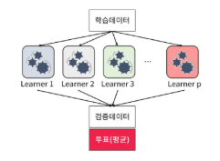

#### 보팅(Voting)
- 여러 개의 분류기가 투표를 통해 최종 예측 결과를 결정하는 방식
- 서로 다른 알고리즘을 여러 개 결합하여 사용

#### 보팅 방식
- 하드 보팅(Hard Voting): 다수의 분류기가 예측한 결과값을 최종 결과로 선정
- 소프트 보팅(Soft Voting) : 모든 분류기가 예측한 레이블 값의 결정 확률 평균을 구한 뒤 가장 확률이 높은 레이블 값을 최종 결과로 선정

#### 배깅(Bootstrap AGGregatING, Bagging)
- 데이터 샘플링(Bootstrap)을 통해 모델을 학습시키고 결과를 집계(Aggregation)하는 방법으로 모두 같은 유형의 알고리즘 기반의 분류기를 사용
- 데이터 분할 시 중복을 허용
- 범주형 데이터는 다수결 투표 방식으로 결과 집계
- 연속형 데이턴느 평균값 집계를 활용 과적합(Overfitting) 방지에 효과적
    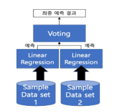

#### 부스팅(Boosting)
- 여러 개의 분류기가 순차적으로 학습을 수행
- 이전 분류기가 예측이 틀린 데이터에 대해서 올바르게 예측할 수 있고, 다음 분류기에게 가중치(weight)를 부여하면서 학습과 예측을 진행
- 예측 성능이 뛰어나 앙상블 학습을 주도
- 보통 부스팅 방식은 배깅에 비해 성능이 좋지만, 속도가 느리고 과적합이 발생할 가능성이 존재하므로 상황에 따라 적절하게 사용
- 대표적인 부스팅 모듈 : XGBoost, AdaBoost, Gradient Boosting
    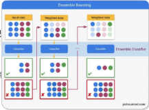

#### 랜덤 포레스트(Random Forest)
- 여러 개의 결정 트리들을 임의적으로 학습하는 방식의 앙상블 방법
- 여러가지 학습기들을 생성한 후 이를 선형 결합하여 최종 학습기를 만드는 방법

- 기반 기술
  - 의사결정 트리 : 여러 가지 요소를 기준으로 갈라지는 가지를 트리형태로 구성하여 분석하는 기법
    - 의사결정 트리의 한계
      - 학습 데이터에 따라 생성되는 결정 트리가 크게 달라져 일반화가 어려운 과적합 문제 발생
      - 계층적 접근 방식으로, 중간에 에러 발생 시 하위 계층으로 에러
  - 앙상블 학습 : 주어진 데이터를 여러 모델로 학습하고 종합하여 정확도를 높이는 기법
  - 배깅(Bagging) : 같은 알고리즘으로 여러 개의 분류기를 만들어서 결합하는 앙상블 학습 기법

- 특징
  - 임의성 : 서로 조금씩 다른 특성의 트리들로 구성
  - 비상관화 : 각 트리들의 예측이 서로 연관되지 않음
  - 견고성 : 오류가 전파되지 않아 노이즈에 강함
  - 일반화 : 임의화를 통한 과적합 문제 극복
  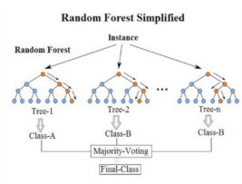

- 장점
  - 과적합이 잘 일어나지 않음
  - 결측치나 이상치에 강함
  - 의사결정나무 알고리즘에 기반한 기법이기 때문에 scaling, 정규화 과정이 필요 없음
  - 비선형적 데이터에 강함
  - 새로운 데이터가 들어와도 크게 영향을 받지 않음
- 단점
  - 수많은 트리를 계산하기 때문에 학습 시간과 계산 연산량이 큼

## 3. 군집
### 1) 군집(Clustering)
#### 군집이란?
- 군집 분석은 비슷한 특성을 가진 데이터를 그룹화하는 비지도 학습 기법
- 데이터의 내재된 구조를 발견하고, 패턴을 파악하는 데 활용
- 마케팅 세분화, 이상치 탐지, 추천 시스템 등 다양한 분야에서 사용
    

#### Cluster 간 거리 계산 방법
1. 단일 연결법(최단 연결법, Single linkage)
   - 각각의 군집에서 하나씩 선택한 개체를 연결했을 때 가장 짧은 거리

2. 완전 연결법(최장 연결법, Complete linkage)
   - 각각의 군집에서 하나씩 선택한 개체를 연결했을 때 가장 긴 거리

3. 평균 연결법(Average linkage)
   - 각각의 군집에서 하나씩 선택한 개체를 연결한 전체 거리의 평균

4. 중심 연결법(Centroid linkage)
   - 각각의 군집 내에서 개체의 중간에 해당하는 점(Center)를 연결한 거리